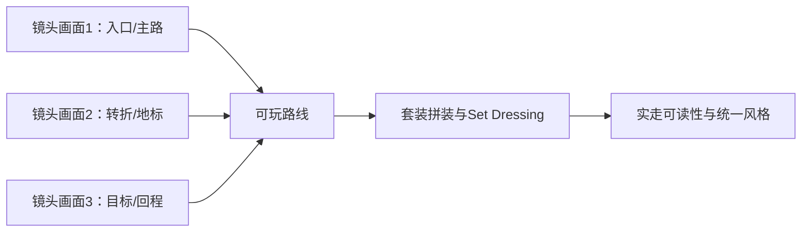

# D04｜跟AI一步步做：美术结业：用套装二开拼出自己的童话场景

状态：对话脚本已编写，不代表课堂或软件已经执行。

**学习分组：** D组；**本课编号：** D04；**路线：** 美术主线｜套装二开与统一。

## 0. 开始前：只准备本课需要的东西

**本次起点：** 一个已可玩的固定视角转角/小场景、主资产套装、风格卡和一两件二开变体；没有整图也可只做样板。
**缺材料时：** 可先作风格/观察决定。没有真实图片或样本时用标明的原创简图，不描述不存在的画面，不记真实作品观察通过。
**当前配套：** 见0A的真实文件、首步与覆盖边界；文件存在不表示本课所有M已有完整配套。

**今天的最小任务：** 用主资产套装和少量二开变体，完成一个固定视角下统一、可辨路、能说明取舍的小型童话场景。
**怎样读：** 先看两项M和概念图，再复制对话1。启动框已带首步、继续条件和结束证据；之后用自己的话回复即可，不必把六框逐一重发。
**怎样停：** 完成当前小步可以暂停，记录下次起点；只有本课两项M都有相应证据才标本课应用通过。暂停不是失败，模拟完成不是软件通过。
**逐渐减少代答：** 本课先由你写一个目标、修改范围和验证办法，AI再执行或补一个线索。可以请求示范，但那次记录为有提示练习，不以拒绝帮助作为考核。

## 0A. 这课怎样学、怎样查缺口

**学习顺序：** 短示范或预测 → 课堂随练 → 软件概念对照 → 自己解释 → 只补薄弱项。

**实际配套：** [kitbash_style_lab.blend](../../blender/labs/kitbash_style_lab.blend)、[main.tscn](../../game/scenes/main.tscn)

**练习首步：** 挑一个小区域组合已合格部件，固定机位做减法。

**配套局限：** 当前文件只是起点，不是已验收美术结业作品。

**正式项目落点：** P8。实验只为理解；进入相应生产阶段再迁移。

**打开方式与分工：** [现成实验入口](../../LABS-START.md)。Godot打开当前场景按F6；Blender直接打开已有文件，先另存副本。默认先体验，不为上课重新搭建。

**回忆与检查：** [本课记忆规则](../../print/memory-by-lesson.md#d04) · [单元检查](../../assessments/unit-checkpoints.md) · [AI追问与弱项诊断](../../assessments/ai-diagnostic-review.md)。

**记录分开：** 回忆/解释/软件应用/换情境；没有证据写待验证。菜单/API可查；得到根因提示记有提示。

## 2A. 场景、概念图与逐步AI对话

**实际位置：** P07｜用套装与少量Hero二开完成一个固定视角场景。

|操作前的问题|本课希望得到的结果|
|---|---|
|美术作品与游戏脱节，或者用装饰盖住交互问题。|少量自有变体形成统一小场景，保留完整收集体验和来源记录。|

这是目标对照，不是已完成的游戏截图。概念图为职责/因果示意，不是继承图或完整运行证明。

OpenMAIC不能渲染Mermaid时画等价方框图；无3D或真实连接时仅标课堂模拟，不伪造软件运行。

### 本课人和AI分别负责什么

|责任|这课具体做什么|
|---|---|
|我必须作出的判断|选择一项最影响整体的偏差，按实际玩家观察和来源证据判断成品。|
|可以交给AI的制作|按风格卡提出少量局部变体及样板到套件清单，不重做整张世界。|
|我检查AI交付物|看修改对象/前后差异、实际执行记录及未验证项；先核对是否保留本课约束，再决定是否接入。|

**不是手工熟练考试：** 重复劳动与代码可委托；常用可见参数适合亲调时先调一项，无障碍需要可由AI按已选值执行。必须能说明选择、观察和恢复，不要求机械地拖每个滑杆。

**两种模式：** 练习时可问根因、看示范；独立验收时先由我提出选择/假设，AI只协助执行与记录。已透露本题根因或目标值，就记录“有提示”，再换未揭示答案的变式。

### 复制第1框开始；以后每次只发当前一步

**学员用法：** 无需一次读完所有提示。将当前框发给你使用的AI；做完后回“完成＋观察”，结果不符回“不符＋现象”，报错回“报错＋原文”，需要停下回“暂停”。自然语言也可以。不要一口气把六步当成自动执行授权。

### 对话1｜建立本课上下文

```text
请做我这节课的协作教练：D04《美术结业：用套装二开拼出自己的童话场景》。
我们逐步制作同一个「星光小庭院」，当前只解决：美术作品与游戏脱节，或者用装饰盖住交互问题。
目标：少量自有变体形成统一小场景，保留完整收集体验和来源记录。
必须掌握：让轮廓、比例、色盘、灯光、细节密度形成一致表达；提交观察与改造过程，并说明可复用与仍需验证的部分。理解即可：儿童偏好应按年龄、情境做实际观察，不存在保证所有孩子喜欢的配方
停止线：不要求制作原创角色动画或大型世界；不以追求大师同款细节拖延完成。
必须保持：主路、交互净空、固定镜头和来源记录保持；不以原创网格比例作为质量分。
本课由我负责：选择一项最影响整体的偏差，按实际玩家观察和来源证据判断成品。
可以交给你：按风格卡提出少量局部变体及样板到套件清单，不重做整张世界。
请标明建议/已执行/已验证的区别。练习可提示；验收先等我作判断，已提示根因则如实记有提示。
概念配套：blender/labs/kitbash_style_lab.blend、game/scenes/main.tscn
练习首步：挑一个小区域组合已合格部件，固定机位做减法。
覆盖边界：当前文件只是起点，不是已验收美术结业作品。
对应生产阶段：P8；达到当前阶段才迁移，不把实验完成当成项目通过。
默认先用现成实验体验；下方连接/实现任务属于之后的项目迁移，不作为打开本实验的前置。OpenMAIC已提供同等概念证据时不重复刷题，但真实资源/物理/导出等软件证据不可由模拟代替。
先复用上述现有样本，不重新生成同一个Lab。练习可提示；检查先只读快照，不一边改答案一边评分。
先读取我已提供的进度和材料，只问真正缺失的一项。需要软件操作时核对实际版本、当前截图或场景树、可访问的工具；不要求我发密钥或整个电脑。
本课入场材料：一个已可玩的固定视角转角/小场景、主资产套装、风格卡和一两件二开变体；没有整图也可只做样板。
材料不足的处理：可先作风格/观察决定。没有真实图片或样本时用标明的原创简图，不描述不存在的画面，不记真实作品观察通过。
以下是本课连续推进卡，不是一次性执行授权；收到我的观察后每轮最多推进一个有意义的小步。
首步：先在固定玩家机位摆主套装的六件以内资产，只解决整体比例、主次和留白；暂不精修单件。
继续条件：一眼能读出主路/焦点，资产像同一个世界而不是素材展台。
随后一步：只选择一两件Hero做明显二开，其余靠组合、配色和材质统一；最后隐藏参考换一个道具检验规则。
结束证据：六件套件在同一游戏机位形成一致比例/光色/细节层级并保持目标可辨。；交实际观察、改造前后、来源及可复用边界；换道具后规则仍可说明。
相关回归：启动、探索、收齐、完成、重开；再检查既有性能目标。
验收时先等我提出目标、修改范围和验证办法，不先替我判断；若我请求帮助，切回练习并如实记录提示。
这些是待执行要求，不是我的已完成进度。不要凭课号推断前置已通过；只复用我已提供的实际材料和证据。
对话1之后我可直接回复完成/不符/报错/暂停，无需重贴整课；你应沿这张推进卡继续，不临时增加系统。
先给一个预测问题并等我回答，再给一个最小步骤。不跳课、不自动做整款游戏。能执行才说已执行，否则给明确操作单或脚本，并标未执行。
后续每轮用四项回应：现在是哪一步；只改什么/怎样恢复；我应观察什么；目前还缺什么证据。没有证据不要替我勾通过。
```

**AI此时应做：** 确认当前场景与学习范围，不直接输出几十个文件。已经提供过的版本、素材和约束应复用，不重复问。

### 对话2｜先理解一个因果关系

```text
先问我：六件单独精美是否保证整体好看？
等我写预测和理由后，再指出一个证据缺口，只给一个提示，不先公布完整答案。用词不专业时先确认意思，再补术语。
```

**转入下一步：** 有自己的预测即可；预测错可以用实验纠正，不要求先背定义。

### 对话3｜AI只完成第一小步

```text
沿用已确认的版本、材料和修改边界。现在只做：先在固定玩家机位摆主套装的六件以内资产，只解决整体比例、主次和留白；暂不精修单件。
先列影响对象和原值，再提供一个可撤销初稿。没有实际软件连接时给我可执行的局部操作单/脚本，不说已经修改。做完先停下。
```

**预计看到／拿到：** 一眼能读出主路/焦点，资产像同一个世界而不是素材展台。
**不是自动保证：** 这是验收目标，取决于实际模型、工具和输入；结果不同就走下方“不符”分支。

### 对话4｜人观察与亲调，再继续第二小步

```text
这是我刚才的实际结果：我会附一张当前图、短演示或必要日志，并用一句话描述差异。
先检查是否满足：一眼能读出主路/焦点，资产像同一个世界而不是素材展台。
本课可用的微调项：
入口：主次比例/摆放（内置/设计）；操作：在原游戏机位做一个构图调整；观察：路径和互动目标是否仍优先
入口：材质或主光（内置）；操作：固定其余项微调一次并记录；观察：气氛与可读性是否同时改善
若满足，先指导我选择其中一项亲调；我回报观察后才继续：只选择一两件Hero做明显二开，其余靠组合、配色和材质统一；最后隐藏参考换一个道具检验规则。
一次只动一项可见参数。方向接近就手调；结构有误才给局部修复，不能不断重生成整个场景。
```

|选中哪里与参数性质|这次亲自试什么|观察与停手依据|
|---|---|---|
|主次比例/摆放（内置/设计）|在原游戏机位做一个构图调整|路径和互动目标是否仍优先|
|材质或主光（内置）|固定其余项微调一次并记录|气氛与可读性是否同时改善|

**保存与恢复：** 先记录原值和实际对象。优先在安全副本试；运行中Remote Inspector的变化不要当成已保存的设计值，确认后将选定值写回本地场景/资源或配置并重新运行。菜单路径随版本核对，自定义变量不冒充内置属性。
**采用哪种沟通：** 大方向偏了，用参考图圈出要借鉴的轮廓/色彩/光感，并指出不要照搬什么；单个视觉值接近了，先拖或输入数值；原因不明，固定条件做一次对照。参考图不是可自动反推所有参数的答案。

### 对话5｜成功验收，或失败时只修一处

**达到目标时发送：**
```text
请只根据我提供的证据检查：
- 六件套件在同一游戏机位形成一致比例/光色/细节层级并保持目标可辨。
- 交实际观察、改造前后、来源及可复用边界；换道具后规则仍可说明。
旧功能回归：启动、探索、收齐、完成、重开；再检查既有性能目标。
缺少过程证据就标待验证；不得用一张截图证明走跳或一次性事件。不要新增需求或把所有候选题变成作业。
```

**结果不符或报错时发送：**
```text
不符/报错：我会提供触发步骤、预期、实际现象和必要原始日志。
保留：主路、交互净空、固定镜头和来源记录保持；不以原创网格比例作为质量分。
本课优先风险：检查AI是否为了显得高级把每件资产都重做、把场景填满，或让背景细节抢走玩法焦点。
先提出一个可推翻的假设和一个最小验证；不要同时改多个系统。若两次验证仍无进展，回到基线并列出缺失证据，不反复抽卡。不要删除测试、关闭需求或扩大权限来假装修好。
```

**AI评分边界：** 代码和初稿可以由AI提供；判断、亲调与证据解释由学员完成。得到根因提示记为有提示，不因此重复考试所有概念。

### 对话6｜存进度，下一次接着做

```text
请总结本课D04（D04）的进度卡，不把预测当已完成。
记录：真实软件版本/渲染器；当前场景与变更对象；选定参数和原值；我做的判断；实际证据；通过/待验证；使用过的提示；恢复方法；下一步唯一任务。
只有实际验证才标通过，没有生成或真机执行就明确写模拟/待验证。给我一段可以复制到新AI对话的摘要，不假称你已持久保存。
先核对下一课前置和我的已选路线，未完成就停在当前步骤，不催着扩范围。
```

**学员保存：** 把进度卡存本地或私人笔记；下次粘贴进度卡和下一课第1框。不要公开API Key、账户、本地私密路径或个人录像。

### 当前风险与长期责任

**本课风险检查：** 检查AI是否为了显得高级把每件资产都重做、把场景填满，或让背景细节抢走玩法焦点。
这是需要在当前工具版本下核验的风险，不是所有AI必然失败的排行榜，也不预测何时改善。长期保留需求、参考选择、影响范围、结果认可与取舍责任；测量、批量设置和重复验证可以由AI协助。
**不把学习变成额外六次考试：** 六个对话阶段共享本课原有M/K证据；只在薄弱关键能力上追加一处故障或变式。没有实际材料时先做课堂模拟，真机状态单独记录。

下一建议：[D07](../dialogues/D07.md)。先检查前置；选修未选可以跳过。
