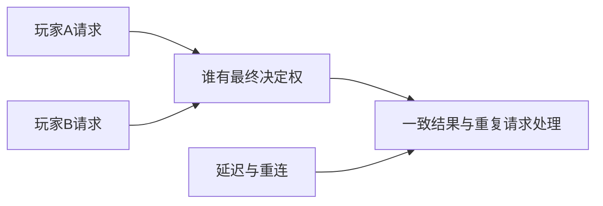

# E06｜跟AI一步步做：多人认识专题：先知道为什么会复杂

状态：对话脚本已编写，不代表课堂或软件已经执行。

**学习分组：** E组；**本课编号：** E06；**路线：** 选修｜全K，只理解用途。

## 0. 开始前：只准备本课需要的东西

**本次起点：** 两人同时请求一件物品的教学时间线即可；不需要网络项目、服务器或软件操作。
**缺材料时：** 只作一次用途与是否需要的决定即可结束；不增加软件执行或M成绩。
**当前配套：** 见0A的真实文件、首步与覆盖边界；文件存在不表示本课所有M已有完整配套。

**本次结束：** 用一个情境说明用途与当前不做什么；不要求实操、软件截图或M评分。

## 0A. 这课怎样学、怎样查缺口

**学习顺序：** 本课全K：只做用途认识；不要求实操，不考反复记忆或迁移。

**实际配套：** 没有专用软件Lab；先按本课材料分支做认识/模拟，不虚构文件。

**练习首步：** 只解释联网增加了哪类协调问题，以及本项目是否需要。

**配套局限：** 全K，只理解用途，不要求实操或背诵。

**正式项目落点：** 不加入单机生产门槛。实验只为理解；进入相应生产阶段再迁移。

**打开方式与分工：** [现成实验入口](../../LABS-START.md)。Godot打开当前场景按F6；Blender直接打开已有文件，先另存副本。默认先体验，不为上课重新搭建。

**回忆与检查：** [本课记忆规则](../../print/memory-by-lesson.md#e06) · [单元检查](../../assessments/unit-checkpoints.md) · [AI追问与弱项诊断](../../assessments/ai-diagnostic-review.md)。

**记录分开：** 回忆/解释/软件应用/换情境；没有证据写待验证。菜单/API可查；得到根因提示记有提示。

## 2A. 场景、概念图与逐步AI对话

**实际位置：** P07决策记录｜要不要把庭院改成多人。

|操作前的问题|本课希望得到的结果|
|---|---|
|以为把单机再加一个玩家就自动成为可靠多人游戏。|知道状态权威、延迟和恢复增加的需求，能决定当前不做多人。|

这是目标对照，不是已完成的游戏截图。概念图为职责/因果示意，不是继承图或完整运行证明。

OpenMAIC不能渲染Mermaid时画等价方框图；无3D或真实连接时仅标课堂模拟，不伪造软件运行。

### 本课人和AI分别负责什么

**我决定：** 只判断本项目是否需要联网，以及多人结果由谁确认；不实施网络。

**AI协助：** 给明确标示的两人请求时间线，等待用途解释，不生成服务器代码。

**结束线：** 说明用途与本项目取舍即可；不运行软件、不做M评分。

### 复制第1框开始；以后每次只发当前一步

**学员用法：** 无需一次读完所有提示。将当前框发给你使用的AI；做完后回“完成＋观察”，结果不符回“不符＋现象”，报错回“报错＋原文”，需要停下回“暂停”。自然语言也可以。不要一口气把六步当成自动执行授权。

### 对话1｜建立本课上下文

```text
请做我这节课的协作教练：E06《多人认识专题：先知道为什么会复杂》。
我们逐步制作同一个「星光小庭院」，当前只解决：以为把单机再加一个玩家就自动成为可靠多人游戏。
目标：知道状态权威、延迟和恢复增加的需求，能决定当前不做多人。
必须掌握：无；本课仅理解用途。理解即可：权威决定谁能确认结果；延迟、预测、重连会影响不同客户端看到的状态
停止线：本课为全K选修，不计入单机毕业条件，不要求服务器和同步代码。
必须保持：课程全K认识；主庭院保持单机，不形成网络实现或操作考试。
本课由我负责：只判断本项目是否需要联网，以及多人结果由谁确认；不实施网络。
可以交给你：给明确标示的两人请求时间线，等待用途解释，不生成服务器代码。
请标明建议/已执行/已验证的区别。练习可提示；验收先等我作判断，已提示根因则如实记有提示。
概念配套：没有专用软件Lab；使用本课明确的材料分支
练习首步：只解释联网增加了哪类协调问题，以及本项目是否需要。
覆盖边界：全K，只理解用途，不要求实操或背诵。
对应生产阶段：不加入单机生产门槛；达到当前阶段才迁移，不把实验完成当成项目通过。
默认先用现成实验体验；下方连接/实现任务属于之后的项目迁移，不作为打开本实验的前置。OpenMAIC已提供同等概念证据时不重复刷题，但真实资源/物理/导出等软件证据不可由模拟代替。
先复用上述现有样本，不重新生成同一个Lab。练习可提示；检查先只读快照，不一边改答案一边评分。
先读取我已提供的进度和材料，只问真正缺失的一项。需要软件操作时核对实际版本、当前截图或场景树、可访问的工具；不要求我发密钥或整个电脑。
本课入场材料：两人同时请求一件物品的教学时间线即可；不需要网络项目、服务器或软件操作。
材料不足的处理：只作一次用途与是否需要的决定即可结束；不增加软件执行或M成绩。
以下是本课连续推进卡，不是一次性执行授权；收到我的观察后每轮最多推进一个有意义的小步。
用途任务：只讨论两位玩家同时拿一颗星，先让我说谁决定结果；不写联网代码。
结束判断：我能说明权威与延迟为何会影响结果，知道何时查询。
随后：对比重连与重复请求两个用途场景，记录本项目暂不联网。；保持全K，不生成实现。
这些是待执行要求，不是我的已完成进度。不要凭课号推断前置已通过；只复用我已提供的实际材料和证据。
对话1之后我可直接回复完成/不符/报错/暂停，无需重贴整课；你应沿这张推进卡继续，不临时增加系统。
先给一个预测问题并等我回答，再给一个最小步骤。不跳课、不自动做整款游戏。能执行才说已执行，否则给明确操作单或脚本，并标未执行。
后续每轮用四项回应：现在是哪一步；只改什么/怎样恢复；我应观察什么；目前还缺什么证据。没有证据不要替我勾通过。
```

**AI此时应做：** 确认当前场景与学习范围，不直接输出几十个文件。已经提供过的版本、素材和约束应复用，不重复问。

### 对话2｜先理解一个因果关系

```text
先问我：谁应确认同一物品最终归属？
等我写预测和理由后，再指出一个证据缺口，只给一个提示，不先公布完整答案。用词不专业时先确认意思，再补术语。
```

**转入下一步：** 有自己的预测即可；预测错可以用实验纠正，不要求先背定义。

### 对话3｜K用途选择与结束

```text
只讨论两位玩家同时拿一颗星，先让我说谁决定结果；不写联网代码。
对比重连与重复请求两个用途场景，记录本项目暂不联网。
只核对我的用途解释，缺口用一个追问；不生成实现，不要求操作或长报告。最后给我一份认识记录，写明本项目不因为此课就增加联网。
```

**结束证据：** 我能说明权威与延迟为何会影响结果，知道何时查询。
**本课全K：** 不出现软件执行门槛、六步实操或M成绩。

### 当前风险与长期责任

**本课风险检查：** 检查AI是否承诺低延迟或无冲突而无测试，把K认识课变成部署课程。
这是需要在当前工具版本下核验的风险，不是所有AI必然失败的排行榜，也不预测何时改善。长期保留需求、参考选择、影响范围、结果认可与取舍责任；测量、批量设置和重复验证可以由AI协助。
**不把学习变成额外六次考试：** 六个对话阶段共享本课原有M/K证据；只在薄弱关键能力上追加一处故障或变式。没有实际材料时先做课堂模拟，真机状态单独记录。

已到本路线收束点：先验收、整理证据；高级专项按实际问题另选。
