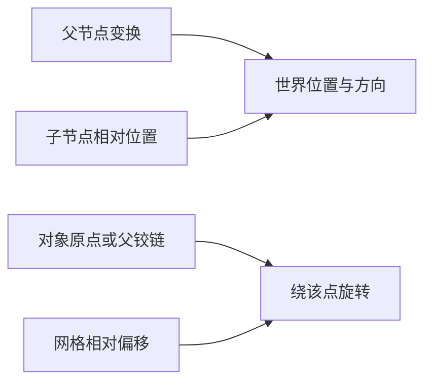

# E-03｜跟AI一步步做：门与移动平台：复用已会的空间和状态

状态：对话脚本已编写，不代表课堂或软件已经执行。

## 2A. 场景、概念图与逐步AI对话

**实际位置：** P06｜庭院侧门或一块移动平台。

|操作前的问题|本课希望得到的结果|
|---|---|
|门轴对但反复触发失控；平台只看起来运动，站上去行为异常。|选定一个小机关，在重触发、站立/离开和重开时可解释。|

这是目标对照，不是已完成的游戏截图。概念图为职责/因果示意，不是继承图或完整运行证明。

OpenMAIC不能渲染Mermaid时画等价方框图；无3D或真实连接时仅标课堂模拟，不伪造软件运行。

### 复制第1框开始；以后每次只发当前一步

**学员用法：** 无需一次读完所有提示。将当前框发给你使用的AI；做完后回“完成＋观察”，结果不符回“不符＋现象”，报错回“报错＋原文”，需要停下回“暂停”。自然语言也可以。不要一口气把六步当成自动执行授权。

### 对话1｜建立本课上下文

```text
请做我这节课的协作教练：E-03（兼容课号I04）《门与移动平台：复用已会的空间和状态》。
我们逐步制作同一个「星光小庭院」，当前只解决：门轴对但反复触发失控；平台只看起来运动，站上去行为异常。
目标：选定一个小机关，在重触发、站立/离开和重开时可解释。
必须掌握：组合支点、条件和状态，避免重复触发冲突；检查站上、离开、阻挡和恢复等边界。理解即可：AnimatableBody3D等物理类型按实际运动方式查
停止线：本课门为主任务；平台作为给定示例验收，不写通用平台物理系统。
必须保持：玩家控制与原收集循环保持；不同时增加机关系统和敌人系统。
先读取我已提供的进度和材料，只问真正缺失的一项。需要软件操作时核对实际版本、当前截图或场景树、可访问的工具；不要求我发密钥或整个电脑。
先给一个预测问题并等我回答，再给一个最小步骤。不跳课、不自动做整款游戏。能执行才说已执行，否则给明确操作单或脚本，并标未执行。
后续每轮用四项回应：现在是哪一步；只改什么/怎样恢复；我应观察什么；目前还缺什么证据。没有证据不要替我勾通过。
```

**AI此时应做：** 确认当前场景与学习范围，不直接输出几十个文件。已经提供过的版本、素材和约束应复用，不重复问。

### 对话2｜先理解一个因果关系

```text
先问我：门动画播完就能证明玩家能通过吗？
等我写预测和理由后，再指出一个证据缺口，只给一个提示，不先公布完整答案。用词不专业时先确认意思，再补术语。
```

**转入下一步：** 有自己的预测即可；预测错可以用实验纠正，不要求先背定义。

### 对话3｜AI只完成第一小步

```text
沿用已确认的版本、材料和修改边界。现在只做：从门或平台中只选一个；先列允许状态和实际运动的对象，不同时做两种机关。
先列影响对象和原值，再提供一个可撤销初稿。没有实际软件连接时给我可执行的局部操作单/脚本，不说已经修改。做完先停下。
```

**预计看到／拿到：** 选门时开关位置正确；选平台时站上能按预期运动；当前只验所选机制。
**不是自动保证：** 这是验收目标，取决于实际模型、工具和输入；结果不同就走下方“不符”分支。

### 对话4｜人观察与亲调，再继续第二小步

```text
这是我刚才的实际结果：我会附一张当前图、短演示或必要日志，并用一句话描述差异。
先检查是否满足：选门时开关位置正确；选平台时站上能按预期运动；当前只验所选机制。
本课可用的微调项：
入口：机关行程或开门角（自定义）；操作：先小行程核对，再调目标角度或距离；观察：碰撞与可见外观是否一起运动
入口：机关持续时间（自定义）；操作：固定行程，单独改时长；观察：角色可否安全通过，重触发是否堆叠
若满足，先指导我选择其中一项亲调；我回报观察后才继续：对已选机制检查重复触发、离开或恢复；通过后才讨论另一种机制，不强制实现。
一次只动一项可见参数。方向接近就手调；结构有误才给局部修复，不能不断重生成整个场景。
```

|选中哪里与参数性质|这次亲自试什么|观察与停手依据|
|---|---|---|
|机关行程或开门角（自定义）|先小行程核对，再调目标角度或距离|碰撞与可见外观是否一起运动|
|机关持续时间（自定义）|固定行程，单独改时长|角色可否安全通过，重触发是否堆叠|

**保存与恢复：** 先记录原值和实际对象。优先在安全副本试；运行中Remote Inspector的变化不要当成已保存的设计值，确认后将选定值写回本地场景/资源或配置并重新运行。菜单路径随版本核对，自定义变量不冒充内置属性。
**采用哪种沟通：** 大方向偏了，用参考图圈出要借鉴的轮廓/色彩/光感，并指出不要照搬什么；单个视觉值接近了，先拖或输入数值；原因不明，固定条件做一次对照。参考图不是可自动反推所有参数的答案。

### 对话5｜成功验收，或失败时只修一处

**达到目标时发送：**
```text
请只根据我提供的证据检查：
- 能复用空间、触发和状态说明一条机关行为链。
- 能测试重复触发与恢复；选平台时再测站立/离开，不强制两种都做。
旧功能回归：原玩家起跳、墙碰撞、星星收集和重开不退化。
缺少过程证据就标待验证；不得用一张截图证明走跳或一次性事件。不要新增需求或把所有候选题变成作业。
```

**结果不符或报错时发送：**
```text
不符/报错：我会提供触发步骤、预期、实际现象和必要原始日志。
保留：玩家控制与原收集循环保持；不同时增加机关系统和敌人系统。
本课优先风险：检查AI是否只移动Visual、每次进入都新建一个Tween，或通过禁用碰撞掩盖穿插。
先提出一个可推翻的假设和一个最小验证；不要同时改多个系统。若两次验证仍无进展，回到基线并列出缺失证据，不反复抽卡。不要删除测试、关闭需求或扩大权限来假装修好。
```

**AI评分边界：** 代码和初稿可以由AI提供；判断、亲调与证据解释由学员完成。得到根因提示记为有提示，不因此重复考试所有概念。

### 对话6｜存进度，下一次接着做

```text
请总结本课E-03（I04）的进度卡，不把预测当已完成。
记录：真实软件版本/渲染器；当前场景与变更对象；选定参数和原值；我做的判断；实际证据；通过/待验证；使用过的提示；恢复方法；下一步唯一任务。
只有实际验证才标通过，没有生成或真机执行就明确写模拟/待验证。给我一段可以复制到新AI对话的摘要，不假称你已持久保存。
先核对下一课前置和我的已选路线，未完成就停在当前步骤，不催着扩范围。
```

**学员保存：** 把进度卡存本地或私人笔记；下次粘贴进度卡和下一课第1框。不要公开API Key、账户、本地私密路径或个人录像。

### 当前风险与长期责任

**本课风险检查：** 检查AI是否只移动Visual、每次进入都新建一个Tween，或通过禁用碰撞掩盖穿插。
这是需要在当前工具版本下核验的风险，不是所有AI必然失败的排行榜，也不预测何时改善。长期保留需求、参考选择、影响范围、结果认可与取舍责任；测量、批量设置和重复验证可以由AI协助。
**不把学习变成额外六次考试：** 六个对话阶段共享本课原有M/K证据；只在薄弱关键能力上追加一处故障或变式。没有实际材料时先做课堂模拟，真机状态单独记录。

下一建议：[E-04](../dialogues/I05.md)。先检查前置；选修未选可以跳过。
