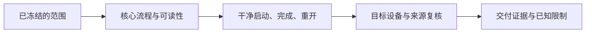

# E-09｜跟AI一步步做：精致Demo结业：完整探索关卡与可选训练角

状态：对话脚本已编写，不代表课堂或软件已经执行。

## 2A. 场景、概念图与逐步AI对话

**实际位置：** P06c/P07｜精致Demo的基础版与增强版验收。

|操作前的问题|本课希望得到的结果|
|---|---|
|局部任务分别通过，但整段探索、风格和交付尚未连起来。|基础版三段地图十星循环可靠；增强版额外有可绕过的攻击木桩闭环。|

这是目标对照，不是已完成的游戏截图。概念图为职责/因果示意，不是继承图或完整运行证明。

OpenMAIC不能渲染Mermaid时画等价方框图；无3D或真实连接时仅标课堂模拟，不伪造软件运行。

### 复制第1框开始；以后每次只发当前一步

**学员用法：** 无需一次读完所有提示。将当前框发给你使用的AI；做完后回“完成＋观察”，结果不符回“不符＋现象”，报错回“报错＋原文”，需要停下回“暂停”。自然语言也可以。不要一口气把六步当成自动执行授权。

### 对话1｜建立本课上下文

```text
请做我这节课的协作教练：E-09（兼容课号I12）《精致Demo结业：完整探索关卡与可选训练角》。
我们逐步制作同一个「星光小庭院」，当前只解决：局部任务分别通过，但整段探索、风格和交付尚未连起来。
目标：基础版三段地图十星循环可靠；增强版额外有可绕过的攻击木桩闭环。
必须掌握：从首次启动走完收集、完成和重开，并用证据说明地图、美术和控制可用。；按基础版或增强版的明确范围检查回归、性能与来源，不靠删需求或隐藏错误过关。。理解即可：只抽已选路线的用途词；未选导航和高级专题不考。
停止线：不同时强制敌人、机关、战斗、多人；控制原型范围。
必须保持：基础十星、原角色/相机行为、已选风格与目标平台固定；未选战斗/导航不成为门槛。
先读取我已提供的进度和材料，只问真正缺失的一项。需要软件操作时核对实际版本、当前截图或场景树、可访问的工具；不要求我发密钥或整个电脑。
先给一个预测问题并等我回答，再给一个最小步骤。不跳课、不自动做整款游戏。能执行才说已执行，否则给明确操作单或脚本，并标未执行。
后续每轮用四项回应：现在是哪一步；只改什么/怎样恢复；我应观察什么；目前还缺什么证据。没有证据不要替我勾通过。
```

**AI此时应做：** 确认当前场景与学习范围，不直接输出几十个文件。已经提供过的版本、素材和约束应复用，不重复问。

### 对话2｜先理解一个因果关系

```text
先问我：系统数量多是否代表更合格？
等我写预测和理由后，再指出一个证据缺口，只给一个提示，不先公布完整答案。用词不专业时先确认意思，再补术语。
```

**转入下一步：** 有自己的预测即可；预测错可以用实验纠正，不要求先背定义。

### 对话3｜AI只完成第一小步

```text
沿用已确认的版本、材料和修改边界。现在只做：先由我选择基础版或增强版，按项目质量表核对范围，不增加临时新需求。
先列影响对象和原值，再提供一个可撤销初稿。没有实际软件连接时给我可执行的局部操作单/脚本，不说已经修改。做完先停下。
```

**预计看到／拿到：** 三段路线、十星、三个视觉观察点和完整重开有实际证据。
**不是自动保证：** 这是验收目标，取决于实际模型、工具和输入；结果不同就走下方“不符”分支。

### 对话4｜人观察与亲调，再继续第二小步

```text
这是我刚才的实际结果：我会附一张当前图、短演示或必要日志，并用一句话描述差异。
先检查是否满足：三段路线、十星、三个视觉观察点和完整重开有实际证据。
若满足，指导我先亲调下面表格的一项；我回报观察后才继续：只修一个阻碍交付的缺陷；增强版额外验空挥、防重和控制恢复。
一次只动一项可见参数。方向接近就手调；结构有误才给局部修复，不能不断重生成整个场景。
```

|选中哪里与参数性质|这次亲自试什么|观察与停手依据|
|---|---|---|
|完整路线与三个玩家观察点（验收入口）|固定输入参数跑同一路线，比较一项改动|迷路、遮挡、反馈、完成和重开是否改善|
|训练角启用配置（本项目自定义，仅增强版）|开和关分别回归，不改星星计数|攻击防重/恢复与基础收集互不破坏|

**保存与恢复：** 先记录原值和实际对象。优先在安全副本试；运行中Remote Inspector的变化不要当成已保存的设计值，确认后将选定值写回本地场景/资源或配置并重新运行。菜单路径随版本核对，自定义变量不冒充内置属性。
**采用哪种沟通：** 大方向偏了，用参考图圈出要借鉴的轮廓/色彩/光感，并指出不要照搬什么；单个视觉值接近了，先拖或输入数值；原因不明，固定条件做一次对照。参考图不是可自动反推所有参数的答案。

### 对话5｜成功验收，或失败时只修一处

**达到目标时发送：**
```text
请只根据我提供的证据检查：
- 实际从干净启动走完三段地图、十星、完成和重开，并说明三个视觉观察点的风格规则。
- 基础版按范围回归；增强版另提供空挥、同次去重、下一次可命中和取消恢复证据，无数据的性能不宣称达标。
旧功能回归：用相同目标设备、分辨率和路线核对原控制、碰撞、资源往返、提示与恢复。
缺少过程证据就标待验证；不得用一张截图证明走跳或一次性事件。不要新增需求或把所有候选题变成作业。
```

**结果不符或报错时发送：**
```text
不符/报错：我会提供触发步骤、预期、实际现象和必要原始日志。
保留：基础十星、原角色/相机行为、已选风格与目标平台固定；未选战斗/导航不成为门槛。
本课优先风险：检查AI是否用漂亮截图代替连续游玩、把选修加入通关门槛、隐瞒失败或报告未执行的性能数据。
先提出一个可推翻的假设和一个最小验证；不要同时改多个系统。若两次验证仍无进展，回到基线并列出缺失证据，不反复抽卡。不要删除测试、关闭需求或扩大权限来假装修好。
```

**AI评分边界：** 代码和初稿可以由AI提供；判断、亲调与证据解释由学员完成。得到根因提示记为有提示，不因此重复考试所有概念。

### 对话6｜存进度，下一次接着做

```text
请总结本课E-09（I12）的进度卡，不把预测当已完成。
记录：真实软件版本/渲染器；当前场景与变更对象；选定参数和原值；我做的判断；实际证据；通过/待验证；使用过的提示；恢复方法；下一步唯一任务。
只有实际验证才标通过，没有生成或真机执行就明确写模拟/待验证。给我一段可以复制到新AI对话的摘要，不假称你已持久保存。
先核对下一课前置和我的已选路线，未完成就停在当前步骤，不催着扩范围。
```

**学员保存：** 把进度卡存本地或私人笔记；下次粘贴进度卡和下一课第1框。不要公开API Key、账户、本地私密路径或个人录像。

### 当前风险与长期责任

**本课风险检查：** 检查AI是否用漂亮截图代替连续游玩、把选修加入通关门槛、隐瞒失败或报告未执行的性能数据。
这是需要在当前工具版本下核验的风险，不是所有AI必然失败的排行榜，也不预测何时改善。长期保留需求、参考选择、影响范围、结果认可与取舍责任；测量、批量设置和重复验证可以由AI协助。
**不把学习变成额外六次考试：** 六个对话阶段共享本课原有M/K证据；只在薄弱关键能力上追加一处故障或变式。没有实际材料时先做课堂模拟，真机状态单独记录。

已到本路线收束点：先验收、整理证据；高级专项按实际问题另选。
