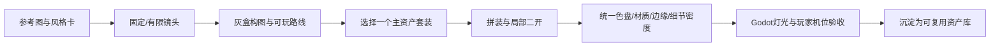

# 固定/有限镜头风格化3D：套装二开与组装工作流

本项目默认目标不是自由环绕的通用第三人称游戏，而是**固定或有限镜头的风格化3D小游戏**：角色可以在场景中跑、跳、收集与交互，但镜头由设计控制；画面追求温暖、唯美、卡通、低写实和清楚的配色层级。这个约束同时服务舒适、审美和制作效率。

> 核心生产思想：不是从零做完所有模型，而是把优秀、许可适用、可编辑的资产套装当作视觉基因和积木；人负责参考、规则、取舍与最终画面，AI负责分析、候选、重复劳动和局部实现，Blender负责拼装与二开，Godot负责最终构图、光照、交互和验收。

## 1. Camera先于World

先确定玩家实际会看到的镜头，再决定该制作多少世界。固定视角允许每个区域像一张可玩的设计稿：入口、主路、地标、交互目标和留白都围绕最终画面组织。

项目舒适基线：默认不要求鼠标持续控制镜头；不把头部晃动、频繁动态FOV、强镜头震动和运动模糊当必要效果。区域切镜时优先明确切换或可预测的缓和过渡，避免在边界反复跳镜头。具体舒适感仍需真人在目标设备验证，不存在一组数值保证所有人都不晕。

## 2. 资产套装不是成品，是母体

优先找一套与你目标接近、来源和修改条件清楚、可编辑的风格化资产作为母体。选套装时先看整体，不先看单件是否最精致：

|先检查|为什么|
|---|---|
|形状语言|圆润/硬朗、比例夸张方式能否成为整个世界的共同语言|
|色彩结构|是否容易归入你的主色、辅色、强调色，而不是每件各用一套色盘|
|边缘处理|倒角、硬边、平滑和轮廓粗细是否容易统一|
|材质复杂度|是否能用少量稳定参数在Godot中复现，而不是只能在离线渲染里成立|
|尺度/原点/模块接口|能否快速拼接、替换和摆放，而不是每次重新修正|
|来源与可编辑性|游戏内使用、修改和公开源文件再分发是不同问题，分别核对|

AI图片转3D或生成3D作为**补缺手段**，不是默认主生产线。更适合缺少的标志性物体、概念代理或少量Hero资产；进入项目前仍检查轮廓、拓扑/法线、UV、尺度、原点、材质和许可。

## 3. 二开顺序：先改关系，再改细节

一件基底资产进入你的项目后，按以下顺序处理：

1. **用途与镜头**：玩家多远看、会不会接近、是否碰撞/交互。
2. **大形/剪影**：宽高、头身、屋顶比例、门窗大小、树冠形状等。
3. **模块拼装**：换屋顶、门窗、招牌、灯、附件，组合成新的轮廓。
4. **统一色盘**：先解决色相/明暗/饱和关系，不先堆纹理。
5. **统一材质语言**：木、布、金属可以不同，但整体粗糙层级、反射克制和细节密度受同一风格卡约束。
6. **有限细修**：倒角、厚度、局部法线、简单UV；只做玩家机位能感知的收益。
7. **回到Godot**：实际镜头、光照、背景和移动中再次判断；Blender预览不是最终画面。

这类练习考察的是**选基底、判断改哪里、保持哪些接口、怎样证明风格更统一**，不是建模速度或从Cube开始完整重做。

## 4. 三档资产投入

|等级|例子|制作策略|
|---|---|---|
|Hero Asset|主建筑、剧情物体、重要NPC/特殊树|可做明显二开、专属配色和少量AI补缺，让世界有自己的身份|
|Gameplay Asset|普通房屋、桥、门、路牌、可互动物|以成熟套装为主，改比例/模块/颜色/材质和功能包装|
|Background Asset|远山、远树、远景建筑、天际线|只满足目标镜头；允许极简几何、卡片、低细节背面等做法|

**原创的重点是整个视觉系统和组合结果，不是证明每个网格都从零开始。**

## 5. 固定视角可用的“视觉作弊”

这些是制作选择，不是每个场景都必须使用；只在玩家确实看不到或到不了时采用，并保留测试边界。

|做法|适合哪里|会穿帮的情况|
|---|---|---|
|Facade/Shell，只认真做可见面|建筑、店铺、远景结构|镜头能绕到背面，或玩家能进入内部|
|背面和不可见处减细节|屋顶后侧、墙背、远景道具|反射/阴影/切镜会暴露这些面|
|Billboard/Cross Plane|中远景树、草、远景装饰|玩家能贴近、镜头角度变化太大|
|Forced Perspective|固定构图中的远景建筑/山体|玩家可改变观察点或接近对象|
|简单假阴影/AO/Decal|风格化接触阴影、背景物|动态光变化明显或物体可移动|
|一张水面Plane|不可潜水的小河/池塘|玩家需要从水下看或真实体积交互|
|视觉Mesh与简单Collision分开|几乎所有Gameplay资产|碰撞简化到影响路线、落点或攻击判定|

原则：**背景可以大胆骗，Gameplay资产要保证玩法，Hero资产要保证关键镜头。**

## 6. 套装之间怎样统一成“同一个游戏”

混用两套资源时不要直接全场摆放。先各取一两件做样板，固定玩家机位后只比较下面四层：

- **比例/轮廓**：门窗、屋顶、树冠、石头的夸张规则是否一致。
- **配色**：建立有限主色/辅色/强调色关系，再把原素材映射进来。
- **表面**：统一粗糙层级、金属使用范围、纹理噪声和边缘高光。
- **细节密度**：背景更简，焦点更清楚；不要每件都争夺注意力。

先统一一处样板转角，通过后再让AI帮助批量改色、替换材质槽、整理命名或生成变体；人抽样检查并走完整路线。不要让AI一开始重做整张世界。

## 7. 动作资源也按“套装融合”处理

角色和动作不要求原创。流程是：选择来源清楚的角色/动作包 → 试一段最小动作 → 检查骨架/参考姿态/根位移/脚底和接触 → 决定保留、少量适配或换包 → 再做状态切换和轻战斗。

动作的风格统一重点不是“每一帧都自己做”，而是节奏、幅度、角色比例、位移来源、接触时机和反馈能否和当前游戏一致。AI可协助映射、裁剪、状态条件和日志；人负责选片段、接受何种脚滑/穿插、是否值得继续修。

## 8. 本项目最终希望形成的能力

看到一个参考画面或资产包后，学员能：说出要借鉴的视觉规则；挑合适基底；判断哪些地方不用改；用Blender做少量真正有收益的修改/拼装；用Godot固定镜头和光照统一最终画面；把可复用结果存回自己的小型资产库；需要动作时能接入兼容资源而不是从零做动画。

这就是本项目的美术生产主线：**审美指导 + 套装选择 + 二开拼装 + 风格统一 + 游戏内验收**。

[课程索引](lesson-index.md) · [AI协作](../assessments/ai-collaboration.md) · [Demo质量](demo-quality.md)
