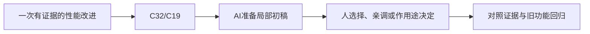

# E-12｜高级测量：用证据决定技术投入

> 兼容课号：A01。ABCDE是主题入口，不是必须按字母顺序完成；文件链接与题号保留稳定。

版本：Applied Curriculum v5｜2026-09-15
状态：课件正文与互动规格已编写；尚未逐课生成OpenMAIC课堂或试教。

## 1. 本课任务卡

**产出：** 为一个真实瓶颈设计基线、实验和回归，不为高级而高级。
**前置：** I12；**对应概念：** C32/C19。
**预计课堂：** 20–30分钟，可在实验前后暂停；不含后续真实软件制作时间。
**M 必须掌握：**
- 区分症状、假设、干预和证据。
- 证明收益没有靠删功能或降低未声明质量获得。
**K 理解即可：**
- 外部CPU/GPU分析器知道用途与入口。
**停止线：** 没有性能问题可以跳过高级线；不实现Profiler和基准框架。

## 2. 必要讲解：先看现象，再给术语

高级判断不是会念更多优化术语，而是能排除错误归因。记录分辨率、场景、设备、构建版本和样本分布，并重复关键路径。

帧时间改善之外还要看载入、内存、视觉与功能回归。一次实验不确定就标不确定，不能把合成数据当产品跑分。

## 2A. 这次在实际场景里解决什么

**应用位置：** P07隔离实验｜一次有证据的性能改进；选修隔离实验：有价值才接入。

|开始时遇到的问题|本课期望得到的变化|
|---|---|
|只报告平均帧率提高，不知道卡顿是否减少或功能是否被删。|有基线、假设、固定条件、结果和回归，能够选择不优化。|

**这是目标状态对照，不是已完成截图。** 首次操作应使用匹配当前进度的最小场景；还没有配套时，只能记为课堂模拟，不能直接勾选真机应用通过。

### 概念关系示意


图中箭头表示教学流程，不是引擎节点继承。OpenMAIC不支持Mermaid时改画等价方框图，不能把代码原文冒充运行示意。

### 先让AI帮助理解，再让AI帮助工作

**学习指令：**
```text
现在只检查这道判断：只拿最好一次测试能证明稳定收益吗？
先等我给预测和理由，再指出一个证据缺口；一次只给一个线索，不先公布完整答案。
我的用词不专业时，先用人话确认意思，再补对应术语。
```

**工作指令：可复制；先补实际版本与当前材料，不粘贴密钥。**
```text
我正在逐步制作同一个小型单机「星光小庭院」，不是重新生成整款游戏。
我会提供实际软件版本、当前场景/文件和必要截图；先确认你能访问哪些材料和工具。
这次只做：仅处理已提供测量中的一个问题。先列可证伪假设与最小实验，区分CPU/GPU/资源假设；缺数据就说明缺口，不编造收益。
必须保持：版本、目标设备、路线和视觉/功能最低要求固定。
先列出将改的对象、原值和预期结果，提供最小可撤销初稿及检查步骤。
没有真实软件连接时只提供操作单/脚本，不声称已经编辑、运行或看过未提供的截图。
不要自动安装插件、联网下载素材、购买服务或读取无关文件；必要操作另说明并取得授权。
完成后报告实际做了什么、还没验证什么；我负责选择和最终验收。
```

### 哪些地方比继续发指令更适合亲自试

|入口与性质|一次只做的微调/选择|亲眼观察什么|
|---|---|---|
|监视器/分析工具（入口）|标同一时间区间与事件位置|慢帧是否重复、瓶颈假设是否有依据|
|一个实验开关（自定义）|一次仅切换一项策略|性能变化与画面/内存代价同时记录|

**初值与恢复：** 先读取并记录当前值；表里的方向是对照办法，不是通用最佳参数。先在副本上操作，不覆盖基底；返回前用撤销或记录值恢复并重新预览。自定义变量不是软件内置参数。
**选择下一步：** 方向不对，补一张明确参考并圈出要借鉴的部分；结构/因果不对，让AI做局部修复；已接近目标且入口可直接操作，先亲调一项。原因不明先做对照，不靠反复重生成抽卡。

**局部修复指令：**
```text
保留本课「必须保持」的部分。我会给出同条件的当前结果和目标差异。
只围绕「有基线、假设、固定条件、结果和回归，能够选择不优化。」检查一个根因假设；先给最小验证，未经证据不要重写全部内容。
若只是一个可见参数偏差，告诉我该选哪个对象、哪个入口、怎么小幅调和恢复。
```

**本课风险检查：** 检查AI是否仅优化容易显示的平均值、用不同条件对比或省略负面结果。
**时间边界：** 上述是需要在当前模型/工具/软件版本下验证的风险清单，不是所有AI必然失败的结论，也不预测何时会解决。长期保留的是目标、约束、参考选择、结果认可和取舍责任；测量和重复调整可以继续交给AI协助。

## 3. 界面与参数学习深度

以下是后续真机操作的对应范围，不要求本轮打开软件。模拟滑块是教学控件，不代表软件都有同名按钮。会调是指看懂作用、主动选择与恢复；会定位是知道去哪找；按需查不考菜单路径、快捷键和API记忆。
- 常用：分析报告、构建版本和画质开关。
- 会定位：CPU/GPU时间与加载记录。
- 按需查：专项分析器操作和引擎后端。

## 4. 互动实验规格

**初始状态：** 合成基线三段路线、一次加载尖峰与稳定样本；优化方案有明确改动清单。
**可操作项：** 路线、预热、画质基线、单项干预、重复测量次数。
**实验步骤：**
1. 先写可被否定的瓶颈假设。
2. 选择唯一变量并固定其他条件。
3. 比较慢帧与资源成本，检查功能和视觉是否退化。
**预期反馈：** 每个数据点标来源；结论分支持/不支持/证据不足。
**故障或反例：** 故障：优化同时删阴影和NPC，却不在报告披露；要求同功能比较或声明取舍。
**复位：** 回到原构建和条件，保留实验记录。
**无图/无3D替代：** 用原创简单形状、状态卡或给定时间序列表达同一因果关系；标明“示意”，不得把预设结果说成Godot/Blender实测。不能以假按钮或不响应的截图代替交互。
**完成判据：** 对本课两项M提供操作或判断及解释；一个实验可覆盖多项。只有关键M或发现薄弱处才追加故障/变式，不为每个术语加作业。

## 5. 小结与必须牢记

- 假设要能被验证和否定。
- 同需求同条件比较。
- 结论允许证据不足。

## 6. 训练：先作答，再看反馈

P=预测，D=诊断，T=迁移，K=用途认识。下面是候选训练，不是每个词都做四次作业。课堂先用预测和一个操作，重点未达标再选D或T；延迟复测换对象，不重复抄答案。

### A01-P1
只拿最好一次测试能证明稳定收益吗？

### A01-D2
FPS更高但画面缺关键物体，怎样判定？

### A01-T3
新硬件上收益消失，怎么处理？

### A01-K4
GPU分析器何时值得查？

## 7. 后续真机任务（配套待做，不作为当前课堂依赖）

后续专项只针对实际目标硬件；先完成实验计划。
即使已有参考工程，也要区分课件、运行测试、人工体验、学习掌握四种证据。按用户安排，当前先完成全部课件，之后再统一补素材、Godot/Blender起始与参考工程。

## 8. 实际应用验收：把结果放回同一个项目

**本课产物：** 有基线、假设、固定条件、结果和回归，能够选择不优化。
**接入边界：** 版本、目标设备、路线和视觉/功能最低要求固定。

以下是要采集的证据，不是宣称已经执行。记录“未尝试 / 有提示完成 / 独立验证 / 隔次仍会”；不把这四种状态与M/K学习要求混淆。

|原有M能力|本次在哪里取证|
|---|---|
|区分症状、假设、干预和证据。|能定义基线与一个可检验假设。|
|证明收益没有靠删功能或降低未声明质量获得。|能根据实际测量与回归决定保留或撤销，报告限制。|

**旧功能回归：** 玩法、场景可读性、内存和最差体验区间一并核对。
**最小记录：** 一段现场演示，或同条件前后图/日志，加一句“我改了什么、为什么”。截图不足以证明运动/一次性事件时，要演示动作或查看对应状态。记录用过的提示，不要求写长报告。
**一般能力取证：** 一次有效操作/选择与解释即可；只有证据不足才补练，不强制反复考试。

**换情境的候选任务：** 改变一个硬件或场景条件，指出旧结论需要重新验证的部分。
**判定：** 普通M按原0–2锚点；有针对性根因提示记练习，换变式再验证。K只查用途，不能抵消关键M失败。没有真实操作的M只记待验证，模拟通过不能自动升级为真机通过。未选专题不阻塞主线。

**接入不等于新增系统：** 美术课可交风格卡、参数决定或改造样本；性能课可得出“不优化”。隔离实验只有对当前项目有收益才接入，不强迫庭院变成战斗、开放世界或联网游戏。

## 9. 复现与延迟检查

本课复现：B14, I07。只复习已学的关键M。
下次课抽一个本课关键判断，换对象或数值后先独立解释。查菜单和API不扣独立判断分；被提示根因或目标值后完成，记录有提示，换变式再验。K不反复背定义。

## 10. 依据与观看入口

- [Godot General optimization：测量与取舍](https://docs.godotengine.org/en/stable/tutorials/performance/general_optimization.html)

技术来源支持术语和软件边界；具体实验与课程顺序是本项目教学设计，不代表已证明学习效果。艺术家入口用于观看研习，不等于获得图片或素材再分发许可。
