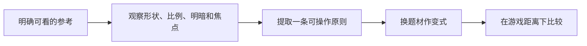

# A01｜美术对话：把唯美、卡通说具体

版本：统一课号课程版｜2026-09-15
状态：课件正文与互动规格已编写；尚未逐课生成OpenMAIC课堂或试教。

**学习分组：** A组；**本课编号：** A01；**路线：** 主线。

## 0. 开始前：只准备本课需要的东西

**本次起点：** 一张你确实能查看的参考图，或一段自己的偏好描述；没有图也可先练表达，但不能凭空评价画面。
**缺材料时：** 可先作风格/观察决定。没有真实图片或样本时用标明的原创简图，不描述不存在的画面，不记真实作品观察通过。
**当前配套：** 见0A的真实文件、首步与覆盖边界；文件存在不表示本课所有M已有完整配套。

**今天的最小任务：** 写一张能指导AI和素材选择的五维风格卡。
**怎样读：** 先看两项M和概念图，再复制对话1。启动框已带首步、继续条件和结束证据；之后用自己的话回复即可，不必把六框逐一重发。
**怎样停：** 完成当前小步可以暂停，记录下次起点；只有本课两项M都有相应证据才标本课应用通过。暂停不是失败，模拟完成不是软件通过。
**先学再验：** 初次允许AI示范一小步，你再换一个值/对象作选择；需要检查独立判断时换未讲过的变式，不要求从零手写代码。

## 0A. 这课怎样学、怎样查缺口

**学习顺序：** 短示范或预测 → 课堂随练 → 软件概念对照 → 自己解释 → 只补薄弱项。

**实际配套：** 没有专用软件Lab；先按本课材料分支做认识/模拟，不虚构文件。

**练习首步：** 从自己提供的参考中选一个可见特征，说出借鉴与不借鉴什么。

**配套局限：** 参考分析，无软件Lab门槛；没有图不捏造作品内容。

**正式项目落点：** P0。实验只为理解；进入相应生产阶段再迁移。

**打开方式与分工：** [现成实验入口](../../LABS-START.md)。Godot打开当前场景按F6；Blender直接打开已有文件，先另存副本。默认先体验，不为上课重新搭建。

**回忆与检查：** [本课记忆规则](../../print/memory-by-lesson.md#a01) · [单元检查](../../assessments/unit-checkpoints.md) · [AI追问与弱项诊断](../../assessments/ai-diagnostic-review.md)。

**记录分开：** 回忆/解释/软件应用/换情境；没有证据写待验证。菜单/API可查；得到根因提示记有提示。

## 1. 本课任务卡

**产出：** 写一张能指导AI和素材选择的五维风格卡。
**前置：** 无；**对应概念：** ART01/ART02。
**预计课堂：** 20–30分钟，可在实验前后暂停；不含后续真实软件制作时间。
**M 必须掌握：**
- 用轮廓、比例、色彩、光照、表面五类词描述偏好。
- 给出保留项、排除项和一个可检查的视觉目标。
**K 理解即可：**
- Stylized、Painterly、Toon/Cel、Diorama是检索方向，不是互斥标准。
**停止线：** 不要求素描基础、艺术史和完整建模；不把艺术家名字当唯一提示词。

## 1A. 必学内容、实操与题目如何对应

M1/M2只是本课任务卡的两项能力序号，不是新的技术概念。查菜单/API不扣独立判断分。

|必须掌握到这里|本课实操题：做什么算有证据|可选配套题|
|---|---|---|
|M1：用轮廓、比例、色彩、光照、表面五类词描述偏好。|对同一小屋的两份示意方案指出可见差异，分别用五维词汇表达。|A01-P1, A01-T3|
|M2：给出保留项、排除项和一个可检查的视觉目标。|写两项保留、一项排除和一个观察目标，再把规则用于路牌。|A01-D2, A01-T3|

**最低学习路径：** 一次预测 → 一个能覆盖上述两项M的小实验/项目改动 → 一次结果解释。普通M做到即可；关键薄弱处再选一题诊断或隔次迁移，不把P/D/T全套加到每个术语上。
**理解即可与停止线：** 任务卡中的K只检用途；按需查的界面、API、高级实现不进入本课操作门槛。只有已学且已存在的项目功能需要回归。

## 2. 必要讲解：先看现象，再给术语

唯美是感受，不是一个可直接复现的参数。可细化为圆润大形、略夸张比例、受控色盘、柔和暖光、少量手绘质感；同时说清不要写实毛孔、不要油亮塑料、不要拥挤小细节。

本课程把童趣绘本、柔软玩具、漫画明暗、低多边形微缩景作为比较方向，不声称它们是标准分类或所有孩子都喜欢。你提到的卡梅拉先保留为童趣绘本参考词，具体作品对应仍应由实际样图确认。

本项目默认面向固定或有限镜头的风格化3D小游戏：温暖、唯美、卡通、低写实、配色清楚。镜头是构图工具，不要求玩家持续自由环绕；美术生产以优质资产套装的选择、拼装、二开和统一为主，从零建模与原创复杂动画不是主线门槛。A01仍训练把个人偏好拆成可观察规则；默认风格只是本项目的起始方向，可被实际参考图修正。

## 2A. 场景、概念图与逐步AI对话

**实际位置：** P00｜决定庭院到底要怎样的卡通感。

|操作前的问题|本课希望得到的结果|
|---|---|
|只说唯美、可爱，AI给出彼此不搭配的方案。|一张能指导同一庭院制作的一页风格卡，而不是一串艺术家名字。|

这是目标对照，不是已完成的游戏截图。概念图为职责/因果示意，不是继承图或完整运行证明。

OpenMAIC不能渲染Mermaid时画等价方框图；无3D或真实连接时仅标课堂模拟，不伪造软件运行。

### 本课人和AI分别负责什么

|责任|这课具体做什么|
|---|---|
|我必须作出的判断|自己选参考中借鉴与不借鉴的特征，把感受译成可观察要求。|
|可以交给AI的制作|把用户已提供参考拆成形状、比例、颜色、光照、表面候选描述，不猜未见图片。|
|我检查AI交付物|看修改对象/前后差异、实际执行记录及未验证项；先核对是否保留本课约束，再决定是否接入。|

**不是手工熟练考试：** 重复劳动与代码可委托；常用可见参数适合亲调时先调一项，无障碍需要可由AI按已选值执行。必须能说明选择、观察和恢复，不要求机械地拖每个滑杆。

**两种模式：** 练习时可问根因、看示范；独立验收时先由我提出选择/假设，AI只协助执行与记录。已透露本题根因或目标值，就记录“有提示”，再换未揭示答案的变式。

### 复制第1框开始；以后每次只发当前一步

**学员用法：** 无需一次读完所有提示。将当前框发给你使用的AI；做完后回“完成＋观察”，结果不符回“不符＋现象”，报错回“报错＋原文”，需要停下回“暂停”。自然语言也可以。不要一口气把六步当成自动执行授权。

### 对话1｜建立本课上下文

```text
请做我这节课的协作教练：A01《美术对话：把唯美、卡通说具体》。
我们逐步制作同一个「星光小庭院」，当前只解决：只说唯美、可爱，AI给出彼此不搭配的方案。
目标：一张能指导同一庭院制作的一页风格卡，而不是一串艺术家名字。
必须掌握：用轮廓、比例、色彩、光照、表面五类词描述偏好；给出保留项、排除项和一个可检查的视觉目标。理解即可：Stylized、Painterly、Toon/Cel、Diorama是检索方向，不是互斥标准
停止线：不要求素描基础、艺术史和完整建模；不把艺术家名字当唯一提示词。
必须保持：小型单机收集玩法、主要游戏观察距离和温暖卡通方向保持；不增加世界观。
本课由我负责：自己选参考中借鉴与不借鉴的特征，把感受译成可观察要求。
可以交给你：把用户已提供参考拆成形状、比例、颜色、光照、表面候选描述，不猜未见图片。
请标明建议/已执行/已验证的区别。练习可提示；验收先等我作判断，已提示根因则如实记有提示。
概念配套：没有专用软件Lab；使用本课明确的材料分支
练习首步：从自己提供的参考中选一个可见特征，说出借鉴与不借鉴什么。
覆盖边界：参考分析，无软件Lab门槛；没有图不捏造作品内容。
对应生产阶段：P0；达到当前阶段才迁移，不把实验完成当成项目通过。
默认先用现成实验体验；下方连接/实现任务属于之后的项目迁移，不作为打开本实验的前置。OpenMAIC已提供同等概念证据时不重复刷题，但真实资源/物理/导出等软件证据不可由模拟代替。
先复用上述现有样本，不重新生成同一个Lab。练习可提示；检查先只读快照，不一边改答案一边评分。
先读取我已提供的进度和材料，只问真正缺失的一项。需要软件操作时核对实际版本、当前截图或场景树、可访问的工具；不要求我发密钥或整个电脑。
本课入场材料：一张你确实能查看的参考图，或一段自己的偏好描述；没有图也可先练表达，但不能凭空评价画面。
材料不足的处理：没有真实文件就说明缺失；先作明示模拟，不布置重建工程作业。
当前目的：体验模式。只有明确说我要改自己的作品，才切换到作品模式。
以下是本课连续推进卡，不是一次性执行授权；收到我的观察后每轮最多推进一个有意义的小步。
首步：从自己提供的参考中选一个可见特征，说出借鉴与不借鉴什么。
继续条件：先作预测，再提供一项实际对照和解释；未覆盖的能力留待验证。
随后一步：在现成材料覆盖范围内选择一个参数或条件作变式，再恢复；不为了凑题重造系统。
结束证据：对同一小屋的两份示意方案指出可见差异，分别用五维词汇表达。；写两项保留、一项排除和一个观察目标，再把规则用于路牌。
相关回归：风格仍允许看清路径与拾取物，不用高复杂度效果作为入门前提。
这些是待执行要求，不是我的已完成进度。不要凭课号推断前置已通过；只复用我已提供的实际材料和证据。
对话1之后我可直接回复完成/不符/报错/暂停，无需重贴整课；你应沿这张推进卡继续，不临时增加系统。
先给一个预测问题并等我回答，再给一个最小步骤。不跳课、不自动做整款游戏。能执行才说已执行，否则给明确操作单或脚本，并标未执行。
后续每轮用四项回应：现在是哪一步；只改什么/怎样恢复；我应观察什么；目前还缺什么证据。没有证据不要替我勾通过。
```

**AI此时应做：** 确认默认体验模式和现成文件；不要先输出脚本或建场景。已经提供过的版本、素材和约束应复用，不重复问。

### 对话2｜先理解一个因果关系

```text
先问我：把所有材质变鲜艳就一定是卡通吗？
等我写预测和理由后，再指出一个证据缺口，只给一个提示，不先公布完整答案。用词不专业时先确认意思，再补术语。
```

**转入下一步：** 有自己的预测即可；预测错可以用实验纠正，不要求先背定义。

### 对话3｜在现成材料里完成第一项对照

```text
沿用已确认的版本、材料和修改边界。现在只做：从自己提供的参考中选一个可见特征，说出借鉴与不借鉴什么。
只找现成控件并记录原值，不创建节点、不写初始化脚本；缺文件就说明缺失，不让学员临时搭场景。软件执行必须有实际观察。做完先停下。
```

**预计看到／拿到：** 先作预测，再提供一项实际对照和解释；未覆盖的能力留待验证。
**不是自动保证：** 这是验收目标，取决于实际模型、工具和输入；结果不同就走下方“不符”分支。

### 对话4｜观察与亲调，不追加一轮搭建

```text
这是我刚才的实际结果：我会附一张当前图、短演示或必要日志，并用一句话描述差异。
先检查是否满足：先作预测，再提供一项实际对照和解释；未覆盖的能力留待验证。
本课可用的微调项（引擎属性供定位；体验先用现成控件，不为匹配表格重建场景）：
入口：参考板/风格卡（设计内容）；操作：选一个圆润程度与一个比例原则；观察：能否用它区分两种候选，而不只说更好看
入口：色板和缩略预览（设计工具入口）；操作：减少互相竞争的高对比颜色；观察：星星与背景是否有清楚主次
若满足，先指导我选择其中一项亲调；我回报观察后才继续：在现成材料覆盖范围内选择一个参数或条件作变式，再恢复；不为了凑题重造系统。
一次只动一项可见参数。方向接近就手调；结构有误才给局部修复，不能不断重生成整个场景。
```

|选中哪里与参数性质|这次亲自试什么|观察与停手依据|
|---|---|---|
|参考板/风格卡（设计内容）|选一个圆润程度与一个比例原则|能否用它区分两种候选，而不只说更好看|
|色板和缩略预览（设计工具入口）|减少互相竞争的高对比颜色|星星与背景是否有清楚主次|

**保存与恢复：** 先记录原值和实际对象。优先在安全副本试；运行中Remote Inspector的变化不要当成已保存的设计值，确认后将选定值写回本地场景/资源或配置并重新运行。菜单路径随版本核对，自定义变量不冒充内置属性。
**采用哪种沟通：** 大方向偏了，用参考图圈出要借鉴的轮廓/色彩/光感，并指出不要照搬什么；单个视觉值接近了，先拖或输入数值；原因不明，固定条件做一次对照。参考图不是可自动反推所有参数的答案。

### 对话5｜成功验收，或失败时只修一处

**达到目标时发送：**
```text
请只根据我提供的证据检查：
- 对同一小屋的两份示意方案指出可见差异，分别用五维词汇表达。
- 写两项保留、一项排除和一个观察目标，再把规则用于路牌。
旧功能回归：风格仍允许看清路径与拾取物，不用高复杂度效果作为入门前提。
缺少过程证据就标待验证；不得用一张截图证明走跳或一次性事件。不要新增需求或把所有候选题变成作业。
```

**结果不符或报错时发送：**
```text
不符/报错：我会提供触发步骤、预期、实际现象和必要原始日志。
保留：小型单机收集玩法、主要游戏观察距离和温暖卡通方向保持；不增加世界观。
本课优先风险：检查AI是否臆测图像内容、复制独特角色，或把个人偏好说成所有孩子都喜欢。
先提出一个可推翻的假设和一个最小验证；不要同时改多个系统。若两次验证仍无进展，回到基线并列出缺失证据，不反复抽卡。不要删除测试、关闭需求或扩大权限来假装修好。
```

**AI评分边界：** 代码和初稿可以由AI提供；判断、亲调与证据解释由学员完成。得到根因提示记为有提示，不因此重复考试所有概念。

### 对话6｜存进度，下一次接着做

```text
请总结本课A01（A01）的进度卡，不把预测当已完成。
记录：真实软件版本/渲染器；当前场景与变更对象；选定参数和原值；我做的判断；实际证据；通过/待验证；使用过的提示；恢复方法；下一步唯一任务。
只有实际验证才标通过，没有生成或真机执行就明确写模拟/待验证。给我一段可以复制到新AI对话的摘要，不假称你已持久保存。
先核对下一课前置和我的已选路线，未完成就停在当前步骤，不催着扩范围。
```

**学员保存：** 把进度卡存本地或私人笔记；下次粘贴进度卡和下一课第1框。不要公开API Key、账户、本地私密路径或个人录像。

<details data-purpose="project">
<summary>作品模式：明确要改自己的工作副本时才展开</summary>

当前默认是体验模式，以下任务不自动执行。只有学员明确说“我要改自己的作品”，并提供工作副本与本次验收，才一次选一项。不要复制第二套作业。

**作品实现候选一：** 先把我给的参考或文字拆成形状、比例、色彩、光照、表面五栏；我先选一项喜欢与一项不要的特征，再完善风格卡，不生成整张场景。

**作品实现候选二：** 用同一个庭院入口比较两种风格描述，只保留我选定的一个方向。

先核对已有对象；能局部修改就不重新创建。实现可交给AI，目标、保持项和验收由学员提出。

</details>


### 当前风险与长期责任

**本课风险检查：** 检查AI是否臆测图像内容、复制独特角色，或把个人偏好说成所有孩子都喜欢。
这是需要在当前工具版本下核验的风险，不是所有AI必然失败的排行榜，也不预测何时改善。长期保留需求、参考选择、影响范围、结果认可与取舍责任；测量、批量设置和重复验证可以由AI协助。
**不把学习变成额外六次考试：** 六个对话阶段共享本课原有M/K证据；只在薄弱关键能力上追加一处故障或变式。没有实际材料时先做课堂模拟，真机状态单独记录。

## 3. 界面与参数学习深度

以下是软件操作的对应范围；优先使用0A已给出的实验，尚无配套的部分如实标待验证。模拟滑块是教学控件，不代表软件都有同名按钮。会调是指看懂作用、主动选择与恢复；会定位是知道去哪找；按需查不考菜单路径、快捷键和API记忆。
- 无必会软件操作；先会观察和写风格卡。
- 会定位：参考板、对照图片、缩略图。
- 按需查：风格词英文拼写和软件实现方法。

## 4. 互动实验规格

**初始状态：** 同一小屋的四张原创或有展示许可的风格卡；统一机位和物体摆放，只改表达方式。没有图片时用带明确示意标签的形状与色块，不伪称大师原作。
**可操作项：** 风格卡切换；轮廓圆/直、比例常规/夸张、色彩低/高饱和、明暗柔和/分块、细节少/多标签选择。
**实验步骤：**
1. 先选最喜欢和最不喜欢的一张，每张给一个可见原因，不只说好看。
2. 把喜欢的一张拆成五维风格卡；再选一张反例写不要什么。
3. 把小屋换成路牌，用同一张卡说明哪些规则仍保持。
**预期反馈：** 显示选择对应的可观察描述，不根据偏好打审美分。风格卡只约束目标，不自动保证生成质量。
**故障或反例：** 反例：提示词只有大师名+高质量+卡通，生成风格漂移；补可观察特征与排除项。
**复位：** 清空标签选择但保留喜欢/不喜欢的理由；便于第二次比较。
**无图/无3D替代：** 用原创简单形状、状态卡或给定时间序列表达同一因果关系；标明“示意”，不得把预设结果说成Godot/Blender实测。不能以假按钮或不响应的截图代替交互。
**完成判据：** 对本课两项M提供操作或判断及解释；一个实验可覆盖多项。只有关键M或发现薄弱处才追加故障/变式，不为每个术语加作业。

## 5. 小结与必须牢记

- 感受要落到可见特征。
- 喜欢与不喜欢都要描述。
- 风格规则比堆艺术家名字更可执行。
- 本项目先固定“温暖、风格化、低写实”的方向，再用实际参考细化，不靠抽卡决定画风。

## 6. 训练：先作答，再看反馈

题干中的日志、数值与AI建议均为标明的教学情境，除非另附运行证据，不是本项目实测。可以有多个合理假设：先给能区分它们的验证，而不是猜老师心中的唯一原因。

P=预测，D=诊断，T=迁移，K=用途认识。下面是候选训练，不是每个词都做四次作业。课堂先用预测和一个操作，重点未达标再选D或T；延迟复测换对象，不重复抄答案。

### A01-P1
**考察范围：** M1的限定子能力；不是整项真机通过证明。先给判断与理由；要求操作时再提供过程/对照。仅答对文字不自动等于实际应用通过。

把所有材质变鲜艳就一定是卡通吗？

### A01-D2
**考察范围：** M2的限定子能力；不是整项真机通过证明。先给判断与理由；要求操作时再提供过程/对照。仅答对文字不自动等于实际应用通过。

【教学构造情境，不是真实测量或某模型故障统计】你要求柔和绘本小屋，AI给出圆润但油亮的玩具屋。当前只有这张实际结果图；参考图还没提供。你会让AI猜大师风格，还是补哪项可见差异？给一句保留/修改/不照搬的指令。

### A01-T3
**考察范围：** M1、M2的限定子能力；不是整项真机通过证明。先给判断与理由；要求操作时再提供过程/对照。仅答对文字不自动等于实际应用通过。

同风格做一棵树，如何不依赖复制原角色？

### A01-K4
**考察范围：** K｜理解用途即可；不要求实现。一句用途解释即可。

Painterly大致用于搜什么？

<details data-purpose="project">
<summary>作品模式：明确要改自己的工作副本时才展开</summary>

## 7. 正式项目迁移（达到相应阶段再做）

后续软件阶段沿用这张卡，不要求这一课制作模型。
即使已有参考工程，也要区分课件、运行测试、人工体验、学习掌握四种证据。已有Lab先随课使用；完整生产按任务单推进，未交付的逐课配套不冒充完成。

## 8. 实际应用验收：把结果放回同一个项目

**本课产物：** 一张能指导同一庭院制作的一页风格卡，而不是一串艺术家名字。
**接入边界：** 小型单机收集玩法、主要游戏观察距离和温暖卡通方向保持；不增加世界观。

以下是要采集的证据，不是宣称已经执行。记录“未尝试 / 有提示完成 / 独立验证 / 隔次仍会”；不把这四种状态与M/K学习要求混淆。

|原有M能力|本次在哪里取证|
|---|---|
|用轮廓、比例、色彩、光照、表面五类词描述偏好。|对同一小屋的两份示意方案指出可见差异，分别用五维词汇表达。|
|给出保留项、排除项和一个可检查的视觉目标。|写两项保留、一项排除和一个观察目标，再把规则用于路牌。|

**旧功能回归：** 风格仍允许看清路径与拾取物，不用高复杂度效果作为入门前提。
**最小记录：** 一段现场演示，或同条件前后图/日志，加一句“我改了什么、为什么”。截图不足以证明运动/一次性事件时，要演示动作或查看对应状态。记录用过的提示，不要求写长报告。
**一般能力取证：** 一次有效操作/选择与解释即可；只有证据不足才补练，不强制反复考试。

**换情境的候选任务：** 新来一张不同风格的参考，指出哪些原则可借鉴、哪些不适用庭院。
**判定：** 普通M按原0–2锚点；有针对性根因提示记练习，换变式再验证。K只查用途，不能抵消关键M失败。没有真实操作的M只记待验证，模拟通过不能自动升级为真机通过。未选专题不阻塞主线。

**接入不等于新增系统：** 美术课可交风格卡、参数决定或改造样本；性能课可得出“不优化”。隔离实验只有对当前项目有收益才接入，不强迫庭院变成战斗、开放世界或联网游戏。


</details>

## 9. 复现与延迟检查

本课复现：无前置复习，直接开始。只复习已学的关键M。
下次课抽一个本课关键判断，换对象或数值后先独立解释。查菜单和API不扣独立判断分；被提示根因或目标值后完成，记录有提示，换变式再验。K不反复背定义。

## 10. 依据与观看入口

- [Roman Klco / Polygon Runway：风格化3D作品与课程](https://polygonrunway.com/)
- [Grant Abbitt：Blender造型与图形设计](https://www.gabbitt.co.uk/)
- [The Walt Disney Family Museum：Mary Blair展览资料](https://www.waltdisney.org/mary-blair)
- [Godot运行检查与可见碰撞工具](https://docs.godotengine.org/en/stable/tutorials/scripting/debug/overview_of_debugging_tools.html)

技术来源支持术语和软件边界；具体实验与课程顺序是本项目教学设计，不代表已证明学习效果。艺术家入口用于观看研习，不等于获得图片或素材再分发许可。
