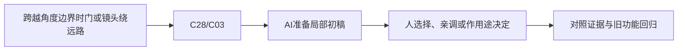

# E-14｜复杂旋转选修：轨迹对，比公式背得熟重要

> 兼容课号：A03。ABCDE是主题入口，不是必须按字母顺序完成；文件链接与题号保留稳定。

版本：Applied Curriculum v5｜2026-09-15
状态：课件正文与互动规格已编写；尚未逐课生成OpenMAIC课堂或试教。

## 1. 本课任务卡

**产出：** 识别跨角度边界和父级旋转的错误插值。
**前置：** I04, B01B；**对应概念：** C28/C03。
**预计课堂：** 20–30分钟，可在实验前后暂停；不含后续真实软件制作时间。
**M 必须掌握：**
- 规定旋转方向、路径和终态。
- 检查跨±180度与父级变化下的结果。
**K 理解即可：**
- Quaternion/Basis是旋转表示工具，API按需查。
**停止线：** 不考展开式、矩阵乘法和插值算法实现。

## 2. 必要讲解：先看现象，再给术语

角度数值接近边界时，直接线性插值可能沿意外长路径走。最短路径也不是所有艺术需求：风车可能希望持续同方向转。

先定义期望路径和参考空间，AI再选表示和实现。可视化坐标与轨迹比背公式更能帮助验收。

## 2A. 这次在实际场景里解决什么

**应用位置：** P07隔离实验｜跨越角度边界时门或镜头绕远路；选修隔离实验：有价值才接入。

|开始时遇到的问题|本课期望得到的变化|
|---|---|
|普通角度正常，跨正负180度或父级旋转后轨迹异常。|能用边界样例验收旋转轨迹，而不用背四元数公式。|

**这是目标状态对照，不是已完成截图。** 首次操作应使用匹配当前进度的最小场景；还没有配套时，只能记为课堂模拟，不能直接勾选真机应用通过。

### 概念关系示意


图中箭头表示教学流程，不是引擎节点继承。OpenMAIC不支持Mermaid时改画等价方框图，不能把代码原文冒充运行示意。

### 先让AI帮助理解，再让AI帮助工作

**学习指令：**
```text
现在只检查这道判断：170到-170数值差很大就必须转340度吗？
先等我给预测和理由，再指出一个证据缺口；一次只给一个线索，不先公布完整答案。
我的用词不专业时，先用人话确认意思，再补对应术语。
```

**工作指令：可复制；先补实际版本与当前材料，不粘贴密钥。**
```text
我正在逐步制作同一个小型单机「星光小庭院」，不是重新生成整款游戏。
我会提供实际软件版本、当前场景/文件和必要截图；先确认你能访问哪些材料和工具。
这次只做：用现有支点模型的副本只比较几个边界姿态与插值方案。显示起终姿态和轨迹，包含父级转动；不要同时改速度和物理结构。
必须保持：支点、端点要求和观察机位固定；不把数学推导设为验收门槛。
先列出将改的对象、原值和预期结果，提供最小可撤销初稿及检查步骤。
没有真实软件连接时只提供操作单/脚本，不声称已经编辑、运行或看过未提供的截图。
不要自动安装插件、联网下载素材、购买服务或读取无关文件；必要操作另说明并取得授权。
完成后报告实际做了什么、还没验证什么；我负责选择和最终验收。
```

### 哪些地方比继续发指令更适合亲自试

|入口与性质|一次只做的微调/选择|亲眼观察什么|
|---|---|---|
|起终旋转与时长（内置/自定义）|先测普通角度，再测边界，单独改变一项|是否绕远路或突然翻转|
|插值方案选择（教学控件）|同端点比较轨迹，注明不是内置通用按钮|轨迹是否符合实际运动目标|

**初值与恢复：** 先读取并记录当前值；表里的方向是对照办法，不是通用最佳参数。先在副本上操作，不覆盖基底；返回前用撤销或记录值恢复并重新预览。自定义变量不是软件内置参数。
**选择下一步：** 方向不对，补一张明确参考并圈出要借鉴的部分；结构/因果不对，让AI做局部修复；已接近目标且入口可直接操作，先亲调一项。原因不明先做对照，不靠反复重生成抽卡。

**局部修复指令：**
```text
保留本课「必须保持」的部分。我会给出同条件的当前结果和目标差异。
只围绕「能用边界样例验收旋转轨迹，而不用背四元数公式。」检查一个根因假设；先给最小验证，未经证据不要重写全部内容。
若只是一个可见参数偏差，告诉我该选哪个对象、哪个入口、怎么小幅调和恢复。
```

**本课风险检查：** 检查AI是否混用度/弧度、只验证终点或把Euler某一数值直接当完整姿态。
**时间边界：** 上述是需要在当前模型/工具/软件版本下验证的风险清单，不是所有AI必然失败的结论，也不预测何时会解决。长期保留的是目标、约束、参考选择、结果认可和取舍责任；测量和重复调整可以继续交给AI协助。

## 3. 界面与参数学习深度

以下是后续真机操作的对应范围，不要求本轮打开软件。模拟滑块是教学控件，不代表软件都有同名按钮。会调是指看懂作用、主动选择与恢复；会定位是知道去哪找；按需查不考菜单路径、快捷键和API记忆。
- 常用：关键姿态、轨迹与播放速度。
- 会定位：旋转模式和父级关系。
- 按需查：slerp、Quaternion和Basis接口。

## 4. 互动实验规格

**初始状态：** 箭头姿态从170到-170度；父节点0/90度；固定步长播放。
**可操作项：** 直接角度/短路径示意、父转角、持续同向需求、单步播放。
**实验步骤：**
1. 先画箭头预期怎么走。
2. 对照长短路径，判断哪个符合给定需求。
3. 改变父级后再测，分别报告本地与世界效果。
**预期反馈：** 每步显示方向与参考轴；不得把所有旋转错误归咎于四元数。
**故障或反例：** 故障：镜头过边界绕大圈；先检查路径约定与表示。
**复位：** 恢复起点与父变换，清空轨迹。
**无图/无3D替代：** 用原创简单形状、状态卡或给定时间序列表达同一因果关系；标明“示意”，不得把预设结果说成Godot/Blender实测。不能以假按钮或不响应的截图代替交互。
**完成判据：** 对本课两项M提供操作或判断及解释；一个实验可覆盖多项。只有关键M或发现薄弱处才追加故障/变式，不为每个术语加作业。

## 5. 小结与必须牢记

- 终点对不代表过程对。
- 最短路径也要符合需求。
- 先说明参考空间。

## 6. 训练：先作答，再看反馈

P=预测，D=诊断，T=迁移，K=用途认识。下面是候选训练，不是每个词都做四次作业。课堂先用预测和一个操作，重点未达标再选D或T；延迟复测换对象，不重复抄答案。

### A03-P1
170到-170数值差很大就必须转340度吗？

### A03-D2
父节点转了后方向错，先查什么？

### A03-T3
风车要一直顺转，能总用最短路径吗？

### A03-K4
四元数现在要背吗？

## 7. 后续真机任务（配套待做，不作为当前课堂依赖）

后续只针对出现的复杂旋转故障提供示例。
即使已有参考工程，也要区分课件、运行测试、人工体验、学习掌握四种证据。按用户安排，当前先完成全部课件，之后再统一补素材、Godot/Blender起始与参考工程。

## 8. 实际应用验收：把结果放回同一个项目

**本课产物：** 能用边界样例验收旋转轨迹，而不用背四元数公式。
**接入边界：** 支点、端点要求和观察机位固定；不把数学推导设为验收门槛。

以下是要采集的证据，不是宣称已经执行。记录“未尝试 / 有提示完成 / 独立验证 / 隔次仍会”；不把这四种状态与M/K学习要求混淆。

|原有M能力|本次在哪里取证|
|---|---|
|规定旋转方向、路径和终态。|能指出参照系与角度边界在故障中的作用。|
|检查跨±180度与父级变化下的结果。|能用轨迹而非只看终点验收方案，再恢复基线。|

**旧功能回归：** 原门轴和镜头逻辑不变；未选此专项不影响主线结业。
**最小记录：** 一段现场演示，或同条件前后图/日志，加一句“我改了什么、为什么”。截图不足以证明运动/一次性事件时，要演示动作或查看对应状态。记录用过的提示，不要求写长报告。
**一般能力取证：** 一次有效操作/选择与解释即可；只有证据不足才补练，不强制反复考试。

**换情境的候选任务：** 把门换成朝目标转动的路牌，用新父级条件验证。
**判定：** 普通M按原0–2锚点；有针对性根因提示记练习，换变式再验证。K只查用途，不能抵消关键M失败。没有真实操作的M只记待验证，模拟通过不能自动升级为真机通过。未选专题不阻塞主线。

**接入不等于新增系统：** 美术课可交风格卡、参数决定或改造样本；性能课可得出“不优化”。隔离实验只有对当前项目有收益才接入，不强迫庭院变成战斗、开放世界或联网游戏。

## 9. 复现与延迟检查

本课复现：B01B。只复习已学的关键M。
下次课抽一个本课关键判断，换对象或数值后先独立解释。查菜单和API不扣独立判断分；被提示根因或目标值后完成，记录有提示，换变式再验。K不反复背定义。

## 10. 依据与观看入口

- [Godot Node3D：变换与父空间](https://docs.godotengine.org/en/stable/classes/class_node3d.html)
- [Godot AnimationTree：动画组织](https://docs.godotengine.org/en/stable/tutorials/animation/animation_tree.html)

技术来源支持术语和软件边界；具体实验与课程顺序是本项目教学设计，不代表已证明学习效果。艺术家入口用于观看研习，不等于获得图片或素材再分发许可。
