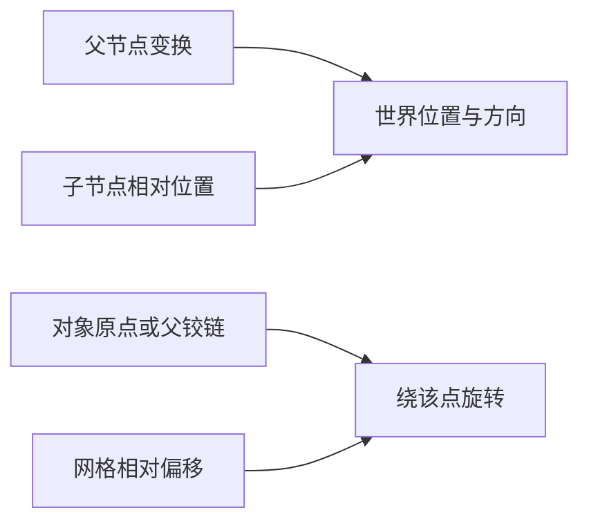

# E-14｜复杂旋转选修：轨迹对，比公式背得熟重要

> 兼容课号：A03。ABCDE是主题入口，不是必须按字母顺序完成；文件链接与题号保留稳定。

版本：Guided Demo v6｜2026-09-15
状态：课件正文与互动规格已编写；尚未逐课生成OpenMAIC课堂或试教。

## 1. 本课任务卡

**产出：** 识别跨角度边界和父级旋转的错误插值。
**前置：** I04, B01B；**对应概念：** C28/C03。
**预计课堂：** 20–30分钟，可在实验前后暂停；不含后续真实软件制作时间。
**M 必须掌握：**
- 规定旋转方向、路径和终态。
- 检查跨±180度与父级变化下的结果。
**K 理解即可：**
- Quaternion/Basis是旋转表示工具，API按需查。
**停止线：** 不考展开式、矩阵乘法和插值算法实现。

## 2. 必要讲解：先看现象，再给术语

角度数值接近边界时，直接线性插值可能沿意外长路径走。最短路径也不是所有艺术需求：风车可能希望持续同方向转。

先定义期望路径和参考空间，AI再选表示和实现。可视化坐标与轨迹比背公式更能帮助验收。

## 2A. 场景、概念图与逐步AI对话

**实际位置：** P07隔离实验｜跨越角度边界时门或镜头绕远路。

|操作前的问题|本课希望得到的结果|
|---|---|
|普通角度正常，跨正负180度或父级旋转后轨迹异常。|能用边界样例验收旋转轨迹，而不用背四元数公式。|

这是目标对照，不是已完成的游戏截图。概念图为职责/因果示意，不是继承图或完整运行证明。

OpenMAIC不能渲染Mermaid时画等价方框图；无3D或真实连接时仅标课堂模拟，不伪造软件运行。

### 复制第1框开始；以后每次只发当前一步

**学员用法：** 无需一次读完所有提示。将当前框发给你使用的AI；做完后回“完成＋观察”，结果不符回“不符＋现象”，报错回“报错＋原文”，需要停下回“暂停”。自然语言也可以。不要一口气把六步当成自动执行授权。

### 对话1｜建立本课上下文

```text
请做我这节课的协作教练：E-14（兼容课号A03）《复杂旋转选修：轨迹对，比公式背得熟重要》。
我们逐步制作同一个「星光小庭院」，当前只解决：普通角度正常，跨正负180度或父级旋转后轨迹异常。
目标：能用边界样例验收旋转轨迹，而不用背四元数公式。
必须掌握：规定旋转方向、路径和终态；检查跨±180度与父级变化下的结果。理解即可：Quaternion/Basis是旋转表示工具，API按需查
停止线：不考展开式、矩阵乘法和插值算法实现。
必须保持：支点、端点要求和观察机位固定；不把数学推导设为验收门槛。
先读取我已提供的进度和材料，只问真正缺失的一项。需要软件操作时核对实际版本、当前截图或场景树、可访问的工具；不要求我发密钥或整个电脑。
先给一个预测问题并等我回答，再给一个最小步骤。不跳课、不自动做整款游戏。能执行才说已执行，否则给明确操作单或脚本，并标未执行。
后续每轮用四项回应：现在是哪一步；只改什么/怎样恢复；我应观察什么；目前还缺什么证据。没有证据不要替我勾通过。
```

**AI此时应做：** 确认当前场景与学习范围，不直接输出几十个文件。已经提供过的版本、素材和约束应复用，不重复问。

### 对话2｜先理解一个因果关系

```text
先问我：170到-170数值差很大就必须转340度吗？
等我写预测和理由后，再指出一个证据缺口，只给一个提示，不先公布完整答案。用词不专业时先确认意思，再补术语。
```

**转入下一步：** 有自己的预测即可；预测错可以用实验纠正，不要求先背定义。

### 对话3｜AI只完成第一小步

```text
沿用已确认的版本、材料和修改边界。现在只做：先只提供一组跨角度边界的旋转对照，保留父子关系，不推公式。
先列影响对象和原值，再提供一个可撤销初稿。没有实际软件连接时给我可执行的局部操作单/脚本，不说已经修改。做完先停下。
```

**预计看到／拿到：** 我能从轨迹判断是否走错方向或经过不希望的姿态。
**不是自动保证：** 这是验收目标，取决于实际模型、工具和输入；结果不同就走下方“不符”分支。

### 对话4｜人观察与亲调，再继续第二小步

```text
这是我刚才的实际结果：我会附一张当前图、短演示或必要日志，并用一句话描述差异。
先检查是否满足：我能从轨迹判断是否走错方向或经过不希望的姿态。
本课可用的微调项：
入口：起终旋转与时长（内置/自定义）；操作：先测普通角度，再测边界，单独改变一项；观察：是否绕远路或突然翻转
入口：插值方案选择（教学控件）；操作：同端点比较轨迹，注明不是内置通用按钮；观察：轨迹是否符合实际运动目标
若满足，先指导我选择其中一项亲调；我回报观察后才继续：换父旋转或起终姿态复测，AI实现可查但我要选对验收轨迹。
一次只动一项可见参数。方向接近就手调；结构有误才给局部修复，不能不断重生成整个场景。
```

|选中哪里与参数性质|这次亲自试什么|观察与停手依据|
|---|---|---|
|起终旋转与时长（内置/自定义）|先测普通角度，再测边界，单独改变一项|是否绕远路或突然翻转|
|插值方案选择（教学控件）|同端点比较轨迹，注明不是内置通用按钮|轨迹是否符合实际运动目标|

**保存与恢复：** 先记录原值和实际对象。优先在安全副本试；运行中Remote Inspector的变化不要当成已保存的设计值，确认后将选定值写回本地场景/资源或配置并重新运行。菜单路径随版本核对，自定义变量不冒充内置属性。
**采用哪种沟通：** 大方向偏了，用参考图圈出要借鉴的轮廓/色彩/光感，并指出不要照搬什么；单个视觉值接近了，先拖或输入数值；原因不明，固定条件做一次对照。参考图不是可自动反推所有参数的答案。

### 对话5｜成功验收，或失败时只修一处

**达到目标时发送：**
```text
请只根据我提供的证据检查：
- 能指出参照系与角度边界在故障中的作用。
- 能用轨迹而非只看终点验收方案，再恢复基线。
旧功能回归：原门轴和镜头逻辑不变；未选此专项不影响主线结业。
缺少过程证据就标待验证；不得用一张截图证明走跳或一次性事件。不要新增需求或把所有候选题变成作业。
```

**结果不符或报错时发送：**
```text
不符/报错：我会提供触发步骤、预期、实际现象和必要原始日志。
保留：支点、端点要求和观察机位固定；不把数学推导设为验收门槛。
本课优先风险：检查AI是否混用度/弧度、只验证终点或把Euler某一数值直接当完整姿态。
先提出一个可推翻的假设和一个最小验证；不要同时改多个系统。若两次验证仍无进展，回到基线并列出缺失证据，不反复抽卡。不要删除测试、关闭需求或扩大权限来假装修好。
```

**AI评分边界：** 代码和初稿可以由AI提供；判断、亲调与证据解释由学员完成。得到根因提示记为有提示，不因此重复考试所有概念。

### 对话6｜存进度，下一次接着做

```text
请总结本课E-14（A03）的进度卡，不把预测当已完成。
记录：真实软件版本/渲染器；当前场景与变更对象；选定参数和原值；我做的判断；实际证据；通过/待验证；使用过的提示；恢复方法；下一步唯一任务。
只有实际验证才标通过，没有生成或真机执行就明确写模拟/待验证。给我一段可以复制到新AI对话的摘要，不假称你已持久保存。
先核对下一课前置和我的已选路线，未完成就停在当前步骤，不催着扩范围。
```

**学员保存：** 把进度卡存本地或私人笔记；下次粘贴进度卡和下一课第1框。不要公开API Key、账户、本地私密路径或个人录像。

### 当前风险与长期责任

**本课风险检查：** 检查AI是否混用度/弧度、只验证终点或把Euler某一数值直接当完整姿态。
这是需要在当前工具版本下核验的风险，不是所有AI必然失败的排行榜，也不预测何时改善。长期保留需求、参考选择、影响范围、结果认可与取舍责任；测量、批量设置和重复验证可以由AI协助。
**不把学习变成额外六次考试：** 六个对话阶段共享本课原有M/K证据；只在薄弱关键能力上追加一处故障或变式。没有实际材料时先做课堂模拟，真机状态单独记录。

## 3. 界面与参数学习深度

以下是后续真机操作的对应范围，不要求本轮打开软件。模拟滑块是教学控件，不代表软件都有同名按钮。会调是指看懂作用、主动选择与恢复；会定位是知道去哪找；按需查不考菜单路径、快捷键和API记忆。
- 常用：关键姿态、轨迹与播放速度。
- 会定位：旋转模式和父级关系。
- 按需查：slerp、Quaternion和Basis接口。

## 4. 互动实验规格

**初始状态：** 箭头姿态从170到-170度；父节点0/90度；固定步长播放。
**可操作项：** 直接角度/短路径示意、父转角、持续同向需求、单步播放。
**实验步骤：**
1. 先画箭头预期怎么走。
2. 对照长短路径，判断哪个符合给定需求。
3. 改变父级后再测，分别报告本地与世界效果。
**预期反馈：** 每步显示方向与参考轴；不得把所有旋转错误归咎于四元数。
**故障或反例：** 故障：镜头过边界绕大圈；先检查路径约定与表示。
**复位：** 恢复起点与父变换，清空轨迹。
**无图/无3D替代：** 用原创简单形状、状态卡或给定时间序列表达同一因果关系；标明“示意”，不得把预设结果说成Godot/Blender实测。不能以假按钮或不响应的截图代替交互。
**完成判据：** 对本课两项M提供操作或判断及解释；一个实验可覆盖多项。只有关键M或发现薄弱处才追加故障/变式，不为每个术语加作业。

## 5. 小结与必须牢记

- 终点对不代表过程对。
- 最短路径也要符合需求。
- 先说明参考空间。

## 6. 训练：先作答，再看反馈

P=预测，D=诊断，T=迁移，K=用途认识。下面是候选训练，不是每个词都做四次作业。课堂先用预测和一个操作，重点未达标再选D或T；延迟复测换对象，不重复抄答案。

### A03-P1
170到-170数值差很大就必须转340度吗？

### A03-D2
父节点转了后方向错，先查什么？

### A03-T3
风车要一直顺转，能总用最短路径吗？

### A03-K4
四元数现在要背吗？

## 7. 后续真机任务（配套待做，不作为当前课堂依赖）

后续只针对出现的复杂旋转故障提供示例。
即使已有参考工程，也要区分课件、运行测试、人工体验、学习掌握四种证据。按用户安排，当前先完成全部课件，之后再统一补素材、Godot/Blender起始与参考工程。

## 8. 实际应用验收：把结果放回同一个项目

**本课产物：** 能用边界样例验收旋转轨迹，而不用背四元数公式。
**接入边界：** 支点、端点要求和观察机位固定；不把数学推导设为验收门槛。

以下是要采集的证据，不是宣称已经执行。记录“未尝试 / 有提示完成 / 独立验证 / 隔次仍会”；不把这四种状态与M/K学习要求混淆。

|原有M能力|本次在哪里取证|
|---|---|
|规定旋转方向、路径和终态。|能指出参照系与角度边界在故障中的作用。|
|检查跨±180度与父级变化下的结果。|能用轨迹而非只看终点验收方案，再恢复基线。|

**旧功能回归：** 原门轴和镜头逻辑不变；未选此专项不影响主线结业。
**最小记录：** 一段现场演示，或同条件前后图/日志，加一句“我改了什么、为什么”。截图不足以证明运动/一次性事件时，要演示动作或查看对应状态。记录用过的提示，不要求写长报告。
**一般能力取证：** 一次有效操作/选择与解释即可；只有证据不足才补练，不强制反复考试。

**换情境的候选任务：** 把门换成朝目标转动的路牌，用新父级条件验证。
**判定：** 普通M按原0–2锚点；有针对性根因提示记练习，换变式再验证。K只查用途，不能抵消关键M失败。没有真实操作的M只记待验证，模拟通过不能自动升级为真机通过。未选专题不阻塞主线。

**接入不等于新增系统：** 美术课可交风格卡、参数决定或改造样本；性能课可得出“不优化”。隔离实验只有对当前项目有收益才接入，不强迫庭院变成战斗、开放世界或联网游戏。

## 9. 复现与延迟检查

本课复现：B01B。只复习已学的关键M。
下次课抽一个本课关键判断，换对象或数值后先独立解释。查菜单和API不扣独立判断分；被提示根因或目标值后完成，记录有提示，换变式再验。K不反复背定义。

## 10. 依据与观看入口

- [Godot Node3D：变换与父空间](https://docs.godotengine.org/en/stable/classes/class_node3d.html)
- [Godot AnimationTree：动画组织](https://docs.godotengine.org/en/stable/tutorials/animation/animation_tree.html)
- [Godot运行检查与可见碰撞工具](https://docs.godotengine.org/en/stable/tutorials/scripting/debug/overview_of_debugging_tools.html)

技术来源支持术语和软件边界；具体实验与课程顺序是本项目教学设计，不代表已证明学习效果。艺术家入口用于观看研习，不等于获得图片或素材再分发许可。
