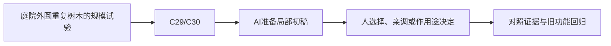

# E-15｜大场景选修：批量、剔除与加载各治什么

> 兼容课号：A04。ABCDE是主题入口，不是必须按字母顺序完成；文件链接与题号保留稳定。

版本：Applied Curriculum v5｜2026-09-15
状态：课件正文与互动规格已编写；尚未逐课生成OpenMAIC课堂或试教。

## 1. 本课任务卡

**产出：** 为重复植被场景选择一种有证据支持的优化策略。
**前置：** A01；**对应概念：** C29/C30。
**预计课堂：** 20–30分钟，可在实验前后暂停；不含后续真实软件制作时间。
**M 必须掌握：**
- 按瓶颈区分批量绘制、细节等级、遮挡和加载问题。
- 验收视角变化与边界经过时的副作用。
**K 理解即可：**
- MultiMesh/LOD/Culling/Streaming分别是工具族。
**停止线：** 不要求同时实现四种技术；小场景不强制学习。

## 2. 必要讲解：先看现象，再给术语

批量减少某些提交成本，LOD降低远处细节，剔除减少不需绘制内容，流送管理驻留资源。它们不是同一个万能开关。

把整个森林合成一组可能损害有效剔除；分区和边界移动需要测。具体效果由场景和引擎实现决定。

## 2A. 这次在实际场景里解决什么

**应用位置：** P07隔离实验｜庭院外圈重复树木的规模试验；选修隔离实验：有价值才接入。

|开始时遇到的问题|本课期望得到的变化|
|---|---|
|一味合批导致整片都被绘制，或剔除/加载策略引入突然消失与慢帧。|只针对实际规模问题选择分区、LOD、剔除或加载之一，记录取舍。|

**这是目标状态对照，不是已完成截图。** 首次操作应使用匹配当前进度的最小场景；还没有配套时，只能记为课堂模拟，不能直接勾选真机应用通过。

### 概念关系示意


图中箭头表示教学流程，不是引擎节点继承。OpenMAIC不支持Mermaid时改画等价方框图，不能把代码原文冒充运行示意。

### 先让AI帮助理解，再让AI帮助工作

**学习指令：**
```text
现在只检查这道判断：批量绘制能自动解决所有内存问题吗？
先等我给预测和理由，再指出一个证据缺口；一次只给一个线索，不先公布完整答案。
我的用词不专业时，先用人话确认意思，再补对应术语。
```

**工作指令：可复制；先补实际版本与当前材料，不粘贴密钥。**
```text
我正在逐步制作同一个小型单机「星光小庭院」，不是重新生成整款游戏。
我会提供实际软件版本、当前场景/文件和必要截图；先确认你能访问哪些材料和工具。
这次只做：在独立压力场景复用少量基底，明确每种策略解决的不同问题。先对一个候选做同路线实验，保留边界移动与内存记录，不把所有策略一起启用。
必须保持：原庭院项目不扩成开放世界；不能减少交互需求来伪造优化。
先列出将改的对象、原值和预期结果，提供最小可撤销初稿及检查步骤。
没有真实软件连接时只提供操作单/脚本，不声称已经编辑、运行或看过未提供的截图。
不要自动安装插件、联网下载素材、购买服务或读取无关文件；必要操作另说明并取得授权。
完成后报告实际做了什么、还没验证什么；我负责选择和最终验收。
```

### 哪些地方比继续发指令更适合亲自试

|入口与性质|一次只做的微调/选择|亲眼观察什么|
|---|---|---|
|分区大小或LOD阈值（自定义/引擎入口，以实际实现为准）|一次只调当前被测策略|边界切换、突变和实际绘制负担|
|固定路线视角/距离（实验条件）|重复靠近、离开与转身|是否突然消失、卡顿或错误保持大批可见|

**初值与恢复：** 先读取并记录当前值；表里的方向是对照办法，不是通用最佳参数。先在副本上操作，不覆盖基底；返回前用撤销或记录值恢复并重新预览。自定义变量不是软件内置参数。
**选择下一步：** 方向不对，补一张明确参考并圈出要借鉴的部分；结构/因果不对，让AI做局部修复；已接近目标且入口可直接操作，先亲调一项。原因不明先做对照，不靠反复重生成抽卡。

**局部修复指令：**
```text
保留本课「必须保持」的部分。我会给出同条件的当前结果和目标差异。
只围绕「只针对实际规模问题选择分区、LOD、剔除或加载之一，记录取舍。」检查一个根因假设；先给最小验证，未经证据不要重写全部内容。
若只是一个可见参数偏差，告诉我该选哪个对象、哪个入口、怎么小幅调和恢复。
```

**本课风险检查：** 检查AI是否把MultiMesh等同单对象精细剔除、只测静止视角或忽略加载卡顿。
**时间边界：** 上述是需要在当前模型/工具/软件版本下验证的风险清单，不是所有AI必然失败的结论，也不预测何时会解决。长期保留的是目标、约束、参考选择、结果认可和取舍责任；测量和重复调整可以继续交给AI协助。

## 3. 界面与参数学习深度

以下是后续真机操作的对应范围，不要求本轮打开软件。模拟滑块是教学控件，不代表软件都有同名按钮。会调是指看懂作用、主动选择与恢复；会定位是知道去哪找；按需查不考菜单路径、快捷键和API记忆。
- 常用：策略开关、距离范围、分区大小。
- 会定位：对应性能报告。
- 按需查：MultiMesh、LOD和异步加载API。

## 4. 互动实验规格

**初始状态：** 合成森林格网，一部分在视野外；显示每格实例与资源驻留的示意数。
**可操作项：** 全场/分区批量、近远细节、视角移动、边界加载示意。
**实验步骤：**
1. 先选一个数据支持的瓶颈。
2. 只改一种策略，比较提交/细节/驻留哪类量变化。
3. 走过分区边界，检查跳变、尖峰和缺物体。
**预期反馈：** 所有数值标模拟，不伪装真实Draw Call；可视化被剔除格与保留格。
**故障或反例：** 故障：减少提交却让大量不可见对象仍被整批处理；讨论分区并复测。
**复位：** 恢复场景数量、分区和观察路线。
**无图/无3D替代：** 用原创简单形状、状态卡或给定时间序列表达同一因果关系；标明“示意”，不得把预设结果说成Godot/Blender实测。不能以假按钮或不响应的截图代替交互。
**完成判据：** 对本课两项M提供操作或判断及解释；一个实验可覆盖多项。只有关键M或发现薄弱处才追加故障/变式，不为每个术语加作业。

## 5. 小结与必须牢记

- 先区分成本类型。
- 优化要走过边界再测。
- 不把所有策略一次全上。

## 6. 训练：先作答，再看反馈

P=预测，D=诊断，T=迁移，K=用途认识。下面是候选训练，不是每个词都做四次作业。课堂先用预测和一个操作，重点未达标再选D或T；延迟复测换对象，不重复抄答案。

### A04-P1
批量绘制能自动解决所有内存问题吗？

### A04-D2
边界突然卡顿，只有平均FPS正常，怎样补证据？

### A04-T3
森林改为室内房间，优化选择一定相同吗？

### A04-K4
Streaming与LOD有何用途区别？

## 7. 后续真机任务（配套待做，不作为当前课堂依赖）

工程实现按实际瓶颈追加，不是当前必交内容。
即使已有参考工程，也要区分课件、运行测试、人工体验、学习掌握四种证据。按用户安排，当前先完成全部课件，之后再统一补素材、Godot/Blender起始与参考工程。

## 8. 实际应用验收：把结果放回同一个项目

**本课产物：** 只针对实际规模问题选择分区、LOD、剔除或加载之一，记录取舍。
**接入边界：** 原庭院项目不扩成开放世界；不能减少交互需求来伪造优化。

以下是要采集的证据，不是宣称已经执行。记录“未尝试 / 有提示完成 / 独立验证 / 隔次仍会”；不把这四种状态与M/K学习要求混淆。

|原有M能力|本次在哪里取证|
|---|---|
|按瓶颈区分批量绘制、细节等级、遮挡和加载问题。|能把批量、细节、遮挡和加载问题区分后选择一个策略。|
|验收视角变化与边界经过时的副作用。|能报告画面、帧时间和内存的对照，明确不适用范围。|

**旧功能回归：** 原样本物体的位置与交互保持，回主项目前单独验证收益。
**最小记录：** 一段现场演示，或同条件前后图/日志，加一句“我改了什么、为什么”。截图不足以证明运动/一次性事件时，要演示动作或查看对应状态。记录用过的提示，不要求写长报告。
**一般能力取证：** 一次有效操作/选择与解释即可；只有证据不足才补练，不强制反复考试。

**换情境的候选任务：** 由开阔地换成有墙遮挡的布局，重新判断策略而不机械沿用。
**判定：** 普通M按原0–2锚点；有针对性根因提示记练习，换变式再验证。K只查用途，不能抵消关键M失败。没有真实操作的M只记待验证，模拟通过不能自动升级为真机通过。未选专题不阻塞主线。

**接入不等于新增系统：** 美术课可交风格卡、参数决定或改造样本；性能课可得出“不优化”。隔离实验只有对当前项目有收益才接入，不强迫庭院变成战斗、开放世界或联网游戏。

## 9. 复现与延迟检查

本课复现：I07, A01。只复习已学的关键M。
下次课抽一个本课关键判断，换对象或数值后先独立解释。查菜单和API不扣独立判断分；被提示根因或目标值后完成，记录有提示，换变式再验。K不反复背定义。

## 10. 依据与观看入口

- [Godot General optimization：测量与取舍](https://docs.godotengine.org/en/stable/tutorials/performance/general_optimization.html)

技术来源支持术语和软件边界；具体实验与课程顺序是本项目教学设计，不代表已证明学习效果。艺术家入口用于观看研习，不等于获得图片或素材再分发许可。
