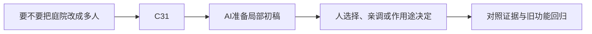

# E-16｜多人认识专题：先知道为什么会复杂

> 兼容课号：A05。ABCDE是主题入口，不是必须按字母顺序完成；文件链接与题号保留稳定。

版本：Applied Curriculum v5｜2026-09-15
状态：课件正文与互动规格已编写；尚未逐课生成OpenMAIC课堂或试教。

## 1. 本课任务卡

**产出：** 用事件时间线认识权威、延迟和重连；不开展网络实作。
**前置：** I12；**对应概念：** C31。
**预计课堂：** 5–10分钟的认识讨论，可选。
**M 必须掌握：**
无。本课全为K认识选修，不进入单机毕业细考。
**K 理解即可：**
- 权威决定谁能确认结果。
- 延迟、预测、重连会影响不同客户端看到的状态。
**停止线：** 本课为全K选修，不计入单机毕业条件，不要求服务器和同步代码。

## 2. 必要讲解：先看现象，再给术语

两个人同时拾取同一件物品时，两个屏幕都显示成功不意味着系统可以发两份奖励。需要明确结果由谁确认。

网络消息有延迟和顺序问题，重连还要恢复一致状态。这与本地一次性事件有关，但不能简单复制本地脚本就保证正确。

## 2A. 这次在实际场景里解决什么

**应用位置：** P07决策记录｜要不要把庭院改成多人；K用途决策：不实现。

|开始时遇到的问题|本课期望得到的变化|
|---|---|
|以为把单机再加一个玩家就自动成为可靠多人游戏。|知道状态权威、延迟和恢复增加的需求，能决定当前不做多人。|

**这是目标状态对照，不是已完成截图。** 首次操作应使用匹配当前进度的最小场景；还没有配套时，只能记为课堂模拟，不能直接勾选真机应用通过。

### 概念关系示意


图中箭头表示教学流程，不是引擎节点继承。OpenMAIC不支持Mermaid时改画等价方框图，不能把代码原文冒充运行示意。

### 先让AI帮助理解，再让AI帮助工作

**学习指令：**
```text
现在只检查这道判断：谁应确认同一物品最终归属？
先等我给预测和理由，再指出一个证据缺口；一次只给一个线索，不先公布完整答案。
我的用词不专业时，先用人话确认意思，再补对应术语。
```

**工作指令：可复制；先补实际版本与当前材料，不粘贴密钥。**
```text
我正在逐步制作同一个小型单机「星光小庭院」，不是重新生成整款游戏。
我会提供实际软件版本、当前场景/文件和必要截图；先确认你能访问哪些材料和工具。
这次只做：只用两人同时碰一颗星的情境解释谁决定奖励与各端看见什么。列出要新验证的三类问题，不写网络代码、不搭服务；先等我判断再提示。
必须保持：课程全K认识；主庭院保持单机，不形成网络实现或操作考试。
先列出将改的对象、原值和预期结果，提供最小可撤销初稿及检查步骤。
没有真实软件连接时只提供操作单/脚本，不声称已经编辑、运行或看过未提供的截图。
不要自动安装插件、联网下载素材、购买服务或读取无关文件；必要操作另说明并取得授权。
完成后报告实际做了什么、还没验证什么；我负责选择和最终验收。
```

### 哪些地方比继续发指令更适合亲自试

|入口与性质|一次只做的微调/选择|亲眼观察什么|
|---|---|---|
|事件卡片排序（讨论材料）|比较两端请求的先后关系|为什么同一星的奖励需要一致判定|

**初值与恢复：** 先读取并记录当前值；表里的方向是对照办法，不是通用最佳参数。先在副本上操作，不覆盖基底；返回前用撤销或记录值恢复并重新预览。自定义变量不是软件内置参数。
**选择下一步：** 方向不对，补一张明确参考并圈出要借鉴的部分；结构/因果不对，让AI做局部修复；已接近目标且入口可直接操作，先亲调一项。原因不明先做对照，不靠反复重生成抽卡。

**局部修复指令：**
```text
保留本课「必须保持」的部分。我会给出同条件的当前结果和目标差异。
只围绕「知道状态权威、延迟和恢复增加的需求，能决定当前不做多人。」检查一个根因假设；先给最小验证，未经证据不要重写全部内容。
若只是一个可见参数偏差，告诉我该选哪个对象、哪个入口、怎么小幅调和恢复。
```

**本课风险检查：** 检查AI是否承诺低延迟或无冲突而无测试，把K认识课变成部署课程。
**时间边界：** 上述是需要在当前模型/工具/软件版本下验证的风险清单，不是所有AI必然失败的结论，也不预测何时会解决。长期保留的是目标、约束、参考选择、结果认可和取舍责任；测量和重复调整可以继续交给AI协助。

## 3. 界面与参数学习深度

以下是后续真机操作的对应范围，不要求本轮打开软件。模拟滑块是教学控件，不代表软件都有同名按钮。会调是指看懂作用、主动选择与恢复；会定位是知道去哪找；按需查不考菜单路径、快捷键和API记忆。
- 无必会实操界面。
- 知道网络调试信息的用途。
- 需要网络项目时再查RPC与网络API。

## 4. 互动实验规格

**初始状态：** 客户端A/B与权威节点三条时间线，两个同时拾取请求；数值仅教学示意。
**可操作项：** 延迟0/100/300毫秒示意、重复请求、断线重连；没有真实网络连接。
**实验步骤：**
1. 观察两人同时请求时可能出现的冲突。
2. 选择谁确认最终结果并说明用途。
3. 回答本项目现在是否需要多人，给出暂缓理由。
**预期反馈：** 只要求用途解释，演示可由老师操控；不考编程和详细故障修复。
**故障或反例：** 反例讨论：每个客户端自行增加奖励会出现什么不一致；不要求排错实操。
**复位：** 清空消息时间线与最终奖励。
**无图/无3D替代：** 用原创简单形状、状态卡或给定时间序列表达同一因果关系；标明“示意”，不得把预设结果说成Godot/Blender实测。不能以假按钮或不响应的截图代替交互。
**完成判据：** 只做用途识别，不强制实操、诊断或迁移。

## 5. 小结与必须牢记

- 多人先问谁确认结果。
- 认识风险不等于现在实现。

## 6. 训练：先作答，再看反馈

P=预测，D=诊断，T=迁移，K=用途认识。下面是候选训练，不是每个词都做四次作业。课堂先用预测和一个操作，重点未达标再选D或T；延迟复测换对象，不重复抄答案。

### A05-K1
谁应确认同一物品最终归属？

### A05-K2
为什么延迟值得考虑？

### A05-K3
重连为什么不是重新显示画面就够？

### A05-K4
现在做单机收集游戏需要实现这些吗？

## 7. 后续真机任务（配套待做，不作为当前课堂依赖）

没有网络项目和代码任务；全K轻量识别即可。
即使已有参考工程，也要区分课件、运行测试、人工体验、学习掌握四种证据。按用户安排，当前先完成全部课件，之后再统一补素材、Godot/Blender起始与参考工程。

## 8. 实际应用验收：把结果放回同一个项目

**本课产物：** 知道状态权威、延迟和恢复增加的需求，能决定当前不做多人。
**接入边界：** 课程全K认识；主庭院保持单机，不形成网络实现或操作考试。

以下是要采集的证据，不是宣称已经执行。记录“未尝试 / 有提示完成 / 独立验证 / 隔次仍会”；不把这四种状态与M/K学习要求混淆。

本课全部K：只提交一次用途判断，不要求操作、实现或深度故障排查。
- [ ] 能用一两句话说明权威或延迟解决的问题，并作当前项目是否需要的决定。

**换情境的候选任务：** 只换成两人同时开门的轻量用途题，不升级成故障排查作业。
**判定：** 普通M按原0–2锚点；有针对性根因提示记练习，换变式再验证。K只查用途，不能抵消关键M失败。没有真实操作的M只记待验证，模拟通过不能自动升级为真机通过。未选专题不阻塞主线。

**接入不等于新增系统：** 美术课可交风格卡、参数决定或改造样本；性能课可得出“不优化”。隔离实验只有对当前项目有收益才接入，不强迫庭院变成战斗、开放世界或联网游戏。

## 9. 复现与延迟检查

本课复现：B10。只复习已学的关键M。
下次课抽一个本课关键判断，换对象或数值后先独立解释。查菜单和API不扣独立判断分；被提示根因或目标值后完成，记录有提示，换变式再验。K不反复背定义。

## 10. 依据与观看入口

- [Godot Resources：共享和引用](https://docs.godotengine.org/en/stable/tutorials/scripting/resources.html)

技术来源支持术语和软件边界；具体实验与课程顺序是本项目教学设计，不代表已证明学习效果。艺术家入口用于观看研习，不等于获得图片或素材再分发许可。
