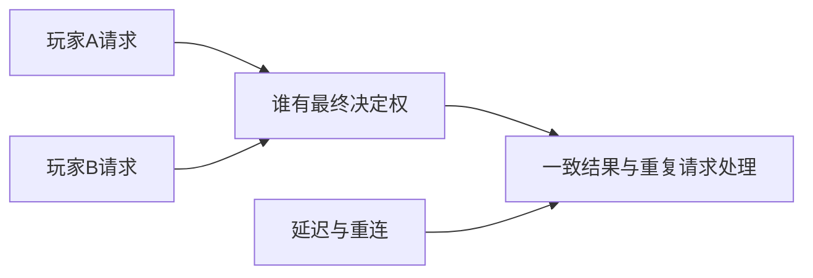

# E-16｜多人认识专题：先知道为什么会复杂

> 兼容课号：A05。ABCDE是主题入口，不是必须按字母顺序完成；文件链接与题号保留稳定。

版本：Guided Demo v6｜2026-09-15
状态：课件正文与互动规格已编写；尚未逐课生成OpenMAIC课堂或试教。

## 1. 本课任务卡

**产出：** 用事件时间线认识权威、延迟和重连；不开展网络实作。
**前置：** I12；**对应概念：** C31。
**预计课堂：** 5–10分钟的认识讨论，可选。
**M 必须掌握：**
无。本课全为K认识选修，不进入单机毕业细考。
**K 理解即可：**
- 权威决定谁能确认结果。
- 延迟、预测、重连会影响不同客户端看到的状态。
**停止线：** 本课为全K选修，不计入单机毕业条件，不要求服务器和同步代码。

## 2. 必要讲解：先看现象，再给术语

两个人同时拾取同一件物品时，两个屏幕都显示成功不意味着系统可以发两份奖励。需要明确结果由谁确认。

网络消息有延迟和顺序问题，重连还要恢复一致状态。这与本地一次性事件有关，但不能简单复制本地脚本就保证正确。

## 2A. 场景、概念图与逐步AI对话

**实际位置：** P07决策记录｜要不要把庭院改成多人。

|操作前的问题|本课希望得到的结果|
|---|---|
|以为把单机再加一个玩家就自动成为可靠多人游戏。|知道状态权威、延迟和恢复增加的需求，能决定当前不做多人。|

这是目标对照，不是已完成的游戏截图。概念图为职责/因果示意，不是继承图或完整运行证明。

OpenMAIC不能渲染Mermaid时画等价方框图；无3D或真实连接时仅标课堂模拟，不伪造软件运行。

### 复制第1框开始；以后每次只发当前一步

**学员用法：** 无需一次读完所有提示。将当前框发给你使用的AI；做完后回“完成＋观察”，结果不符回“不符＋现象”，报错回“报错＋原文”，需要停下回“暂停”。自然语言也可以。不要一口气把六步当成自动执行授权。

### 对话1｜建立本课上下文

```text
请做我这节课的协作教练：E-16（兼容课号A05）《多人认识专题：先知道为什么会复杂》。
我们逐步制作同一个「星光小庭院」，当前只解决：以为把单机再加一个玩家就自动成为可靠多人游戏。
目标：知道状态权威、延迟和恢复增加的需求，能决定当前不做多人。
必须掌握：无；本课仅理解用途。理解即可：权威决定谁能确认结果。；延迟、预测、重连会影响不同客户端看到的状态。
停止线：本课为全K选修，不计入单机毕业条件，不要求服务器和同步代码。
必须保持：课程全K认识；主庭院保持单机，不形成网络实现或操作考试。
先读取我已提供的进度和材料，只问真正缺失的一项。需要软件操作时核对实际版本、当前截图或场景树、可访问的工具；不要求我发密钥或整个电脑。
先给一个预测问题并等我回答，再给一个最小步骤。不跳课、不自动做整款游戏。能执行才说已执行，否则给明确操作单或脚本，并标未执行。
后续每轮用四项回应：现在是哪一步；只改什么/怎样恢复；我应观察什么；目前还缺什么证据。没有证据不要替我勾通过。
```

**AI此时应做：** 确认当前场景与学习范围，不直接输出几十个文件。已经提供过的版本、素材和约束应复用，不重复问。

### 对话2｜先理解一个因果关系

```text
先问我：谁应确认同一物品最终归属？
等我写预测和理由后，再指出一个证据缺口，只给一个提示，不先公布完整答案。用词不专业时先确认意思，再补术语。
```

**转入下一步：** 有自己的预测即可；预测错可以用实验纠正，不要求先背定义。

### 对话3｜K用途选择与结束

```text
只讨论两位玩家同时拿一颗星，先让我说谁决定结果；不写联网代码。
对比重连与重复请求两个用途场景，记录本项目暂不联网。
只核对我的用途解释，缺口用一个追问；不生成实现，不要求操作或长报告。最后给我一份认识记录，写明本项目不因为此课就增加联网。
```

**结束证据：** 我能说明权威与延迟为何会影响结果，知道何时查询。
**本课全K：** 不出现软件执行门槛、六步实操或M成绩。

### 当前风险与长期责任

**本课风险检查：** 检查AI是否承诺低延迟或无冲突而无测试，把K认识课变成部署课程。
这是需要在当前工具版本下核验的风险，不是所有AI必然失败的排行榜，也不预测何时改善。长期保留需求、参考选择、影响范围、结果认可与取舍责任；测量、批量设置和重复验证可以由AI协助。
**不把学习变成额外六次考试：** 六个对话阶段共享本课原有M/K证据；只在薄弱关键能力上追加一处故障或变式。没有实际材料时先做课堂模拟，真机状态单独记录。

## 3. 界面与参数学习深度

以下是后续真机操作的对应范围，不要求本轮打开软件。模拟滑块是教学控件，不代表软件都有同名按钮。会调是指看懂作用、主动选择与恢复；会定位是知道去哪找；按需查不考菜单路径、快捷键和API记忆。
- 无必会实操界面。
- 知道网络调试信息的用途。
- 需要网络项目时再查RPC与网络API。

## 4. 互动实验规格

**初始状态：** 客户端A/B与权威节点三条时间线，两个同时拾取请求；数值仅教学示意。
**可操作项：** 延迟0/100/300毫秒示意、重复请求、断线重连；没有真实网络连接。
**实验步骤：**
1. 观察两人同时请求时可能出现的冲突。
2. 选择谁确认最终结果并说明用途。
3. 回答本项目现在是否需要多人，给出暂缓理由。
**预期反馈：** 只要求用途解释，演示可由老师操控；不考编程和详细故障修复。
**故障或反例：** 反例讨论：每个客户端自行增加奖励会出现什么不一致；不要求排错实操。
**复位：** 清空消息时间线与最终奖励。
**无图/无3D替代：** 用原创简单形状、状态卡或给定时间序列表达同一因果关系；标明“示意”，不得把预设结果说成Godot/Blender实测。不能以假按钮或不响应的截图代替交互。
**完成判据：** 只做用途识别，不强制实操、诊断或迁移。

## 5. 小结与必须牢记

- 多人先问谁确认结果。
- 认识风险不等于现在实现。

## 6. 训练：先作答，再看反馈

P=预测，D=诊断，T=迁移，K=用途认识。下面是候选训练，不是每个词都做四次作业。课堂先用预测和一个操作，重点未达标再选D或T；延迟复测换对象，不重复抄答案。

### A05-K1
谁应确认同一物品最终归属？

### A05-K2
为什么延迟值得考虑？

### A05-K3
重连为什么不是重新显示画面就够？

### A05-K4
现在做单机收集游戏需要实现这些吗？

## 7. 后续真机任务（配套待做，不作为当前课堂依赖）

没有网络项目和代码任务；全K轻量识别即可。
即使已有参考工程，也要区分课件、运行测试、人工体验、学习掌握四种证据。按用户安排，当前先完成全部课件，之后再统一补素材、Godot/Blender起始与参考工程。

## 8. 实际应用验收：把结果放回同一个项目

**本课产物：** 知道状态权威、延迟和恢复增加的需求，能决定当前不做多人。
**接入边界：** 课程全K认识；主庭院保持单机，不形成网络实现或操作考试。

以下是要采集的证据，不是宣称已经执行。记录“未尝试 / 有提示完成 / 独立验证 / 隔次仍会”；不把这四种状态与M/K学习要求混淆。

本课全部K：只提交一次用途判断，不要求操作、实现或深度故障排查。
- [ ] 能用一两句话说明权威或延迟解决的问题，并作当前项目是否需要的决定。

**换情境的候选任务：** 只换成两人同时开门的轻量用途题，不升级成故障排查作业。
**判定：** 普通M按原0–2锚点；有针对性根因提示记练习，换变式再验证。K只查用途，不能抵消关键M失败。没有真实操作的M只记待验证，模拟通过不能自动升级为真机通过。未选专题不阻塞主线。

**接入不等于新增系统：** 美术课可交风格卡、参数决定或改造样本；性能课可得出“不优化”。隔离实验只有对当前项目有收益才接入，不强迫庭院变成战斗、开放世界或联网游戏。

## 9. 复现与延迟检查

本课复现：B10。只复习已学的关键M。
下次课抽一个本课关键判断，换对象或数值后先独立解释。查菜单和API不扣独立判断分；被提示根因或目标值后完成，记录有提示，换变式再验。K不反复背定义。

## 10. 依据与观看入口

- [Godot Resources：共享和引用](https://docs.godotengine.org/en/stable/tutorials/scripting/resources.html)

技术来源支持术语和软件边界；具体实验与课程顺序是本项目教学设计，不代表已证明学习效果。艺术家入口用于观看研习，不等于获得图片或素材再分发许可。
