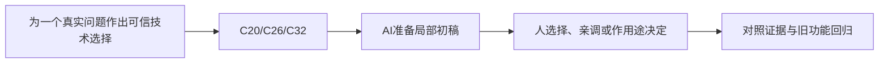

# E-17｜高级专项结业：一个问题，一份可信决策

> 兼容课号：A06。ABCDE是主题入口，不是必须按字母顺序完成；文件链接与题号保留稳定。

版本：Applied Curriculum v5｜2026-09-15
状态：课件正文与互动规格已编写；尚未逐课生成OpenMAIC课堂或试教。

## 1. 本课任务卡

**产出：** 只选一个真实专项，提交取舍、证据和回退方式。
**前置：** I12；**对应概念：** C20/C26/C32。
**预计课堂：** 20–30分钟，可在实验前后暂停；不含后续真实软件制作时间。
**M 必须掌握：**
- 定义所选专项的成功条件和不做范围。
- 用实验证据与回归决定保留或放弃方案。
**K 理解即可：**
- 未选专项只认识名称，不参加细考。
**停止线：** 没有高级需求可不选；不以会写Shader、联网、流送当通用能力标准。

## 2. 必要讲解：先看现象，再给术语

高级学习围绕具体限制展开。选择Shader、复杂旋转、性能或大场景其中一个，并补齐该专项前置，不能靠堆功能证明高级。

放弃不合适方案也是有效产出，只要有证据说明成本、限制和替代方向。结业记录应让别人能复现，而非只有漂亮截图。

## 2A. 这次在实际场景里解决什么

**应用位置：** P07决策交付｜为一个真实问题作出可信技术选择；选修隔离实验：有价值才接入。

|开始时遇到的问题|本课期望得到的变化|
|---|---|
|有许多高级术语，却没有对应问题与验证。|一份针对所选问题的方案、实验、取舍和回退记录。|

**这是目标状态对照，不是已完成截图。** 首次操作应使用匹配当前进度的最小场景；还没有配套时，只能记为课堂模拟，不能直接勾选真机应用通过。

### 概念关系示意


图中箭头表示教学流程，不是引擎节点继承。OpenMAIC不支持Mermaid时改画等价方框图，不能把代码原文冒充运行示意。

### 先让AI帮助理解，再让AI帮助工作

**学习指令：**
```text
现在只检查这道判断：高级阶段必须四种专项全做吗？
先等我给预测和理由，再指出一个证据缺口；一次只给一个线索，不先公布完整答案。
我的用词不专业时，先用人话确认意思，再补对应术语。
```

**工作指令：可复制；先补实际版本与当前材料，不粘贴密钥。**
```text
我正在逐步制作同一个小型单机「星光小庭院」，不是重新生成整款游戏。
我会提供实际软件版本、当前场景/文件和必要截图；先确认你能访问哪些材料和工具。
这次只做：只审查我已经选择并试过的一个专项，允许低成本方案或不采用。把证据、推测、未知分开，检查功能与视觉回归；不要求完成所有高级模块。
必须保持：其余高级选修保持可跳过；没有专项证据不能伪称掌握。
先列出将改的对象、原值和预期结果，提供最小可撤销初稿及检查步骤。
没有真实软件连接时只提供操作单/脚本，不声称已经编辑、运行或看过未提供的截图。
不要自动安装插件、联网下载素材、购买服务或读取无关文件；必要操作另说明并取得授权。
完成后报告实际做了什么、还没验证什么；我负责选择和最终验收。
```

### 哪些地方比继续发指令更适合亲自试

|入口与性质|一次只做的微调/选择|亲眼观察什么|
|---|---|---|
|所选专项的一个关键参数（当前实现）|用已定义的对照范围验证|是否解决原问题而非只改善无关指标|
|保留/撤销决策（设计内容）|根据同条件证据作决定|能否解释成本、限制和回退|

**初值与恢复：** 先读取并记录当前值；表里的方向是对照办法，不是通用最佳参数。先在副本上操作，不覆盖基底；返回前用撤销或记录值恢复并重新预览。自定义变量不是软件内置参数。
**选择下一步：** 方向不对，补一张明确参考并圈出要借鉴的部分；结构/因果不对，让AI做局部修复；已接近目标且入口可直接操作，先亲调一项。原因不明先做对照，不靠反复重生成抽卡。

**局部修复指令：**
```text
保留本课「必须保持」的部分。我会给出同条件的当前结果和目标差异。
只围绕「一份针对所选问题的方案、实验、取舍和回退记录。」检查一个根因假设；先给最小验证，未经证据不要重写全部内容。
若只是一个可见参数偏差，告诉我该选哪个对象、哪个入口、怎么小幅调和恢复。
```

**本课风险检查：** 检查AI是否把推荐当证据、用其他模型或旧环境的结果替代本项目实测。
**时间边界：** 上述是需要在当前模型/工具/软件版本下验证的风险清单，不是所有AI必然失败的结论，也不预测何时会解决。长期保留的是目标、约束、参考选择、结果认可和取舍责任；测量和重复调整可以继续交给AI协助。

## 3. 界面与参数学习深度

以下是后续真机操作的对应范围，不要求本轮打开软件。模拟滑块是教学控件，不代表软件都有同名按钮。会调是指看懂作用、主动选择与恢复；会定位是知道去哪找；按需查不考菜单路径、快捷键和API记忆。
- 复用所选专项界面。
- 会定位：版本、测试与回退。
- 按需查：具体实现；不增加工具考试。

## 4. 互动实验规格

**初始状态：** 四张问题卡与一张无需高级技术卡；每张有目标约束但不提供标准方案。
**可操作项：** 选择专项、填写成功条件、比较候选、证据自检。
**实验步骤：**
1. 判断是否真的需要高级工具。
2. 选择对应前置课并只验证一个问题。
3. 检查收益、副作用和回退路径，说明保留/放弃原因。
**预期反馈：** 对未选专项不出深题；证据缺失明确标待完成。
**故障或反例：** 故障：选了最多功能的方案却没有目标或测试；退回问题定义。
**复位：** 恢复问题卡，不清除已留存证据。
**无图/无3D替代：** 用原创简单形状、状态卡或给定时间序列表达同一因果关系；标明“示意”，不得把预设结果说成Godot/Blender实测。不能以假按钮或不响应的截图代替交互。
**完成判据：** 对本课两项M提供操作或判断及解释；一个实验可覆盖多项。只有关键M或发现薄弱处才追加故障/变式，不为每个术语加作业。

## 5. 小结与必须牢记

- 一个专项解决一个真实问题。
- 证据要匹配目标。
- 放弃方案可以是正确判断。

## 6. 训练：先作答，再看反馈

P=预测，D=诊断，T=迁移，K=用途认识。下面是候选训练，不是每个词都做四次作业。课堂先用预测和一个操作，重点未达标再选D或T；延迟复测换对象，不重复抄答案。

### A06-P1
高级阶段必须四种专项全做吗？

### A06-D2
只有静态截图但目标是消除运动闪烁，证据够吗？

### A06-T3
方案失败后如何留下长期价值？

### A06-K4
没选的技术要考实现吗？

## 7. 后续真机任务（配套待做，不作为当前课堂依赖）

所选A01/A02/A03/A04为条件前置；课堂先完成选择，真正实验在专项就绪后开展。
即使已有参考工程，也要区分课件、运行测试、人工体验、学习掌握四种证据。按用户安排，当前先完成全部课件，之后再统一补素材、Godot/Blender起始与参考工程。

## 8. 实际应用验收：把结果放回同一个项目

**本课产物：** 一份针对所选问题的方案、实验、取舍和回退记录。
**接入边界：** 其余高级选修保持可跳过；没有专项证据不能伪称掌握。

以下是要采集的证据，不是宣称已经执行。记录“未尝试 / 有提示完成 / 独立验证 / 隔次仍会”；不把这四种状态与M/K学习要求混淆。

|原有M能力|本次在哪里取证|
|---|---|
|定义所选专项的成功条件和不做范围。|能从实际问题推导一个受约束方案，或说明不采用的理由。|
|用实验证据与回归决定保留或放弃方案。|能引用真实实验/回归证据，解释结论适用范围和未知项。|

**旧功能回归：** 接入前验证核心循环；不采用也要说明实验如何退出而不污染主项目。
**最小记录：** 一段现场演示，或同条件前后图/日志，加一句“我改了什么、为什么”。截图不足以证明运动/一次性事件时，要演示动作或查看对应状态。记录用过的提示，不要求写长报告。
**一般能力取证：** 一次有效操作/选择与解释即可；只有证据不足才补练，不强制反复考试。

**换情境的候选任务：** 给问题增加一个限制，说明哪些结论需要补测。
**判定：** 普通M按原0–2锚点；有针对性根因提示记练习，换变式再验证。K只查用途，不能抵消关键M失败。没有真实操作的M只记待验证，模拟通过不能自动升级为真机通过。未选专题不阻塞主线。

**接入不等于新增系统：** 美术课可交风格卡、参数决定或改造样本；性能课可得出“不优化”。隔离实验只有对当前项目有收益才接入，不强迫庭院变成战斗、开放世界或联网游戏。

## 9. 复现与延迟检查

本课复现：B15, I12。只复习已学的关键M。
下次课抽一个本课关键判断，换对象或数值后先独立解释。查菜单和API不扣独立判断分；被提示根因或目标值后完成，记录有提示，换变式再验。K不反复背定义。

## 10. 依据与观看入口

- [Godot General optimization：测量与取舍](https://docs.godotengine.org/en/stable/tutorials/performance/general_optimization.html)

技术来源支持术语和软件边界；具体实验与课程顺序是本项目教学设计，不代表已证明学习效果。艺术家入口用于观看研习，不等于获得图片或素材再分发许可。
