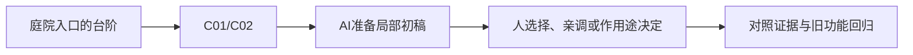

# A-02｜空间入门：位置、旋转、缩放

> 兼容课号：B01A。ABCDE是主题入口，不是必须按字母顺序完成；文件链接与题号保留稳定。

版本：Applied Curriculum v5｜2026-09-15
状态：课件正文与互动规格已编写；尚未逐课生成OpenMAIC课堂或试教。

## 1. 本课任务卡

**产出：** 把一个方块改成三种指定状态，能说明改了哪类参数。
**前置：** 无；**对应概念：** C01/C02。
**预计课堂：** 20–30分钟，可在实验前后暂停；不含后续真实软件制作时间。
**M 必须掌握：**
- 辨认世界坐标轴，区分屏幕方向和世界方向。
- 选择Position/Rotation/Scale完成目标并恢复初值。
**K 理解即可：**
- Gizmo是可视化操作柄；快捷键用时查。
**停止线：** 不教矩阵、四元数、任意角度坐标计算；父子空间留到B01B。

## 2. 必要讲解：先看现象，再给术语

Position回答在哪里，Rotation回答朝哪里，Scale回答相对原模型放大多少。Scale=1不是宽1米；换一个原始尺寸不同的Mesh，实际大小仍会不同。

本课用Godot的Y向上约定。移动相机只改变你从哪里看，不改变世界轴。Blender的Z向上到资产课再对照，不要求此刻记住所有软件约定。

## 2A. 这次在实际场景里解决什么

**应用位置：** P01｜庭院入口的台阶；主项目中的功能、视觉或交付决定。

|开始时遇到的问题|本课期望得到的变化|
|---|---|
|方块挡住入口；学员容易把观察视角变化误当物体移动。|同一方块成为入口旁的低台阶，能指出改了位置、旋转还是尺寸。|

**这是目标状态对照，不是已完成截图。** 首次操作应使用匹配当前进度的最小场景；还没有配套时，只能记为课堂模拟，不能直接勾选真机应用通过。

### 概念关系示意


图中箭头表示教学流程，不是引擎节点继承。OpenMAIC不支持Mermaid时改画等价方框图，不能把代码原文冒充运行示意。

### 先让AI帮助理解，再让AI帮助工作

**学习指令：**
```text
现在只检查这道判断：方块看起来更高了，怎样区分是位置变高还是自身拉长？
先等我给预测和理由，再指出一个证据缺口；一次只给一个线索，不先公布完整答案。
我的用词不专业时，先用人话确认意思，再补对应术语。
```

**工作指令：可复制；先补实际版本与当前材料，不粘贴密钥。**
```text
我正在逐步制作同一个小型单机「星光小庭院」，不是重新生成整款游戏。
我会提供实际软件版本、当前场景/文件和必要截图；先确认你能访问哪些材料和工具。
这次只做：基于我提供的场景只准备地面和一块台阶。显示世界坐标轴，分别演示移动、旋转、缩放，保留可撤销的初始状态；不要加入角色控制代码。
必须保持：地面、相机和坐标约定保持不变；对象变换不等于编辑网格。
先列出将改的对象、原值和预期结果，提供最小可撤销初稿及检查步骤。
没有真实软件连接时只提供操作单/脚本，不声称已经编辑、运行或看过未提供的截图。
不要自动安装插件、联网下载素材、购买服务或读取无关文件；必要操作另说明并取得授权。
完成后报告实际做了什么、还没验证什么；我负责选择和最终验收。
```

### 哪些地方比继续发指令更适合亲自试

|入口与性质|一次只做的微调/选择|亲眼观察什么|
|---|---|---|
|Godot Inspector > Transform（内置）|先只改Position Y，再还原；然后单独改Scale X|物体相对地面的高度和宽度，而不是屏幕上的左右|
|Blender Item > Transform（内置）|核对本软件竖直轴；把位置与Dimensions/Scale分开看|Scale为1是否真的意味着目标尺寸|

**初值与恢复：** 先读取并记录当前值；表里的方向是对照办法，不是通用最佳参数。先在副本上操作，不覆盖基底；返回前用撤销或记录值恢复并重新预览。自定义变量不是软件内置参数。
**选择下一步：** 方向不对，补一张明确参考并圈出要借鉴的部分；结构/因果不对，让AI做局部修复；已接近目标且入口可直接操作，先亲调一项。原因不明先做对照，不靠反复重生成抽卡。

**局部修复指令：**
```text
保留本课「必须保持」的部分。我会给出同条件的当前结果和目标差异。
只围绕「同一方块成为入口旁的低台阶，能指出改了位置、旋转还是尺寸。」检查一个根因假设；先给最小验证，未经证据不要重写全部内容。
若只是一个可见参数偏差，告诉我该选哪个对象、哪个入口、怎么小幅调和恢复。
```

**本课风险检查：** 检查AI是否把屏幕方向当世界方向、把Blender轴约定直接套到Godot。
**时间边界：** 上述是需要在当前模型/工具/软件版本下验证的风险清单，不是所有AI必然失败的结论，也不预测何时会解决。长期保留的是目标、约束、参考选择、结果认可和取舍责任；测量和重复调整可以继续交给AI协助。

## 3. 界面与参数学习深度

以下是后续真机操作的对应范围，不要求本轮打开软件。模拟滑块是教学控件，不代表软件都有同名按钮。会调是指看懂作用、主动选择与恢复；会定位是知道去哪找；按需查不考菜单路径、快捷键和API记忆。
- Godot：选中节点、Inspector/Transform、3D视口的移动旋转缩放。
- 会定位：框选目标、重置属性。
- 按需查：快捷键、网格步长、坐标数学。

## 4. 互动实验规格

**初始状态：** 世界轴带XYZ文字；非对称方块放在(0,1,0)，旋转0，缩放(1,1,1)；机位固定。
**可操作项：** 位置X/Z为-3到3、Y为0到3；绕Y角度-90到90度；单轴缩放0.5到2；观察相机按钮。
**实验步骤：**
1. 先预测：只改Y位置会改变高度还是大小？写一句话再操作。
2. 只改位置，再恢复；只改旋转，再恢复；只改X缩放，比较宽度与位置。
3. 转动观察相机，再沿世界X移动；指出屏幕上的投影方向为什么变了。
**预期反馈：** 同时显示参数和物体；保留初始轮廓作对照。位置变化不能偷偷改模型尺寸；旋转轴必须可见。
**故障或反例：** 故障卡：目标是升高方块，程序却增大Scale Y。学员只允许改一组参数修复。
**复位：** 恢复物体全部变换和机位；第一次预测保留，实验状态清空。
**无图/无3D替代：** 用原创简单形状、状态卡或给定时间序列表达同一因果关系；标明“示意”，不得把预设结果说成Godot/Blender实测。不能以假按钮或不响应的截图代替交互。
**完成判据：** 对本课两项M提供操作或判断及解释；一个实验可覆盖多项。只有关键M或发现薄弱处才追加故障/变式，不为每个术语加作业。

## 5. 小结与必须牢记

- 先问改位置、朝向还是大小。
- Scale是倍率，不是米数。
- 屏幕方向不等于世界方向。

## 6. 训练：先作答，再看反馈

P=预测，D=诊断，T=迁移，K=用途认识。下面是候选训练，不是每个词都做四次作业。课堂先用预测和一个操作，重点未达标再选D或T；延迟复测换对象，不重复抄答案。

### B01A-P1
方块看起来更高了，怎样区分是位置变高还是自身拉长？

### B01A-D2
转动相机后，沿世界X拖动物体不再向屏幕右边，是轴坏了吗？

### B01A-T3
把宝箱放到高台上且尺寸不变，你改什么、检查什么？

### B01A-K4
Gizmo解决什么问题？

## 7. 后续真机任务（配套待做，不作为当前课堂依赖）

后续真机对应：只在Inspector改变一个方块；本轮不要求安装软件。
即使已有参考工程，也要区分课件、运行测试、人工体验、学习掌握四种证据。按用户安排，当前先完成全部课件，之后再统一补素材、Godot/Blender起始与参考工程。

## 8. 实际应用验收：把结果放回同一个项目

**本课产物：** 同一方块成为入口旁的低台阶，能指出改了位置、旋转还是尺寸。
**接入边界：** 地面、相机和坐标约定保持不变；对象变换不等于编辑网格。

以下是要采集的证据，不是宣称已经执行。记录“未尝试 / 有提示完成 / 独立验证 / 隔次仍会”；不把这四种状态与M/K学习要求混淆。

|原有M能力|本次在哪里取证|
|---|---|
|辨认世界坐标轴，区分屏幕方向和世界方向。|能选中正确对象完成三种变化并恢复原值。|
|选择Position/Rotation/Scale完成目标并恢复初值。|面对入口被挡的问题，能选择该移动还是改变尺寸，而不重建整个场景。|

**旧功能回归：** 相机仍能看见地面，地面和其他对象未被误改。
**最小记录：** 一段现场演示，或同条件前后图/日志，加一句“我改了什么、为什么”。截图不足以证明运动/一次性事件时，要演示动作或查看对应状态。记录用过的提示，不要求写长报告。
**关键能力复测：** 本课高频或返工风险较高，已有有效证据可复用；薄弱处增加一个未知故障或隔次变式，不把每个词都变成一套试卷。

**换情境的候选任务：** 把台阶换成路牌，目标改为转朝玩家；解释为什么不应移动全部顶点。
**判定：** 普通M按原0–2锚点；有针对性根因提示记练习，换变式再验证。K只查用途，不能抵消关键M失败。没有真实操作的M只记待验证，模拟通过不能自动升级为真机通过。未选专题不阻塞主线。

**接入不等于新增系统：** 美术课可交风格卡、参数决定或改造样本；性能课可得出“不优化”。隔离实验只有对当前项目有收益才接入，不强迫庭院变成战斗、开放世界或联网游戏。

## 9. 复现与延迟检查

本课复现：无前置复习，直接开始。只复习已学的关键M。
下次课抽一个本课关键判断，换对象或数值后先独立解释。查菜单和API不扣独立判断分；被提示根因或目标值后完成，记录有提示，换变式再验。K不反复背定义。

## 10. 依据与观看入口

- [Godot Node3D：变换与父空间](https://docs.godotengine.org/en/stable/classes/class_node3d.html)

技术来源支持术语和软件边界；具体实验与课程顺序是本项目教学设计，不代表已证明学习效果。艺术家入口用于观看研习，不等于获得图片或素材再分发许可。
