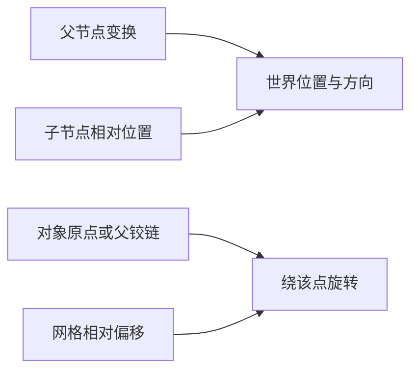

# A-04｜相对谁：父空间、自身方向和门轴

> 兼容课号：B01B。ABCDE是主题入口，不是必须按字母顺序完成；文件链接与题号保留稳定。

版本：Audited Collaboration v7｜2026-09-15
状态：课件正文与互动规格已编写；尚未逐课生成OpenMAIC课堂或试教。

## 1. 本课任务卡

**产出：** 预测三个移动方向，并把门的旋转中心改到铰链。
**前置：** B01A, B02；**对应概念：** C03/C04。
**预计课堂：** 20–30分钟，可在实验前后暂停；不含后续真实软件制作时间。
**M 必须掌握：**
- 区分父相对位置、物体自身方向和世界方向。
- 保持关闭时门板位置不变，只改变支点比较旋转。
**K 理解即可：**
- Origin是对象原点；工具Pivot可临时选择别处，二者不必一致。
**停止线：** 不手算旋转矩阵，不讲骨骼绑定；不把Local一词笼统当成所有局部含义。

## 1A. 必学内容、实操与题目如何对应

M1/M2只是本课任务卡的两项能力序号，不是新的技术概念。查菜单/API不扣独立判断分。

|必须掌握到这里|本课实操题：做什么算有证据|可选配套题|
|---|---|---|
|M1：区分父相对位置、物体自身方向和世界方向。|在单位缩放、不同父子朝向下分别试世界、父、自身方向，说明区别。|B01B-P1|
|M2：保持关闭时门板位置不变，只改变支点比较旋转。|两门关闭时重合，打开后标出铰链边保持不动，并解释原点与工具支点的区别。|B01B-D2, B01B-T3|

**最低学习路径：** 一次预测 → 一个能覆盖上述两项M的小实验/项目改动 → 一次结果解释。普通M做到即可；关键薄弱处再选一题诊断或隔次迁移，不把P/D/T全套加到每个术语上。
**理解即可与停止线：** 任务卡中的K只检用途；按需查的界面、API、高级实现不进入本课操作门槛。只有已学且已存在的项目功能需要回归。

## 2. 必要讲解：先看现象，再给术语

Godot的position相对父节点；物体自身轴由自己的朝向决定。改position.x与沿自己车头移动不一定相同。global_position描述世界位置。

门板围绕父Node3D转动时，父节点可充当铰链，门板相对它偏移。Blender改工具Pivot并不必然改变导出资产的Origin。

## 2A. 场景、概念图与逐步AI对话

**实际位置：** P01/P02｜庭院门轴与镜头支点。

|操作前的问题|本课希望得到的结果|
|---|---|
|门绕中心转，或父节点转向后物体朝意外方向移动。|门围绕侧边开合；能区分父相对位置、自身方向、世界方向。|

这是目标对照，不是已完成的游戏截图。概念图为职责/因果示意，不是继承图或完整运行证明。

OpenMAIC不能渲染Mermaid时画等价方框图；无3D或真实连接时仅标课堂模拟，不伪造软件运行。

### 本课人和AI分别负责什么

|责任|这课具体做什么|
|---|---|
|我必须作出的判断|指定参照空间与应固定的门边，不把临时工具Pivot当资产原点。|
|可以交给AI的制作|搭好中心轴和侧轴的同位置门板，并画父子关系；不要求学员推矩阵。|
|我检查AI交付物|看修改对象/前后差异、实际执行记录及未验证项；先核对是否保留本课约束，再决定是否接入。|

**不是手工熟练考试：** 重复劳动与代码可委托；常用可见参数适合亲调时先调一项，无障碍需要可由AI按已选值执行。必须能说明选择、观察和恢复，不要求机械地拖每个滑杆。

**两种模式：** 练习时可问根因、看示范；独立验收时先由我提出选择/假设，AI只协助执行与记录。已透露本题根因或目标值，就记录“有提示”，再换未揭示答案的变式。

### 复制第1框开始；以后每次只发当前一步

**学员用法：** 无需一次读完所有提示。将当前框发给你使用的AI；做完后回“完成＋观察”，结果不符回“不符＋现象”，报错回“报错＋原文”，需要停下回“暂停”。自然语言也可以。不要一口气把六步当成自动执行授权。

### 对话1｜建立本课上下文

```text
请做我这节课的协作教练：A-04（兼容课号B01B）《相对谁：父空间、自身方向和门轴》。
我们逐步制作同一个「星光小庭院」，当前只解决：门绕中心转，或父节点转向后物体朝意外方向移动。
目标：门围绕侧边开合；能区分父相对位置、自身方向、世界方向。
必须掌握：区分父相对位置、物体自身方向和世界方向；保持关闭时门板位置不变，只改变支点比较旋转。理解即可：Origin是对象原点；工具Pivot可临时选择别处，二者不必一致
停止线：不手算旋转矩阵，不讲骨骼绑定；不把Local一词笼统当成所有局部含义。
必须保持：门板大小、关门位置和开门角相同；不引入角色绑定。
本课由我负责：指定参照空间与应固定的门边，不把临时工具Pivot当资产原点。
可以交给你：搭好中心轴和侧轴的同位置门板，并画父子关系；不要求学员推矩阵。
请标明建议/已执行/已验证的区别。练习可提示；验收先等我作判断，已提示根因则如实记有提示。
先读取我已提供的进度和材料，只问真正缺失的一项。需要软件操作时核对实际版本、当前截图或场景树、可访问的工具；不要求我发密钥或整个电脑。
先给一个预测问题并等我回答，再给一个最小步骤。不跳课、不自动做整款游戏。能执行才说已执行，否则给明确操作单或脚本，并标未执行。
后续每轮用四项回应：现在是哪一步；只改什么/怎样恢复；我应观察什么；目前还缺什么证据。没有证据不要替我勾通过。
```

**AI此时应做：** 确认当前场景与学习范围，不直接输出几十个文件。已经提供过的版本、素材和约束应复用，不重复问。

### 对话2｜先理解一个因果关系

```text
先问我：父节点先转90度，子物体有非零偏移，自身又转45度且缩放为1。沿世界、父、自身的+X操作时方向应全相同吗？只用轴箭头预测，不计算坐标。
等我写预测和理由后，再指出一个证据缺口，只给一个提示，不先公布完整答案。用词不专业时先确认意思，再补术语。
```

**转入下一步：** 有自己的预测即可；预测错可以用实验纠正，不要求先背定义。

### 对话3｜AI只完成第一小步

```text
沿用已确认的版本、材料和修改边界。现在只做：先只比较一块门板在中心轴和侧边轴旋转，关闭时门板位置保持一致。
先列影响对象和原值，再提供一个可撤销初稿。没有实际软件连接时给我可执行的局部操作单/脚本，不说已经修改。做完先停下。
```

**预计看到／拿到：** 我能指出侧边铰链固定在哪里，不用手算矩阵。
**不是自动保证：** 这是验收目标，取决于实际模型、工具和输入；结果不同就走下方“不符”分支。

### 对话4｜人观察与亲调，再继续第二小步

```text
这是我刚才的实际结果：我会附一张当前图、短演示或必要日志，并用一句话描述差异。
先检查是否满足：我能指出侧边铰链固定在哪里，不用手算矩阵。
本课可用的微调项：
入口：Godot Node3D父子Transform（内置）；操作：改支点位置，同时调整门板相对位置；观察：关门外观是否不变、开门时铰链侧是否固定
入口：Blender Origin与工具Pivot（概念/入口）；操作：分别确认对象原点与本次操作支点；观察：是否只改变工具操作方式，却没有改变导出后的门轴
若满足，先指导我选择其中一项亲调；我回报观察后才继续：再引入有朝向的物体和旋转父节点，分别比较世界、父相对与自身方向。
一次只动一项可见参数。方向接近就手调；结构有误才给局部修复，不能不断重生成整个场景。
```

|选中哪里与参数性质|这次亲自试什么|观察与停手依据|
|---|---|---|
|Godot Node3D父子Transform（内置）|改支点位置，同时调整门板相对位置|关门外观是否不变、开门时铰链侧是否固定|
|Blender Origin与工具Pivot（概念/入口）|分别确认对象原点与本次操作支点|是否只改变工具操作方式，却没有改变导出后的门轴|

**保存与恢复：** 先记录原值和实际对象。优先在安全副本试；运行中Remote Inspector的变化不要当成已保存的设计值，确认后将选定值写回本地场景/资源或配置并重新运行。菜单路径随版本核对，自定义变量不冒充内置属性。
**采用哪种沟通：** 大方向偏了，用参考图圈出要借鉴的轮廓/色彩/光感，并指出不要照搬什么；单个视觉值接近了，先拖或输入数值；原因不明，固定条件做一次对照。参考图不是可自动反推所有参数的答案。

### 对话5｜成功验收，或失败时只修一处

**达到目标时发送：**
```text
请只根据我提供的证据检查：
- 在单位缩放、不同父子朝向下分别试世界、父、自身方向，说明区别。
- 两门关闭时重合，打开后标出铰链边保持不动，并解释原点与工具支点的区别。
旧功能回归：门框没有移动；原有相机和场景整体变换不受影响。
缺少过程证据就标待验证；不得用一张截图证明走跳或一次性事件。不要新增需求或把所有候选题变成作业。
```

**结果不符或报错时发送：**
```text
不符/报错：我会提供触发步骤、预期、实际现象和必要原始日志。
保留：门板大小、关门位置和开门角相同；不引入角色绑定。
本课优先风险：检查AI是否把Inspector的局部position说成物体自身轴，或把临时Pivot等同导出原点。
先提出一个可推翻的假设和一个最小验证；不要同时改多个系统。若两次验证仍无进展，回到基线并列出缺失证据，不反复抽卡。不要删除测试、关闭需求或扩大权限来假装修好。
```

**AI评分边界：** 代码和初稿可以由AI提供；判断、亲调与证据解释由学员完成。得到根因提示记为有提示，不因此重复考试所有概念。

### 对话6｜存进度，下一次接着做

```text
请总结本课A-04（B01B）的进度卡，不把预测当已完成。
记录：真实软件版本/渲染器；当前场景与变更对象；选定参数和原值；我做的判断；实际证据；通过/待验证；使用过的提示；恢复方法；下一步唯一任务。
只有实际验证才标通过，没有生成或真机执行就明确写模拟/待验证。给我一段可以复制到新AI对话的摘要，不假称你已持久保存。
先核对下一课前置和我的已选路线，未完成就停在当前步骤，不催着扩范围。
```

**学员保存：** 把进度卡存本地或私人笔记；下次粘贴进度卡和下一课第1框。不要公开API Key、账户、本地私密路径或个人录像。

### 当前风险与长期责任

**本课风险检查：** 检查AI是否把Inspector的局部position说成物体自身轴，或把临时Pivot等同导出原点。
这是需要在当前工具版本下核验的风险，不是所有AI必然失败的排行榜，也不预测何时改善。长期保留需求、参考选择、影响范围、结果认可与取舍责任；测量、批量设置和重复验证可以由AI协助。
**不把学习变成额外六次考试：** 六个对话阶段共享本课原有M/K证据；只在薄弱关键能力上追加一处故障或变式。没有实际材料时先做课堂模拟，真机状态单独记录。

## 3. 界面与参数学习深度

以下是后续真机操作的对应范围，不要求本轮打开软件。模拟滑块是教学控件，不代表软件都有同名按钮。会调是指看懂作用、主动选择与恢复；会定位是知道去哪找；按需查不考菜单路径、快捷键和API记忆。
- Godot：场景树选父/子，Transform与局部/全局操作柄。
- Blender会定位：Object Origin、Transform Pivot Point。
- 按需查：改变原点的方法、Basis/Quaternion API。

## 4. 互动实验规格

**初始状态：** 父节点绕Y转90度，子物体再转45度；三组轴标World/Parent/Object。门板宽2、高2.5，初始角0。
**可操作项：** 三种移动按钮每次一步；父角度0/90、子角度0/45；门角0/45/90；中心轴/侧边轴。
**实验步骤：**
1. 先用轴箭头预测World、Parent、Object +X各往哪里；各从同一起点测试。
2. 先把父角度归零，再恢复90度，观察哪些方向跟着变。
3. 让两扇门在关闭时重合，只换轴，打开到90度并标记固定的边。
**预期反馈：** 显示父相对与世界坐标；说明移动步长采用世界单位还是父单位，方向实验固定Scale=1。门轴切换不得混入门板起始位置变化。
**故障或反例：** 故障：门绕中心转；保持门板关闭时外观位置，调整父支点和子偏移。
**复位：** 恢复角度、位置和门板关闭状态；轴标签保留。
**无图/无3D替代：** 用原创简单形状、状态卡或给定时间序列表达同一因果关系；标明“示意”，不得把预设结果说成Godot/Blender实测。不能以假按钮或不响应的截图代替交互。
**完成判据：** 对本课两项M提供操作或判断及解释；一个实验可覆盖多项。只有关键M或发现薄弱处才追加故障/变式，不为每个术语加作业。

## 5. 小结与必须牢记

- 位置先说明相对谁。
- 临时Pivot不等于资产Origin。
- 判断支点看哪个点该固定。

## 6. 训练：先作答，再看反馈

题干中的日志、数值与AI建议均为标明的教学情境，除非另附运行证据，不是本项目实测。可以有多个合理假设：先给能区分它们的验证，而不是猜老师心中的唯一原因。

P=预测，D=诊断，T=迁移，K=用途认识。下面是候选训练，不是每个词都做四次作业。课堂先用预测和一个操作，重点未达标再选D或T；延迟复测换对象，不重复抄答案。

### B01B-P1
**考察范围：** M1的限定子能力；不是整项真机通过证明。先给判断与理由；要求操作时再提供过程/对照。仅答对文字不自动等于实际应用通过。

父节点先转90度，子物体有非零偏移，自身又转45度且缩放为1。沿世界、父、自身的+X操作时方向应全相同吗？只用轴箭头预测，不计算坐标。

### B01B-D2
**考察范围：** M2的限定子能力；不是整项真机通过证明。先给判断与理由；要求操作时再提供过程/对照。仅答对文字不自动等于实际应用通过。

【教学构造情境，不是真实测量或某模型故障统计】Blender中用3D光标作旋转支点，预览开门正确；导出后仍绕中心。AI建议换灯光让偏差不明显。你首先要核对工具支点、对象Origin还是光线？怎样用关门和开门两个状态验证？

### B01B-T3
**考察范围：** M2的限定子能力；不是整项真机通过证明。先给判断与理由；要求操作时再提供过程/对照。仅答对文字不自动等于实际应用通过。

把门换成风车，支点还放侧边吗？

### B01B-K4
**考察范围：** K｜理解用途即可；不要求实现。一句用途解释即可。

改变工具Pivot与改变对象Origin，哪个直接描述保存在对象中的原点？一句话区分即可。

## 7. 后续真机任务（配套待做，不作为当前课堂依赖）

后续可对照现有空间网页或Godot门轴实验；Web演示不证明导出原点正确。
即使已有参考工程，也要区分课件、运行测试、人工体验、学习掌握四种证据。按用户安排，当前先完成全部课件，之后再统一补素材、Godot/Blender起始与参考工程。

## 8. 实际应用验收：把结果放回同一个项目

**本课产物：** 门围绕侧边开合；能区分父相对位置、自身方向、世界方向。
**接入边界：** 门板大小、关门位置和开门角相同；不引入角色绑定。

以下是要采集的证据，不是宣称已经执行。记录“未尝试 / 有提示完成 / 独立验证 / 隔次仍会”；不把这四种状态与M/K学习要求混淆。

|原有M能力|本次在哪里取证|
|---|---|
|区分父相对位置、物体自身方向和世界方向。|在单位缩放、不同父子朝向下分别试世界、父、自身方向，说明区别。|
|保持关闭时门板位置不变，只改变支点比较旋转。|两门关闭时重合，打开后标出铰链边保持不动，并解释原点与工具支点的区别。|

**旧功能回归：** 门框没有移动；原有相机和场景整体变换不受影响。
**最小记录：** 一段现场演示，或同条件前后图/日志，加一句“我改了什么、为什么”。截图不足以证明运动/一次性事件时，要演示动作或查看对应状态。记录用过的提示，不要求写长报告。
**关键能力复测：** 本课高频或返工风险较高，已有有效证据可复用；薄弱处增加一个未知故障或隔次变式，不把每个词都变成一套试卷。

**换情境的候选任务：** 把门换成风车，选择中心轴，并说明门的侧轴为什么不适用。
**判定：** 普通M按原0–2锚点；有针对性根因提示记练习，换变式再验证。K只查用途，不能抵消关键M失败。没有真实操作的M只记待验证，模拟通过不能自动升级为真机通过。未选专题不阻塞主线。

**接入不等于新增系统：** 美术课可交风格卡、参数决定或改造样本；性能课可得出“不优化”。隔离实验只有对当前项目有收益才接入，不强迫庭院变成战斗、开放世界或联网游戏。

## 9. 复现与延迟检查

本课复现：B01A。只复习已学的关键M。
下次课抽一个本课关键判断，换对象或数值后先独立解释。查菜单和API不扣独立判断分；被提示根因或目标值后完成，记录有提示，换变式再验。K不反复背定义。

## 10. 依据与观看入口

- [Godot Node3D：变换与父空间](https://docs.godotengine.org/en/stable/classes/class_node3d.html)
- [Blender glTF 2.0管线参考（4.0文档，具体新版选项另查）](https://docs.blender.org/manual/en/4.0/addons/import_export/scene_gltf2.html)
- [Godot运行检查与可见碰撞工具](https://docs.godotengine.org/en/stable/tutorials/scripting/debug/overview_of_debugging_tools.html)

技术来源支持术语和软件边界；具体实验与课程顺序是本项目教学设计，不代表已证明学习效果。艺术家入口用于观看研习，不等于获得图片或素材再分发许可。
