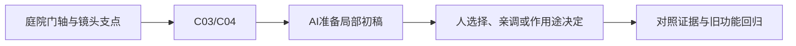

# A-04｜相对谁：父空间、自身方向和门轴

> 兼容课号：B01B。ABCDE是主题入口，不是必须按字母顺序完成；文件链接与题号保留稳定。

版本：Applied Curriculum v5｜2026-09-15
状态：课件正文与互动规格已编写；尚未逐课生成OpenMAIC课堂或试教。

## 1. 本课任务卡

**产出：** 预测三个移动方向，并把门的旋转中心改到铰链。
**前置：** B01A, B02；**对应概念：** C03/C04。
**预计课堂：** 20–30分钟，可在实验前后暂停；不含后续真实软件制作时间。
**M 必须掌握：**
- 区分父相对位置、物体自身方向和世界方向。
- 保持关闭时门板位置不变，只改变支点比较旋转。
**K 理解即可：**
- Origin是对象原点；工具Pivot可以临时选在别处。
**停止线：** 不手算旋转矩阵，不讲骨骼绑定；不把Local一词笼统当成所有局部含义。

## 2. 必要讲解：先看现象，再给术语

Godot的position相对父节点；物体自身轴由自己的朝向决定。改position.x与沿自己车头移动不一定相同。global_position描述世界位置。

门板围绕父Node3D转动时，父节点可充当铰链，门板相对它偏移。Blender改工具Pivot并不必然改变导出资产的Origin。

## 2A. 这次在实际场景里解决什么

**应用位置：** P01/P02｜庭院门轴与镜头支点；主项目中的功能、视觉或交付决定。

|开始时遇到的问题|本课期望得到的变化|
|---|---|
|门绕中心转，或父节点转向后物体朝意外方向移动。|门围绕侧边开合；能区分父相对位置、自身方向、世界方向。|

**这是目标状态对照，不是已完成截图。** 首次操作应使用匹配当前进度的最小场景；还没有配套时，只能记为课堂模拟，不能直接勾选真机应用通过。

### 概念关系示意


图中箭头表示教学流程，不是引擎节点继承。OpenMAIC不支持Mermaid时改画等价方框图，不能把代码原文冒充运行示意。

### 先让AI帮助理解，再让AI帮助工作

**学习指令：**
```text
现在只检查这道判断：父节点转向而子节点position不变，世界位置一定不变吗？
先等我给预测和理由，再指出一个证据缺口；一次只给一个线索，不先公布完整答案。
我的用词不专业时，先用人话确认意思，再补对应术语。
```

**工作指令：可复制；先补实际版本与当前材料，不粘贴密钥。**
```text
我正在逐步制作同一个小型单机「星光小庭院」，不是重新生成整款游戏。
我会提供实际软件版本、当前场景/文件和必要截图；先确认你能访问哪些材料和工具。
这次只做：准备一块门板和一个独立父支点。两种支点方案在关门时保持门板同一位置；只变支点关系，对比开门90度。另用有鼻子的方块演示三种移动参照，不推矩阵。
必须保持：门板大小、关门位置和开门角相同；不引入角色绑定。
先列出将改的对象、原值和预期结果，提供最小可撤销初稿及检查步骤。
没有真实软件连接时只提供操作单/脚本，不声称已经编辑、运行或看过未提供的截图。
不要自动安装插件、联网下载素材、购买服务或读取无关文件；必要操作另说明并取得授权。
完成后报告实际做了什么、还没验证什么；我负责选择和最终验收。
```

### 哪些地方比继续发指令更适合亲自试

|入口与性质|一次只做的微调/选择|亲眼观察什么|
|---|---|---|
|Godot Node3D父子Transform（内置）|改支点位置，同时调整门板相对位置|关门外观是否不变、开门时铰链侧是否固定|
|Blender Origin与工具Pivot（概念/入口）|分别确认对象原点与本次操作支点|是否只改变工具操作方式，却没有改变导出后的门轴|

**初值与恢复：** 先读取并记录当前值；表里的方向是对照办法，不是通用最佳参数。先在副本上操作，不覆盖基底；返回前用撤销或记录值恢复并重新预览。自定义变量不是软件内置参数。
**选择下一步：** 方向不对，补一张明确参考并圈出要借鉴的部分；结构/因果不对，让AI做局部修复；已接近目标且入口可直接操作，先亲调一项。原因不明先做对照，不靠反复重生成抽卡。

**局部修复指令：**
```text
保留本课「必须保持」的部分。我会给出同条件的当前结果和目标差异。
只围绕「门围绕侧边开合；能区分父相对位置、自身方向、世界方向。」检查一个根因假设；先给最小验证，未经证据不要重写全部内容。
若只是一个可见参数偏差，告诉我该选哪个对象、哪个入口、怎么小幅调和恢复。
```

**本课风险检查：** 检查AI是否把Inspector的局部position说成物体自身轴，或把临时Pivot等同导出原点。
**时间边界：** 上述是需要在当前模型/工具/软件版本下验证的风险清单，不是所有AI必然失败的结论，也不预测何时会解决。长期保留的是目标、约束、参考选择、结果认可和取舍责任；测量和重复调整可以继续交给AI协助。

## 3. 界面与参数学习深度

以下是后续真机操作的对应范围，不要求本轮打开软件。模拟滑块是教学控件，不代表软件都有同名按钮。会调是指看懂作用、主动选择与恢复；会定位是知道去哪找；按需查不考菜单路径、快捷键和API记忆。
- Godot：场景树选父/子，Transform与局部/全局操作柄。
- Blender会定位：Object Origin、Transform Pivot Point。
- 按需查：改变原点的方法、Basis/Quaternion API。

## 4. 互动实验规格

**初始状态：** 父节点绕Y转90度，子物体再转45度；三组轴标World/Parent/Object。门板宽2、高2.5，初始角0。
**可操作项：** 三种移动按钮每次一步；父角度0/90、子角度0/45；门角0/45/90；中心轴/侧边轴。
**实验步骤：**
1. 先用轴箭头预测World、Parent、Object +X各往哪里；各从同一起点测试。
2. 先把父角度归零，再恢复90度，观察哪些方向跟着变。
3. 让两扇门在关闭时重合，只换轴，打开到90度并标记固定的边。
**预期反馈：** 显示父相对与世界坐标；说明移动步长采用世界单位还是父单位，方向实验固定Scale=1。门轴切换不得混入门板起始位置变化。
**故障或反例：** 故障：门绕中心转；保持门板关闭时外观位置，调整父支点和子偏移。
**复位：** 恢复角度、位置和门板关闭状态；轴标签保留。
**无图/无3D替代：** 用原创简单形状、状态卡或给定时间序列表达同一因果关系；标明“示意”，不得把预设结果说成Godot/Blender实测。不能以假按钮或不响应的截图代替交互。
**完成判据：** 对本课两项M提供操作或判断及解释；一个实验可覆盖多项。只有关键M或发现薄弱处才追加故障/变式，不为每个术语加作业。

## 5. 小结与必须牢记

- 位置先说明相对谁。
- 临时Pivot不等于资产Origin。
- 判断支点看哪个点该固定。

## 6. 训练：先作答，再看反馈

P=预测，D=诊断，T=迁移，K=用途认识。下面是候选训练，不是每个词都做四次作业。课堂先用预测和一个操作，重点未达标再选D或T；延迟复测换对象，不重复抄答案。

### B01B-P1
父节点转向而子节点position不变，世界位置一定不变吗？

### B01B-D2
只把Blender操作Pivot切到3D光标，导出后门轴仍错，原因可能是什么？

### B01B-T3
把门换成风车，支点还放侧边吗？

### B01B-K4
为什么会听到Quaternion？

## 7. 后续真机任务（配套待做，不作为当前课堂依赖）

后续可对照现有空间网页或Godot门轴实验；Web演示不证明导出原点正确。
即使已有参考工程，也要区分课件、运行测试、人工体验、学习掌握四种证据。按用户安排，当前先完成全部课件，之后再统一补素材、Godot/Blender起始与参考工程。

## 8. 实际应用验收：把结果放回同一个项目

**本课产物：** 门围绕侧边开合；能区分父相对位置、自身方向、世界方向。
**接入边界：** 门板大小、关门位置和开门角相同；不引入角色绑定。

以下是要采集的证据，不是宣称已经执行。记录“未尝试 / 有提示完成 / 独立验证 / 隔次仍会”；不把这四种状态与M/K学习要求混淆。

|原有M能力|本次在哪里取证|
|---|---|
|区分父相对位置、物体自身方向和世界方向。|能在三种参照下预测方向，用一次移动验证。|
|保持关闭时门板位置不变，只改变支点比较旋转。|能保持关门位置并修正门轴；说清是谁绕谁转。|

**旧功能回归：** 门框没有移动；原有相机和场景整体变换不受影响。
**最小记录：** 一段现场演示，或同条件前后图/日志，加一句“我改了什么、为什么”。截图不足以证明运动/一次性事件时，要演示动作或查看对应状态。记录用过的提示，不要求写长报告。
**关键能力复测：** 本课高频或返工风险较高，已有有效证据可复用；薄弱处增加一个未知故障或隔次变式，不把每个词都变成一套试卷。

**换情境的候选任务：** 把门换成风车，选择中心轴，并说明门的侧轴为什么不适用。
**判定：** 普通M按原0–2锚点；有针对性根因提示记练习，换变式再验证。K只查用途，不能抵消关键M失败。没有真实操作的M只记待验证，模拟通过不能自动升级为真机通过。未选专题不阻塞主线。

**接入不等于新增系统：** 美术课可交风格卡、参数决定或改造样本；性能课可得出“不优化”。隔离实验只有对当前项目有收益才接入，不强迫庭院变成战斗、开放世界或联网游戏。

## 9. 复现与延迟检查

本课复现：B01A。只复习已学的关键M。
下次课抽一个本课关键判断，换对象或数值后先独立解释。查菜单和API不扣独立判断分；被提示根因或目标值后完成，记录有提示，换变式再验。K不反复背定义。

## 10. 依据与观看入口

- [Godot Node3D：变换与父空间](https://docs.godotengine.org/en/stable/classes/class_node3d.html)
- [Blender glTF 2.0管线参考（4.0文档，具体新版选项另查）](https://docs.blender.org/manual/en/4.0/addons/import_export/scene_gltf2.html)

技术来源支持术语和软件边界；具体实验与课程顺序是本项目教学设计，不代表已证明学习效果。艺术家入口用于观看研习，不等于获得图片或素材再分发许可。
