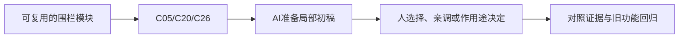

# A-03｜场景、节点与实例：先搭灰盒

> 兼容课号：B02。ABCDE是主题入口，不是必须按字母顺序完成；文件链接与题号保留稳定。

版本：Applied Curriculum v5｜2026-09-15
状态：课件正文与互动规格已编写；尚未逐课生成OpenMAIC课堂或试教。

## 1. 本课任务卡

**产出：** 把两个模块放进灰盒，替换一个外观而不破坏其结构职责。
**前置：** B01A；**对应概念：** C05/C20/C26。
**预计课堂：** 20–30分钟，可在实验前后暂停；不含后续真实软件制作时间。
**M 必须掌握：**
- 识别节点职责，区分场景资源与场景实例。
- 选择整体或外观节点操作，并验收AI改动范围。
**K 理解即可：**
- Grid/Snap用于对齐；目标平台限制后续画面选择。
**停止线：** 不建组件框架，不展开物理系统；碰撞此刻只认识为另一种职责。

## 2. 必要讲解：先看现象，再给术语

Node是承担职责的对象；Scene保存一组节点及关系，Instance是使用它的一份实例。外观、碰撞、控制可以分属不同节点。

灰盒用简单体块验证空间，不是低质量成品。先确定一个桌面单机目标，保留能运行的基线；AI不应为了换外观删掉功能节点。

## 2A. 这次在实际场景里解决什么

**应用位置：** P01｜可复用的围栏模块；主项目中的功能、视觉或交付决定。

|开始时遇到的问题|本课期望得到的变化|
|---|---|
|移动围栏外观后功能部分留在原处；每个模块都被重复从零搭建。|两份模块实例能独立摆放，换一个外观不删掉原功能。|

**这是目标状态对照，不是已完成截图。** 首次操作应使用匹配当前进度的最小场景；还没有配套时，只能记为课堂模拟，不能直接勾选真机应用通过。

### 概念关系示意


图中箭头表示教学流程，不是引擎节点继承。OpenMAIC不支持Mermaid时改画等价方框图，不能把代码原文冒充运行示意。

### 先让AI帮助理解，再让AI帮助工作

**学习指令：**
```text
现在只检查这道判断：只删除Visual是否一定把模块所有功能删掉？
先等我给预测和理由，再指出一个证据缺口；一次只给一个线索，不先公布完整答案。
我的用词不专业时，先用人话确认意思，再补对应术语。
```

**工作指令：可复制；先补实际版本与当前材料，不粘贴密钥。**
```text
我正在逐步制作同一个小型单机「星光小庭院」，不是重新生成整款游戏。
我会提供实际软件版本、当前场景/文件和必要截图；先确认你能访问哪些材料和工具。
这次只做：在现有灰盒准备一个父节点包装的围栏模块与两个实例，标明外观节点和预留功能节点。给出整体移动与只移动外观的对照，限定修改当前模块。
必须保持：原项目入口、其他场景与功能节点保持；只读懂职责，不先搭通用架构。
先列出将改的对象、原值和预期结果，提供最小可撤销初稿及检查步骤。
没有真实软件连接时只提供操作单/脚本，不声称已经编辑、运行或看过未提供的截图。
不要自动安装插件、联网下载素材、购买服务或读取无关文件；必要操作另说明并取得授权。
完成后报告实际做了什么、还没验证什么；我负责选择和最终验收。
```

### 哪些地方比继续发指令更适合亲自试

|入口与性质|一次只做的微调/选择|亲眼观察什么|
|---|---|---|
|Godot Scene树与Inspector（内置）|分别选模块根和Visual改Position|哪些子对象跟随，哪些没有跟随|
|Godot网格吸附（内置入口）|用统一间距摆两个实例|整体连接处是否错位，是否误改共享源|

**初值与恢复：** 先读取并记录当前值；表里的方向是对照办法，不是通用最佳参数。先在副本上操作，不覆盖基底；返回前用撤销或记录值恢复并重新预览。自定义变量不是软件内置参数。
**选择下一步：** 方向不对，补一张明确参考并圈出要借鉴的部分；结构/因果不对，让AI做局部修复；已接近目标且入口可直接操作，先亲调一项。原因不明先做对照，不靠反复重生成抽卡。

**局部修复指令：**
```text
保留本课「必须保持」的部分。我会给出同条件的当前结果和目标差异。
只围绕「两份模块实例能独立摆放，换一个外观不删掉原功能。」检查一个根因假设；先给最小验证，未经证据不要重写全部内容。
若只是一个可见参数偏差，告诉我该选哪个对象、哪个入口、怎么小幅调和恢复。
```

**本课风险检查：** 检查AI是否删除整个实例来替换外观，或把所有实例误当独立资源副本。
**时间边界：** 上述是需要在当前模型/工具/软件版本下验证的风险清单，不是所有AI必然失败的结论，也不预测何时会解决。长期保留的是目标、约束、参考选择、结果认可和取舍责任；测量和重复调整可以继续交给AI协助。

## 3. 界面与参数学习深度

以下是后续真机操作的对应范围，不要求本轮打开软件。模拟滑块是教学控件，不代表软件都有同名按钮。会调是指看懂作用、主动选择与恢复；会定位是知道去哪找；按需查不考菜单路径、快捷键和API记忆。
- Godot：Scene树、Inspector、实例添加、F5/F6的用途。
- 会定位：FileSystem与Remote树。
- 按需查：继承场景高级选项、所有节点类。

## 4. 互动实验规格

**初始状态：** 树中有Module父节点、Visual子节点和只读功能标记；两份实例同屏；右侧显示选中节点。
**可操作项：** 选择父/子、移动X=-2到2、替换Box/Sphere外观、显示树、恢复。
**实验步骤：**
1. 选父节点移动，看整组变化；恢复后只移动Visual，比较功能标记。
2. 在一份实例修改位置，检查另一份的位置；不在这一步展开共享材质。
3. 让AI提议换外观，学员先圈定允许改动的节点，再核对修改前后。
**预期反馈：** 树节点和场景选中状态同步；父变换与外观偏移分别显示。Web结构标记不是实际碰撞测试。
**故障或反例：** 故障：外观被移动，功能标记留在原地；修复应恢复子偏移后移动整体，而不是删标记。
**复位：** 整体与外观偏移都复位；保留修改清单供复盘。
**无图/无3D替代：** 用原创简单形状、状态卡或给定时间序列表达同一因果关系；标明“示意”，不得把预设结果说成Godot/Blender实测。不能以假按钮或不响应的截图代替交互。
**完成判据：** 对本课两项M提供操作或判断及解释；一个实验可覆盖多项。只有关键M或发现薄弱处才追加故障/变式，不为每个术语加作业。

## 5. 小结与必须牢记

- 换外观不等于换功能。
- 改AI代码前保留基线。
- 选对节点再调参数。

## 6. 训练：先作答，再看反馈

P=预测，D=诊断，T=迁移，K=用途认识。下面是候选训练，不是每个词都做四次作业。课堂先用预测和一个操作，重点未达标再选D或T；延迟复测换对象，不重复抄答案。

### B02-P1
只删除Visual是否一定把模块所有功能删掉？

### B02-D2
AI换外观后删除了功能节点，能跑是否算完成？

### B02-T3
将路牌方块换成球体但保持交互位置，你会怎样组织？

### B02-K4
网格吸附有何用途？

## 7. 后续真机任务（配套待做，不作为当前课堂依赖）

已有B02 starter/reference/broken场景可选验证；课件不要求学员阅读构造代码。
即使已有参考工程，也要区分课件、运行测试、人工体验、学习掌握四种证据。按用户安排，当前先完成全部课件，之后再统一补素材、Godot/Blender起始与参考工程。

## 8. 实际应用验收：把结果放回同一个项目

**本课产物：** 两份模块实例能独立摆放，换一个外观不删掉原功能。
**接入边界：** 原项目入口、其他场景与功能节点保持；只读懂职责，不先搭通用架构。

以下是要采集的证据，不是宣称已经执行。记录“未尝试 / 有提示完成 / 独立验证 / 隔次仍会”；不把这四种状态与M/K学习要求混淆。

|原有M能力|本次在哪里取证|
|---|---|
|识别节点职责，区分场景资源与场景实例。|能解释节点、场景和实例在这两个围栏中的区别。|
|选择整体或外观节点操作，并验收AI改动范围。|能指出AI改动范围、回退一次错位，保留同一目标平台记录。|

**旧功能回归：** 原场景入口可打开；另一个实例和功能包装仍在。
**最小记录：** 一段现场演示，或同条件前后图/日志，加一句“我改了什么、为什么”。截图不足以证明运动/一次性事件时，要演示动作或查看对应状态。记录用过的提示，不要求写长报告。
**关键能力复测：** 本课高频或返工风险较高，已有有效证据可复用；薄弱处增加一个未知故障或隔次变式，不把每个词都变成一套试卷。

**换情境的候选任务：** 用同一包装换成邮箱外观，判断应修改哪层。
**判定：** 普通M按原0–2锚点；有针对性根因提示记练习，换变式再验证。K只查用途，不能抵消关键M失败。没有真实操作的M只记待验证，模拟通过不能自动升级为真机通过。未选专题不阻塞主线。

**接入不等于新增系统：** 美术课可交风格卡、参数决定或改造样本；性能课可得出“不优化”。隔离实验只有对当前项目有收益才接入，不强迫庭院变成战斗、开放世界或联网游戏。

## 9. 复现与延迟检查

本课复现：B01A。只复习已学的关键M。
下次课抽一个本课关键判断，换对象或数值后先独立解释。查菜单和API不扣独立判断分；被提示根因或目标值后完成，记录有提示，换变式再验。K不反复背定义。

## 10. 依据与观看入口

- [Godot Node3D：变换与父空间](https://docs.godotengine.org/en/stable/classes/class_node3d.html)
- [Godot Resources：共享和引用](https://docs.godotengine.org/en/stable/tutorials/scripting/resources.html)

技术来源支持术语和软件边界；具体实验与课程顺序是本项目教学设计，不代表已证明学习效果。艺术家入口用于观看研习，不等于获得图片或素材再分发许可。
