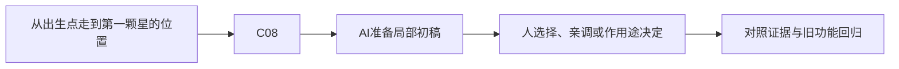

# B-02｜走与跑：输入、速度和时间

> 兼容课号：B03。ABCDE是主题入口，不是必须按字母顺序完成；文件链接与题号保留稳定。

版本：Applied Curriculum v5｜2026-09-15
状态：课件正文与互动规格已编写；尚未逐课生成OpenMAIC课堂或试教。

## 1. 本课任务卡

**产出：** 获得稳定的走跑速度，并用相同时长验证而不是靠感觉猜。
**前置：** B04；**对应概念：** C08。
**预计课堂：** 20–30分钟，可在实验前后暂停；不含后续真实软件制作时间。
**M 必须掌握：**
- 用输入动作表达意图，选择走跑参数。
- 区分速度与位移，检查时间步误用和斜向增速。
**K 理解即可：**
- 渲染帧率和物理tick不是同一个量。
**停止线：** 不背for语法、不推积分；不自己编写测试框架。

## 2. 必要讲解：先看现象，再给术语

速度表示每秒移动多少，位移表示已经移动多少。直接累计位置时要正确考虑时间；Godot4的move_and_slide使用velocity并内部处理物理时间，不能再随手给速度乘一次delta。

WASD只是输入绑定，动作名称才表达意图。比较直走和斜走时固定时长，避免同时按两个方向导致斜向无意加速。

## 2A. 这次在实际场景里解决什么

**应用位置：** P02｜从出生点走到第一颗星的位置；主项目中的功能、视觉或交付决定。

|开始时遇到的问题|本课期望得到的变化|
|---|---|
|走路速度不合适，或者不同运行条件下单位时间位移不一致。|走与跑有可感知差异，斜向没有不合理加速；调整速度不改变关卡尺寸。|

**这是目标状态对照，不是已完成截图。** 首次操作应使用匹配当前进度的最小场景；还没有配套时，只能记为课堂模拟，不能直接勾选真机应用通过。

### 概念关系示意


图中箭头表示教学流程，不是引擎节点继承。OpenMAIC不支持Mermaid时改画等价方框图，不能把代码原文冒充运行示意。

### 先让AI帮助理解，再让AI帮助工作

**学习指令：**
```text
现在只检查这道判断：速度不变，采样次数翻倍，2秒总路程应该翻倍吗？
先等我给预测和理由，再指出一个证据缺口；一次只给一个线索，不先公布完整答案。
我的用词不专业时，先用人话确认意思，再补对应术语。
```

**工作指令：可复制；先补实际版本与当前材料，不粘贴密钥。**
```text
我正在逐步制作同一个小型单机「星光小庭院」，不是重新生成整款游戏。
我会提供实际软件版本、当前场景/文件和必要截图；先确认你能访问哪些材料和工具。
这次只做：只为已有玩家准备WASD走路和Shift跑步，复用已有地面碰撞。暴露walk_speed与run_speed这两个项目自定义参数，附固定时长位移对照；解释velocity与位移，不能给move_and_slide速度重复乘delta。
必须保持：地面碰撞、相机、出生点和场景比例保持；不增加体力条或动画状态机。
先列出将改的对象、原值和预期结果，提供最小可撤销初稿及检查步骤。
没有真实软件连接时只提供操作单/脚本，不声称已经编辑、运行或看过未提供的截图。
不要自动安装插件、联网下载素材、购买服务或读取无关文件；必要操作另说明并取得授权。
完成后报告实际做了什么、还没验证什么；我负责选择和最终验收。
```

### 哪些地方比继续发指令更适合亲自试

|入口与性质|一次只做的微调/选择|亲眼观察什么|
|---|---|---|
|玩家脚本导出变量（自定义）|walk_speed从记录基线略调，再固定路线试走|到目标所需时间和转向控制感|
|玩家脚本导出变量（自定义）|单独调run_speed，不同时改相机FOV|跑步是否确实更快且不会越过目标|

**初值与恢复：** 先读取并记录当前值；表里的方向是对照办法，不是通用最佳参数。先在副本上操作，不覆盖基底；返回前用撤销或记录值恢复并重新预览。自定义变量不是软件内置参数。
**选择下一步：** 方向不对，补一张明确参考并圈出要借鉴的部分；结构/因果不对，让AI做局部修复；已接近目标且入口可直接操作，先亲调一项。原因不明先做对照，不靠反复重生成抽卡。

**局部修复指令：**
```text
保留本课「必须保持」的部分。我会给出同条件的当前结果和目标差异。
只围绕「走与跑有可感知差异，斜向没有不合理加速；调整速度不改变关卡尺寸。」检查一个根因假设；先给最小验证，未经证据不要重写全部内容。
若只是一个可见参数偏差，告诉我该选哪个对象、哪个入口、怎么小幅调和恢复。
```

**本课风险检查：** 检查API版本、重复delta、斜向加速；这些是要测试的风险，不是某模型必然失败。
**时间边界：** 上述是需要在当前模型/工具/软件版本下验证的风险清单，不是所有AI必然失败的结论，也不预测何时会解决。长期保留的是目标、约束、参考选择、结果认可和取舍责任；测量和重复调整可以继续交给AI协助。

## 3. 界面与参数学习深度

以下是后续真机操作的对应范围，不要求本轮打开软件。模拟滑块是教学控件，不代表软件都有同名按钮。会调是指看懂作用、主动选择与恢复；会定位是知道去哪找；按需查不考菜单路径、快捷键和API记忆。
- Godot：Input Map动作、Inspector暴露的walk_speed/run_speed。
- 会定位：物理处理函数和输出日志。
- 按需查：按键事件API、计时测试代码。

## 4. 互动实验规格

**初始状态：** 直线标尺、方向键、walk=4、run=7，固定2秒测试；示意模拟标明不是Godot执行。
**可操作项：** 走速2到6、跑速6到10；直走/斜走；30/60物理采样演示；错误时间开关仅教师控制。
**实验步骤：**
1. 先估计2秒走路与跑步谁更远；点击计时测试。
2. 只改变模拟采样频率，不改速度，比较距离。
3. 用相同时长比较直走和斜走，再读取归一化开关的效果。
**预期反馈：** 显示时长、目标速度、实际距离和误差；示意计算与真实引擎测试明确分开。
**故障或反例：** 故障卡：velocity先乘delta再送move_and_slide。给定前后距离记录，要求识别重复时间处理，不要求重写脚本。
**复位：** 速度、位置、计时和错误开关复位；不改变输入绑定。
**无图/无3D替代：** 用原创简单形状、状态卡或给定时间序列表达同一因果关系；标明“示意”，不得把预设结果说成Godot/Blender实测。不能以假按钮或不响应的截图代替交互。
**完成判据：** 对本课两项M提供操作或判断及解释；一个实验可覆盖多项。只有关键M或发现薄弱处才追加故障/变式，不为每个术语加作业。

## 5. 小结与必须牢记

- 先看每秒还是每帧。
- 不要无条件到处乘delta。
- 测同一时长再比速度。

## 6. 训练：先作答，再看反馈

P=预测，D=诊断，T=迁移，K=用途认识。下面是候选训练，不是每个词都做四次作业。课堂先用预测和一个操作，重点未达标再选D或T；延迟复测换对象，不重复抄答案。

### B03-P1
速度不变，采样次数翻倍，2秒总路程应该翻倍吗？

### B03-D2
用了move_and_slide后角色特别慢，AI建议速度乘60，你先查哪里？

### B03-T3
给手柄加移动，什么要保持一致？

### B03-K4
高FPS是否保证物理tick同样高？

## 7. 后续真机任务（配套待做，不作为当前课堂依赖）

后续在提供控制器上改参数，使用给定计时按钮；代码生成不作为记忆考试。
即使已有参考工程，也要区分课件、运行测试、人工体验、学习掌握四种证据。按用户安排，当前先完成全部课件，之后再统一补素材、Godot/Blender起始与参考工程。

## 8. 实际应用验收：把结果放回同一个项目

**本课产物：** 走与跑有可感知差异，斜向没有不合理加速；调整速度不改变关卡尺寸。
**接入边界：** 地面碰撞、相机、出生点和场景比例保持；不增加体力条或动画状态机。

以下是要采集的证据，不是宣称已经执行。记录“未尝试 / 有提示完成 / 独立验证 / 隔次仍会”；不把这四种状态与M/K学习要求混淆。

|原有M能力|本次在哪里取证|
|---|---|
|用输入动作表达意图，选择走跑参数。|能用输入动作启动走跑，手调速度并说明选择。|
|区分速度与位移，检查时间步误用和斜向增速。|能读固定时长位移结果，区分速度错误与关卡尺度错误。|

**旧功能回归：** 墙仍阻挡玩家；停止输入后行为符合本课设定；其他对象未移动。
**最小记录：** 一段现场演示，或同条件前后图/日志，加一句“我改了什么、为什么”。截图不足以证明运动/一次性事件时，要演示动作或查看对应状态。记录用过的提示，不要求写长报告。
**关键能力复测：** 本课高频或返工风险较高，已有有效证据可复用；薄弱处增加一个未知故障或隔次变式，不把每个词都变成一套试卷。

**换情境的候选任务：** 把直线目标换成绕两根柱子，重新判断速度是否舒服。
**判定：** 普通M按原0–2锚点；有针对性根因提示记练习，换变式再验证。K只查用途，不能抵消关键M失败。没有真实操作的M只记待验证，模拟通过不能自动升级为真机通过。未选专题不阻塞主线。

**接入不等于新增系统：** 美术课可交风格卡、参数决定或改造样本；性能课可得出“不优化”。隔离实验只有对当前项目有收益才接入，不强迫庭院变成战斗、开放世界或联网游戏。

## 9. 复现与延迟检查

本课复现：B02。只复习已学的关键M。
下次课抽一个本课关键判断，换对象或数值后先独立解释。查菜单和API不扣独立判断分；被提示根因或目标值后完成，记录有提示，换变式再验。K不反复背定义。

## 10. 依据与观看入口

- [Godot CharacterBody3D：速度、落地与移动](https://docs.godotengine.org/en/stable/classes/class_characterbody3d.html)

技术来源支持术语和软件边界；具体实验与课程顺序是本项目教学设计，不代表已证明学习效果。艺术家入口用于观看研习，不等于获得图片或素材再分发许可。
