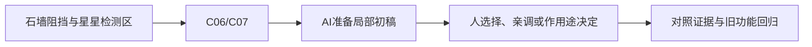

# B-01｜看得见、挡得住、能检测是三回事

> 兼容课号：B04。ABCDE是主题入口，不是必须按字母顺序完成；文件链接与题号保留稳定。

版本：Applied Curriculum v5｜2026-09-15
状态：课件正文与互动规格已编写；尚未逐课生成OpenMAIC课堂或试教。

## 1. 本课任务卡

**产出：** 用三个开关找出穿墙或检测失败的原因，恢复最小正确配置。
**前置：** B02；**对应概念：** C06/C07。
**预计课堂：** 20–30分钟，可在实验前后暂停；不含后续真实软件制作时间。
**M 必须掌握：**
- 区分Mesh、物理阻挡和Area重叠检测。
- 按谁检测谁选择Layer/Mask和简单形状。
**K 理解即可：**
- 凸/凹形状是不同物理近似，按用途查。
**停止线：** 不教碰撞算法和位运算；不考完整信号系统。

## 2. 必要讲解：先看现象，再给术语

可见Mesh决定样子；碰撞形状决定物理系统使用的边界。隐藏外观不会自动禁用碰撞。Area用于检测重叠，不是实体墙。

Layer说明对象属于哪些类，Mask说明本次检测关注哪些类。例：玩家在第2层，星星Mask勾第2层。界面层号与脚本位值不能混说，初级不考换算。

## 2A. 这次在实际场景里解决什么

**应用位置：** P02｜石墙阻挡与星星检测区；主项目中的功能、视觉或交付决定。

|开始时遇到的问题|本课期望得到的变化|
|---|---|
|看得见的墙可以穿过，或星星区域不识别玩家。|墙负责阻挡，区域只负责检测；仅选定对象触发。|

**这是目标状态对照，不是已完成截图。** 首次操作应使用匹配当前进度的最小场景；还没有配套时，只能记为课堂模拟，不能直接勾选真机应用通过。

### 概念关系示意


图中箭头表示教学流程，不是引擎节点继承。OpenMAIC不支持Mermaid时改画等价方框图，不能把代码原文冒充运行示意。

### 先让AI帮助理解，再让AI帮助工作

**学习指令：**
```text
现在只检查这道判断：墙隐藏而碰撞还开着，会发生什么？
先等我给预测和理由，再指出一个证据缺口；一次只给一个线索，不先公布完整答案。
我的用词不专业时，先用人话确认意思，再补对应术语。
```

**工作指令：可复制；先补实际版本与当前材料，不粘贴密钥。**
```text
我正在逐步制作同一个小型单机「星光小庭院」，不是重新生成整款游戏。
我会提供实际软件版本、当前场景/文件和必要截图；先确认你能访问哪些材料和工具。
这次只做：准备一堵可单独隐藏外观/禁用形状的墙，再准备只显示进入次数的Area。先显示实际层号和检测方向，只注入一处Mask错误；本课不制作完整拾取计分。
必须保持：玩家控制器与墙位置固定；不能通过全选所有层或删除碰撞需求修复。
先列出将改的对象、原值和预期结果，提供最小可撤销初稿及检查步骤。
没有真实软件连接时只提供操作单/脚本，不声称已经编辑、运行或看过未提供的截图。
不要自动安装插件、联网下载素材、购买服务或读取无关文件；必要操作另说明并取得授权。
完成后报告实际做了什么、还没验证什么；我负责选择和最终验收。
```

### 哪些地方比继续发指令更适合亲自试

|入口与性质|一次只做的微调/选择|亲眼观察什么|
|---|---|---|
|CollisionShape3D > Disabled（内置）|恢复基线后只切换一次Disabled|阻挡消失与隐藏Mesh的结果是否不同|
|Area3D > Collision Mask（内置）|按玩家实际所属层勾选，不背位掩码数字|玩家进入和错误对象进入是否得到不同结果|

**初值与恢复：** 先读取并记录当前值；表里的方向是对照办法，不是通用最佳参数。先在副本上操作，不覆盖基底；返回前用撤销或记录值恢复并重新预览。自定义变量不是软件内置参数。
**选择下一步：** 方向不对，补一张明确参考并圈出要借鉴的部分；结构/因果不对，让AI做局部修复；已接近目标且入口可直接操作，先亲调一项。原因不明先做对照，不靠反复重生成抽卡。

**局部修复指令：**
```text
保留本课「必须保持」的部分。我会给出同条件的当前结果和目标差异。
只围绕「墙负责阻挡，区域只负责检测；仅选定对象触发。」检查一个根因假设；先给最小验证，未经证据不要重写全部内容。
若只是一个可见参数偏差，告诉我该选哪个对象、哪个入口、怎么小幅调和恢复。
```

**本课风险检查：** 检查AI是否用外观代替物理形状、误解Layer/Mask或扩大检测范围掩盖问题。
**时间边界：** 上述是需要在当前模型/工具/软件版本下验证的风险清单，不是所有AI必然失败的结论，也不预测何时会解决。长期保留的是目标、约束、参考选择、结果认可和取舍责任；测量和重复调整可以继续交给AI协助。

## 3. 界面与参数学习深度

以下是后续真机操作的对应范围，不要求本轮打开软件。模拟滑块是教学控件，不代表软件都有同名按钮。会调是指看懂作用、主动选择与恢复；会定位是知道去哪找；按需查不考菜单路径、快捷键和API记忆。
- Godot：CollisionShape3D的Shape/Disabled、Collision Layer/Mask。
- 会定位：运行时可见碰撞形状、Area Monitoring。
- 按需查：复杂网格碰撞生成、物理服务器细节。

## 4. 互动实验规格

**初始状态：** 有外观墙、简单方盒碰撞、可穿过的星星检测区；玩家属于第2层；测试记录只显示进入是否发生。
**可操作项：** 墙外观开关、墙Shape开关、星星检测层第1/2层；每次只开放一种错误。
**实验步骤：**
1. 先预测隐藏墙后能否通过；隐藏、移动、恢复。
2. 保持外观只禁用Shape，再移动、恢复。
3. 把星星Mask从第2层改第1层，比较检测日志，再恢复正确对象过滤。
**预期反馈：** 三列显示可见/被阻挡/检测事件；不可把HTML中预设答案冒充真实物理检测。
**故障或反例：** 只注入一个错误：Mask遗漏玩家层。学员应指明检测者，而不是把所有层全部勾上。
**复位：** 还原外观、Shape、Mask和对象位置；清空事件日志防止旧记录误读。
**无图/无3D替代：** 用原创简单形状、状态卡或给定时间序列表达同一因果关系；标明“示意”，不得把预设结果说成Godot/Blender实测。不能以假按钮或不响应的截图代替交互。
**完成判据：** 对本课两项M提供操作或判断及解释；一个实验可覆盖多项。只有关键M或发现薄弱处才追加故障/变式，不为每个术语加作业。

## 5. 小结与必须牢记

- 外观、阻挡、检测分别检查。
- Mask按检测方向配置。
- 简单形状先满足玩法。

## 6. 训练：先作答，再看反馈

P=预测，D=诊断，T=迁移，K=用途认识。下面是候选训练，不是每个词都做四次作业。课堂先用预测和一个操作，重点未达标再选D或T；延迟复测换对象，不重复抄答案。

### B04-P1
墙隐藏而碰撞还开着，会发生什么？

### B04-D2
星星区域与玩家重叠却不检测，看到Mask只选环境层，你怎么修？

### B04-T3
树叶需要和每片叶子同样复杂的碰撞吗？

### B04-K4
复杂凸形状什么时候值得查？

## 7. 后续真机任务（配套待做，不作为当前课堂依赖）

后续独立碰撞课包再制作；当前整合工程只是参考，不作为每课材料齐全的证据。
即使已有参考工程，也要区分课件、运行测试、人工体验、学习掌握四种证据。按用户安排，当前先完成全部课件，之后再统一补素材、Godot/Blender起始与参考工程。

## 8. 实际应用验收：把结果放回同一个项目

**本课产物：** 墙负责阻挡，区域只负责检测；仅选定对象触发。
**接入边界：** 玩家控制器与墙位置固定；不能通过全选所有层或删除碰撞需求修复。

以下是要采集的证据，不是宣称已经执行。记录“未尝试 / 有提示完成 / 独立验证 / 隔次仍会”；不把这四种状态与M/K学习要求混淆。

|原有M能力|本次在哪里取证|
|---|---|
|区分Mesh、物理阻挡和Area重叠检测。|能用隐藏外观/禁用形状两次对照分清视觉、阻挡和检测。|
|按谁检测谁选择Layer/Mask和简单形状。|能修一处检测对象错误，并说明为什么不用复杂高模碰撞。|

**旧功能回归：** 恢复后墙继续阻挡；检测区不变成实体障碍。
**最小记录：** 一段现场演示，或同条件前后图/日志，加一句“我改了什么、为什么”。截图不足以证明运动/一次性事件时，要演示动作或查看对应状态。记录用过的提示，不要求写长报告。
**关键能力复测：** 本课高频或返工风险较高，已有有效证据可复用；薄弱处增加一个未知故障或隔次变式，不把每个词都变成一套试卷。

**换情境的候选任务：** 换成树：决定树干和树冠是否要碰撞，按玩法给理由。
**判定：** 普通M按原0–2锚点；有针对性根因提示记练习，换变式再验证。K只查用途，不能抵消关键M失败。没有真实操作的M只记待验证，模拟通过不能自动升级为真机通过。未选专题不阻塞主线。

**接入不等于新增系统：** 美术课可交风格卡、参数决定或改造样本；性能课可得出“不优化”。隔离实验只有对当前项目有收益才接入，不强迫庭院变成战斗、开放世界或联网游戏。

## 9. 复现与延迟检查

本课复现：B02。只复习已学的关键M。
下次课抽一个本课关键判断，换对象或数值后先独立解释。查菜单和API不扣独立判断分；被提示根因或目标值后完成，记录有提示，换变式再验。K不反复背定义。

## 10. 依据与观看入口

- [Godot Area3D：重叠检测与信号](https://docs.godotengine.org/en/stable/classes/class_area3d.html)
- [Godot CharacterBody3D：速度、落地与移动](https://docs.godotengine.org/en/stable/classes/class_characterbody3d.html)

技术来源支持术语和软件边界；具体实验与课程顺序是本项目教学设计，不代表已证明学习效果。艺术家入口用于观看研习，不等于获得图片或素材再分发许可。
