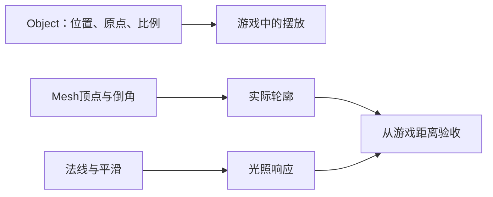

# C-02｜Blender静态资产：先会验收，再谈从零造型

> 兼容课号：B07。ABCDE是主题入口，不是必须按字母顺序完成；文件链接与题号保留稳定。

版本：Audited Collaboration v7｜2026-09-15
状态：课件正文与互动规格已编写；尚未逐课生成OpenMAIC课堂或试教。

## 0. 开始前：只准备本课需要的东西

**本次起点：** 一件来源明确、允许本次使用的可编辑静态道具副本；没有角色也能学，不在唯一源文件上修改。
**缺材料时：** 先用说明卡判断来源、结构和改造范围。缺可编辑源或适用许可时停止导入/修改，不自动购买、下载或替换成不明资源。
**当前配套：** 本课起始包尚未由这一轮交付；不要把下方目标、代码建议或示意看成已经存在的工程。

**今天的最小任务：** 为一件静态道具做尺寸、轮廓、原点和法线检查。
**怎样读：** 先看两项M和概念图，再复制对话1。启动框已带首步、继续条件和结束证据；之后用自己的话回复即可，不必把六框逐一重发。
**怎样停：** 完成当前小步可以暂停，记录下次起点；只有本课两项M都有相应证据才标本课应用通过。暂停不是失败，模拟完成不是软件通过。
**先学再验：** 初次允许AI示范一小步，你再换一个值/对象作选择；需要检查独立判断时换未讲过的变式，不要求从零手写代码。

## 1. 本课任务卡

**产出：** 为一件静态道具做尺寸、轮廓、原点和法线检查。
**前置：** B06, R02；**对应概念：** C02/C11/C26。
**预计课堂：** 20–30分钟，可在实验前后暂停；不含后续真实软件制作时间。
**M 必须掌握：**
- 区分对象变换与网格编辑，判断修正应该发生在哪里。
- 分清平滑着色与真实倒角，检查游戏距离的轮廓。
**K 理解即可：**
- 拓扑、面数、修改器是按需求使用的工具；复杂雕刻暂不学。
**停止线：** 不要求手工搭完整人物，不刷所有快捷键，不用建模速度评分。

## 1A. 必学内容、实操与题目如何对应

M1/M2只是本课任务卡的两项能力序号，不是新的技术概念。查菜单/API不扣独立判断分。

|必须掌握到这里|本课实操题：做什么算有证据|可选配套题|
|---|---|---|
|M1：区分对象变换与网格编辑，判断修正应该发生在哪里。|分别试对象移动与局部几何变化，指出原点和对象变换受影响的区别。|直接用本行实操题取证，不另加术语测验|
|M2：分清平滑着色与真实倒角，检查游戏距离的轮廓。|固定机位比较平滑与倒角的剪影/高光，再在游戏距离保留有收益的一项。|B07-P1, B07-D2, B07-T3|

**最低学习路径：** 一次预测 → 一个能覆盖上述两项M的小实验/项目改动 → 一次结果解释。普通M做到即可；关键薄弱处再选一题诊断或隔次迁移，不把P/D/T全套加到每个术语上。
**理解即可与停止线：** 任务卡中的K只检用途；按需查的界面、API、高级实现不进入本课操作门槛。只有已学且已存在的项目功能需要回归。

## 2. 必要讲解：先看现象，再给术语

Object Mode改变对象在场景里的变换；Edit Mode修改对象内部几何，可能改变可见形状与原点的关系。静态道具也要留原文件，不在唯一副本上试错。

Shade Smooth改变表面着色表现，不会自动把轮廓变圆。Bevel改变边缘几何。先判断目标游戏镜头能否看见差异，再决定是否增加面。

## 2A. 场景、概念图与逐步AI对话

**实际位置：** P03｜替换庭院星星的静态外观。

|操作前的问题|本课希望得到的结果|
|---|---|
|素材太大、原点偏离，或高光平滑却轮廓仍生硬。|一件尺度和原点可用的道具外观，带来源记录。|

这是目标对照，不是已完成的游戏截图。概念图为职责/因果示意，不是继承图或完整运行证明。

OpenMAIC不能渲染Mermaid时画等价方框图；无3D或真实连接时仅标课堂模拟，不伪造软件运行。

### 本课人和AI分别负责什么

|责任|这课具体做什么|
|---|---|
|我必须作出的判断|决定改对象还是几何；在玩家距离评估倒角是否有收益。|
|可以交给AI的制作|准备同尺度基底、平滑/倒角可撤销对照及来源清单。|
|我检查AI交付物|看修改对象/前后差异、实际执行记录及未验证项；先核对是否保留本课约束，再决定是否接入。|

**不是手工熟练考试：** 重复劳动与代码可委托；常用可见参数适合亲调时先调一项，无障碍需要可由AI按已选值执行。必须能说明选择、观察和恢复，不要求机械地拖每个滑杆。

**两种模式：** 练习时可问根因、看示范；独立验收时先由我提出选择/假设，AI只协助执行与记录。已透露本题根因或目标值，就记录“有提示”，再换未揭示答案的变式。

### 复制第1框开始；以后每次只发当前一步

**学员用法：** 无需一次读完所有提示。将当前框发给你使用的AI；做完后回“完成＋观察”，结果不符回“不符＋现象”，报错回“报错＋原文”，需要停下回“暂停”。自然语言也可以。不要一口气把六步当成自动执行授权。

### 对话1｜建立本课上下文

```text
请做我这节课的协作教练：C-02（兼容课号B07）《Blender静态资产：先会验收，再谈从零造型》。
我们逐步制作同一个「星光小庭院」，当前只解决：素材太大、原点偏离，或高光平滑却轮廓仍生硬。
目标：一件尺度和原点可用的道具外观，带来源记录。
必须掌握：区分对象变换与网格编辑，判断修正应该发生在哪里；分清平滑着色与真实倒角，检查游戏距离的轮廓。理解即可：拓扑、面数、修改器是按需求使用的工具；复杂雕刻暂不学
停止线：不要求手工搭完整人物，不刷所有快捷键，不用建模速度评分。
必须保持：只操作静态对象，不对绑定角色套用同样Apply流程；不覆盖唯一源文件。
本课由我负责：决定改对象还是几何；在玩家距离评估倒角是否有收益。
可以交给你：准备同尺度基底、平滑/倒角可撤销对照及来源清单。
请标明建议/已执行/已验证的区别。练习可提示；验收先等我作判断，已提示根因则如实记有提示。
先读取我已提供的进度和材料，只问真正缺失的一项。需要软件操作时核对实际版本、当前截图或场景树、可访问的工具；不要求我发密钥或整个电脑。
本课入场材料：一件来源明确、允许本次使用的可编辑静态道具副本；没有角色也能学，不在唯一源文件上修改。
材料不足的处理：先用说明卡判断来源、结构和改造范围。缺可编辑源或适用许可时停止导入/修改，不自动购买、下载或替换成不明资源。
以下是本课连续推进卡，不是一次性执行授权；收到我的观察后每轮最多推进一个有意义的小步。
首步：只检查一件已提供的静态道具：尺寸、原点、朝向和来源；不从零重做。
继续条件：我能指出一个实际质量问题或说明无需修改。
随后一步：只修该问题，再比较平滑着色与真正倒角对轮廓的区别。
结束证据：分别试对象移动与局部几何变化，指出原点和对象变换受影响的区别。；固定机位比较平滑与倒角的剪影/高光，再在游戏距离保留有收益的一项。
相关回归：导出副本不覆盖原始资产；后续功能仍由游戏包装负责。
这些是待执行要求，不是我的已完成进度。不要凭课号推断前置已通过；只复用我已提供的实际材料和证据。
对话1之后我可直接回复完成/不符/报错/暂停，无需重贴整课；你应沿这张推进卡继续，不临时增加系统。
先给一个预测问题并等我回答，再给一个最小步骤。不跳课、不自动做整款游戏。能执行才说已执行，否则给明确操作单或脚本，并标未执行。
后续每轮用四项回应：现在是哪一步；只改什么/怎样恢复；我应观察什么；目前还缺什么证据。没有证据不要替我勾通过。
```

**AI此时应做：** 确认当前场景与学习范围，不直接输出几十个文件。已经提供过的版本、素材和约束应复用，不重复问。

### 对话2｜先理解一个因果关系

```text
先问我：同一箱子只开平滑着色，外轮廓仍方；改为真实小倒角后，哪类变化才可能出现在剪影上？如何保持比较公平？
等我写预测和理由后，再指出一个证据缺口，只给一个提示，不先公布完整答案。用词不专业时先确认意思，再补术语。
```

**转入下一步：** 有自己的预测即可；预测错可以用实验纠正，不要求先背定义。

### 对话3｜AI只完成第一小步

```text
沿用已确认的版本、材料和修改边界。现在只做：只检查一件已提供的静态道具：尺寸、原点、朝向和来源；不从零重做。
先列影响对象和原值，再提供一个可撤销初稿。没有实际软件连接时给我可执行的局部操作单/脚本，不说已经修改。做完先停下。
```

**预计看到／拿到：** 我能指出一个实际质量问题或说明无需修改。
**不是自动保证：** 这是验收目标，取决于实际模型、工具和输入；结果不同就走下方“不符”分支。

### 对话4｜人观察与亲调，再继续第二小步

```text
这是我刚才的实际结果：我会附一张当前图、短演示或必要日志，并用一句话描述差异。
先检查是否满足：我能指出一个实际质量问题或说明无需修改。
本课可用的微调项：
入口：Blender Item > Dimensions/Scale（内置）；操作：与约定的参照物比较真实尺寸；观察：不是只看Scale是否为1
入口：Blender Bevel修改器（内置）；操作：先少量调宽度，再选择必要段数；观察：游戏距离下轮廓收益和明显变形，不追求面数
若满足，先指导我选择其中一项亲调；我回报观察后才继续：只修该问题，再比较平滑着色与真正倒角对轮廓的区别。
一次只动一项可见参数。方向接近就手调；结构有误才给局部修复，不能不断重生成整个场景。
```

|选中哪里与参数性质|这次亲自试什么|观察与停手依据|
|---|---|---|
|Blender Item > Dimensions/Scale（内置）|与约定的参照物比较真实尺寸|不是只看Scale是否为1|
|Blender Bevel修改器（内置）|先少量调宽度，再选择必要段数|游戏距离下轮廓收益和明显变形，不追求面数|

**保存与恢复：** 先记录原值和实际对象。优先在安全副本试；运行中Remote Inspector的变化不要当成已保存的设计值，确认后将选定值写回本地场景/资源或配置并重新运行。菜单路径随版本核对，自定义变量不冒充内置属性。
**采用哪种沟通：** 大方向偏了，用参考图圈出要借鉴的轮廓/色彩/光感，并指出不要照搬什么；单个视觉值接近了，先拖或输入数值；原因不明，固定条件做一次对照。参考图不是可自动反推所有参数的答案。

### 对话5｜成功验收，或失败时只修一处

**达到目标时发送：**
```text
请只根据我提供的证据检查：
- 分别试对象移动与局部几何变化，指出原点和对象变换受影响的区别。
- 固定机位比较平滑与倒角的剪影/高光，再在游戏距离保留有收益的一项。
旧功能回归：导出副本不覆盖原始资产；后续功能仍由游戏包装负责。
缺少过程证据就标待验证；不得用一张截图证明走跳或一次性事件。不要新增需求或把所有候选题变成作业。
```

**结果不符或报错时发送：**
```text
不符/报错：我会提供触发步骤、预期、实际现象和必要原始日志。
保留：只操作静态对象，不对绑定角色套用同样Apply流程；不覆盖唯一源文件。
本课优先风险：检查AI是否破坏源文件、过度细分，或把Shade Smooth说成自动圆角。
先提出一个可推翻的假设和一个最小验证；不要同时改多个系统。若两次验证仍无进展，回到基线并列出缺失证据，不反复抽卡。不要删除测试、关闭需求或扩大权限来假装修好。
```

**AI评分边界：** 代码和初稿可以由AI提供；判断、亲调与证据解释由学员完成。得到根因提示记为有提示，不因此重复考试所有概念。

### 对话6｜存进度，下一次接着做

```text
请总结本课C-02（B07）的进度卡，不把预测当已完成。
记录：真实软件版本/渲染器；当前场景与变更对象；选定参数和原值；我做的判断；实际证据；通过/待验证；使用过的提示；恢复方法；下一步唯一任务。
只有实际验证才标通过，没有生成或真机执行就明确写模拟/待验证。给我一段可以复制到新AI对话的摘要，不假称你已持久保存。
先核对下一课前置和我的已选路线，未完成就停在当前步骤，不催着扩范围。
```

**学员保存：** 把进度卡存本地或私人笔记；下次粘贴进度卡和下一课第1框。不要公开API Key、账户、本地私密路径或个人录像。

### 当前风险与长期责任

**本课风险检查：** 检查AI是否破坏源文件、过度细分，或把Shade Smooth说成自动圆角。
这是需要在当前工具版本下核验的风险，不是所有AI必然失败的排行榜，也不预测何时改善。长期保留需求、参考选择、影响范围、结果认可与取舍责任；测量、批量设置和重复验证可以由AI协助。
**不把学习变成额外六次考试：** 六个对话阶段共享本课原有M/K证据；只在薄弱关键能力上追加一处故障或变式。没有实际材料时先做课堂模拟，真机状态单独记录。

## 3. 界面与参数学习深度

以下是后续真机操作的对应范围，不要求本轮打开软件。模拟滑块是教学控件，不代表软件都有同名按钮。会调是指看懂作用、主动选择与恢复；会定位是知道去哪找；按需查不考菜单路径、快捷键和API记忆。
- Blender：视口导航、Outliner选择、Object/Edit Mode、Item/Dimensions。
- 会定位：Bevel修改器、面朝向、Set Origin；Apply仅在理解静态对象影响后使用。
- 按需查：倒角全部选项、重拓扑、绑定对象的变换处理。

## 4. 互动实验规格

**初始状态：** 一件有授权的简单箱子或程序生成星星；白色中性光；固定近景和游戏距离两个机位。
**可操作项：** 对象/几何演示切换、平滑开关、倒角0到0.06模型单位、近/远机位、法线示意。
**实验步骤：**
1. 用对象移动和移动全部顶点做A/B，观察原点及Transform。
2. 只开平滑看轮廓；恢复后加小倒角看轮廓和高光。
3. 切到游戏距离，选择保留的变化，填写尺寸与来源。
**预期反馈：** 把外轮廓、高光和原点分别标出；示意倒角不得只改亮度冒充几何。
**故障或反例：** 故障：模型尺寸靠极端缩放补偿，或者原点远离道具；先查来源尺度，再修静态资产。
**复位：** 还原原始副本和固定机位；不覆盖源文件。
**无图/无3D替代：** 用原创简单形状、状态卡或给定时间序列表达同一因果关系；标明“示意”，不得把预设结果说成Godot/Blender实测。不能以假按钮或不响应的截图代替交互。
**完成判据：** 对本课两项M提供操作或判断及解释；一个实验可覆盖多项。只有关键M或发现薄弱处才追加故障/变式，不为每个术语加作业。

## 5. 小结与必须牢记

- 先修大形和尺度。
- 平滑不是倒角。
- 资产要有来源和源文件。

## 6. 训练：先作答，再看反馈

题干中的日志、数值与AI建议均为标明的教学情境，除非另附运行证据，不是本项目实测。可以有多个合理假设：先给能区分它们的验证，而不是猜老师心中的唯一原因。

P=预测，D=诊断，T=迁移，K=用途认识。下面是候选训练，不是每个词都做四次作业。课堂先用预测和一个操作，重点未达标再选D或T；延迟复测换对象，不重复抄答案。

### B07-P1
**考察范围：** M2的限定子能力；不是整项真机通过证明。先给判断与理由；要求操作时再提供过程/对照。仅答对文字不自动等于实际应用通过。

同一箱子只开平滑着色，外轮廓仍方；改为真实小倒角后，哪类变化才可能出现在剪影上？如何保持比较公平？

### B07-D2
**考察范围：** M2的限定子能力；不是整项真机通过证明。先给判断与理由；要求操作时再提供过程/对照。仅答对文字不自动等于实际应用通过。

【教学构造情境，不是真实测量或某模型故障统计】AI声称已把箱子做圆润，只开启Shade Smooth；高光变顺，但黑色剪影四角仍直。你要改灯还是几何？怎样避免为了远景道具盲目增加大量面？

### B07-T3
**考察范围：** M2的限定子能力；不是整项真机通过证明。先给判断与理由；要求操作时再提供过程/对照。仅答对文字不自动等于实际应用通过。

远处路灯不需要特写，是否仍要把每个螺丝建出来？

### B07-K4
**考察范围：** K｜理解用途即可；不要求实现。一句用途解释即可。

拓扑需要现在完整学吗？

## 7. 后续真机任务（配套待做，不作为当前课堂依赖）

后续可修改给定静态基底；当前课件不用另建Blender成品工程。
即使已有参考工程，也要区分课件、运行测试、人工体验、学习掌握四种证据。按用户安排，当前先完成全部课件，之后再统一补素材、Godot/Blender起始与参考工程。

## 8. 实际应用验收：把结果放回同一个项目

**本课产物：** 一件尺度和原点可用的道具外观，带来源记录。
**接入边界：** 只操作静态对象，不对绑定角色套用同样Apply流程；不覆盖唯一源文件。

以下是要采集的证据，不是宣称已经执行。记录“未尝试 / 有提示完成 / 独立验证 / 隔次仍会”；不把这四种状态与M/K学习要求混淆。

|原有M能力|本次在哪里取证|
|---|---|
|区分对象变换与网格编辑，判断修正应该发生在哪里。|分别试对象移动与局部几何变化，指出原点和对象变换受影响的区别。|
|分清平滑着色与真实倒角，检查游戏距离的轮廓。|固定机位比较平滑与倒角的剪影/高光，再在游戏距离保留有收益的一项。|

**旧功能回归：** 导出副本不覆盖原始资产；后续功能仍由游戏包装负责。
**最小记录：** 一段现场演示，或同条件前后图/日志，加一句“我改了什么、为什么”。截图不足以证明运动/一次性事件时，要演示动作或查看对应状态。记录用过的提示，不要求写长报告。
**一般能力取证：** 一次有效操作/选择与解释即可；只有证据不足才补练，不强制反复考试。

**换情境的候选任务：** 把星星基底换成邮箱，按新的用途选择原点和细节。
**判定：** 普通M按原0–2锚点；有针对性根因提示记练习，换变式再验证。K只查用途，不能抵消关键M失败。没有真实操作的M只记待验证，模拟通过不能自动升级为真机通过。未选专题不阻塞主线。

**接入不等于新增系统：** 美术课可交风格卡、参数决定或改造样本；性能课可得出“不优化”。隔离实验只有对当前项目有收益才接入，不强迫庭院变成战斗、开放世界或联网游戏。

## 9. 复现与延迟检查

本课复现：B01A, B02。只复习已学的关键M。
下次课抽一个本课关键判断，换对象或数值后先独立解释。查菜单和API不扣独立判断分；被提示根因或目标值后完成，记录有提示，换变式再验。K不反复背定义。

## 10. 依据与观看入口

- [Blender官方手册：按实际版本查询工具](https://docs.blender.org/manual/en/latest/)
- [Blender glTF 2.0管线参考（4.0文档，具体新版选项另查）](https://docs.blender.org/manual/en/4.0/addons/import_export/scene_gltf2.html)
- [Godot运行检查与可见碰撞工具](https://docs.godotengine.org/en/stable/tutorials/scripting/debug/overview_of_debugging_tools.html)

技术来源支持术语和软件边界；具体实验与课程顺序是本项目教学设计，不代表已证明学习效果。艺术家入口用于观看研习，不等于获得图片或素材再分发许可。
