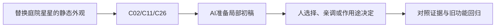

# C-02｜Blender静态资产：先会验收，再谈从零造型

> 兼容课号：B07。ABCDE是主题入口，不是必须按字母顺序完成；文件链接与题号保留稳定。

版本：Applied Curriculum v5｜2026-09-15
状态：课件正文与互动规格已编写；尚未逐课生成OpenMAIC课堂或试教。

## 1. 本课任务卡

**产出：** 为一件静态道具做尺寸、轮廓、原点和法线检查。
**前置：** B06, R02；**对应概念：** C02/C11/C26。
**预计课堂：** 20–30分钟，可在实验前后暂停；不含后续真实软件制作时间。
**M 必须掌握：**
- 区分对象变换与网格编辑，判断修正应该发生在哪里。
- 分清平滑着色与真实倒角，检查游戏距离的轮廓。
**K 理解即可：**
- 拓扑、面数、修改器是按需求使用的工具；复杂雕刻暂不学。
**停止线：** 不要求手工搭完整人物，不刷所有快捷键，不用建模速度评分。

## 2. 必要讲解：先看现象，再给术语

Object Mode改变对象在场景里的变换；Edit Mode修改对象内部几何，可能改变可见形状与原点的关系。静态道具也要留原文件，不在唯一副本上试错。

Shade Smooth改变表面着色表现，不会自动把轮廓变圆。Bevel改变边缘几何。先判断目标游戏镜头能否看见差异，再决定是否增加面。

## 2A. 这次在实际场景里解决什么

**应用位置：** P03｜替换庭院星星的静态外观；主项目中的功能、视觉或交付决定。

|开始时遇到的问题|本课期望得到的变化|
|---|---|
|素材太大、原点偏离，或高光平滑却轮廓仍生硬。|一件尺度和原点可用的道具外观，带来源记录。|

**这是目标状态对照，不是已完成截图。** 首次操作应使用匹配当前进度的最小场景；还没有配套时，只能记为课堂模拟，不能直接勾选真机应用通过。

### 概念关系示意


图中箭头表示教学流程，不是引擎节点继承。OpenMAIC不支持Mermaid时改画等价方框图，不能把代码原文冒充运行示意。

### 先让AI帮助理解，再让AI帮助工作

**学习指令：**
```text
现在只检查这道判断：只用Shade Smooth能让箱子剪影变圆吗？
先等我给预测和理由，再指出一个证据缺口；一次只给一个线索，不先公布完整答案。
我的用词不专业时，先用人话确认意思，再补对应术语。
```

**工作指令：可复制；先补实际版本与当前材料，不粘贴密钥。**
```text
我正在逐步制作同一个小型单机「星光小庭院」，不是重新生成整款游戏。
我会提供实际软件版本、当前场景/文件和必要截图；先确认你能访问哪些材料和工具。
这次只做：使用我提供且允许修改的静态基底，只做尺寸、原点和轻倒角检查。保留源副本；给平滑着色与真实倒角的对照，不要求从零重建模型。
必须保持：只操作静态对象，不对绑定角色套用同样Apply流程；不覆盖唯一源文件。
先列出将改的对象、原值和预期结果，提供最小可撤销初稿及检查步骤。
没有真实软件连接时只提供操作单/脚本，不声称已经编辑、运行或看过未提供的截图。
不要自动安装插件、联网下载素材、购买服务或读取无关文件；必要操作另说明并取得授权。
完成后报告实际做了什么、还没验证什么；我负责选择和最终验收。
```

### 哪些地方比继续发指令更适合亲自试

|入口与性质|一次只做的微调/选择|亲眼观察什么|
|---|---|---|
|Blender Item > Dimensions/Scale（内置）|与约定的参照物比较真实尺寸|不是只看Scale是否为1|
|Blender Bevel修改器（内置）|先少量调宽度，再选择必要段数|游戏距离下轮廓收益和明显变形，不追求面数|

**初值与恢复：** 先读取并记录当前值；表里的方向是对照办法，不是通用最佳参数。先在副本上操作，不覆盖基底；返回前用撤销或记录值恢复并重新预览。自定义变量不是软件内置参数。
**选择下一步：** 方向不对，补一张明确参考并圈出要借鉴的部分；结构/因果不对，让AI做局部修复；已接近目标且入口可直接操作，先亲调一项。原因不明先做对照，不靠反复重生成抽卡。

**局部修复指令：**
```text
保留本课「必须保持」的部分。我会给出同条件的当前结果和目标差异。
只围绕「一件尺度和原点可用的道具外观，带来源记录。」检查一个根因假设；先给最小验证，未经证据不要重写全部内容。
若只是一个可见参数偏差，告诉我该选哪个对象、哪个入口、怎么小幅调和恢复。
```

**本课风险检查：** 检查AI是否破坏源文件、过度细分，或把Shade Smooth说成自动圆角。
**时间边界：** 上述是需要在当前模型/工具/软件版本下验证的风险清单，不是所有AI必然失败的结论，也不预测何时会解决。长期保留的是目标、约束、参考选择、结果认可和取舍责任；测量和重复调整可以继续交给AI协助。

## 3. 界面与参数学习深度

以下是后续真机操作的对应范围，不要求本轮打开软件。模拟滑块是教学控件，不代表软件都有同名按钮。会调是指看懂作用、主动选择与恢复；会定位是知道去哪找；按需查不考菜单路径、快捷键和API记忆。
- Blender：视口导航、Outliner选择、Object/Edit Mode、Item/Dimensions。
- 会定位：Bevel修改器、面朝向、Set Origin；Apply仅在理解静态对象影响后使用。
- 按需查：倒角全部选项、重拓扑、绑定对象的变换处理。

## 4. 互动实验规格

**初始状态：** 一件有授权的简单箱子或程序生成星星；白色中性光；固定近景和游戏距离两个机位。
**可操作项：** 对象/几何演示切换、平滑开关、倒角0到0.06模型单位、近/远机位、法线示意。
**实验步骤：**
1. 用对象移动和移动全部顶点做A/B，观察原点及Transform。
2. 只开平滑看轮廓；恢复后加小倒角看轮廓和高光。
3. 切到游戏距离，选择保留的变化，填写尺寸与来源。
**预期反馈：** 把外轮廓、高光和原点分别标出；示意倒角不得只改亮度冒充几何。
**故障或反例：** 故障：模型尺寸靠极端缩放补偿，或者原点远离道具；先查来源尺度，再修静态资产。
**复位：** 还原原始副本和固定机位；不覆盖源文件。
**无图/无3D替代：** 用原创简单形状、状态卡或给定时间序列表达同一因果关系；标明“示意”，不得把预设结果说成Godot/Blender实测。不能以假按钮或不响应的截图代替交互。
**完成判据：** 对本课两项M提供操作或判断及解释；一个实验可覆盖多项。只有关键M或发现薄弱处才追加故障/变式，不为每个术语加作业。

## 5. 小结与必须牢记

- 先修大形和尺度。
- 平滑不是倒角。
- 资产要有来源和源文件。

## 6. 训练：先作答，再看反馈

P=预测，D=诊断，T=迁移，K=用途认识。下面是候选训练，不是每个词都做四次作业。课堂先用预测和一个操作，重点未达标再选D或T；延迟复测换对象，不重复抄答案。

### B07-P1
只用Shade Smooth能让箱子剪影变圆吗？

### B07-D2
想把整件道具搬走却移了全部顶点，原点没跟走，你如何判断？

### B07-T3
远处路灯不需要特写，是否仍要把每个螺丝建出来？

### B07-K4
拓扑需要现在完整学吗？

## 7. 后续真机任务（配套待做，不作为当前课堂依赖）

后续可修改给定静态基底；当前课件不用另建Blender成品工程。
即使已有参考工程，也要区分课件、运行测试、人工体验、学习掌握四种证据。按用户安排，当前先完成全部课件，之后再统一补素材、Godot/Blender起始与参考工程。

## 8. 实际应用验收：把结果放回同一个项目

**本课产物：** 一件尺度和原点可用的道具外观，带来源记录。
**接入边界：** 只操作静态对象，不对绑定角色套用同样Apply流程；不覆盖唯一源文件。

以下是要采集的证据，不是宣称已经执行。记录“未尝试 / 有提示完成 / 独立验证 / 隔次仍会”；不把这四种状态与M/K学习要求混淆。

|原有M能力|本次在哪里取证|
|---|---|
|区分对象变换与网格编辑，判断修正应该发生在哪里。|能验收尺寸、原点、朝向并指出至少一项需要修正或已正确。|
|分清平滑着色与真实倒角，检查游戏距离的轮廓。|能区分平滑与几何轮廓，给出素材来源和使用范围记录。|

**旧功能回归：** 导出副本不覆盖原始资产；后续功能仍由游戏包装负责。
**最小记录：** 一段现场演示，或同条件前后图/日志，加一句“我改了什么、为什么”。截图不足以证明运动/一次性事件时，要演示动作或查看对应状态。记录用过的提示，不要求写长报告。
**一般能力取证：** 一次有效操作/选择与解释即可；只有证据不足才补练，不强制反复考试。

**换情境的候选任务：** 把星星基底换成邮箱，按新的用途选择原点和细节。
**判定：** 普通M按原0–2锚点；有针对性根因提示记练习，换变式再验证。K只查用途，不能抵消关键M失败。没有真实操作的M只记待验证，模拟通过不能自动升级为真机通过。未选专题不阻塞主线。

**接入不等于新增系统：** 美术课可交风格卡、参数决定或改造样本；性能课可得出“不优化”。隔离实验只有对当前项目有收益才接入，不强迫庭院变成战斗、开放世界或联网游戏。

## 9. 复现与延迟检查

本课复现：B01A, B02。只复习已学的关键M。
下次课抽一个本课关键判断，换对象或数值后先独立解释。查菜单和API不扣独立判断分；被提示根因或目标值后完成，记录有提示，换变式再验。K不反复背定义。

## 10. 依据与观看入口

- [Blender官方手册：按实际版本查询工具](https://docs.blender.org/manual/en/latest/)
- [Blender glTF 2.0管线参考（4.0文档，具体新版选项另查）](https://docs.blender.org/manual/en/4.0/addons/import_export/scene_gltf2.html)

技术来源支持术语和软件边界；具体实验与课程顺序是本项目教学设计，不代表已证明学习效果。艺术家入口用于观看研习，不等于获得图片或素材再分发许可。
