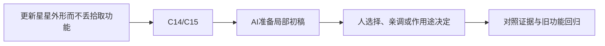

# C-05｜资产往返：源文件改了，游戏别被改坏

> 兼容课号：B09。ABCDE是主题入口，不是必须按字母顺序完成；文件链接与题号保留稳定。

版本：Applied Curriculum v5｜2026-09-15
状态：课件正文与互动规格已编写；尚未逐课生成OpenMAIC课堂或试教。

## 1. 本课任务卡

**产出：** 画出静态资产的来源、导出、导入和包装关系，并排查一次重导入问题。
**前置：** B08；**对应概念：** C14/C15。
**预计课堂：** 20–30分钟，可在实验前后暂停；不含后续真实软件制作时间。
**M 必须掌握：**
- 区分源文件、交换文件、引擎导入数据和游戏包装场景。
- 修改静态资产后检查尺寸、材质与功能是否保留。
**K 理解即可：**
- UV映射、glTF/GLB是按需理解的资源概念。
**停止线：** 不背glTF JSON，不强制复杂UV展开，不处理绑定角色的变换烘焙。

## 2. 必要讲解：先看现象，再给术语

Blender源文件是制作依据，glTF/GLB用于交换；引擎生成的导入数据不应是唯一编辑来源。游戏的碰撞、脚本和交互最好与易被重导入的视觉资产分清。

Blender中复杂节点材质并非都能无损进入引擎。先用简单可交换材质验证，再决定烘焙贴图或在引擎重建。

## 2A. 这次在实际场景里解决什么

**应用位置：** P03｜更新星星外形而不丢拾取功能；主项目中的功能、视觉或交付决定。

|开始时遇到的问题|本课期望得到的变化|
|---|---|
|源模型更新后，碰撞、脚本或手改材质被覆盖。|源资产可反复导出，游戏功能包装稳定保留。|

**这是目标状态对照，不是已完成截图。** 首次操作应使用匹配当前进度的最小场景；还没有配套时，只能记为课堂模拟，不能直接勾选真机应用通过。

### 概念关系示意


图中箭头表示教学流程，不是引擎节点继承。OpenMAIC不支持Mermaid时改画等价方框图，不能把代码原文冒充运行示意。

### 先让AI帮助理解，再让AI帮助工作

**学习指令：**
```text
现在只检查这道判断：只改引擎自动生成数据，下一次重导入一定保留吗？
先等我给预测和理由，再指出一个证据缺口；一次只给一个线索，不先公布完整答案。
我的用词不专业时，先用人话确认意思，再补对应术语。
```

**工作指令：可复制；先补实际版本与当前材料，不粘贴密钥。**
```text
我正在逐步制作同一个小型单机「星光小庭院」，不是重新生成整款游戏。
我会提供实际软件版本、当前场景/文件和必要截图；先确认你能访问哪些材料和工具。
这次只做：根据当前静态资产说明源文件、交换文件与Godot包装场景的职责。只更新视觉子资源，提供一次修改后重导入和恢复路径；不直接修改导入缓存。
必须保持：原拾取脚本、检测形状和引用结构保持；不涉及骨骼动画导入。
先列出将改的对象、原值和预期结果，提供最小可撤销初稿及检查步骤。
没有真实软件连接时只提供操作单/脚本，不声称已经编辑、运行或看过未提供的截图。
不要自动安装插件、联网下载素材、购买服务或读取无关文件；必要操作另说明并取得授权。
完成后报告实际做了什么、还没验证什么；我负责选择和最终验收。
```

### 哪些地方比继续发指令更适合亲自试

|入口与性质|一次只做的微调/选择|亲眼观察什么|
|---|---|---|
|Blender导出所选对象（入口）|核对所选静态对象与尺寸基线|是否误导出整场景或漏掉目标|
|Godot Import/包装实例（入口）|重导入后核对视觉资源引用和朝向|功能节点是否仍属于包装而非可覆盖缓存|

**初值与恢复：** 先读取并记录当前值；表里的方向是对照办法，不是通用最佳参数。先在副本上操作，不覆盖基底；返回前用撤销或记录值恢复并重新预览。自定义变量不是软件内置参数。
**选择下一步：** 方向不对，补一张明确参考并圈出要借鉴的部分；结构/因果不对，让AI做局部修复；已接近目标且入口可直接操作，先亲调一项。原因不明先做对照，不靠反复重生成抽卡。

**局部修复指令：**
```text
保留本课「必须保持」的部分。我会给出同条件的当前结果和目标差异。
只围绕「源资产可反复导出，游戏功能包装稳定保留。」检查一个根因假设；先给最小验证，未经证据不要重写全部内容。
若只是一个可见参数偏差，告诉我该选哪个对象、哪个入口、怎么小幅调和恢复。
```

**本课风险检查：** 检查AI是否在缓存文件上修复，或把不支持的复杂材质当作可原样导出。
**时间边界：** 上述是需要在当前模型/工具/软件版本下验证的风险清单，不是所有AI必然失败的结论，也不预测何时会解决。长期保留的是目标、约束、参考选择、结果认可和取舍责任；测量和重复调整可以继续交给AI协助。

## 3. 界面与参数学习深度

以下是后续真机操作的对应范围，不要求本轮打开软件。模拟滑块是教学控件，不代表软件都有同名按钮。会调是指看懂作用、主动选择与恢复；会定位是知道去哪找；按需查不考菜单路径、快捷键和API记忆。
- Blender：保存副本、选择导出；Godot：导入预览与包装场景。
- 会定位：Import面板、Reimport、导出Selected Objects。
- 按需查：具体导出扩展、动画选项、贴图烘焙。

## 4. 互动实验规格

**初始状态：** 四张可连线卡：source.blend、export.glb、imported visual、游戏包装；功能节点在包装层。
**可操作项：** 修改源颜色/几何、模拟重导入、包装/导入层放置功能、查看变化清单。
**实验步骤：**
1. 先预测重新导入会替换哪部分；给四张卡排序。
2. 修改源静态资产颜色并重导入，检查视觉更新和功能保留。
3. 把脚本错误地放在易覆盖的生成层，观察模拟重导入的差异。
**预期反馈：** 明确这是流程模拟，不声称网页实际运行Blender导出。用前后清单显示保留/变化/丢失。
**故障或反例：** 故障：重导后碰撞不见了；检查编辑归属，而不是反复重新建碰撞却不留正确来源。
**复位：** 还原四层关系和模拟资产版本；保存一次错误解释。
**无图/无3D替代：** 用原创简单形状、状态卡或给定时间序列表达同一因果关系；标明“示意”，不得把预设结果说成Godot/Blender实测。不能以假按钮或不响应的截图代替交互。
**完成判据：** 对本课两项M提供操作或判断及解释；一个实验可覆盖多项。只有关键M或发现薄弱处才追加故障/变式，不为每个术语加作业。

## 5. 小结与必须牢记

- 源文件不能丢。
- 重导入会覆盖哪里要清楚。
- Blender效果不自动等于引擎效果。

## 6. 训练：先作答，再看反馈

P=预测，D=诊断，T=迁移，K=用途认识。下面是候选训练，不是每个词都做四次作业。课堂先用预测和一个操作，重点未达标再选D或T；延迟复测换对象，不重复抄答案。

### B09-P1
只改引擎自动生成数据，下一次重导入一定保留吗？

### B09-D2
Blender好看但GLB材质缺失，先怎么查？

### B09-T3
换外观模型后如何证明原拾取功能没损坏？

### B09-K4
GLB和UV各属于哪一类概念？

## 7. 后续真机任务（配套待做，不作为当前课堂依赖）

真实静态资产往返在后续配套阶段执行；当前仅完成课堂规格与流程练习。
即使已有参考工程，也要区分课件、运行测试、人工体验、学习掌握四种证据。按用户安排，当前先完成全部课件，之后再统一补素材、Godot/Blender起始与参考工程。

## 8. 实际应用验收：把结果放回同一个项目

**本课产物：** 源资产可反复导出，游戏功能包装稳定保留。
**接入边界：** 原拾取脚本、检测形状和引用结构保持；不涉及骨骼动画导入。

以下是要采集的证据，不是宣称已经执行。记录“未尝试 / 有提示完成 / 独立验证 / 隔次仍会”；不把这四种状态与M/K学习要求混淆。

|原有M能力|本次在哪里取证|
|---|---|
|区分源文件、交换文件、引擎导入数据和游戏包装场景。|能指认源文件和生成文件，并完成一次可恢复的静态资产往返。|
|修改静态资产后检查尺寸、材质与功能是否保留。|能用重导入前后比较确认包装保留，不只说模型看起来正常。|

**旧功能回归：** 沿原路线走到对象；已经实现的检测/计数仍正常，尚未学的功能不提前要求。
**最小记录：** 一段现场演示，或同条件前后图/日志，加一句“我改了什么、为什么”。截图不足以证明运动/一次性事件时，要演示动作或查看对应状态。记录用过的提示，不要求写长报告。
**关键能力复测：** 本课高频或返工风险较高，已有有效证据可复用；薄弱处增加一个未知故障或隔次变式，不把每个词都变成一套试卷。

**换情境的候选任务：** 换围栏外观再更新，保留它原有阻挡职责。
**判定：** 普通M按原0–2锚点；有针对性根因提示记练习，换变式再验证。K只查用途，不能抵消关键M失败。没有真实操作的M只记待验证，模拟通过不能自动升级为真机通过。未选专题不阻塞主线。

**接入不等于新增系统：** 美术课可交风格卡、参数决定或改造样本；性能课可得出“不优化”。隔离实验只有对当前项目有收益才接入，不强迫庭院变成战斗、开放世界或联网游戏。

## 9. 复现与延迟检查

本课复现：B07, B08。只复习已学的关键M。
下次课抽一个本课关键判断，换对象或数值后先独立解释。查菜单和API不扣独立判断分；被提示根因或目标值后完成，记录有提示，换变式再验。K不反复背定义。

## 10. 依据与观看入口

- [Blender glTF 2.0管线参考（4.0文档，具体新版选项另查）](https://docs.blender.org/manual/en/4.0/addons/import_export/scene_gltf2.html)
- [Godot Resources：共享和引用](https://docs.godotengine.org/en/stable/tutorials/scripting/resources.html)

技术来源支持术语和软件边界；具体实验与课程顺序是本项目教学设计，不代表已证明学习效果。艺术家入口用于观看研习，不等于获得图片或素材再分发许可。
