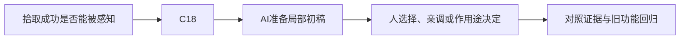

# B-06｜反馈：让玩家知道刚才成功了

> 兼容课号：B11。ABCDE是主题入口，不是必须按字母顺序完成；文件链接与题号保留稳定。

版本：Applied Curriculum v5｜2026-09-15
状态：课件正文与互动规格已编写；尚未逐课生成OpenMAIC课堂或试教。

## 1. 本课任务卡

**产出：** 设计静音也能辨认的拾取反馈，不靠过亮和大粒子堆效果。
**前置：** B10；**对应概念：** C18。
**预计课堂：** 20–30分钟，可在实验前后暂停；不含后续真实软件制作时间。
**M 必须掌握：**
- 把成功状态与视觉反馈明确对应。
- 比较反馈强度，检查不遮挡目标且静音可辨。
**K 理解即可：**
- Tween、粒子、空间音效是可选表现工具。
**停止线：** 不学整套音频工程和特效节点；不把华丽程度当评分依据。

## 2. 必要讲解：先看现象，再给术语

反馈服务于玩家识别：我碰到了吗、拿到了吗、还剩什么。稳定计数、短动效和声音可以互补；只有声音时静音玩家可能错过。

先做一项短反馈，再调持续时间和强度。持续闪烁、过强光晕或全屏效果可能遮住下一目标；偏好必须通过实际观察而不是口头说更刺激。

## 2A. 这次在实际场景里解决什么

**应用位置：** P04｜拾取成功是否能被感知；主项目中的功能、视觉或交付决定。

|开始时遇到的问题|本课期望得到的变化|
|---|---|
|星星突然消失，玩家不知道成功还是出错。|短动效或声音配合稳定视觉提示，静音时仍能判断成功。|

**这是目标状态对照，不是已完成截图。** 首次操作应使用匹配当前进度的最小场景；还没有配套时，只能记为课堂模拟，不能直接勾选真机应用通过。

### 概念关系示意


图中箭头表示教学流程，不是引擎节点继承。OpenMAIC不支持Mermaid时改画等价方框图，不能把代码原文冒充运行示意。

### 先让AI帮助理解，再让AI帮助工作

**学习指令：**
```text
现在只检查这道判断：计数没变但播放成功声，这算好反馈吗？
先等我给预测和理由，再指出一个证据缺口；一次只给一个线索，不先公布完整答案。
我的用词不专业时，先用人话确认意思，再补对应术语。
```

**工作指令：可复制；先补实际版本与当前材料，不粘贴密钥。**
```text
我正在逐步制作同一个小型单机「星光小庭院」，不是重新生成整款游戏。
我会提供实际软件版本、当前场景/文件和必要截图；先确认你能访问哪些材料和工具。
这次只做：为已经成功的拾取事件添加一种短反馈，另保留稳定视觉提示。说明反馈对象的生命周期；星星释放不应切断需要继续播放的效果。不要增加连续闪屏。
必须保持：奖励次数、检测距离和游戏状态不变，效果不能决定计数。
先列出将改的对象、原值和预期结果，提供最小可撤销初稿及检查步骤。
没有真实软件连接时只提供操作单/脚本，不声称已经编辑、运行或看过未提供的截图。
不要自动安装插件、联网下载素材、购买服务或读取无关文件；必要操作另说明并取得授权。
完成后报告实际做了什么、还没验证什么；我负责选择和最终验收。
```

### 哪些地方比继续发指令更适合亲自试

|入口与性质|一次只做的微调/选择|亲眼观察什么|
|---|---|---|
|反馈时长（项目自定义）|先短再稍长，固定位置和其他强度|是否可察觉、是否挡住下一目标|
|声音音量/静音与视觉提示（内置/入口）|先静音走一次，再调合适音量|没有声音是否还能判断；不以音量越大越好|

**初值与恢复：** 先读取并记录当前值；表里的方向是对照办法，不是通用最佳参数。先在副本上操作，不覆盖基底；返回前用撤销或记录值恢复并重新预览。自定义变量不是软件内置参数。
**选择下一步：** 方向不对，补一张明确参考并圈出要借鉴的部分；结构/因果不对，让AI做局部修复；已接近目标且入口可直接操作，先亲调一项。原因不明先做对照，不靠反复重生成抽卡。

**局部修复指令：**
```text
保留本课「必须保持」的部分。我会给出同条件的当前结果和目标差异。
只围绕「短动效或声音配合稳定视觉提示，静音时仍能判断成功。」检查一个根因假设；先给最小验证，未经证据不要重写全部内容。
若只是一个可见参数偏差，告诉我该选哪个对象、哪个入口、怎么小幅调和恢复。
```

**本课风险检查：** 检查AI是否把反馈加入每帧逻辑、用高强度闪烁，或随星星释放提前结束声音。
**时间边界：** 上述是需要在当前模型/工具/软件版本下验证的风险清单，不是所有AI必然失败的结论，也不预测何时会解决。长期保留的是目标、约束、参考选择、结果认可和取舍责任；测量和重复调整可以继续交给AI协助。

## 3. 界面与参数学习深度

以下是后续真机操作的对应范围，不要求本轮打开软件。模拟滑块是教学控件，不代表软件都有同名按钮。会调是指看懂作用、主动选择与恢复；会定位是知道去哪找；按需查不考菜单路径、快捷键和API记忆。
- Godot：动画时长、透明度/缩放等暴露参数、音量。
- 会定位：AnimationPlayer/Tween入口、Audio Bus。
- 按需查：粒子材质、空间衰减与混音技术。

## 4. 互动实验规格

**初始状态：** 已有计数的拾取场景示意；一颗星；视觉提示持续0.3秒；声音默认关闭。
**可操作项：** 提示开关、持续0.1到0.8秒、强度低/中/高、静音、减少动态效果。
**实验步骤：**
1. 先预测只靠声音时静音会漏掉什么。
2. 保持计数不变，比较三档反馈强度，指出遮挡。
3. 低动态模式下用稳定图标和文字继续表达成功。
**预期反馈：** 反馈必须由成功事件触发；失败接触不得播放成功效果。提供无音频替代而非自动播放声音。
**故障或反例：** 故障：错误对象碰星也显示成功；修触发条件，不能仅换颜色掩盖。
**复位：** 清空短效果、恢复未拾取状态、保留用户静音设置。
**无图/无3D替代：** 用原创简单形状、状态卡或给定时间序列表达同一因果关系；标明“示意”，不得把预设结果说成Godot/Blender实测。不能以假按钮或不响应的截图代替交互。
**完成判据：** 对本课两项M提供操作或判断及解释；一个实验可覆盖多项。只有关键M或发现薄弱处才追加故障/变式，不为每个术语加作业。

## 5. 小结与必须牢记

- 反馈要对应真实成功。
- 静音也能辨认。
- 少量清楚胜过大量遮挡。

## 6. 训练：先作答，再看反馈

P=预测，D=诊断，T=迁移，K=用途认识。下面是候选训练，不是每个词都做四次作业。课堂先用预测和一个操作，重点未达标再选D或T；延迟复测换对象，不重复抄答案。

### B11-P1
计数没变但播放成功声，这算好反馈吗？

### B11-D2
粒子遮住下个目标，优先怎么改？

### B11-T3
无声环境中如何保留拾取信息？

### B11-K4
Tween适合什么？

## 7. 后续真机任务（配套待做，不作为当前课堂依赖）

后续只实现一种反馈即可，不强制音效和粒子全做。
即使已有参考工程，也要区分课件、运行测试、人工体验、学习掌握四种证据。按用户安排，当前先完成全部课件，之后再统一补素材、Godot/Blender起始与参考工程。

## 8. 实际应用验收：把结果放回同一个项目

**本课产物：** 短动效或声音配合稳定视觉提示，静音时仍能判断成功。
**接入边界：** 奖励次数、检测距离和游戏状态不变，效果不能决定计数。

以下是要采集的证据，不是宣称已经执行。记录“未尝试 / 有提示完成 / 独立验证 / 隔次仍会”；不把这四种状态与M/K学习要求混淆。

|原有M能力|本次在哪里取证|
|---|---|
|把成功状态与视觉反馈明确对应。|能选择与事件相符的反馈并现场比较强弱。|
|比较反馈强度，检查不遮挡目标且静音可辨。|能在静音或较弱对比条件下说明成功仍可识别的证据。|

**旧功能回归：** 一次拾取只加一次；连拾两颗不会长时间遮挡界面。
**最小记录：** 一段现场演示，或同条件前后图/日志，加一句“我改了什么、为什么”。截图不足以证明运动/一次性事件时，要演示动作或查看对应状态。记录用过的提示，不要求写长报告。
**一般能力取证：** 一次有效操作/选择与解释即可；只有证据不足才补练，不强制反复考试。

**换情境的候选任务：** 给开门成功设计不同反馈，避免与拾取提示混淆。
**判定：** 普通M按原0–2锚点；有针对性根因提示记练习，换变式再验证。K只查用途，不能抵消关键M失败。没有真实操作的M只记待验证，模拟通过不能自动升级为真机通过。未选专题不阻塞主线。

**接入不等于新增系统：** 美术课可交风格卡、参数决定或改造样本；性能课可得出“不优化”。隔离实验只有对当前项目有收益才接入，不强迫庭院变成战斗、开放世界或联网游戏。

## 9. 复现与延迟检查

本课复现：B10, R03。只复习已学的关键M。
下次课抽一个本课关键判断，换对象或数值后先独立解释。查菜单和API不扣独立判断分；被提示根因或目标值后完成，记录有提示，换变式再验。K不反复背定义。

## 10. 依据与观看入口

- [Godot AnimationTree：动画组织](https://docs.godotengine.org/en/stable/tutorials/animation/animation_tree.html)

技术来源支持术语和软件边界；具体实验与课程顺序是本项目教学设计，不代表已证明学习效果。艺术家入口用于观看研习，不等于获得图片或素材再分发许可。
