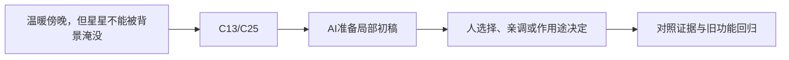

# B-08｜柔和光照：先让目标被看见

> 兼容课号：B13。ABCDE是主题入口，不是必须按字母顺序完成；文件链接与题号保留稳定。

版本：Applied Curriculum v5｜2026-09-15
状态：课件正文与互动规格已编写；尚未逐课生成OpenMAIC课堂或试教。

## 1. 本课任务卡

**产出：** 在同一机位做两版光照，说明哪版更符合温暖卡通目标。
**前置：** B12, R03；**对应概念：** C13/C25。
**预计课堂：** 20–30分钟，可在实验前后暂停；不含后续真实软件制作时间。
**M 必须掌握：**
- 区分主光、环境与阴影，一次只调一项。
- 用主体可辨性而非越亮越好来验收。
**K 理解即可：**
- 曝光、色调映射、GI与烘焙解决不同问题。
**停止线：** 不要求全部GI方案，不把Blender最终渲染等同于游戏效果。

## 2. 必要讲解：先看现象，再给术语

主光帮助读体积，环境影响暗部，阴影帮助读接触关系。全局提亮可能让背景和角色一起失去层次，不等于解决主体不清楚。

卡通或绘本可以有柔和暖色，但可玩目标仍须从背景中区分。用同机位同材质对照，才能知道光照修改带来的作用。

## 2A. 这次在实际场景里解决什么

**应用位置：** P05｜温暖傍晚，但星星不能被背景淹没；主项目中的功能、视觉或交付决定。

|开始时遇到的问题|本课期望得到的变化|
|---|---|
|有氛围却看不清路线，或全场增亮导致主次消失。|柔和主光下路线可读，目标与背景有足够区分。|

**这是目标状态对照，不是已完成截图。** 首次操作应使用匹配当前进度的最小场景；还没有配套时，只能记为课堂模拟，不能直接勾选真机应用通过。

### 概念关系示意


图中箭头表示教学流程，不是引擎节点继承。OpenMAIC不支持Mermaid时改画等价方框图，不能把代码原文冒充运行示意。

### 先让AI帮助理解，再让AI帮助工作

**学习指令：**
```text
现在只检查这道判断：提高所有灯亮度一定更易看见角色吗？
先等我给预测和理由，再指出一个证据缺口；一次只给一个线索，不先公布完整答案。
我的用词不专业时，先用人话确认意思，再补对应术语。
```

**工作指令：可复制；先补实际版本与当前材料，不粘贴密钥。**
```text
我正在逐步制作同一个小型单机「星光小庭院」，不是重新生成整款游戏。
我会提供实际软件版本、当前场景/文件和必要截图；先确认你能访问哪些材料和工具。
这次只做：按我提供的当前图与参考图，只借鉴暖主光、柔和暗部和主体层次。先给一个光照初稿，记录实际渲染器；只改主光/环境/阴影，不改玩家和玩法。固定机位给原值和回退办法。
必须保持：相机FOV、曝光基线、材质、碰撞、拾取和UI保持；需要改它们时先说明原因。
先列出将改的对象、原值和预期结果，提供最小可撤销初稿及检查步骤。
没有真实软件连接时只提供操作单/脚本，不声称已经编辑、运行或看过未提供的截图。
不要自动安装插件、联网下载素材、购买服务或读取无关文件；必要操作另说明并取得授权。
完成后报告实际做了什么、还没验证什么；我负责选择和最终验收。
```

### 哪些地方比继续发指令更适合亲自试

|入口与性质|一次只做的微调/选择|亲眼观察什么|
|---|---|---|
|DirectionalLight3D > Energy/light_energy（内置）|先从记录原值小幅增减，其他项不动|星星、路线与暗角，而不是全图越亮越好|
|光源Rotation（内置）|固定能量，只改入射方向|是否更能读出门框、平台边缘和主体轮廓|

**初值与恢复：** 先读取并记录当前值；表里的方向是对照办法，不是通用最佳参数。先在副本上操作，不覆盖基底；返回前用撤销或记录值恢复并重新预览。自定义变量不是软件内置参数。
**选择下一步：** 方向不对，补一张明确参考并圈出要借鉴的部分；结构/因果不对，让AI做局部修复；已接近目标且入口可直接操作，先亲调一项。原因不明先做对照，不靠反复重生成抽卡。

**局部修复指令：**
```text
保留本课「必须保持」的部分。我会给出同条件的当前结果和目标差异。
只围绕「柔和主光下路线可读，目标与背景有足够区分。」检查一个根因假设；先给最小验证，未经证据不要重写全部内容。
若只是一个可见参数偏差，告诉我该选哪个对象、哪个入口、怎么小幅调和恢复。
```

**本课风险检查：** 检查AI是否通过曝光或全部Emission补偿、未经确认切换渲染器，或声称参考图参数能一比一还原。
**时间边界：** 上述是需要在当前模型/工具/软件版本下验证的风险清单，不是所有AI必然失败的结论，也不预测何时会解决。长期保留的是目标、约束、参考选择、结果认可和取舍责任；测量和重复调整可以继续交给AI协助。

## 3. 界面与参数学习深度

以下是后续真机操作的对应范围，不要求本轮打开软件。模拟滑块是教学控件，不代表软件都有同名按钮。会调是指看懂作用、主动选择与恢复；会定位是知道去哪找；按需查不考菜单路径、快捷键和API记忆。
- Godot：DirectionalLight3D能量/方向、WorldEnvironment基本环境、阴影。
- 会定位：渲染器名称、曝光和色调映射。
- 按需查：GI类型、反射探针、烘焙参数。

## 4. 互动实验规格

**初始状态：** 小屋、角色与星星；固定材质、相机和渲染模式；一盏方向光及环境填充。
**可操作项：** 主光能量0.5到2、方向两档、环境弱/中、阴影开关；曝光作为观察项不强制操作。
**实验步骤：**
1. 先指出第一眼看到什么，再选一项目标：更柔和或更清晰。
2. 只改光方向观察体积；恢复后只改环境观察暗部。
3. 切到简化灰度对比，检查星星与背景是否仍区分。
**预期反馈：** A/B同机位切换，记录光参数；灰度只是明暗检查手段，不自动判审美。
**故障或反例：** 故障：为照亮角色把所有灯都加亮，目标融入背景；要求局部与对比方案，不无脑加灯。
**复位：** 恢复材质、灯光、环境与机位；保留选定风格目标。
**无图/无3D替代：** 用原创简单形状、状态卡或给定时间序列表达同一因果关系；标明“示意”，不得把预设结果说成Godot/Blender实测。不能以假按钮或不响应的截图代替交互。
**完成判据：** 对本课两项M提供操作或判断及解释；一个实验可覆盖多项。只有关键M或发现薄弱处才追加故障/变式，不为每个术语加作业。

## 5. 小结与必须牢记

- 先辨主体，再加气氛。
- 同机位做A/B。
- 发亮与照明分别验收。

## 6. 训练：先作答，再看反馈

P=预测，D=诊断，T=迁移，K=用途认识。下面是候选训练，不是每个词都做四次作业。课堂先用预测和一个操作，重点未达标再选D或T；延迟复测换对象，不重复抄答案。

### B13-P1
提高所有灯亮度一定更易看见角色吗？

### B13-D2
改灯后不知道什么使画面更好，怎样重做实验？

### B13-T3
温暖黄昏场景中黄色星星融入背景，怎样保留风格又能识别？

### B13-K4
烘焙与实时光照为什么要区分？

## 7. 后续真机任务（配套待做，不作为当前课堂依赖）

后续Godot中人工检查；网页模拟不承诺渲染器功能完全一致。
即使已有参考工程，也要区分课件、运行测试、人工体验、学习掌握四种证据。按用户安排，当前先完成全部课件，之后再统一补素材、Godot/Blender起始与参考工程。

## 8. 实际应用验收：把结果放回同一个项目

**本课产物：** 柔和主光下路线可读，目标与背景有足够区分。
**接入边界：** 相机FOV、曝光基线、材质、碰撞、拾取和UI保持；需要改它们时先说明原因。

以下是要采集的证据，不是宣称已经执行。记录“未尝试 / 有提示完成 / 独立验证 / 隔次仍会”；不把这四种状态与M/K学习要求混淆。

|原有M能力|本次在哪里取证|
|---|---|
|区分主光、环境与阴影，一次只调一项。|能用同机位A/B说明改的是光还是材质。|
|用主体可辨性而非越亮越好来验收。|能沿实际路线验证目标可辨，并说明氛围与可读性的取舍。|

**旧功能回归：** 收集、完成、重开、镜头都正常；有性能基线后再复测相同路线。
**最小记录：** 一段现场演示，或同条件前后图/日志，加一句“我改了什么、为什么”。截图不足以证明运动/一次性事件时，要演示动作或查看对应状态。记录用过的提示，不要求写长报告。
**一般能力取证：** 一次有效操作/选择与解释即可；只有证据不足才补练，不强制反复考试。

**换情境的候选任务：** 把星星放到另一个阴影角落，不全场加光，而先定位影响来源。
**判定：** 普通M按原0–2锚点；有针对性根因提示记练习，换变式再验证。K只查用途，不能抵消关键M失败。没有真实操作的M只记待验证，模拟通过不能自动升级为真机通过。未选专题不阻塞主线。

**接入不等于新增系统：** 美术课可交风格卡、参数决定或改造样本；性能课可得出“不优化”。隔离实验只有对当前项目有收益才接入，不强迫庭院变成战斗、开放世界或联网游戏。

## 9. 复现与延迟检查

本课复现：B08, R03。只复习已学的关键M。
下次课抽一个本课关键判断，换对象或数值后先独立解释。查菜单和API不扣独立判断分；被提示根因或目标值后完成，记录有提示，换变式再验。K不反复背定义。

## 10. 依据与观看入口

- [Blender Principled BSDF：当前手册入口](https://docs.blender.org/manual/en/latest/render/shader_nodes/shader/principled.html)
- [Godot General optimization：测量与取舍](https://docs.godotengine.org/en/stable/tutorials/performance/general_optimization.html)

技术来源支持术语和软件边界；具体实验与课程顺序是本项目教学设计，不代表已证明学习效果。艺术家入口用于观看研习，不等于获得图片或素材再分发许可。
