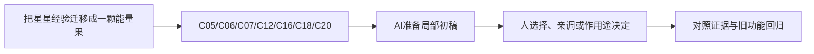

# B-10｜初级结业：把星星换成另一种可用物品

> 兼容课号：B16。ABCDE是主题入口，不是必须按字母顺序完成；文件链接与题号保留稳定。

版本：Applied Curriculum v5｜2026-09-15
状态：课件正文与互动规格已编写；尚未逐课生成OpenMAIC课堂或试教。

## 1. 本课任务卡

**产出：** 用已学知识完成一种新拾取物，并证明关键条件没有被破坏。
**前置：** B15；**对应概念：** C05/C06/C07/C12/C16/C18/C20。
**预计课堂：** 20–30分钟，可在实验前后暂停；不含后续真实软件制作时间。
**M 必须掌握：**
- 迁移外观、检测、一次性状态和反馈。
- 对AI修改做功能回归并解释结果。
**K 理解即可：**
- 只抽本阶段已经介绍的用途词，不增加新术语。
**停止线：** 不突然加入敌人、背包、绑定、多人；不要求做完整跨阶段题库。

## 2. 必要讲解：先看现象，再给术语

迁移不是逐步抄原星星：新道具可能更小、颜色更接近背景，检测与反馈要随用途核对。实现可以由AI完成，选择、预测和验收由学员承担。

提交最少证据：需求一句、改动范围、一次正常测试、一次关键异常、一个次日变式。不会某项就补对应实验，不重看全部课程。

## 2A. 这次在实际场景里解决什么

**应用位置：** P05｜把星星经验迁移成一颗能量果；主项目中的功能、视觉或交付决定。

|开始时遇到的问题|本课期望得到的变化|
|---|---|
|能照着做星星，但换外观和奖励就不知道改哪里。|同庭院出现一种新拾取物，原星星循环保持，修改职责清楚。|

**这是目标状态对照，不是已完成截图。** 首次操作应使用匹配当前进度的最小场景；还没有配套时，只能记为课堂模拟，不能直接勾选真机应用通过。

### 概念关系示意


图中箭头表示教学流程，不是引擎节点继承。OpenMAIC不支持Mermaid时改画等价方框图，不能把代码原文冒充运行示意。

### 先让AI帮助理解，再让AI帮助工作

**学习指令：**
```text
现在只检查这道判断：只换颜色就一定成为合格新拾取物吗？
先等我给预测和理由，再指出一个证据缺口；一次只给一个线索，不先公布完整答案。
我的用词不专业时，先用人话确认意思，再补对应术语。
```

**工作指令：可复制；先补实际版本与当前材料，不粘贴密钥。**
```text
我正在逐步制作同一个小型单机「星光小庭院」，不是重新生成整款游戏。
我会提供实际软件版本、当前场景/文件和必要截图；先确认你能访问哪些材料和工具。
这次只做：协助复用已有拾取结构，只新增一种能量果外观和奖励状态。先等我给出需要改与保持的部分，再给最小实现；不要扩成背包、任务树或战斗系统。
必须保持：原星星计数、完成条件、重开、移动和镜头保持。
先列出将改的对象、原值和预期结果，提供最小可撤销初稿及检查步骤。
没有真实软件连接时只提供操作单/脚本，不声称已经编辑、运行或看过未提供的截图。
不要自动安装插件、联网下载素材、购买服务或读取无关文件；必要操作另说明并取得授权。
完成后报告实际做了什么、还没验证什么；我负责选择和最终验收。
```

### 哪些地方比继续发指令更适合亲自试

|入口与性质|一次只做的微调/选择|亲眼观察什么|
|---|---|---|
|新物品视觉材质与尺寸（内置）|固定机位调整可辨性|与星星是否分得清，实际尺寸是否合理|
|检测形状与奖励值（内置/自定义）|分别调范围和奖励，不同时改|一次触发范围及能量变化是否符合目标|

**初值与恢复：** 先读取并记录当前值；表里的方向是对照办法，不是通用最佳参数。先在副本上操作，不覆盖基底；返回前用撤销或记录值恢复并重新预览。自定义变量不是软件内置参数。
**选择下一步：** 方向不对，补一张明确参考并圈出要借鉴的部分；结构/因果不对，让AI做局部修复；已接近目标且入口可直接操作，先亲调一项。原因不明先做对照，不靠反复重生成抽卡。

**局部修复指令：**
```text
保留本课「必须保持」的部分。我会给出同条件的当前结果和目标差异。
只围绕「同庭院出现一种新拾取物，原星星循环保持，修改职责清楚。」检查一个根因假设；先给最小验证，未经证据不要重写全部内容。
若只是一个可见参数偏差，告诉我该选哪个对象、哪个入口、怎么小幅调和恢复。
```

**本课风险检查：** 检查AI是否直接替换全部星星需求，或用两个显示计数掩盖状态耦合。
**时间边界：** 上述是需要在当前模型/工具/软件版本下验证的风险清单，不是所有AI必然失败的结论，也不预测何时会解决。长期保留的是目标、约束、参考选择、结果认可和取舍责任；测量和重复调整可以继续交给AI协助。

## 3. 界面与参数学习深度

以下是后续真机操作的对应范围，不要求本轮打开软件。模拟滑块是教学控件，不代表软件都有同名按钮。会调是指看懂作用、主动选择与恢复；会定位是知道去哪找；按需查不考菜单路径、快捷键和API记忆。
- 复用初级已学的Inspector、场景树、材质和检测参数。
- 会定位：日志与版本差异。
- 按需查：语法、菜单路径，不增加新工具。

## 4. 互动实验规格

**初始状态：** 可选果实/能量球两张需求卡，已存在检测和计数流程；不预先给目标参数。
**可操作项：** 选择外观尺寸、材质、检测范围和反馈；测试正确/错误对象、重复/重开。
**实验步骤：**
1. 先写新物品与星星有哪些相同、不同时。
2. 限定AI只改必要对象，学员自己选参数并测试。
3. 抽一个未见故障，然后换另一种大小或颜色复测。
**预期反馈：** 按功能证据判定，不按美术复杂度或代码数量。缺证据时标待验证。
**故障或反例：** 随机一个故障：Mask、共享材质或未重置；不得同时塞三个让学员猜。
**复位：** 恢复原星星版本，保留新方案为独立练习副本。
**无图/无3D替代：** 用原创简单形状、状态卡或给定时间序列表达同一因果关系；标明“示意”，不得把预设结果说成Godot/Blender实测。不能以假按钮或不响应的截图代替交互。
**完成判据：** 对本课两项M提供操作或判断及解释；一个实验可覆盖多项。只有关键M或发现薄弱处才追加故障/变式，不为每个术语加作业。

## 5. 小结与必须牢记

- 换对象仍会用才算迁移。
- 只补失败的关键能力。
- 代码可外包，验收不能。

## 6. 训练：先作答，再看反馈

P=预测，D=诊断，T=迁移，K=用途认识。下面是候选训练，不是每个词都做四次作业。课堂先用预测和一个操作，重点未达标再选D或T；延迟复测换对象，不重复抄答案。

### B16-P1
只换颜色就一定成为合格新拾取物吗？

### B16-D2
重开后新物品不出现，怎样缩小问题？

### B16-T3
换成更小果实但保持容易拾取，怎样取舍？

### B16-K4
本阶段哪些实现可以交AI？

## 7. 后续真机任务（配套待做，不作为当前课堂依赖）

完整游戏工程的实操验收稍后开展；此处是结业课堂与评价设计，不宣称已有学习者通过。
即使已有参考工程，也要区分课件、运行测试、人工体验、学习掌握四种证据。按用户安排，当前先完成全部课件，之后再统一补素材、Godot/Blender起始与参考工程。

## 8. 实际应用验收：把结果放回同一个项目

**本课产物：** 同庭院出现一种新拾取物，原星星循环保持，修改职责清楚。
**接入边界：** 原星星计数、完成条件、重开、移动和镜头保持。

以下是要采集的证据，不是宣称已经执行。记录“未尝试 / 有提示完成 / 独立验证 / 隔次仍会”；不把这四种状态与M/K学习要求混淆。

|原有M能力|本次在哪里取证|
|---|---|
|迁移外观、检测、一次性状态和反馈。|能独立决定外观、检测、状态和反馈各改哪层。|
|对AI修改做功能回归并解释结果。|能提供新物品一次性行为与旧星星循环回归的证据。|

**旧功能回归：** 收齐原星星并重开；重复碰新物品不重复奖励。
**最小记录：** 一段现场演示，或同条件前后图/日志，加一句“我改了什么、为什么”。截图不足以证明运动/一次性事件时，要演示动作或查看对应状态。记录用过的提示，不要求写长报告。
**关键能力复测：** 本课高频或返工风险较高，已有有效证据可复用；薄弱处增加一个未知故障或隔次变式，不把每个词都变成一套试卷。

**换情境的候选任务：** 隔次换成另一种不改变完成条件的收集物，只抽一个关键判断再验。
**判定：** 普通M按原0–2锚点；有针对性根因提示记练习，换变式再验证。K只查用途，不能抵消关键M失败。没有真实操作的M只记待验证，模拟通过不能自动升级为真机通过。未选专题不阻塞主线。

**接入不等于新增系统：** 美术课可交风格卡、参数决定或改造样本；性能课可得出“不优化”。隔离实验只有对当前项目有收益才接入，不强迫庭院变成战斗、开放世界或联网游戏。

## 9. 复现与延迟检查

本课复现：B04, B08, B10, B15。只复习已学的关键M。
下次课抽一个本课关键判断，换对象或数值后先独立解释。查菜单和API不扣独立判断分；被提示根因或目标值后完成，记录有提示，换变式再验。K不反复背定义。

## 10. 依据与观看入口

- [Godot Area3D：重叠检测与信号](https://docs.godotengine.org/en/stable/classes/class_area3d.html)
- [Godot Resources：共享和引用](https://docs.godotengine.org/en/stable/tutorials/scripting/resources.html)
- [Godot General optimization：测量与取舍](https://docs.godotengine.org/en/stable/tutorials/performance/general_optimization.html)

技术来源支持术语和软件边界；具体实验与课程顺序是本项目教学设计，不代表已证明学习效果。艺术家入口用于观看研习，不等于获得图片或素材再分发许可。
