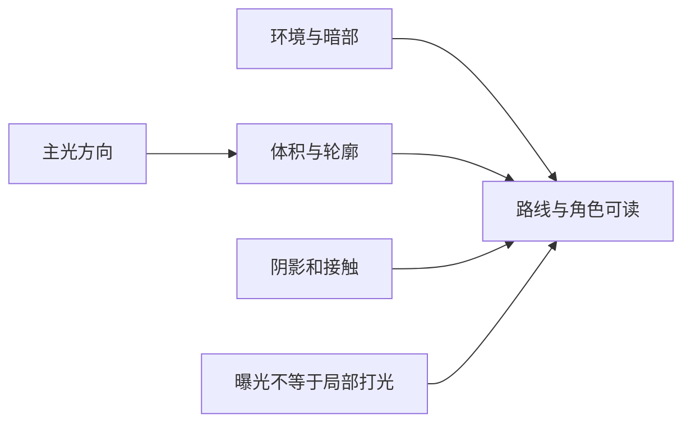

# C08｜风格化光照方案：效果必须能进游戏

版本：统一课号课程版｜2026-09-15
状态：课件正文与互动规格已编写；尚未逐课生成OpenMAIC课堂或试教。

**学习分组：** C组；**本课编号：** C08；**路线：** 主线。

## 0. 开始前：只准备本课需要的东西

**本次起点：** 真实目标设备/渲染器、一个静态样本及会移动的对象；不强制两个候选方案都已实现。
**缺材料时：** 先用课内模拟辨清概念。缺起始场景时仅准备最小搭建清单；不要让新手为了上本课先生成整款游戏，真机应用保持待验证。
**当前配套：** 本课起始包尚未由这一轮交付；不要把下方目标、代码建议或示意看成已经存在的工程。

**今天的最小任务：** 在两种照明方案中选一个适合动态角色和目标设备的方案。
**怎样读：** 先看两项M和概念图，再复制对话1。启动框已带首步、继续条件和结束证据；之后用自己的话回复即可，不必把六框逐一重发。
**怎样停：** 完成当前小步可以暂停，记录下次起点；只有本课两项M都有相应证据才标本课应用通过。暂停不是失败，模拟完成不是软件通过。
**先学再验：** 初次允许AI示范一小步，你再换一个值/对象作选择；需要检查独立判断时换未讲过的变式，不要求从零手写代码。

## 1. 本课任务卡

**产出：** 在两种照明方案中选一个适合动态角色和目标设备的方案。
**前置：** C07, B09；**对应概念：** KN25。
**预计课堂：** 20–30分钟，可在实验前后暂停；不含后续真实软件制作时间。
**M 必须掌握：**
- 比较方案的表现、动态支持和成本。
- 核对Blender展示与Godot实际渲染的差异。
**K 理解即可：**
- Lightmap/GI/反射探针知道用途即可。
- Tonemapping/Exposure、Color Adjustments、Glow、Fog、SSAO、DOF与自定义后处理知道各自解决什么；先核对渲染器支持，不要求全开。
**停止线：** 不要求搭建所有GI技术，不学习光传输推导。

## 1A. 必学内容、实操与题目如何对应

M1/M2只是本课任务卡的两项能力序号，不是新的技术概念。查菜单/API不扣独立判断分。

|必须掌握到这里|本课实操题：做什么算有证据|可选配套题|
|---|---|---|
|M1：比较方案的表现、动态支持和成本。|说明选择方案的表现、动态限制和实际成本证据。|C08-P1, C08-D2, C08-T3|
|M2：核对Blender展示与Godot实际渲染的差异。|角色跨亮暗区及移动对象实测，并分类Blender/Godot观感差异。|C08-T3|

**最低学习路径：** 一次预测 → 一个能覆盖上述两项M的小实验/项目改动 → 一次结果解释。普通M做到即可；关键薄弱处再选一题诊断或隔次迁移，不把P/D/T全套加到每个术语上。
**理解即可与停止线：** 任务卡中的K只检用途；按需查的界面、API、高级实现不进入本课操作门槛。只有已学且已存在的项目功能需要回归。

## 2. 必要讲解：先看现象，再给术语

展示渲染和实时游戏的约束不同。静态背景可采用的光照方法不必同样适用于移动角色。

选择一种最简单可行方案，固定相机与材质比较。缺阴影、色彩管理或环境不同都可能改变观感，不该用无穷加灯掩盖。

固定视角风格化游戏常见的“先试低成本、再按需加”渲染工具：①Tonemapping/Exposure控制整体亮度与高光压缩；②Color Adjustments或LUT思路统一色调；③Glow/Bloom让星星、魔法和灯有柔和光晕；④Fog/高度雾分离前中后景；⑤SSAO/接触阴影帮助物体贴地；⑥DOF在微缩/静态构图中突出焦点；⑦描边/Rim Light增强卡通轮廓；⑧粒子、Trail和局部Emission负责事件效果。不要一次全开，先按“画面问题→一种工具→同机位对照”验证。

渲染器能力不同：Fog、Tonemapping、Glow和颜色调整较普遍；Volumetric Fog、SSR、SSIL等更依赖具体渲染器，SSAO也并非所有目标都支持。课程因此不把某个高级效果当必修；先确定目标设备与渲染器，再让AI核对当前版本支持并提供可回退方案。屏幕空间效果还会受“画面外/被遮挡信息不可见”等限制，不能只凭一张截图判断稳定。

对本项目推荐的优先顺序是：先相机与构图→主光/环境→色盘/材质→Tonemapping/Exposure→少量Glow/Fog→需要时再试AO、DOF、描边或自定义后处理。漂亮不是“特效越多”，而是焦点、层次、配色和玩法可读性一起成立。

## 2A. 场景、概念图与逐步AI对话

**实际位置：** P06｜美术预览很美，进入可玩庭院却不一致。

|操作前的问题|本课希望得到的结果|
|---|---|
|采用了不适合目标设备或动态角色的照明方案。|选择一个可实现的光照方案，明确静态和动态对象的限制。|

这是目标对照，不是已完成的游戏截图。概念图为职责/因果示意，不是继承图或完整运行证明。

OpenMAIC不能渲染Mermaid时画等价方框图；无3D或真实连接时仅标课堂模拟，不伪造软件运行。

### 本课人和AI分别负责什么

|责任|这课具体做什么|
|---|---|
|我必须作出的判断|从实际动态角色和目标设备需求选择一种可行方案，不追最复杂GI。|
|可以交给AI的制作|核对所用版本/渲染器支持，准备同条件最小静态与动态样本。|
|我检查AI交付物|看修改对象/前后差异、实际执行记录及未验证项；先核对是否保留本课约束，再决定是否接入。|

**不是手工熟练考试：** 重复劳动与代码可委托；常用可见参数适合亲调时先调一项，无障碍需要可由AI按已选值执行。必须能说明选择、观察和恢复，不要求机械地拖每个滑杆。

**两种模式：** 练习时可问根因、看示范；独立验收时先由我提出选择/假设，AI只协助执行与记录。已透露本题根因或目标值，就记录“有提示”，再换未揭示答案的变式。

### 复制第1框开始；以后每次只发当前一步

**学员用法：** 无需一次读完所有提示。将当前框发给你使用的AI；做完后回“完成＋观察”，结果不符回“不符＋现象”，报错回“报错＋原文”，需要停下回“暂停”。自然语言也可以。不要一口气把六步当成自动执行授权。

### 对话1｜建立本课上下文

```text
请做我这节课的协作教练：C08《风格化光照方案：效果必须能进游戏》。
我们逐步制作同一个「星光小庭院」，当前只解决：采用了不适合目标设备或动态角色的照明方案。
目标：选择一个可实现的光照方案，明确静态和动态对象的限制。
必须掌握：比较方案的表现、动态支持和成本；核对Blender展示与Godot实际渲染的差异。理解即可：Lightmap/GI/反射探针知道用途即可；Tonemapping/Exposure、Color Adjustments、Glow、Fog、SSAO、DOF与自定义后处理知道各自解决什么；先核对渲染器支持，不要求全开
停止线：不要求搭建所有GI技术，不学习光传输推导。
必须保持：同机位、同资产、同路线，比较时不偷偷改曝光与材质。
本课由我负责：从实际动态角色和目标设备需求选择一种可行方案，不追最复杂GI。
可以交给你：核对所用版本/渲染器支持，准备同条件最小静态与动态样本。
请标明建议/已执行/已验证的区别。练习可提示；验收先等我作判断，已提示根因则如实记有提示。
先读取我已提供的进度和材料，只问真正缺失的一项。需要软件操作时核对实际版本、当前截图或场景树、可访问的工具；不要求我发密钥或整个电脑。
本课入场材料：真实目标设备/渲染器、一个静态样本及会移动的对象；不强制两个候选方案都已实现。
材料不足的处理：先用课内模拟辨清概念。缺起始场景时仅准备最小搭建清单；不要让新手为了上本课先生成整款游戏，真机应用保持待验证。
以下是本课连续推进卡，不是一次性执行授权；收到我的观察后每轮最多推进一个有意义的小步。
首步：先明确动态对象与目标设备，用同一场景列两种可行光照方案，不把所有GI都打开。
继续条件：能说明选定方案的适用条件及待测试成本。
随后一步：只实现一个最小对照区域，检查角色经过明暗区域的表现和旧功能。
结束证据：说明选择方案的表现、动态限制和实际成本证据。；角色跨亮暗区及移动对象实测，并分类Blender/Godot观感差异。
相关回归：移动角色经过暗区、门开启、物品拾取时表现合理，旧玩法仍通过。
这些是待执行要求，不是我的已完成进度。不要凭课号推断前置已通过；只复用我已提供的实际材料和证据。
对话1之后我可直接回复完成/不符/报错/暂停，无需重贴整课；你应沿这张推进卡继续，不临时增加系统。
先给一个预测问题并等我回答，再给一个最小步骤。不跳课、不自动做整款游戏。能执行才说已执行，否则给明确操作单或脚本，并标未执行。
后续每轮用四项回应：现在是哪一步；只改什么/怎样恢复；我应观察什么；目前还缺什么证据。没有证据不要替我勾通过。
```

**AI此时应做：** 确认当前场景与学习范围，不直接输出几十个文件。已经提供过的版本、素材和约束应复用，不重复问。

### 对话2｜先理解一个因果关系

```text
先问我：背景看起来完美能说明移动角色也合适吗？
等我写预测和理由后，再指出一个证据缺口，只给一个提示，不先公布完整答案。用词不专业时先确认意思，再补术语。
```

**转入下一步：** 有自己的预测即可；预测错可以用实验纠正，不要求先背定义。

### 对话3｜AI只完成第一小步

```text
沿用已确认的版本、材料和修改边界。现在只做：先明确动态对象与目标设备，用同一场景列两种可行光照方案，不把所有GI都打开。
先列影响对象和原值，再提供一个可撤销初稿。没有实际软件连接时给我可执行的局部操作单/脚本，不说已经修改。做完先停下。
```

**预计看到／拿到：** 能说明选定方案的适用条件及待测试成本。
**不是自动保证：** 这是验收目标，取决于实际模型、工具和输入；结果不同就走下方“不符”分支。

### 对话4｜人观察与亲调，再继续第二小步

```text
这是我刚才的实际结果：我会附一张当前图、短演示或必要日志，并用一句话描述差异。
先检查是否满足：能说明选定方案的适用条件及待测试成本。
本课可用的微调项：
入口：主光/环境强度（内置）；操作：在已选方案下先调少量原生参数；观察：角色暗部与路径是否可读
入口：阴影开关/距离等（内置，具体入口按版本查）；操作：只改变一项，再回到同一路线；观察：阴影收益、动态物体一致性和实际成本
若满足，先指导我选择其中一项亲调；我回报观察后才继续：只实现一个最小对照区域，检查角色经过明暗区域的表现和旧功能。
一次只动一项可见参数。方向接近就手调；结构有误才给局部修复，不能不断重生成整个场景。
```

|选中哪里与参数性质|这次亲自试什么|观察与停手依据|
|---|---|---|
|主光/环境强度（内置）|在已选方案下先调少量原生参数|角色暗部与路径是否可读|
|阴影开关/距离等（内置，具体入口按版本查）|只改变一项，再回到同一路线|阴影收益、动态物体一致性和实际成本|

**保存与恢复：** 先记录原值和实际对象。优先在安全副本试；运行中Remote Inspector的变化不要当成已保存的设计值，确认后将选定值写回本地场景/资源或配置并重新运行。菜单路径随版本核对，自定义变量不冒充内置属性。
**采用哪种沟通：** 大方向偏了，用参考图圈出要借鉴的轮廓/色彩/光感，并指出不要照搬什么；单个视觉值接近了，先拖或输入数值；原因不明，固定条件做一次对照。参考图不是可自动反推所有参数的答案。

### 对话5｜成功验收，或失败时只修一处

**达到目标时发送：**
```text
请只根据我提供的证据检查：
- 说明选择方案的表现、动态限制和实际成本证据。
- 角色跨亮暗区及移动对象实测，并分类Blender/Godot观感差异。
旧功能回归：移动角色经过暗区、门开启、物品拾取时表现合理，旧玩法仍通过。
缺少过程证据就标待验证；不得用一张截图证明走跳或一次性事件。不要新增需求或把所有候选题变成作业。
```

**结果不符或报错时发送：**
```text
不符/报错：我会提供触发步骤、预期、实际现象和必要原始日志。
保留：同机位、同资产、同路线，比较时不偷偷改曝光与材质。
本课优先风险：检查AI是否混淆渲染器支持、烘焙结果与动态照明，或把多加灯当唯一办法。
先提出一个可推翻的假设和一个最小验证；不要同时改多个系统。若两次验证仍无进展，回到基线并列出缺失证据，不反复抽卡。不要删除测试、关闭需求或扩大权限来假装修好。
```

**AI评分边界：** 代码和初稿可以由AI提供；判断、亲调与证据解释由学员完成。得到根因提示记为有提示，不因此重复考试所有概念。

### 对话6｜存进度，下一次接着做

```text
请总结本课C08（C08）的进度卡，不把预测当已完成。
记录：真实软件版本/渲染器；当前场景与变更对象；选定参数和原值；我做的判断；实际证据；通过/待验证；使用过的提示；恢复方法；下一步唯一任务。
只有实际验证才标通过，没有生成或真机执行就明确写模拟/待验证。给我一段可以复制到新AI对话的摘要，不假称你已持久保存。
先核对下一课前置和我的已选路线，未完成就停在当前步骤，不催着扩范围。
```

**学员保存：** 把进度卡存本地或私人笔记；下次粘贴进度卡和下一课第1框。不要公开API Key、账户、本地私密路径或个人录像。

### 当前风险与长期责任

**本课风险检查：** 检查AI是否混淆渲染器支持、烘焙结果与动态照明，或把多加灯当唯一办法。
这是需要在当前工具版本下核验的风险，不是所有AI必然失败的排行榜，也不预测何时改善。长期保留需求、参考选择、影响范围、结果认可与取舍责任；测量、批量设置和重复验证可以由AI协助。
**不把学习变成额外六次考试：** 六个对话阶段共享本课原有M/K证据；只在薄弱关键能力上追加一处故障或变式。没有实际材料时先做课堂模拟，真机状态单独记录。

## 3. 界面与参数学习深度

以下是后续真机操作的对应范围，不要求本轮打开软件。模拟滑块是教学控件，不代表软件都有同名按钮。会调是指看懂作用、主动选择与恢复；会定位是知道去哪找；按需查不考菜单路径、快捷键和API记忆。
- Godot：环境与灯光基础设置、目标渲染器。
- 会定位：Lightmap/GI开关及支持范围。
- 按需查：烘焙参数、反射更新、阴影过滤。

## 4. 互动实验规格

**初始状态：** 固定童话小屋场景；A简易实时主光，B带静态烘焙背景的方案卡；角色可移动。
**可操作项：** A/B切换、移动角色、昼夜改变开关、成本记录标签。
**实验步骤：**
1. 先列动态需求和目标设备，再选候选。
2. 检查角色经过阴影和亮区时是否合理。
3. 记录与Blender参考的差异，按材质/环境/灯光分类。
**预期反馈：** 未真实测量的耗时只标教学估算；不把方案卡数值写成性能结论。
**故障或反例：** 故障：把静态烘焙结果当可任意移动的实时光，变化后照明不对应；重新匹配需求。
**复位：** 恢复同一机位、材质和角色位置。
**无图/无3D替代：** 用原创简单形状、状态卡或给定时间序列表达同一因果关系；标明“示意”，不得把预设结果说成Godot/Blender实测。不能以假按钮或不响应的截图代替交互。
**完成判据：** 对本课两项M提供操作或判断及解释；一个实验可覆盖多项。只有关键M或发现薄弱处才追加故障/变式，不为每个术语加作业。

## 5. 小结与必须牢记

- 展示渲染不等于游戏渲染。
- 动态物体单独验收。
- 先选可行方案，不把技术全用上。

## 6. 训练：先作答，再看反馈

题干中的日志、数值与AI建议均为标明的教学情境，除非另附运行证据，不是本项目实测。可以有多个合理假设：先给能区分它们的验证，而不是猜老师心中的唯一原因。

P=预测，D=诊断，T=迁移，K=用途认识。下面是候选训练，不是每个词都做四次作业。课堂先用预测和一个操作，重点未达标再选D或T；延迟复测换对象，不重复抄答案。

### C08-P1
**考察范围：** M1的限定子能力；不是整项真机通过证明。先给判断与理由；要求操作时再提供过程/对照。仅答对文字不自动等于实际应用通过。

背景看起来完美能说明移动角色也合适吗？

### C08-D2
**考察范围：** M1的限定子能力；不是整项真机通过证明。先给判断与理由；要求操作时再提供过程/对照。仅答对文字不自动等于实际应用通过。

【教学构造情境，不是真实测量或某模型故障统计】烘焙背景截图很美，后来移动装饰箱，旧位置仍有阴影。AI说换更高分辨率烘焙就会自动跟随。先确认哪项静态假设？怎样验收新动态需求？

### C08-T3
**考察范围：** M1、M2的限定子能力；不是整项真机通过证明。先给判断与理由；要求操作时再提供过程/对照。仅答对文字不自动等于实际应用通过。

加入可移动太阳后原方案要补什么验证？

### C08-K4
**考察范围：** K｜理解用途即可；不要求实现。一句用途解释即可。

Lightmap大致是什么？

## 7. 后续真机任务（配套待做，不作为当前课堂依赖）

后续只实施一种选定方案；课堂先完成取舍练习。
即使已有参考工程，也要区分课件、运行测试、人工体验、学习掌握四种证据。按用户安排，当前先完成全部课件，之后再统一补素材、Godot/Blender起始与参考工程。

## 8. 实际应用验收：把结果放回同一个项目

**本课产物：** 选择一个可实现的光照方案，明确静态和动态对象的限制。
**接入边界：** 同机位、同资产、同路线，比较时不偷偷改曝光与材质。

以下是要采集的证据，不是宣称已经执行。记录“未尝试 / 有提示完成 / 独立验证 / 隔次仍会”；不把这四种状态与M/K学习要求混淆。

|原有M能力|本次在哪里取证|
|---|---|
|比较方案的表现、动态支持和成本。|说明选择方案的表现、动态限制和实际成本证据。|
|核对Blender展示与Godot实际渲染的差异。|角色跨亮暗区及移动对象实测，并分类Blender/Godot观感差异。|

**旧功能回归：** 移动角色经过暗区、门开启、物品拾取时表现合理，旧玩法仍通过。
**最小记录：** 一段现场演示，或同条件前后图/日志，加一句“我改了什么、为什么”。截图不足以证明运动/一次性事件时，要演示动作或查看对应状态。记录用过的提示，不要求写长报告。
**一般能力取证：** 一次有效操作/选择与解释即可；只有证据不足才补练，不强制反复考试。

**换情境的候选任务：** 把一个静态道具改为会移动，重新检查当前方案是否适用。
**判定：** 普通M按原0–2锚点；有针对性根因提示记练习，换变式再验证。K只查用途，不能抵消关键M失败。没有真实操作的M只记待验证，模拟通过不能自动升级为真机通过。未选专题不阻塞主线。

**接入不等于新增系统：** 美术课可交风格卡、参数决定或改造样本；性能课可得出“不优化”。隔离实验只有对当前项目有收益才接入，不强迫庭院变成战斗、开放世界或联网游戏。

## 9. 复现与延迟检查

本课复现：B09, B11。只复习已学的关键M。
下次课抽一个本课关键判断，换对象或数值后先独立解释。查菜单和API不扣独立判断分；被提示根因或目标值后完成，记录有提示，换变式再验。K不反复背定义。

## 10. 依据与观看入口

- [Godot General optimization：测量与取舍](https://docs.godotengine.org/en/stable/tutorials/performance/general_optimization.html)
- [Blender glTF 2.0管线参考（4.0文档，具体新版选项另查）](https://docs.blender.org/manual/en/4.0/addons/import_export/scene_gltf2.html)
- [Godot运行检查与可见碰撞工具](https://docs.godotengine.org/en/stable/tutorials/scripting/debug/overview_of_debugging_tools.html)
- [Godot Environment 与后处理](https://docs.godotengine.org/en/stable/tutorials/3d/environment_and_post_processing.html)
- [Godot 渲染器功能差异](https://docs.godotengine.org/en/stable/tutorials/rendering/renderers.html)

技术来源支持术语和软件边界；具体实验与课程顺序是本项目教学设计，不代表已证明学习效果。艺术家入口用于观看研习，不等于获得图片或素材再分发许可。
