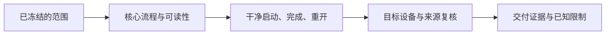

# C12｜交付：别人电脑上第一次运行

版本：统一课号课程版｜2026-09-15
状态：课件正文与互动规格已编写；尚未逐课生成OpenMAIC课堂或试教。

**学习分组：** C组；**本课编号：** C12；**路线：** 主线。

## 0. 开始前：只准备本课需要的东西

**本次起点：** 直接打开：game/world/exploration.tscn
**缺材料时：** 先用课内模拟辨清概念。缺起始场景时仅准备最小搭建清单；不要让新手为了上本课先生成整款游戏，真机应用保持待验证。
**当前配套：** 见0A的真实文件、首步与覆盖边界；文件存在不表示本课所有M已有完整配套。

**今天的最小任务：** 写出选定平台的首次启动与完成路径验收单。
**怎样读：** 先看两项M和概念图，再复制对话1。启动框已带首步、继续条件和结束证据；之后用自己的话回复即可，不必把六框逐一重发。
**怎样停：** 完成当前小步可以暂停，记录下次起点；只有本课两项M都有相应证据才标本课应用通过。暂停不是失败，模拟完成不是软件通过。
**先学再验：** 初次允许AI示范一小步，你再换一个值/对象作选择；需要检查独立判断时换未讲过的变式，不要求从零手写代码。

## 0A. 这课怎样学、怎样查缺口

**学习顺序：** 短示范或预测 → 课堂随练 → 软件概念对照 → 自己解释 → 只补薄弱项。

**实际配套：** [exploration.tscn](../../game/world/exploration.tscn)

**练习首步：** 先运行完整三段主线和暂停菜单，再按自己的目标平台实际导出验收。

**配套局限：** 源码与自动测试不是全部设备体验认证；发布包仍须目标设备检查。

**正式项目落点：** P11。实验只为理解；进入相应生产阶段再迁移。

**打开方式与分工：** [现成实验入口](../../LABS-START.md)。Godot打开当前场景按F6；Blender直接打开已有文件，先另存副本。默认先体验，不为上课重新搭建。

**回忆与检查：** [本课记忆规则](../../print/memory-by-lesson.md#c12) · [单元检查](../../assessments/unit-checkpoints.md) · [AI追问与弱项诊断](../../assessments/ai-diagnostic-review.md)。

**记录分开：** 回忆/解释/软件应用/换情境；没有证据写待验证。菜单/API可查；得到根因提示记有提示。

## 1. 本课任务卡

**产出：** 写出选定平台的首次启动与完成路径验收单。
**前置：** C11, C09；**对应概念：** KN20/KN24/KN26。
**预计课堂：** 20–30分钟，可在实验前后暂停；不含后续真实软件制作时间。
**M 必须掌握：**
- 在干净环境检查依赖、输入、资源与结束路径。
- 核对来源、可分发范围和已知限制。
**K 理解即可：**
- Debug/Release、导出模板和平台签名知道入口即可。
**停止线：** 只选一个目标平台，不学全部商店运营和签名体系。

## 1A. 必学内容、实操与题目如何对应

M1/M2只是本课任务卡的两项能力序号，不是新的技术概念。查菜单/API不扣独立判断分。

|必须掌握到这里|本课实操题：做什么算有证据|可选配套题|
|---|---|---|
|M1：在干净环境检查依赖、输入、资源与结束路径。|实际目标包在干净数据条件走完启动、控制、收齐、重开/退出路径。|C12-P1, C12-D2|
|M2：核对来源、可分发范围和已知限制。|逐项核对来源和所选发布物范围，明确未授权源资产不能直接公开。|C12-T3|

**最低学习路径：** 一次预测 → 一个能覆盖上述两项M的小实验/项目改动 → 一次结果解释。普通M做到即可；关键薄弱处再选一题诊断或隔次迁移，不把P/D/T全套加到每个术语上。
**理解即可与停止线：** 任务卡中的K只检用途；按需查的界面、API、高级实现不进入本课操作门槛。只有已学且已存在的项目功能需要回归。

## 2. 必要讲解：先看现象，再给术语

编辑器里能玩不等于导出包能玩。干净用户数据、资源路径大小写、导出包含范围和输入设备可能暴露遗漏。

课程公开仓库与游戏发布包的授权需求也可能不同。可在游戏使用不必然可在源码仓库再分发源资产，按具体许可核对。

## 2A. 场景、概念图与逐步AI对话

**实际位置：** P06｜把庭院交给没装编辑器的人。

|操作前的问题|本课希望得到的结果|
|---|---|
|作者电脑能运行，却不知道缺哪些资源和初始数据。|选定平台有可启动、可完成、可恢复的交付记录。|

这是目标对照，不是已完成的游戏截图。概念图为职责/因果示意，不是继承图或完整运行证明。

OpenMAIC不能渲染Mermaid时画等价方框图；无3D或真实连接时仅标课堂模拟，不伪造软件运行。

### 本课人和AI分别负责什么

|责任|这课具体做什么|
|---|---|
|我必须作出的判断|选一个目标平台，确认首次启动与资源分发范围，不把许可证猜测当结论。|
|可以交给AI的制作|准备导出依赖清单和干净数据测试步骤，标出许可信息缺口。|
|我检查AI交付物|看修改对象/前后差异、实际执行记录及未验证项；先核对是否保留本课约束，再决定是否接入。|

**不是手工熟练考试：** 重复劳动与代码可委托；常用可见参数适合亲调时先调一项，无障碍需要可由AI按已选值执行。必须能说明选择、观察和恢复，不要求机械地拖每个滑杆。

**两种模式：** 练习时可问根因、看示范；独立验收时先由我提出选择/假设，AI只协助执行与记录。已透露本题根因或目标值，就记录“有提示”，再换未揭示答案的变式。

### 复制第1框开始；以后每次只发当前一步

**学员用法：** 无需一次读完所有提示。将当前框发给你使用的AI；做完后回“完成＋观察”，结果不符回“不符＋现象”，报错回“报错＋原文”，需要停下回“暂停”。自然语言也可以。不要一口气把六步当成自动执行授权。

### 对话1｜建立本课上下文

```text
请做我这节课的协作教练：C12《交付：别人电脑上第一次运行》。
我们逐步制作同一个「星光小庭院」，当前只解决：作者电脑能运行，却不知道缺哪些资源和初始数据。
目标：选定平台有可启动、可完成、可恢复的交付记录。
必须掌握：在干净环境检查依赖、输入、资源与结束路径；核对来源、可分发范围和已知限制。理解即可：Debug/Release、导出模板和平台签名知道入口即可
停止线：只选一个目标平台，不学全部商店运营和签名体系。
必须保持：源项目、唯一存档和第三方原资源不被清理；不扩成多平台商店发布。
本课由我负责：选一个目标平台，确认首次启动与资源分发范围，不把许可证猜测当结论。
可以交给你：准备导出依赖清单和干净数据测试步骤，标出许可信息缺口。
请标明建议/已执行/已验证的区别。练习可提示；验收先等我作判断，已提示根因则如实记有提示。
概念配套：game/world/exploration.tscn
练习首步：先运行完整三段主线和暂停菜单，再按自己的目标平台实际导出验收。
覆盖边界：源码与自动测试不是全部设备体验认证；发布包仍须目标设备检查。
对应生产阶段：P11；达到当前阶段才迁移，不把实验完成当成项目通过。
默认先用现成实验体验；下方连接/实现任务属于之后的项目迁移，不作为打开本实验的前置。OpenMAIC已提供同等概念证据时不重复刷题，但真实资源/物理/导出等软件证据不可由模拟代替。
先复用上述现有样本，不重新生成同一个Lab。练习可提示；检查先只读快照，不一边改答案一边评分。
先读取我已提供的进度和材料，只问真正缺失的一项。需要软件操作时核对实际版本、当前截图或场景树、可访问的工具；不要求我发密钥或整个电脑。
本课入场材料：直接使用：game/world/exploration.tscn
材料不足的处理：没有真实文件就说明缺失；先作明示模拟，不布置重建工程作业。
当前目的：体验模式。只有明确说我要改自己的作品，才切换到作品模式。
以下是本课连续推进卡，不是一次性执行授权；收到我的观察后每轮最多推进一个有意义的小步。
首步：先运行完整三段主线和暂停菜单，再按自己的目标平台实际导出验收。
继续条件：先作预测，再提供一项实际对照和解释；未覆盖的能力留待验证。
随后一步：在现成材料覆盖范围内选择一个参数或条件作变式，再恢复；不为了凑题重造系统。
结束证据：实际目标包在干净数据条件走完启动、控制、收齐、重开/退出路径。；逐项核对来源和所选发布物范围，明确未授权源资产不能直接公开。
相关回归：导出版本而非编辑器内重走核心循环，记录实际设备与版本。
这些是待执行要求，不是我的已完成进度。不要凭课号推断前置已通过；只复用我已提供的实际材料和证据。
对话1之后我可直接回复完成/不符/报错/暂停，无需重贴整课；你应沿这张推进卡继续，不临时增加系统。
先给一个预测问题并等我回答，再给一个最小步骤。不跳课、不自动做整款游戏。能执行才说已执行，否则给明确操作单或脚本，并标未执行。
后续每轮用四项回应：现在是哪一步；只改什么/怎样恢复；我应观察什么；目前还缺什么证据。没有证据不要替我勾通过。
```

**AI此时应做：** 确认默认体验模式和现成文件；不要先输出脚本或建场景。已经提供过的版本、素材和约束应复用，不重复问。

### 对话2｜先理解一个因果关系

```text
先问我：本机编辑器跑通等于发布包通过吗？
等我写预测和理由后，再指出一个证据缺口，只给一个提示，不先公布完整答案。用词不专业时先确认意思，再补术语。
```

**转入下一步：** 有自己的预测即可；预测错可以用实验纠正，不要求先背定义。

### 对话3｜在现成材料里完成第一项对照

```text
沿用已确认的版本、材料和修改边界。现在只做：先运行完整三段主线和暂停菜单，再按自己的目标平台实际导出验收。
只找现成控件并记录原值，不创建节点、不写初始化脚本；缺文件就说明缺失，不让学员临时搭场景。软件执行必须有实际观察。做完先停下。
```

**预计看到／拿到：** 先作预测，再提供一项实际对照和解释；未覆盖的能力留待验证。
**不是自动保证：** 这是验收目标，取决于实际模型、工具和输入；结果不同就走下方“不符”分支。

### 对话4｜观察与亲调，不追加一轮搭建

```text
这是我刚才的实际结果：我会附一张当前图、短演示或必要日志，并用一句话描述差异。
先检查是否满足：先作预测，再提供一项实际对照和解释；未覆盖的能力留待验证。
本课可用的微调项（引擎属性供定位；体验先用现成控件，不为匹配表格重建场景）：
入口：Godot Export Preset（内置入口）；操作：核对单一目标与所需导出资源；观察：是否误漏资源或包含开发秘密
入口：游戏画面/音量设置（项目界面）；操作：在干净用户数据下确认首次默认值；观察：首次进入能否看清、操作并完成
若满足，先指导我选择其中一项亲调；我回报观察后才继续：在现成材料覆盖范围内选择一个参数或条件作变式，再恢复；不为了凑题重造系统。
一次只动一项可见参数。方向接近就手调；结构有误才给局部修复，不能不断重生成整个场景。
```

|选中哪里与参数性质|这次亲自试什么|观察与停手依据|
|---|---|---|
|Godot Export Preset（内置入口）|核对单一目标与所需导出资源|是否误漏资源或包含开发秘密|
|游戏画面/音量设置（项目界面）|在干净用户数据下确认首次默认值|首次进入能否看清、操作并完成|

**保存与恢复：** 先记录原值和实际对象。优先在安全副本试；运行中Remote Inspector的变化不要当成已保存的设计值，确认后将选定值写回本地场景/资源或配置并重新运行。菜单路径随版本核对，自定义变量不冒充内置属性。
**采用哪种沟通：** 大方向偏了，用参考图圈出要借鉴的轮廓/色彩/光感，并指出不要照搬什么；单个视觉值接近了，先拖或输入数值；原因不明，固定条件做一次对照。参考图不是可自动反推所有参数的答案。

### 对话5｜成功验收，或失败时只修一处

**达到目标时发送：**
```text
请只根据我提供的证据检查：
- 实际目标包在干净数据条件走完启动、控制、收齐、重开/退出路径。
- 逐项核对来源和所选发布物范围，明确未授权源资产不能直接公开。
旧功能回归：导出版本而非编辑器内重走核心循环，记录实际设备与版本。
缺少过程证据就标待验证；不得用一张截图证明走跳或一次性事件。不要新增需求或把所有候选题变成作业。
```

**结果不符或报错时发送：**
```text
不符/报错：我会提供触发步骤、预期、实际现象和必要原始日志。
保留：源项目、唯一存档和第三方原资源不被清理；不扩成多平台商店发布。
本课优先风险：检查AI是否把导出命令成功当可玩验收，或漏掉资源授权和秘密文件。
先提出一个可推翻的假设和一个最小验证；不要同时改多个系统。若两次验证仍无进展，回到基线并列出缺失证据，不反复抽卡。不要删除测试、关闭需求或扩大权限来假装修好。
```

**AI评分边界：** 代码和初稿可以由AI提供；判断、亲调与证据解释由学员完成。得到根因提示记为有提示，不因此重复考试所有概念。

### 对话6｜存进度，下一次接着做

```text
请总结本课C12（C12）的进度卡，不把预测当已完成。
记录：真实软件版本/渲染器；当前场景与变更对象；选定参数和原值；我做的判断；实际证据；通过/待验证；使用过的提示；恢复方法；下一步唯一任务。
只有实际验证才标通过，没有生成或真机执行就明确写模拟/待验证。给我一段可以复制到新AI对话的摘要，不假称你已持久保存。
先核对下一课前置和我的已选路线，未完成就停在当前步骤，不催着扩范围。
```

**学员保存：** 把进度卡存本地或私人笔记；下次粘贴进度卡和下一课第1框。不要公开API Key、账户、本地私密路径或个人录像。

<details data-purpose="project">
<summary>作品模式：明确要改自己的工作副本时才展开</summary>

当前默认是体验模式，以下任务不自动执行。只有学员明确说“我要改自己的作品”，并提供工作副本与本次验收，才一次选一项。不要复制第二套作业。

**作品实现候选一：** 先确认唯一目标平台、输入和资源来源；导出一个测试包而非同时支持全部平台。

**作品实现候选二：** 沿固定路线检查完成、重开、声音与设置；增强版还测关闭训练角。

先核对已有对象；能局部修改就不重新创建。实现可交给AI，目标、保持项和验收由学员提出。

</details>


### 当前风险与长期责任

**本课风险检查：** 检查AI是否把导出命令成功当可玩验收，或漏掉资源授权和秘密文件。
这是需要在当前工具版本下核验的风险，不是所有AI必然失败的排行榜，也不预测何时改善。长期保留需求、参考选择、影响范围、结果认可与取舍责任；测量、批量设置和重复验证可以由AI协助。
**不把学习变成额外六次考试：** 六个对话阶段共享本课原有M/K证据；只在薄弱关键能力上追加一处故障或变式。没有实际材料时先做课堂模拟，真机状态单独记录。

## 3. 界面与参数学习深度

以下是软件操作的对应范围；优先使用0A已给出的实验，尚无配套的部分如实标待验证。模拟滑块是教学控件，不代表软件都有同名按钮。会调是指看懂作用、主动选择与恢复；会定位是知道去哪找；按需查不考菜单路径、快捷键和API记忆。
- Godot：Export目标、资源包含范围、Release/Debug用途。
- 会定位：首次启动日志、数据目录。
- 按需查：安装签名、平台权限和商店要求。

## 4. 互动实验规格

**初始状态：** 两张包清单：只含游戏包与误包含本地绝对路径的包；首次启动/老用户两种场景。
**可操作项：** 干净/已有存档、目标平台、资源包含勾选、完成/退出步骤。
**实验步骤：**
1. 画一次从打开到完成再退出的路径。
2. 用清单查缺失依赖和硬编码路径。
3. 核对每份资源的来源、修改和再分发记录。
**预期反馈：** 明确课堂不真的导出或验证某平台，输出待执行验收单。
**故障或反例：** 故障：仅作者电脑有的一张贴图被漏打包；修导出依赖而非让用户手工复制私人目录。
**复位：** 还原包清单与测试数据，不修改真实系统。
**无图/无3D替代：** 用原创简单形状、状态卡或给定时间序列表达同一因果关系；标明“示意”，不得把预设结果说成Godot/Blender实测。不能以假按钮或不响应的截图代替交互。
**完成判据：** 对本课两项M提供操作或判断及解释；一个实验可覆盖多项。只有关键M或发现薄弱处才追加故障/变式，不为每个术语加作业。

## 5. 小结与必须牢记

- 测试别人第一次运行。
- 导出包才是交付对象。
- 使用权和源资产再分发分开核对。

## 6. 训练：先作答，再看反馈

题干中的日志、数值与AI建议均为标明的教学情境，除非另附运行证据，不是本项目实测。可以有多个合理假设：先给能区分它们的验证，而不是猜老师心中的唯一原因。

P=预测，D=诊断，T=迁移，K=用途认识。下面是候选训练，不是每个词都做四次作业。课堂先用预测和一个操作，重点未达标再选D或T；延迟复测换对象，不重复抄答案。

### C12-P1
**考察范围：** M1的限定子能力；不是整项真机通过证明。先给判断与理由；要求操作时再提供过程/对照。仅答对文字不自动等于实际应用通过。

本机编辑器跑通等于发布包通过吗？

### C12-D2
**考察范围：** M1的限定子能力；不是整项真机通过证明。先给判断与理由；要求操作时再提供过程/对照。仅答对文字不自动等于实际应用通过。

【教学构造情境，不是真实测量或某模型故障统计】作者电脑导出包正常，另一台缺贴图。AI给出作者私人磁盘的绝对路径，声称修复。怎样检查依赖和打包范围？课程仓库与游戏包中的素材应分别核对什么？

### C12-T3
**考察范围：** M2的限定子能力；不是整项真机通过证明。先给判断与理由；要求操作时再提供过程/对照。仅答对文字不自动等于实际应用通过。

教程仓库准备公开，资源已可商用就都能上传吗？

### C12-K4
**考察范围：** K｜理解用途即可；不要求实现。一句用途解释即可。

Release与Debug为何区分？

<details data-purpose="project">
<summary>作品模式：明确要改自己的工作副本时才展开</summary>

## 7. 正式项目迁移（达到相应阶段再做）

平台实际导出和法律判断需对应执行/许可文本；课程不作普遍许可保证。
即使已有参考工程，也要区分课件、运行测试、人工体验、学习掌握四种证据。已有Lab先随课使用；完整生产按任务单推进，未交付的逐课配套不冒充完成。

## 8. 实际应用验收：把结果放回同一个项目

**本课产物：** 选定平台有可启动、可完成、可恢复的交付记录。
**接入边界：** 源项目、唯一存档和第三方原资源不被清理；不扩成多平台商店发布。

以下是要采集的证据，不是宣称已经执行。记录“未尝试 / 有提示完成 / 独立验证 / 隔次仍会”；不把这四种状态与M/K学习要求混淆。

|原有M能力|本次在哪里取证|
|---|---|
|在干净环境检查依赖、输入、资源与结束路径。|实际目标包在干净数据条件走完启动、控制、收齐、重开/退出路径。|
|核对来源、可分发范围和已知限制。|逐项核对来源和所选发布物范围，明确未授权源资产不能直接公开。|

**旧功能回归：** 导出版本而非编辑器内重走核心循环，记录实际设备与版本。
**最小记录：** 一段现场演示，或同条件前后图/日志，加一句“我改了什么、为什么”。截图不足以证明运动/一次性事件时，要演示动作或查看对应状态。记录用过的提示，不要求写长报告。
**关键能力复测：** 本课高频或返工风险较高，已有有效证据可复用；薄弱处增加一个未知故障或隔次变式，不把每个词都变成一套试卷。

**换情境的候选任务：** 换另一个干净用户目录再测，不要求新增第二个平台。
**判定：** 普通M按原0–2锚点；有针对性根因提示记练习，换变式再验证。K只查用途，不能抵消关键M失败。没有真实操作的M只记待验证，模拟通过不能自动升级为真机通过。未选专题不阻塞主线。

**接入不等于新增系统：** 美术课可交风格卡、参数决定或改造样本；性能课可得出“不优化”。隔离实验只有对当前项目有收益才接入，不强迫庭院变成战斗、开放世界或联网游戏。


</details>

## 9. 复现与延迟检查

本课复现：B05, B11, C11。只复习已学的关键M。
下次课抽一个本课关键判断，换对象或数值后先独立解释。查菜单和API不扣独立判断分；被提示根因或目标值后完成，记录有提示，换变式再验。K不反复背定义。

## 10. 依据与观看入口

- [Kenney Support：资产用途与许可说明](https://kenney.nl/support)
- [Adobe Mixamo FAQ：角色、动作及使用条件](https://helpx.adobe.com/creative-cloud/faq/mixamo-faq.html)
- [Godot General optimization：测量与取舍](https://docs.godotengine.org/en/stable/tutorials/performance/general_optimization.html)
- [Godot运行检查与可见碰撞工具](https://docs.godotengine.org/en/stable/tutorials/scripting/debug/overview_of_debugging_tools.html)

技术来源支持术语和软件边界；具体实验与课程顺序是本项目教学设计，不代表已证明学习效果。艺术家入口用于观看研习，不等于获得图片或素材再分发许可。
