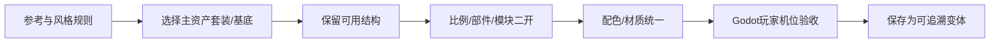

# D01｜资产套装二开：从基底拼装成自己的道具

版本：统一课号课程版｜2026-09-15
状态：课件正文与互动规格已编写；尚未逐课生成OpenMAIC课堂或试教。

**学习分组：** D组；**本课编号：** D01；**路线：** 美术主线｜套装二开与统一。

## 0. 开始前：只准备本课需要的东西

**本次起点：** 一件来源和修改条件明确的可编辑套装基底、风格卡、固定玩家机位和只读原件；从二开开始，不从零建模。
**缺材料时：** 先用说明卡判断来源、结构和改造范围。缺可编辑源或适用许可时停止导入/修改，不自动购买、下载或替换成不明资源。
**当前配套：** 见0A的真实文件、首步与覆盖边界；文件存在不表示本课所有M已有完整配套。

**今天的最小任务：** 从风格接近的可编辑套装中选择基底，通过比例、模块替换和有限细修做出属于当前项目的变体。
**怎样读：** 先看两项M和概念图，再复制对话1。启动框已带首步、继续条件和结束证据；之后用自己的话回复即可，不必把六框逐一重发。
**怎样停：** 完成当前小步可以暂停，记录下次起点；只有本课两项M都有相应证据才标本课应用通过。暂停不是失败，模拟完成不是软件通过。
**先学再验：** 初次允许AI示范一小步，你再换一个值/对象作选择；需要检查独立判断时换未讲过的变式，不要求从零手写代码。

## 0A. 这课怎样学、怎样查缺口

**学习顺序：** 短示范或预测 → 课堂随练 → 软件概念对照 → 自己解释 → 只补薄弱项。

**实际配套：** [kitbash_style_lab.blend](../../blender/labs/kitbash_style_lab.blend)

**练习首步：** 先另存副本，选Variant_Roof只改一项比例，比较Base。

**配套局限：** 原创几何二开样例，不是已购买的完整资产套装。

**正式项目落点：** P6。实验只为理解；进入相应生产阶段再迁移。

**打开方式与分工：** [现成实验入口](../../LABS-START.md)。Godot打开当前场景按F6；Blender直接打开已有文件，先另存副本。默认先体验，不为上课重新搭建。

**回忆与检查：** [本课记忆规则](../../print/memory-by-lesson.md#d01) · [单元检查](../../assessments/unit-checkpoints.md) · [AI追问与弱项诊断](../../assessments/ai-diagnostic-review.md)。

**记录分开：** 回忆/解释/软件应用/换情境；没有证据写待验证。菜单/API可查；得到根因提示记有提示。

## 1. 本课任务卡

**产出：** 从风格接近的可编辑套装中选择基底，通过比例、模块替换和有限细修做出属于当前项目的变体。
**前置：** C07, B10；**对应概念：** ART02/ART03/KN11/KN15。
**预计课堂：** 20–30分钟，可在实验前后暂停；不含后续真实软件制作时间。
**M 必须掌握：**
- 选择适合改造的基底并保持非破坏性工作流。
- 只打磨游戏镜头能感知的比例、边缘和细节。
**K 理解即可：**
- Modifier Stack、拓扑和法线修复知道影响及查找入口。
**停止线：** 不做全套雕刻、复杂角色重拓扑或从Cube重造整件资产；只改玩家镜头真正看得到且能提升统一性的部分。

## 1A. 必学内容、实操与题目如何对应

M1/M2只是本课任务卡的两项能力序号，不是新的技术概念。查菜单/API不扣独立判断分。

|必须掌握到这里|本课实操题：做什么算有证据|可选配套题|
|---|---|---|
|M1：选择适合改造的基底并保持非破坏性工作流。|按目标、来源和可编辑性选基底，能回到原始版本。|D01-P1|
|M2：只打磨游戏镜头能感知的比例、边缘和细节。|依次打磨大形、结构与有限细节，在固定游戏机位展示收益。|D01-D2, D01-T3|

**最低学习路径：** 一次预测 → 一个能覆盖上述两项M的小实验/项目改动 → 一次结果解释。普通M做到即可；关键薄弱处再选一题诊断或隔次迁移，不把P/D/T全套加到每个术语上。
**理解即可与停止线：** 任务卡中的K只检用途；按需查的界面、API、高级实现不进入本课操作门槛。只有已学且已存在的项目功能需要回归。

## 2. 必要讲解：先看现象，再给术语

合适基底应有可用授权、可编辑结构、合理尺度，并接近目标风格。若差距主要在整体比例、形体节奏与材质，常可从基底改造；若必须重做全部结构，换基底更省时间。

三轮顺序：先轮廓比例，再开口厚度/连接关系等中形，最后有限倒角与装饰。每轮在统一游戏机位看一遍；保留源版本和可回退修改器。

把资产包当乐高积木：先保留它优秀的视觉基因，再改最影响身份的大形、比例和部件组合。可以换屋顶/门窗/招牌/附件，或把多个兼容模块Kitbash成新道具；不需要为“原创”把已合格结构全部重做。

## 2A. 场景、概念图与逐步AI对话

**实际位置：** P07｜把通用套装里的基底二开成庭院自己的道具。

|操作前的问题|本课希望得到的结果|
|---|---|
|现成资产单独好看，但直接放入场景像别的游戏；或为了原创从零重做浪费时间。|保留优秀基底，用比例、部件组合和有限表面修改形成项目变体，可回退也可复用。|

这是目标对照，不是已完成的游戏截图。概念图为职责/因果示意，不是继承图或完整运行证明。

OpenMAIC不能渲染Mermaid时画等价方框图；无3D或真实连接时仅标课堂模拟，不伪造软件运行。

### 本课人和AI分别负责什么

|责任|这课具体做什么|
|---|---|
|我必须作出的判断|比较基底差距/编辑成本，保留可回退源，在玩家距离选择改造重点。|
|可以交给AI的制作|列少量局部改造与可撤销修改器方案，复杂坏基底允许推荐换用。|
|我检查AI交付物|看修改对象/前后差异、实际执行记录及未验证项；先核对是否保留本课约束，再决定是否接入。|

**不是手工熟练考试：** 重复劳动与代码可委托；常用可见参数适合亲调时先调一项，无障碍需要可由AI按已选值执行。必须能说明选择、观察和恢复，不要求机械地拖每个滑杆。

**两种模式：** 练习时可问根因、看示范；独立验收时先由我提出选择/假设，AI只协助执行与记录。已透露本题根因或目标值，就记录“有提示”，再换未揭示答案的变式。

### 复制第1框开始；以后每次只发当前一步

**学员用法：** 无需一次读完所有提示。将当前框发给你使用的AI；做完后回“完成＋观察”，结果不符回“不符＋现象”，报错回“报错＋原文”，需要停下回“暂停”。自然语言也可以。不要一口气把六步当成自动执行授权。

### 对话1｜建立本课上下文

```text
请做我这节课的协作教练：D01《资产套装二开：从基底拼装成自己的道具》。
我们逐步制作同一个「星光小庭院」，当前只解决：现成资产单独好看，但直接放入场景像别的游戏；或为了原创从零重做浪费时间。
目标：保留优秀基底，用比例、部件组合和有限表面修改形成项目变体，可回退也可复用。
必须掌握：选择适合改造的基底并保持非破坏性工作流；只打磨游戏镜头能感知的比例、边缘和细节。理解即可：Modifier Stack、拓扑和法线修复知道影响及查找入口
停止线：不做全套雕刻、复杂角色重拓扑或从Cube重造整件资产；只改玩家镜头真正看得到且能提升统一性的部分。
必须保持：用途、接口、原点约定和通行空间保持；本课不要求职业级重拓扑。
本课由我负责：比较基底差距/编辑成本，保留可回退源，在玩家距离选择改造重点。
可以交给你：列少量局部改造与可撤销修改器方案，复杂坏基底允许推荐换用。
请标明建议/已执行/已验证的区别。练习可提示；验收先等我作判断，已提示根因则如实记有提示。
概念配套：blender/labs/kitbash_style_lab.blend
练习首步：先另存副本，选Variant_Roof只改一项比例，比较Base。
覆盖边界：原创几何二开样例，不是已购买的完整资产套装。
对应生产阶段：P6；达到当前阶段才迁移，不把实验完成当成项目通过。
默认先用现成实验体验；下方连接/实现任务属于之后的项目迁移，不作为打开本实验的前置。OpenMAIC已提供同等概念证据时不重复刷题，但真实资源/物理/导出等软件证据不可由模拟代替。
先复用上述现有样本，不重新生成同一个Lab。练习可提示；检查先只读快照，不一边改答案一边评分。
先读取我已提供的进度和材料，只问真正缺失的一项。需要软件操作时核对实际版本、当前截图或场景树、可访问的工具；不要求我发密钥或整个电脑。
本课入场材料：一件来源和修改条件明确的可编辑套装基底、风格卡、固定玩家机位和只读原件；从二开开始，不从零建模。
材料不足的处理：先用说明卡判断来源、结构和改造范围。缺可编辑源或适用许可时停止导入/修改，不自动购买、下载或替换成不明资源。
以下是本课连续推进卡，不是一次性执行授权；收到我的观察后每轮最多推进一个有意义的小步。
首步：先选一件套装基底，写保留/修改/不做三栏；只改大比例或替换一组部件，不先雕细节。
继续条件：固定玩家机位能看出它已更符合风格，同时原点/接口/用途仍可用。
随后一步：再加一处有限倒角、厚度或附件；收益不明显就停止，不从零重做。
结束证据：按目标、来源和可编辑性选基底，能回到原始版本。；依次打磨大形、结构与有限细节，在固定游戏机位展示收益。
相关回归：导出后尺寸、原点、材质引用仍可用；相邻模块与功能包装未坏。
这些是待执行要求，不是我的已完成进度。不要凭课号推断前置已通过；只复用我已提供的实际材料和证据。
对话1之后我可直接回复完成/不符/报错/暂停，无需重贴整课；你应沿这张推进卡继续，不临时增加系统。
先给一个预测问题并等我回答，再给一个最小步骤。不跳课、不自动做整款游戏。能执行才说已执行，否则给明确操作单或脚本，并标未执行。
后续每轮用四项回应：现在是哪一步；只改什么/怎样恢复；我应观察什么；目前还缺什么证据。没有证据不要替我勾通过。
```

**AI此时应做：** 确认当前场景与学习范围，不直接输出几十个文件。已经提供过的版本、素材和约束应复用，不重复问。

### 对话2｜先理解一个因果关系

```text
先问我：有基底就一定比重做快吗？
等我写预测和理由后，再指出一个证据缺口，只给一个提示，不先公布完整答案。用词不专业时先确认意思，再补术语。
```

**转入下一步：** 有自己的预测即可；预测错可以用实验纠正，不要求先背定义。

### 对话3｜AI只完成第一小步

```text
沿用已确认的版本、材料和修改边界。现在只做：先选一件套装基底，写保留/修改/不做三栏；只改大比例或替换一组部件，不先雕细节。
先列影响对象和原值，再提供一个可撤销初稿。没有实际软件连接时给我可执行的局部操作单/脚本，不说已经修改。做完先停下。
```

**预计看到／拿到：** 固定玩家机位能看出它已更符合风格，同时原点/接口/用途仍可用。
**不是自动保证：** 这是验收目标，取决于实际模型、工具和输入；结果不同就走下方“不符”分支。

### 对话4｜人观察与亲调，再继续第二小步

```text
这是我刚才的实际结果：我会附一张当前图、短演示或必要日志，并用一句话描述差异。
先检查是否满足：固定玩家机位能看出它已更符合风格，同时原点/接口/用途仍可用。
本课可用的微调项：
入口：Blender对象/编辑模式（内置）；操作：先小幅改主次比例，再检查厚度与开口；观察：游戏距离下大形收益、连接位置是否合理
入口：Bevel修改器宽度与段数（内置）；操作：少量调宽度，段数只加到可见需求；观察：轮廓、高光和变形，不以参数越大越高级
若满足，先指导我选择其中一项亲调；我回报观察后才继续：再加一处有限倒角、厚度或附件；收益不明显就停止，不从零重做。
一次只动一项可见参数。方向接近就手调；结构有误才给局部修复，不能不断重生成整个场景。
```

|选中哪里与参数性质|这次亲自试什么|观察与停手依据|
|---|---|---|
|Blender对象/编辑模式（内置）|先小幅改主次比例，再检查厚度与开口|游戏距离下大形收益、连接位置是否合理|
|Bevel修改器宽度与段数（内置）|少量调宽度，段数只加到可见需求|轮廓、高光和变形，不以参数越大越高级|

**保存与恢复：** 先记录原值和实际对象。优先在安全副本试；运行中Remote Inspector的变化不要当成已保存的设计值，确认后将选定值写回本地场景/资源或配置并重新运行。菜单路径随版本核对，自定义变量不冒充内置属性。
**采用哪种沟通：** 大方向偏了，用参考图圈出要借鉴的轮廓/色彩/光感，并指出不要照搬什么；单个视觉值接近了，先拖或输入数值；原因不明，固定条件做一次对照。参考图不是可自动反推所有参数的答案。

### 对话5｜成功验收，或失败时只修一处

**达到目标时发送：**
```text
请只根据我提供的证据检查：
- 按目标、来源和可编辑性选基底，能回到原始版本。
- 依次打磨大形、结构与有限细节，在固定游戏机位展示收益。
旧功能回归：导出后尺寸、原点、材质引用仍可用；相邻模块与功能包装未坏。
缺少过程证据就标待验证；不得用一张截图证明走跳或一次性事件。不要新增需求或把所有候选题变成作业。
```

**结果不符或报错时发送：**
```text
不符/报错：我会提供触发步骤、预期、实际现象和必要原始日志。
保留：用途、接口、原点约定和通行空间保持；本课不要求职业级重拓扑。
本课优先风险：检查AI是否为了“原创”重做整件模型、破坏接口/原点，或把看不到的小细节当质量核心。
先提出一个可推翻的假设和一个最小验证；不要同时改多个系统。若两次验证仍无进展，回到基线并列出缺失证据，不反复抽卡。不要删除测试、关闭需求或扩大权限来假装修好。
```

**AI评分边界：** 代码和初稿可以由AI提供；判断、亲调与证据解释由学员完成。得到根因提示记为有提示，不因此重复考试所有概念。

### 对话6｜存进度，下一次接着做

```text
请总结本课D01（D01）的进度卡，不把预测当已完成。
记录：真实软件版本/渲染器；当前场景与变更对象；选定参数和原值；我做的判断；实际证据；通过/待验证；使用过的提示；恢复方法；下一步唯一任务。
只有实际验证才标通过，没有生成或真机执行就明确写模拟/待验证。给我一段可以复制到新AI对话的摘要，不假称你已持久保存。
先核对下一课前置和我的已选路线，未完成就停在当前步骤，不催着扩范围。
```

**学员保存：** 把进度卡存本地或私人笔记；下次粘贴进度卡和下一课第1框。不要公开API Key、账户、本地私密路径或个人录像。

### 当前风险与长期责任

**本课风险检查：** 检查AI是否为了“原创”重做整件模型、破坏接口/原点，或把看不到的小细节当质量核心。
这是需要在当前工具版本下核验的风险，不是所有AI必然失败的排行榜，也不预测何时改善。长期保留需求、参考选择、影响范围、结果认可与取舍责任；测量、批量设置和重复验证可以由AI协助。
**不把学习变成额外六次考试：** 六个对话阶段共享本课原有M/K证据；只在薄弱关键能力上追加一处故障或变式。没有实际材料时先做课堂模拟，真机状态单独记录。

## 3. 界面与参数学习深度

以下是软件操作的对应范围；优先使用0A已给出的实验，尚无配套的部分如实标待验证。模拟滑块是教学控件，不代表软件都有同名按钮。会调是指看懂作用、主动选择与恢复；会定位是知道去哪找；按需查不考菜单路径、快捷键和API记忆。
- Blender常用：Object/Edit Mode、选局部、Move/Scale、简单Extrude/Bevel、修改器启停。
- 会定位：法线/面朝向、合并重复点、Mirror和Apply影响。
- 按需查：复杂拓扑、雕刻笔刷、自动重拓扑。

## 4. 互动实验规格

**初始状态：** 许可明确的简单木箱教学基底；目标是圆润绘本风而非写实旧箱。提供近景与游戏距离预览。
**可操作项：** 宽高比0.8到1.3、边缘倒角小/中/大、装饰0/2/6处、平滑对照、修改栈开关。
**实验步骤：**
1. 对照风格卡，只圈三处最重要变化。
2. 按大形→结构→细节顺序逐轮A/B，不能一开始刻全部木纹。
3. 关闭修改器看基底仍可恢复，检查原点、尺度和模型表面。
**预期反馈：** 显示每轮投入与实际可见收益；高面数不自动加分。对比必须使用相同灯光和机位。
**故障或反例：** 反例：为修表面黑斑不断加细分；应先查法线、重叠面等原因，再决定是否要增面。
**复位：** 恢复原始基底副本和修改栈，保留三轮取舍记录。
**无图/无3D替代：** 用原创简单形状、状态卡或给定时间序列表达同一因果关系；标明“示意”，不得把预设结果说成Godot/Blender实测。不能以假按钮或不响应的截图代替交互。
**完成判据：** 对本课两项M提供操作或判断及解释；一个实验可覆盖多项。只有关键M或发现薄弱处才追加故障/变式，不为每个术语加作业。

## 5. 小结与必须牢记

- 先选合适基底再改。
- 三轮打磨，先大后小。
- 游戏距离看不到的细节先省。

## 6. 训练：先作答，再看反馈

题干中的日志、数值与AI建议均为标明的教学情境，除非另附运行证据，不是本项目实测。可以有多个合理假设：先给能区分它们的验证，而不是猜老师心中的唯一原因。

P=预测，D=诊断，T=迁移，K=用途认识。下面是候选训练，不是每个词都做四次作业。课堂先用预测和一个操作，重点未达标再选D或T；延迟复测换对象，不重复抄答案。

### D01-P1
**考察范围：** M1的限定子能力；不是整项真机通过证明。先给判断与理由；要求操作时再提供过程/对照。仅答对文字不自动等于实际应用通过。

有基底就一定比重做快吗？

### D01-D2
**考察范围：** M2的限定子能力；不是整项真机通过证明。先给判断与理由；要求操作时再提供过程/对照。仅答对文字不自动等于实际应用通过。

【教学构造情境，不是真实测量或某模型故障统计】箱子局部有黑斑。AI连续增加Subdivision层级，面数上升但黑斑仍在；目标只要圆润绘本道具。接下来先检查哪类原因，怎样避免把未知故障当细节不足？

### D01-T3
**考察范围：** M2的限定子能力；不是整项真机通过证明。先给判断与理由；要求操作时再提供过程/对照。仅答对文字不自动等于实际应用通过。

木箱改造规则复用到门，哪些可共享？

### D01-K4
**考察范围：** K｜理解用途即可；不要求实现。一句用途解释即可。

非破坏性修改为何重要？

## 7. 正式项目迁移（达到相应阶段再做）

本轮不附改造模型成品；后续按三轮要求制作参考资产。
即使已有参考工程，也要区分课件、运行测试、人工体验、学习掌握四种证据。已有Lab先随课使用；完整生产按任务单推进，未交付的逐课配套不冒充完成。

## 8. 实际应用验收：把结果放回同一个项目

**本课产物：** 保留优秀基底，用比例、部件组合和有限表面修改形成项目变体，可回退也可复用。
**接入边界：** 用途、接口、原点约定和通行空间保持；本课不要求职业级重拓扑。

以下是要采集的证据，不是宣称已经执行。记录“未尝试 / 有提示完成 / 独立验证 / 隔次仍会”；不把这四种状态与M/K学习要求混淆。

|原有M能力|本次在哪里取证|
|---|---|
|选择适合改造的基底并保持非破坏性工作流。|按目标、来源和可编辑性选基底，能回到原始版本。|
|只打磨游戏镜头能感知的比例、边缘和细节。|依次打磨大形、结构与有限细节，在固定游戏机位展示收益。|

**旧功能回归：** 导出后尺寸、原点、材质引用仍可用；相邻模块与功能包装未坏。
**最小记录：** 一段现场演示，或同条件前后图/日志，加一句“我改了什么、为什么”。截图不足以证明运动/一次性事件时，要演示动作或查看对应状态。记录用过的提示，不要求写长报告。
**关键能力复测：** 本课高频或返工风险较高，已有有效证据可复用；薄弱处增加一个未知故障或隔次变式，不把每个词都变成一套试卷。

**换情境的候选任务：** 换成灯基底，只复用改造方法，不机械套同一倒角和比例。
**判定：** 普通M按原0–2锚点；有针对性根因提示记练习，换变式再验证。K只查用途，不能抵消关键M失败。没有真实操作的M只记待验证，模拟通过不能自动升级为真机通过。未选专题不阻塞主线。

**接入不等于新增系统：** 美术课可交风格卡、参数决定或改造样本；性能课可得出“不优化”。隔离实验只有对当前项目有收益才接入，不强迫庭院变成战斗、开放世界或联网游戏。

## 9. 复现与延迟检查

本课复现：B02, B01, C07。只复习已学的关键M。
下次课抽一个本课关键判断，换对象或数值后先独立解释。查菜单和API不扣独立判断分；被提示根因或目标值后完成，记录有提示，换变式再验。K不反复背定义。

## 10. 依据与观看入口

- [Blender官方手册：按实际版本查询工具](https://docs.blender.org/manual/en/latest/)
- [Blender glTF 2.0管线参考（4.0文档，具体新版选项另查）](https://docs.blender.org/manual/en/4.0/addons/import_export/scene_gltf2.html)
- [Grant Abbitt：Blender造型与图形设计](https://www.gabbitt.co.uk/)
- [Godot运行检查与可见碰撞工具](https://docs.godotengine.org/en/stable/tutorials/scripting/debug/overview_of_debugging_tools.html)
- [Blender Asset Libraries：资产复用入口](https://docs.blender.org/manual/en/latest/files/asset_libraries/introduction.html)

技术来源支持术语和软件边界；具体实验与课程顺序是本项目教学设计，不代表已证明学习效果。艺术家入口用于观看研习，不等于获得图片或素材再分发许可。
