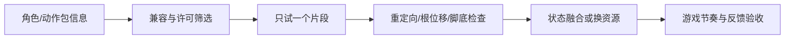

# D06｜轻战斗融入：现成攻击动作与可重复训练木桩

版本：统一课号课程版｜2026-09-15
状态：课件正文与互动规格已编写；尚未逐课生成OpenMAIC课堂或试教。

**学习分组：** D组；**本课编号：** D06；**路线：** 动作增强选修。

## 0. 开始前：只准备本课需要的东西

**本次起点：** D05已验证的一段原地攻击、现有控制器和一个木桩测试副本；动作来自资源复用，不要求原创。
**缺材料时：** 未选择此专题就跳过。已选择但缺材料时先做范围/方案判断，实际应用留待验证，不反过来阻塞基础版。
**当前配套：** 见0A的真实文件、首步与覆盖边界；文件存在不表示本课所有M已有完整配套。

**今天的最小任务：** 先完成单次攻击→有效命中→木桩反馈→恢复，再作为可绕过的训练角接入原收集关卡。
**怎样读：** 先看两项M和概念图，再复制对话1。启动框已带首步、继续条件和结束证据；之后用自己的话回复即可，不必把六框逐一重发。
**怎样停：** 完成当前小步可以暂停，记录下次起点；只有本课两项M都有相应证据才标本课应用通过。暂停不是失败，模拟完成不是软件通过。
**先学再验：** 初次允许AI示范一小步，你再换一个值/对象作选择；需要检查独立判断时换未讲过的变式，不要求从零手写代码。

## 0A. 这课怎样学、怎样查缺口

**学习顺序：** 短示范或预测 → 课堂随练 → 软件概念对照 → 自己解释 → 只补薄弱项。

**实际配套：** 没有专用软件Lab；先按本课材料分支做认识/模拟，不虚构文件。

**练习首步：** 先完成一段攻击和恢复移动，再加一次有效命中规则。

**配套局限：** 无完整木桩/动作工程；未选增强路线无需做。

**正式项目落点：** P10。实验只为理解；进入相应生产阶段再迁移。

**回忆与检查：** [本课记忆规则](../../print/memory-by-lesson.md#d06) · [单元检查](../../assessments/unit-checkpoints.md) · [AI追问与弱项诊断](../../assessments/ai-diagnostic-review.md)。

**记录分开：** 回忆/解释/软件应用/换情境；没有证据写待验证。菜单/API可查；得到根因提示记有提示。

## 1. 本课任务卡

**产出：** 先完成单次攻击→有效命中→木桩反馈→恢复，再作为可绕过的训练角接入原收集关卡。
**前置：** D05, B06, B07, C06；**对应概念：** KN06/KN07/KN16/KN18/KN21/ART09。
**预计课堂：** 20–30分钟，可在实验前后暂停；不含后续真实软件制作时间。
**M 必须掌握：**
- 借助AI接入一段兼容攻击动作，区分动画表现、有效窗口和命中规则。
- 亲测空挥、命中、防重复及结束/中断后的恢复，并验证不影响收集主线。
**K 理解即可：**
- Hitbox/Hurtbox、方法事件轨道、Hit stop和Root Motion知道用途，不要求全部采用。
- Hit flash、Impact particles、Trail、目标反应、短促Camera impulse/Shake，以及透视FOV Pulse或正交Size Pulse是可组合的打击感层；不要求每层都上。
**停止线：** 只用一个角色、一段原地单次攻击和一个木桩；不做连招、玩家受伤、敌人追踪、技能树、锁定或联网。

## 1A. 必学内容、实操与题目如何对应

M1/M2只是本课任务卡的两项能力序号，不是新的技术概念。查菜单/API不扣独立判断分。

|必须掌握到这里|本课实操题：做什么算有证据|可选配套题|
|---|---|---|
|M1：借助AI接入一段兼容攻击动作，区分动画表现、有效窗口和命中规则。|动作能播且规则明确，在运行中把接触姿态与有效窗口对照。|D06-P1, D06-T3|
|M2：亲测空挥、命中、防重复及结束/中断后的恢复，并验证不影响收集主线。|空挥不命中、同击同目标一次、原地第二击可再中、中断恢复；禁用训练角主线仍可通。|D06-D2, D06-T3|

**最低学习路径：** 一次预测 → 一个能覆盖上述两项M的小实验/项目改动 → 一次结果解释。普通M做到即可；关键薄弱处再选一题诊断或隔次迁移，不把P/D/T全套加到每个术语上。
**理解即可与停止线：** 任务卡中的K只检用途；按需查的界面、API、高级实现不进入本课操作门槛。只有已学且已存在的项目功能需要回归。

## 2. 必要讲解：先看现象，再给术语

本课选择单次、原地、兼容现成角色的动作。先只验证片段能播放且能返回待机，再加入玩法；没有许可清楚的片段时只能完成时间线模拟，不能宣称动作已经接入。参考资源不能因为买到就上传公开仓库。

攻击至少有准备、有效、恢复三个阶段。只在有效阶段、目标符合范围与对象规则、且本次攻击尚未计过该目标时记录一次命中。视觉武器碰上木桩不是自动的玩法判定；空挥应播放动作但不增加命中。下一次攻击需重新开始自己的去重记录，不把木桩永久标成已拾取。

初版规则明确为攻击期间暂停水平移动和新跳跃，但镜头可转；收势、取消、重开均恢复控制并关闭攻击有效状态。它是训练角的设计取舍，不是所有动作游戏的规则。把该取舍告诉AI，防止它顺便重写整个控制器。

方法事件轨道可以把回调对齐动画时间，但编辑器预览不执行这些事件，需要运行游戏验证。Area3D重叠信息按物理步更新；窗口开启前已经站在范围内的木桩也要检测，不能只等新进入信号。具体查询/事件实现可以由AI提供，学员检查结果与边界，不背API。

教学归一化时间线示例：0到0.35准备、0.35到0.55有效、0.55到1恢复。真片段按实际接触姿态标窗口，数字不是配方。改变动画速度后复测窗口、反馈和退出，不让固定墙钟Timer与动作时间各走各的。

轻战斗仍沿用资源复用原则：现成动作负责表演，玩法命中和反馈由游戏规则负责。只需把一个兼容攻击片段“套进”已有角色和木桩测试，不为证明能力从零做武打动画。

固定视角的打击感可以非常强，不需要自由相机。建议按层叠加而不是只靠震屏：第一层是玩法命中真的成立；第二层是目标反应（姿态、轻微后坐/位移、Squash等）；第三层是Hit flash、冲击粒子、武器Trail与声音；第四层才是很短的Hit stop、Camera impulse/Shake；透视镜头可选轻微FOV Pulse，正交镜头可用Size Pulse或极小镜头位移。每次只加一层做A/B。

“强震屏”不是禁用，而是不该成为所有攻击的默认。普通攻击可主要靠Hit stop、目标反应、粒子/Trail和声音；重击/Boss事件才提高镜头冲击。为容易晕3D的玩家保留低运动版本：关闭或降低Shake和FOV/Size Pulse后，命中仍应靠目标闪光、粒子、声音和动作停顿被清楚感知。

## 2A. 场景、概念图与逐步AI对话

**实际位置：** P07可选增强｜旁路训练角的单次攻击闭环。

|操作前的问题|本课希望得到的结果|
|---|---|
|动作能播却空挥也算命中，或攻击结束后不能继续探索。|原地攻击只在有效范围与时间命中木桩一次，反馈清楚，结束/取消后恢复，主线可绕过。|

这是目标对照，不是已完成的游戏截图。概念图为职责/因果示意，不是继承图或完整运行证明。

OpenMAIC不能渲染Mermaid时画等价方框图；无3D或真实连接时仅标课堂模拟，不伪造软件运行。

### 本课人和AI分别负责什么

|责任|这课具体做什么|
|---|---|
|我必须作出的判断|定义准备/有效/恢复与每次攻击去重规则，核对动作、命中、反馈而非一帧截图。|
|可以交给AI的制作|复用一段已核对动作，提供攻击编号/窗口/目标记录，最小命中与恢复测试。|
|我检查AI交付物|看修改对象/前后差异、实际执行记录及未验证项；先核对是否保留本课约束，再决定是否接入。|

**不是手工熟练考试：** 重复劳动与代码可委托；常用可见参数适合亲调时先调一项，无障碍需要可由AI按已选值执行。必须能说明选择、观察和恢复，不要求机械地拖每个滑杆。

**两种模式：** 练习时可问根因、看示范；独立验收时先由我提出选择/假设，AI只协助执行与记录。已透露本题根因或目标值，就记录“有提示”，再换未揭示答案的变式。

### 复制第1框开始；以后每次只发当前一步

**学员用法：** 无需一次读完所有提示。将当前框发给你使用的AI；做完后回“完成＋观察”，结果不符回“不符＋现象”，报错回“报错＋原文”，需要停下回“暂停”。自然语言也可以。不要一口气把六步当成自动执行授权。

### 对话1｜建立本课上下文

```text
请做我这节课的协作教练：D06《轻战斗融入：现成攻击动作与可重复训练木桩》。
我们逐步制作同一个「星光小庭院」，当前只解决：动作能播却空挥也算命中，或攻击结束后不能继续探索。
目标：原地攻击只在有效范围与时间命中木桩一次，反馈清楚，结束/取消后恢复，主线可绕过。
必须掌握：借助AI接入一段兼容攻击动作，区分动画表现、有效窗口和命中规则；亲测空挥、命中、防重复及结束/中断后的恢复，并验证不影响收集主线。理解即可：Hitbox/Hurtbox、方法事件轨道、Hit stop和Root Motion知道用途，不要求全部采用；Hit flash、Impact particles、Trail、目标反应、短促Camera impulse/Shake，以及透视FOV Pulse或正交Size Pulse是可组合的打击感层；不要求每层都上
停止线：只用一个角色、一段原地单次攻击和一个木桩；不做连招、玩家受伤、敌人追踪、技能树、锁定或联网。
必须保持：原走跑跳和镜头在非攻击时保持；攻击中暂停水平移动和新跳跃但允许镜头，结束或中断恢复。训练命中不改星星数，训练角不成为通关门槛。
本课由我负责：定义准备/有效/恢复与每次攻击去重规则，核对动作、命中、反馈而非一帧截图。
可以交给你：复用一段已核对动作，提供攻击编号/窗口/目标记录，最小命中与恢复测试。
请标明建议/已执行/已验证的区别。练习可提示；验收先等我作判断，已提示根因则如实记有提示。
概念配套：没有专用软件Lab；使用本课明确的材料分支
练习首步：先完成一段攻击和恢复移动，再加一次有效命中规则。
覆盖边界：无完整木桩/动作工程；未选增强路线无需做。
对应生产阶段：P10；达到当前阶段才迁移，不把实验完成当成项目通过。
先复用上述现有样本，不重新生成同一个Lab。练习可提示；检查先只读快照，不一边改答案一边评分。
先读取我已提供的进度和材料，只问真正缺失的一项。需要软件操作时核对实际版本、当前截图或场景树、可访问的工具；不要求我发密钥或整个电脑。
本课入场材料：D05已验证的一段原地攻击、现有控制器和一个木桩测试副本；动作来自资源复用，不要求原创。
材料不足的处理：未选择此专题就跳过。已选择但缺材料时先做范围/方案判断，实际应用留待验证，不反过来阻塞基础版。
以下是本课连续推进卡，不是一次性执行授权；收到我的观察后每轮最多推进一个有意义的小步。
首步：先用D05已验证的一段原地攻击，只确认动作能回到待机；不先加连招或敌人AI。
继续条件：动作播放后控制能恢复，主线移动/收集仍正常。
随后一步：再接一个有效窗口和木桩命中；空挥、同击一次、原地第二击与中断分别验证。
结束证据：动作能播且规则明确，在运行中把接触姿态与有效窗口对照。；空挥不命中、同击同目标一次、原地第二击可再中、中断恢复；禁用训练角主线仍可通。
相关回归：镜头、走跑跳、收集、完成、重开和禁用训练角的基础版均不退化。
这些是待执行要求，不是我的已完成进度。不要凭课号推断前置已通过；只复用我已提供的实际材料和证据。
对话1之后我可直接回复完成/不符/报错/暂停，无需重贴整课；你应沿这张推进卡继续，不临时增加系统。
先给一个预测问题并等我回答，再给一个最小步骤。不跳课、不自动做整款游戏。能执行才说已执行，否则给明确操作单或脚本，并标未执行。
后续每轮用四项回应：现在是哪一步；只改什么/怎样恢复；我应观察什么；目前还缺什么证据。没有证据不要替我勾通过。
```

**AI此时应做：** 确认当前场景与学习范围，不直接输出几十个文件。已经提供过的版本、素材和约束应复用，不重复问。

### 对话2｜先理解一个因果关系

```text
先问我：播放攻击时木桩自动加一次计数，算完成了吗？
等我写预测和理由后，再指出一个证据缺口，只给一个提示，不先公布完整答案。用词不专业时先确认意思，再补术语。
```

**转入下一步：** 有自己的预测即可；预测错可以用实验纠正，不要求先背定义。

### 对话3｜AI只完成第一小步

```text
沿用已确认的版本、材料和修改边界。现在只做：先用D05已验证的一段原地攻击，只确认动作能回到待机；不先加连招或敌人AI。
先列影响对象和原值，再提供一个可撤销初稿。没有实际软件连接时给我可执行的局部操作单/脚本，不说已经修改。做完先停下。
```

**预计看到／拿到：** 动作播放后控制能恢复，主线移动/收集仍正常。
**不是自动保证：** 这是验收目标，取决于实际模型、工具和输入；结果不同就走下方“不符”分支。

### 对话4｜人观察与亲调，再继续第二小步

```text
这是我刚才的实际结果：我会附一张当前图、短演示或必要日志，并用一句话描述差异。
先检查是否满足：动作播放后控制能恢复，主线移动/收集仍正常。
本课可用的微调项：
入口：实际片段预览/速度/过渡（内置或已暴露参数）；操作：固定命中规则，小幅调整一项再回放；观察：准备、接触、恢复是否清晰，脚底是否漂移
入口：有效窗口与命中范围（本项目自定义）；操作：依据真片段接触姿态改一项并在运行中验证；观察：空挥不记分，同一次只一次，下次还能命中
若满足，先指导我选择其中一项亲调；我回报观察后才继续：再接一个有效窗口和木桩命中；空挥、同击一次、原地第二击与中断分别验证。
一次只动一项可见参数。方向接近就手调；结构有误才给局部修复，不能不断重生成整个场景。
```

|选中哪里与参数性质|这次亲自试什么|观察与停手依据|
|---|---|---|
|实际片段预览/速度/过渡（内置或已暴露参数）|固定命中规则，小幅调整一项再回放|准备、接触、恢复是否清晰，脚底是否漂移|
|有效窗口与命中范围（本项目自定义）|依据真片段接触姿态改一项并在运行中验证|空挥不记分，同一次只一次，下次还能命中|

**保存与恢复：** 先记录原值和实际对象。优先在安全副本试；运行中Remote Inspector的变化不要当成已保存的设计值，确认后将选定值写回本地场景/资源或配置并重新运行。菜单路径随版本核对，自定义变量不冒充内置属性。
**采用哪种沟通：** 大方向偏了，用参考图圈出要借鉴的轮廓/色彩/光感，并指出不要照搬什么；单个视觉值接近了，先拖或输入数值；原因不明，固定条件做一次对照。参考图不是可自动反推所有参数的答案。

### 对话5｜成功验收，或失败时只修一处

**达到目标时发送：**
```text
请只根据我提供的证据检查：
- 动作能播且规则明确，在运行中把接触姿态与有效窗口对照。
- 空挥不命中、同击同目标一次、原地第二击可再中、中断恢复；禁用训练角主线仍可通。
旧功能回归：镜头、走跑跳、收集、完成、重开和禁用训练角的基础版均不退化。
缺少过程证据就标待验证；不得用一张截图证明走跳或一次性事件。不要新增需求或把所有候选题变成作业。
```

**结果不符或报错时发送：**
```text
不符/报错：我会提供触发步骤、预期、实际现象和必要原始日志。
保留：原走跑跳和镜头在非攻击时保持；攻击中暂停水平移动和新跳跃但允许镜头，结束或中断恢复。训练命中不改星星数，训练角不成为通关门槛。
本课优先风险：检查AI是否用更大攻击距离、持续强Shake或大幅动态FOV掩盖命中时序问题；也检查镜头效果结束后是否恢复基线，低运动设置下反馈是否仍清楚。
先提出一个可推翻的假设和一个最小验证；不要同时改多个系统。若两次验证仍无进展，回到基线并列出缺失证据，不反复抽卡。不要删除测试、关闭需求或扩大权限来假装修好。
```

**AI评分边界：** 代码和初稿可以由AI提供；判断、亲调与证据解释由学员完成。得到根因提示记为有提示，不因此重复考试所有概念。

### 对话6｜存进度，下一次接着做

```text
请总结本课D06（D06）的进度卡，不把预测当已完成。
记录：真实软件版本/渲染器；当前场景与变更对象；选定参数和原值；我做的判断；实际证据；通过/待验证；使用过的提示；恢复方法；下一步唯一任务。
只有实际验证才标通过，没有生成或真机执行就明确写模拟/待验证。给我一段可以复制到新AI对话的摘要，不假称你已持久保存。
先核对下一课前置和我的已选路线，未完成就停在当前步骤，不催着扩范围。
```

**学员保存：** 把进度卡存本地或私人笔记；下次粘贴进度卡和下一课第1框。不要公开API Key、账户、本地私密路径或个人录像。

### 当前风险与长期责任

**本课风险检查：** 检查AI是否用更大攻击距离、持续强Shake或大幅动态FOV掩盖命中时序问题；也检查镜头效果结束后是否恢复基线，低运动设置下反馈是否仍清楚。
这是需要在当前工具版本下核验的风险，不是所有AI必然失败的排行榜，也不预测何时改善。长期保留需求、参考选择、影响范围、结果认可与取舍责任；测量、批量设置和重复验证可以由AI协助。
**不把学习变成额外六次考试：** 六个对话阶段共享本课原有M/K证据；只在薄弱关键能力上追加一处故障或变式。没有实际材料时先做课堂模拟，真机状态单独记录。

## 3. 界面与参数学习深度

以下是软件操作的对应范围；优先使用0A已给出的实验，尚无配套的部分如实标待验证。模拟滑块是教学控件，不代表软件都有同名按钮。会调是指看懂作用、主动选择与恢复；会定位是知道去哪找；按需查不考菜单路径、快捷键和API记忆。
- 常用亲调：AnimationPlayer/Tree片段预览和过渡；攻击窗口与调速以实际实现暴露的参数为准。
- 会定位：攻击条件、木桩检测对象、方法事件轨道、控制恢复入口和命中日志。
- 按需查：重定向、IK和动作曲线；不要求原创武打或通用战斗框架。

## 4. 互动实验规格

**初始状态：** 原有控制与收集基线；独立TrainingCorner，一个木桩和一段待提供的兼容动作。课堂用原创形状与时间线，明确模拟不是引擎运行。
**可操作项：** 单击Attack、目标近/远、时间线单步、播放速度0.8到1.2、有效窗口标记、命中日志、取消、重置。项目变量是教学控件而非内置Godot属性。
**实验步骤：**
1. 先复用片段，只检查攻击结束能回待机；不同时接判定和特效。
2. 增加有效窗口及本次攻击对每目标一次的规则，分别做空挥、命中、站在范围内连续两次攻击。
3. 增加一个短木桩反应和稳定计数，测中断/重开/连续输入后恢复；并入可绕过训练角后再跑十星路线。
**预期反馈：** 显示攻击序号、阶段、目标序号与本次是否已命中；反馈只随有效事件触发。暂停播放便于看接触点，实际行为最终需真机验证。
**故障或反例：** 故障库每次选一处：动画开始就命中；站在区域内第二次打不到；连续物理帧重复记分；中断后控制一直锁住。不得同时注入全部错误。
**复位：** 取消当前攻击、关闭有效状态、清本轮去重、恢复控制与木桩、清演示计数；不触碰主线十星进度。
**无图/无3D替代：** 用原创简单形状、状态卡或给定时间序列表达同一因果关系；标明“示意”，不得把预设结果说成Godot/Blender实测。不能以假按钮或不响应的截图代替交互。
**完成判据：** 对本课两项M提供操作或判断及解释；一个实验可覆盖多项。只有关键M或发现薄弱处才追加故障/变式，不为每个术语加作业。

## 5. 小结与必须牢记

- 动作、命中、反馈分别验收。
- 每次攻击的去重不能阻止下一次攻击。
- 结束、中断、重开都恢复控制。

## 6. 训练：先作答，再看反馈

题干中的日志、数值与AI建议均为标明的教学情境，除非另附运行证据，不是本项目实测。可以有多个合理假设：先给能区分它们的验证，而不是猜老师心中的唯一原因。

P=预测，D=诊断，T=迁移，K=用途认识。下面是候选训练，不是每个词都做四次作业。课堂先用预测和一个操作，重点未达标再选D或T；延迟复测换对象，不重复抄答案。

### D06-P1
**考察范围：** M1的限定子能力；不是整项真机通过证明。先给判断与理由；要求操作时再提供过程/对照。仅答对文字不自动等于实际应用通过。

播放攻击时木桩自动加一次计数，算完成了吗？

### D06-D2
**考察范围：** M2的限定子能力；不是整项真机通过证明。先给判断与理由；要求操作时再提供过程/对照。仅答对文字不自动等于实际应用通过。

【教学构造情境，不是真实测量或某模型故障统计】角色一直站在木桩范围内。第一击计1，恢复后第二击计0；走出再进入又能计1。AI要把攻击距离翻倍。应区分“只等进入事件”和“每次攻击去重未清”哪类问题，最小需要哪些日志？

### D06-T3
**考察范围：** M1、M2的限定子能力；不是整项真机通过证明。先给判断与理由；要求操作时再提供过程/对照。仅答对文字不自动等于实际应用通过。

把动画调快后，哪些证据要重做？

### D06-K4
**考察范围：** K｜理解用途即可；不要求实现。一句用途解释即可。

编辑器预览看到动作，能证明方法事件已执行吗？

## 7. 正式项目迁移（达到相应阶段再做）

后续交付隔离训练场及集成开关；基础版可绕过训练角完成十星。增强版需真实兼容动作和命中/恢复证据。本轮只提供完整课件与对话，不新增战斗代码或动作资源。
即使已有参考工程，也要区分课件、运行测试、人工体验、学习掌握四种证据。已有Lab先随课使用；完整生产按任务单推进，未交付的逐课配套不冒充完成。

## 8. 实际应用验收：把结果放回同一个项目

**本课产物：** 原地攻击只在有效范围与时间命中木桩一次，反馈清楚，结束/取消后恢复，主线可绕过。
**接入边界：** 原走跑跳和镜头在非攻击时保持；攻击中暂停水平移动和新跳跃但允许镜头，结束或中断恢复。训练命中不改星星数，训练角不成为通关门槛。

以下是要采集的证据，不是宣称已经执行。记录“未尝试 / 有提示完成 / 独立验证 / 隔次仍会”；不把这四种状态与M/K学习要求混淆。

|原有M能力|本次在哪里取证|
|---|---|
|借助AI接入一段兼容攻击动作，区分动画表现、有效窗口和命中规则。|动作能播且规则明确，在运行中把接触姿态与有效窗口对照。|
|亲测空挥、命中、防重复及结束/中断后的恢复，并验证不影响收集主线。|空挥不命中、同击同目标一次、原地第二击可再中、中断恢复；禁用训练角主线仍可通。|

**旧功能回归：** 镜头、走跑跳、收集、完成、重开和禁用训练角的基础版均不退化。
**最小记录：** 一段现场演示，或同条件前后图/日志，加一句“我改了什么、为什么”。截图不足以证明运动/一次性事件时，要演示动作或查看对应状态。记录用过的提示，不要求写长报告。
**一般能力取证：** 一次有效操作/选择与解释即可；只有证据不足才补练，不强制反复考试。

**换情境的候选任务：** 更换一段兼容攻击或调整播放速度，只复测时间、范围、防重与恢复，不引入第二种技能。
**判定：** 普通M按原0–2锚点；有针对性根因提示记练习，换变式再验证。K只查用途，不能抵消关键M失败。没有真实操作的M只记待验证，模拟通过不能自动升级为真机通过。未选专题不阻塞主线。

**接入不等于新增系统：** 美术课可交风格卡、参数决定或改造样本；性能课可得出“不优化”。隔离实验只有对当前项目有收益才接入，不强迫庭院变成战斗、开放世界或联网游戏。

## 9. 复现与延迟检查

本课复现：A04, B06, C04, D05。只复习已学的关键M。
下次课抽一个本课关键判断，换对象或数值后先独立解释。查菜单和API不扣独立判断分；被提示根因或目标值后完成，记录有提示，换变式再验。K不反复背定义。

## 10. 依据与观看入口

- [Godot Retargeting 3D Skeletons](https://docs.godotengine.org/en/stable/tutorials/assets_pipeline/retargeting_3d_skeletons.html)
- [Godot动画轨道：方法事件不在编辑器预览执行](https://docs.godotengine.org/en/stable/tutorials/animation/animation_track_types.html)
- [Godot Area3D：监测、重叠和物理步更新](https://docs.godotengine.org/en/stable/classes/class_area3d.html)
- [Godot运行检查与可见碰撞工具](https://docs.godotengine.org/en/stable/tutorials/scripting/debug/overview_of_debugging_tools.html)
- [Godot Area3D：重叠列表的物理更新时机](https://docs.godotengine.org/en/stable/classes/class_area3d.html)
- [Godot动画事件轨道：编辑器预览与运行不同](https://docs.godotengine.org/en/stable/tutorials/animation/animation_track_types.html)

技术来源支持术语和软件边界；具体实验与课程顺序是本项目教学设计，不代表已证明学习效果。艺术家入口用于观看研习，不等于获得图片或素材再分发许可。
