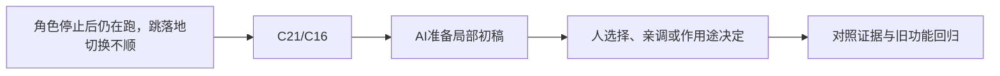

# E-02｜动画状态：动作片段如何接起来

> 兼容课号：I02。ABCDE是主题入口，不是必须按字母顺序完成；文件链接与题号保留稳定。

版本：Applied Curriculum v5｜2026-09-15
状态：课件正文与互动规格已编写；尚未逐课生成OpenMAIC课堂或试教。

## 1. 本课任务卡

**产出：** 设计待机、走跑、跳落地的切换条件，排除抖动与错切。
**前置：** I01；**对应概念：** C21/C16。
**预计课堂：** 20–30分钟，可在实验前后暂停；不含后续真实软件制作时间。
**M 必须掌握：**
- 用状态和条件选择片段，区分动画表现与角色运动。
- 调过渡时间并检查连续动作。
**K 理解即可：**
- Root Motion/IK/Blend分别是位移来源、局部约束和混合思路。
**停止线：** 不推动画混合算法，不强制Root Motion实现。

## 2. 必要讲解：先看现象，再给术语

AnimationPlayer保存片段，AnimationTree可组织混合和状态切换。脚本控制器与动作片段可能都含位移，要明确谁控制根移动。

状态条件优先于过渡好看：落地才回到移动，速度接近零时避免在待机和走之间抖动。短过渡不必越长越柔和。

## 2A. 这次在实际场景里解决什么

**应用位置：** P06｜角色停止后仍在跑，跳落地切换不顺；主项目中的功能、视觉或交付决定。

|开始时遇到的问题|本课期望得到的变化|
|---|---|
|现成动作可播放，但状态条件与真实运动脱节。|待机、走跑、起跳和落地按实际条件切换，异常可定位。|

**这是目标状态对照，不是已完成截图。** 首次操作应使用匹配当前进度的最小场景；还没有配套时，只能记为课堂模拟，不能直接勾选真机应用通过。

### 概念关系示意


图中箭头表示教学流程，不是引擎节点继承。OpenMAIC不支持Mermaid时改画等价方框图，不能把代码原文冒充运行示意。

### 先让AI帮助理解，再让AI帮助工作

**学习指令：**
```text
现在只检查这道判断：空中水平速度为零就应待机吗？
先等我给预测和理由，再指出一个证据缺口；一次只给一个线索，不先公布完整答案。
我的用词不专业时，先用人话确认意思，再补对应术语。
```

**工作指令：可复制；先补实际版本与当前材料，不粘贴密钥。**
```text
我正在逐步制作同一个小型单机「星光小庭院」，不是重新生成整款游戏。
我会提供实际软件版本、当前场景/文件和必要截图；先确认你能访问哪些材料和工具。
这次只做：只把已经验证的动作片段接到已有运动状态。先画输入/速度/落地到动画的条件表，再接状态；提供起停、跑跳、空中松键的连续测试，不靠根运动重写控制器。
必须保持：移动速度、物理位置来源、相机和碰撞不变。
先列出将改的对象、原值和预期结果，提供最小可撤销初稿及检查步骤。
没有真实软件连接时只提供操作单/脚本，不声称已经编辑、运行或看过未提供的截图。
不要自动安装插件、联网下载素材、购买服务或读取无关文件；必要操作另说明并取得授权。
完成后报告实际做了什么、还没验证什么；我负责选择和最终验收。
```

### 哪些地方比继续发指令更适合亲自试

|入口与性质|一次只做的微调/选择|亲眼观察什么|
|---|---|---|
|AnimationTree过渡时间（内置入口）|记录基线，少量调整同一组过渡|突然切换是否减轻，不能用超长混合遮掉错误状态|
|AnimationPlayer播放速度（内置）|在同一路线比较小幅调速|脚滑与身体速度的对应，不改变实际走速蒙混|

**初值与恢复：** 先读取并记录当前值；表里的方向是对照办法，不是通用最佳参数。先在副本上操作，不覆盖基底；返回前用撤销或记录值恢复并重新预览。自定义变量不是软件内置参数。
**选择下一步：** 方向不对，补一张明确参考并圈出要借鉴的部分；结构/因果不对，让AI做局部修复；已接近目标且入口可直接操作，先亲调一项。原因不明先做对照，不靠反复重生成抽卡。

**局部修复指令：**
```text
保留本课「必须保持」的部分。我会给出同条件的当前结果和目标差异。
只围绕「待机、走跑、起跳和落地按实际条件切换，异常可定位。」检查一个根因假设；先给最小验证，未经证据不要重写全部内容。
若只是一个可见参数偏差，告诉我该选哪个对象、哪个入口、怎么小幅调和恢复。
```

**本课风险检查：** 检查AI是否把动画视觉状态当落地物理事实，或让根位移与控制器双重驱动。
**时间边界：** 上述是需要在当前模型/工具/软件版本下验证的风险清单，不是所有AI必然失败的结论，也不预测何时会解决。长期保留的是目标、约束、参考选择、结果认可和取舍责任；测量和重复调整可以继续交给AI协助。

## 3. 界面与参数学习深度

以下是后续真机操作的对应范围，不要求本轮打开软件。模拟滑块是教学控件，不代表软件都有同名按钮。会调是指看懂作用、主动选择与恢复；会定位是知道去哪找；按需查不考菜单路径、快捷键和API记忆。
- 常用：片段预览、状态条件、过渡时间。
- 会定位：AnimationPlayer/AnimationTree与参数面板。
- 按需查：BlendSpace、Root Motion提取、IK算法。

## 4. 互动实验规格

**初始状态：** 待机/走/跑/跳四卡，speed=0、grounded=true；用简化骨架或时间条，不伪称真实动画素材。
**可操作项：** 速度0到7、grounded开关、过渡0到0.4秒、连续输入测试。
**实验步骤：**
1. 写三个切换条件后再连线。
2. 连续启停和跳落地，读状态日志。
3. 只改变过渡时长，看过长过渡是否让动作迟钝。
**预期反馈：** 当前状态、条件与片段时间同时显示；动画与位置分别显示。
**故障或反例：** 故障：空中speed=0时错误回Idle；应纳入落地条件。
**复位：** 清空状态机回到站立初态，恢复速度和过渡。
**无图/无3D替代：** 用原创简单形状、状态卡或给定时间序列表达同一因果关系；标明“示意”，不得把预设结果说成Godot/Blender实测。不能以假按钮或不响应的截图代替交互。
**完成判据：** 对本课两项M提供操作或判断及解释；一个实验可覆盖多项。只有关键M或发现薄弱处才追加故障/变式，不为每个术语加作业。

## 5. 小结与必须牢记

- 先对条件，再调过渡。
- 动作播放不等于移动正确。
- 避免双重根位移。

## 6. 训练：先作答，再看反馈

P=预测，D=诊断，T=迁移，K=用途认识。下面是候选训练，不是每个词都做四次作业。课堂先用预测和一个操作，重点未达标再选D或T；延迟复测换对象，不重复抄答案。

### I02-P1
空中水平速度为零就应待机吗？

### I02-D2
人物走路脚滑一定是模型坏了吗？

### I02-T3
新增慢走片段，怎样验证没有破坏跳跃？

### I02-K4
Root Motion大概指什么？

## 7. 后续真机任务（配套待做，不作为当前课堂依赖）

后续使用现成动画，学员只调条件与节奏。
即使已有参考工程，也要区分课件、运行测试、人工体验、学习掌握四种证据。按用户安排，当前先完成全部课件，之后再统一补素材、Godot/Blender起始与参考工程。

## 8. 实际应用验收：把结果放回同一个项目

**本课产物：** 待机、走跑、起跳和落地按实际条件切换，异常可定位。
**接入边界：** 移动速度、物理位置来源、相机和碰撞不变。

以下是要采集的证据，不是宣称已经执行。记录“未尝试 / 有提示完成 / 独立验证 / 隔次仍会”；不把这四种状态与M/K学习要求混淆。

|原有M能力|本次在哪里取证|
|---|---|
|用状态和条件选择片段，区分动画表现与角色运动。|能用条件表说明为什么此时播放这个动作。|
|调过渡时间并检查连续动作。|能识别条件错误与过渡不舒服的区别，再局部修改并复测。|

**旧功能回归：** 站立、移动、跳跃的物理结果保持；重复切换不累积异常偏移。
**最小记录：** 一段现场演示，或同条件前后图/日志，加一句“我改了什么、为什么”。截图不足以证明运动/一次性事件时，要演示动作或查看对应状态。记录用过的提示，不要求写长报告。
**关键能力复测：** 本课高频或返工风险较高，已有有效证据可复用；薄弱处增加一个未知故障或隔次变式，不把每个词都变成一套试卷。

**换情境的候选任务：** 把走路片段换成同骨架新片段，重新调过渡而不复用旧结论。
**判定：** 普通M按原0–2锚点；有针对性根因提示记练习，换变式再验证。K只查用途，不能抵消关键M失败。没有真实操作的M只记待验证，模拟通过不能自动升级为真机通过。未选专题不阻塞主线。

**接入不等于新增系统：** 美术课可交风格卡、参数决定或改造样本；性能课可得出“不优化”。隔离实验只有对当前项目有收益才接入，不强迫庭院变成战斗、开放世界或联网游戏。

## 9. 复现与延迟检查

本课复现：B10, B05。只复习已学的关键M。
下次课抽一个本课关键判断，换对象或数值后先独立解释。查菜单和API不扣独立判断分；被提示根因或目标值后完成，记录有提示，换变式再验。K不反复背定义。

## 10. 依据与观看入口

- [Godot AnimationTree：动画组织](https://docs.godotengine.org/en/stable/tutorials/animation/animation_tree.html)
- [Godot Retargeting 3D Skeletons](https://docs.godotengine.org/en/stable/tutorials/assets_pipeline/retargeting_3d_skeletons.html)

技术来源支持术语和软件边界；具体实验与课程顺序是本项目教学设计，不代表已证明学习效果。艺术家入口用于观看研习，不等于获得图片或素材再分发许可。
