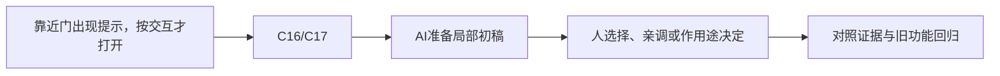

# E-08｜可交互对象：提示、条件和结果

> 兼容课号：I09。ABCDE是主题入口，不是必须按字母顺序完成；文件链接与题号保留稳定。

版本：Applied Curriculum v5｜2026-09-15
状态：课件正文与互动规格已编写；尚未逐课生成OpenMAIC课堂或试教。

## 1. 本课任务卡

**产出：** 让一个开关或门可理解地交互，并拒绝距离外操作。
**前置：** I04；**对应概念：** C16/C17。
**预计课堂：** 20–30分钟，可在实验前后暂停；不含后续真实软件制作时间。
**M 必须掌握：**
- 把目标提示、可交互条件和状态结果对应起来。
- 复用一条交互链而不让对象乱改全局UI。
**K 理解即可：**
- 射线检测是一种选择目标的方法。
**停止线：** 不要求通用背包，亦不依赖导航选修。

## 2. 必要讲解：先看现象，再给术语

提示告诉玩家现在能做什么，条件决定是否真的能做。提示出现但按键无效，或远处也能触发，都破坏可理解性。

对象报告交互结果，UI呈现提示；状态归属要明确。钥匙需求可以先用布尔条件模拟，不因此展开完整物品系统。

## 2A. 这次在实际场景里解决什么

**应用位置：** P06｜靠近门出现提示，按交互才打开；主项目中的功能、视觉或交付决定。

|开始时遇到的问题|本课期望得到的变化|
|---|---|
|远处也能开门，或一个对象直接乱改其他对象的UI。|提示、条件、目标和动作结果明确归属，交互只作用当前目标。|

**这是目标状态对照，不是已完成截图。** 首次操作应使用匹配当前进度的最小场景；还没有配套时，只能记为课堂模拟，不能直接勾选真机应用通过。

### 概念关系示意


图中箭头表示教学流程，不是引擎节点继承。OpenMAIC不支持Mermaid时改画等价方框图，不能把代码原文冒充运行示意。

### 先让AI帮助理解，再让AI帮助工作

**学习指令：**
```text
现在只检查这道判断：显示按E是否就表示条件有效？
先等我给预测和理由，再指出一个证据缺口；一次只给一个线索，不先公布完整答案。
我的用词不专业时，先用人话确认意思，再补对应术语。
```

**工作指令：可复制；先补实际版本与当前材料，不粘贴密钥。**
```text
我正在逐步制作同一个小型单机「星光小庭院」，不是重新生成整款游戏。
我会提供实际软件版本、当前场景/文件和必要截图；先确认你能访问哪些材料和工具。
这次只做：复用门和已有输入，准备距离/目标/状态检查，只给当前对象显示提示。定义交互请求和结果，不引入通用背包；解释切换目标时谁清理旧提示。
必须保持：拾取自动检测和门的交互按键不混合；全局计数与玩家运动不变。
先列出将改的对象、原值和预期结果，提供最小可撤销初稿及检查步骤。
没有真实软件连接时只提供操作单/脚本，不声称已经编辑、运行或看过未提供的截图。
不要自动安装插件、联网下载素材、购买服务或读取无关文件；必要操作另说明并取得授权。
完成后报告实际做了什么、还没验证什么；我负责选择和最终验收。
```

### 哪些地方比继续发指令更适合亲自试

|入口与性质|一次只做的微调/选择|亲眼观察什么|
|---|---|---|
|交互距离（自定义或射线长度）|固定视角，改变允许距离|提示出现范围与真正可执行范围是否一致|
|提示位置/字体（Control内置）|固定目标再调整视觉位置|是否挡住门或与收集提示混淆|

**初值与恢复：** 先读取并记录当前值；表里的方向是对照办法，不是通用最佳参数。先在副本上操作，不覆盖基底；返回前用撤销或记录值恢复并重新预览。自定义变量不是软件内置参数。
**选择下一步：** 方向不对，补一张明确参考并圈出要借鉴的部分；结构/因果不对，让AI做局部修复；已接近目标且入口可直接操作，先亲调一项。原因不明先做对照，不靠反复重生成抽卡。

**局部修复指令：**
```text
保留本课「必须保持」的部分。我会给出同条件的当前结果和目标差异。
只围绕「提示、条件、目标和动作结果明确归属，交互只作用当前目标。」检查一个根因假设；先给最小验证，未经证据不要重写全部内容。
若只是一个可见参数偏差，告诉我该选哪个对象、哪个入口、怎么小幅调和恢复。
```

**本课风险检查：** 检查AI是否只检查距离不检查目标、每个对象直接改全局UI，或提示和行为范围不一致。
**时间边界：** 上述是需要在当前模型/工具/软件版本下验证的风险清单，不是所有AI必然失败的结论，也不预测何时会解决。长期保留的是目标、约束、参考选择、结果认可和取舍责任；测量和重复调整可以继续交给AI协助。

## 3. 界面与参数学习深度

以下是后续真机操作的对应范围，不要求本轮打开软件。模拟滑块是教学控件，不代表软件都有同名按钮。会调是指看懂作用、主动选择与恢复；会定位是知道去哪找；按需查不考菜单路径、快捷键和API记忆。
- Godot：检测距离、对象组、提示文本和状态条件。
- 会定位：RayCast3D结果和信号。
- 按需查：完整交互框架。

## 4. 互动实验规格

**初始状态：** 门与按钮两个目标，距离与视线标签；一次只允许一个当前目标。
**可操作项：** 距离1到5、视线遮挡、交互键、locked条件、提示开关。
**实验步骤：**
1. 先预测距离外或被遮挡时的结果。
2. 比较提示与实际触发；改变目标确保旧提示消失。
3. 把按钮换成宝箱，复用条件链而改变结果。
**预期反馈：** 每次失败有可理解原因，但不泄露不该显示的游戏信息；日志与状态对应。
**故障或反例：** 故障：目标已离开但旧提示仍在，按键修改旧对象；清理当前目标与UI。
**复位：** 清空目标、提示和对象状态。
**无图/无3D替代：** 用原创简单形状、状态卡或给定时间序列表达同一因果关系；标明“示意”，不得把预设结果说成Godot/Blender实测。不能以假按钮或不响应的截图代替交互。
**完成判据：** 对本课两项M提供操作或判断及解释；一个实验可覆盖多项。只有关键M或发现薄弱处才追加故障/变式，不为每个术语加作业。

## 5. 小结与必须牢记

- 提示与可操作条件一致。
- 目标过期要清理。
- 对象状态不藏在UI。

## 6. 训练：先作答，再看反馈

P=预测，D=诊断，T=迁移，K=用途认识。下面是候选训练，不是每个词都做四次作业。课堂先用预测和一个操作，重点未达标再选D或T；延迟复测换对象，不重复抄答案。

### I09-P1
显示按E是否就表示条件有效？

### I09-D2
离开门后仍操作旧门，优先查什么？

### I09-T3
按钮改成一次性宝箱，增加什么检查？

### I09-K4
射线在交互中有什么用途？

## 7. 后续真机任务（配套待做，不作为当前课堂依赖）

后续可用开关作为最小实现，不先做背包。
即使已有参考工程，也要区分课件、运行测试、人工体验、学习掌握四种证据。按用户安排，当前先完成全部课件，之后再统一补素材、Godot/Blender起始与参考工程。

## 8. 实际应用验收：把结果放回同一个项目

**本课产物：** 提示、条件、目标和动作结果明确归属，交互只作用当前目标。
**接入边界：** 拾取自动检测和门的交互按键不混合；全局计数与玩家运动不变。

以下是要采集的证据，不是宣称已经执行。记录“未尝试 / 有提示完成 / 独立验证 / 隔次仍会”；不把这四种状态与M/K学习要求混淆。

|原有M能力|本次在哪里取证|
|---|---|
|把目标提示、可交互条件和状态结果对应起来。|能区分提示可见与条件满足，说明请求由谁处理。|
|复用一条交互链而不让对象乱改全局UI。|能切换目标、超出范围、重复按键并验证状态不串。|

**旧功能回归：** 原自动拾取继续正常；UI不残留上一扇门提示。
**最小记录：** 一段现场演示，或同条件前后图/日志，加一句“我改了什么、为什么”。截图不足以证明运动/一次性事件时，要演示动作或查看对应状态。记录用过的提示，不要求写长报告。
**一般能力取证：** 一次有效操作/选择与解释即可；只有证据不足才补练，不强制反复考试。

**换情境的候选任务：** 把门换成可读告示牌，保留检测思路但更换结果职责。
**判定：** 普通M按原0–2锚点；有针对性根因提示记练习，换变式再验证。K只查用途，不能抵消关键M失败。没有真实操作的M只记待验证，模拟通过不能自动升级为真机通过。未选专题不阻塞主线。

**接入不等于新增系统：** 美术课可交风格卡、参数决定或改造样本；性能课可得出“不优化”。隔离实验只有对当前项目有收益才接入，不强迫庭院变成战斗、开放世界或联网游戏。

## 9. 复现与延迟检查

本课复现：B10, I03。只复习已学的关键M。
下次课抽一个本课关键判断，换对象或数值后先独立解释。查菜单和API不扣独立判断分；被提示根因或目标值后完成，记录有提示，换变式再验。K不反复背定义。

## 10. 依据与观看入口

- [Godot Area3D：重叠检测与信号](https://docs.godotengine.org/en/stable/classes/class_area3d.html)
- [Godot Resources：共享和引用](https://docs.godotengine.org/en/stable/tutorials/scripting/resources.html)

技术来源支持术语和软件边界；具体实验与课程顺序是本项目教学设计，不代表已证明学习效果。艺术家入口用于观看研习，不等于获得图片或素材再分发许可。
