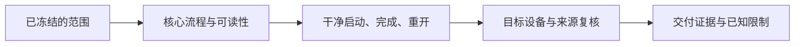

# E-09｜精致Demo结业：完整探索关卡与可选训练角

> 兼容课号：I12。ABCDE是主题入口，不是必须按字母顺序完成；文件链接与题号保留稳定。

版本：Audited Collaboration v7｜2026-09-15
状态：课件正文与互动规格已编写；尚未逐课生成OpenMAIC课堂或试教。

## 0. 开始前：只准备本课需要的东西

**本次起点：** 已完成的基础版可探索小关卡、来源与实际测试记录；仅选择增强版者再准备训练角证据。
**缺材料时：** 先用课内模拟辨清概念。缺起始场景时仅准备最小搭建清单；不要让新手为了上本课先生成整款游戏，真机应用保持待验证。
**当前配套：** 本课起始包尚未由这一轮交付；不要把下方目标、代码建议或示意看成已经存在的工程。

**今天的最小任务：** 交付有统一世界观感、清楚探索路线与可靠十星循环的小关卡；选择增强版时再验收训练角。
**怎样读：** 先看两项M和概念图，再复制对话1。启动框已带首步、继续条件和结束证据；之后用自己的话回复即可，不必把六框逐一重发。
**怎样停：** 完成当前小步可以暂停，记录下次起点；只有本课两项M都有相应证据才标本课应用通过。暂停不是失败，模拟完成不是软件通过。
**逐渐减少代答：** 本课先由你写一个目标、修改范围和验证办法，AI再执行或补一个线索。可以请求示范，但那次记录为有提示练习，不以拒绝帮助作为考核。

## 1. 本课任务卡

**产出：** 交付有统一世界观感、清楚探索路线与可靠十星循环的小关卡；选择增强版时再验收训练角。
**前置：** I11, I02, I04, I14；**对应概念：** C16/C21/C24/C25/C26。
**预计课堂：** 20–30分钟，可在实验前后暂停；不含后续真实软件制作时间。
**M 必须掌握：**
- 从首次启动走完收集、完成和重开，并用证据说明地图、美术和控制可用。
- 按基础版或增强版的明确范围检查回归、性能与来源，不靠删需求或隐藏错误过关。
**K 理解即可：**
- 只抽已选路线的用途词；未选导航和高级专题不考。
**停止线：** 不同时强制敌人、机关、战斗、多人；控制原型范围。

## 1A. 必学内容、实操与题目如何对应

M1/M2只是本课任务卡的两项能力序号，不是新的技术概念。查菜单/API不扣独立判断分。

|必须掌握到这里|本课实操题：做什么算有证据|可选配套题|
|---|---|---|
|M1：从首次启动走完收集、完成和重开，并用证据说明地图、美术和控制可用。|从首次启动连续走完三段回路、十星、完成、重开，解释地图和美术取舍。|I12-P1, I12-T3|
|M2：按基础版或增强版的明确范围检查回归、性能与来源，不靠删需求或隐藏错误过关。|同一构建对齐功能/性能/来源证据；选增强版才验证训练角，可禁用后主线仍通。|I12-P1, I12-D2, I12-T3|

**最低学习路径：** 一次预测 → 一个能覆盖上述两项M的小实验/项目改动 → 一次结果解释。普通M做到即可；关键薄弱处再选一题诊断或隔次迁移，不把P/D/T全套加到每个术语上。
**理解即可与停止线：** 任务卡中的K只检用途；按需查的界面、API、高级实现不进入本课操作门槛。只有已学且已存在的项目功能需要回归。

## 2. 必要讲解：先看现象，再给术语

中级不是功能越多越好，而是少量功能连接可靠。一个清楚的目标、一种交互、合理反馈、失败恢复比五个未完成系统更有价值。

已有初级证据可复用，只抽关键变式。评价包括解释取舍，而不是要求学员从空白手写所有脚本。

基础版以庭院—林路—观景台回路为目标，十颗星全部可达，三处观察点风格统一，路线可辨。增强版才增加X02训练角：主线不依赖命中，攻击、空挥与恢复分别验收。增强版不是全体学员必修条件。

先做一次不看讲义的连续游玩，再抽一个已学关键概念的变式。若要改变目标设备、输入方式或美术风格，记录新的约束，不把原验收结论直接搬过来。

## 2A. 场景、概念图与逐步AI对话

**实际位置：** P06c/P07｜精致Demo的基础版与增强版验收。

|操作前的问题|本课希望得到的结果|
|---|---|
|局部任务分别通过，但整段探索、风格和交付尚未连起来。|基础版三段地图十星循环可靠；增强版额外有可绕过的攻击木桩闭环。|

这是目标对照，不是已完成的游戏截图。概念图为职责/因果示意，不是继承图或完整运行证明。

OpenMAIC不能渲染Mermaid时画等价方框图；无3D或真实连接时仅标课堂模拟，不伪造软件运行。

### 本课人和AI分别负责什么

|责任|这课具体做什么|
|---|---|
|我必须作出的判断|明确基础版或增强版，按当前版本证据决定交付还是缩减未选扩展。|
|可以交给AI的制作|组织最终路线/回归表及缺口清单，不替学员捏造通过记录。|
|我检查AI交付物|看修改对象/前后差异、实际执行记录及未验证项；先核对是否保留本课约束，再决定是否接入。|

**不是手工熟练考试：** 重复劳动与代码可委托；常用可见参数适合亲调时先调一项，无障碍需要可由AI按已选值执行。必须能说明选择、观察和恢复，不要求机械地拖每个滑杆。

**两种模式：** 练习时可问根因、看示范；独立验收时先由我提出选择/假设，AI只协助执行与记录。已透露本题根因或目标值，就记录“有提示”，再换未揭示答案的变式。

### 复制第1框开始；以后每次只发当前一步

**学员用法：** 无需一次读完所有提示。将当前框发给你使用的AI；做完后回“完成＋观察”，结果不符回“不符＋现象”，报错回“报错＋原文”，需要停下回“暂停”。自然语言也可以。不要一口气把六步当成自动执行授权。

### 对话1｜建立本课上下文

```text
请做我这节课的协作教练：E-09（兼容课号I12）《精致Demo结业：完整探索关卡与可选训练角》。
我们逐步制作同一个「星光小庭院」，当前只解决：局部任务分别通过，但整段探索、风格和交付尚未连起来。
目标：基础版三段地图十星循环可靠；增强版额外有可绕过的攻击木桩闭环。
必须掌握：从首次启动走完收集、完成和重开，并用证据说明地图、美术和控制可用；按基础版或增强版的明确范围检查回归、性能与来源，不靠删需求或隐藏错误过关。理解即可：只抽已选路线的用途词；未选导航和高级专题不考
停止线：不同时强制敌人、机关、战斗、多人；控制原型范围。
必须保持：基础十星、原角色/相机行为、已选风格与目标平台固定；未选战斗/导航不成为门槛。
本课由我负责：明确基础版或增强版，按当前版本证据决定交付还是缩减未选扩展。
可以交给你：组织最终路线/回归表及缺口清单，不替学员捏造通过记录。
请标明建议/已执行/已验证的区别。练习可提示；验收先等我作判断，已提示根因则如实记有提示。
先读取我已提供的进度和材料，只问真正缺失的一项。需要软件操作时核对实际版本、当前截图或场景树、可访问的工具；不要求我发密钥或整个电脑。
本课入场材料：已完成的基础版可探索小关卡、来源与实际测试记录；仅选择增强版者再准备训练角证据。
材料不足的处理：先用课内模拟辨清概念。缺起始场景时仅准备最小搭建清单；不要让新手为了上本课先生成整款游戏，真机应用保持待验证。
以下是本课连续推进卡，不是一次性执行授权；收到我的观察后每轮最多推进一个有意义的小步。
首步：先由我选择基础版或增强版，按项目质量表核对范围，不增加临时新需求。
继续条件：三段路线、十星、三个视觉观察点和完整重开有实际证据。
随后一步：只修一个阻碍交付的缺陷；增强版额外验空挥、防重和控制恢复。
结束证据：从首次启动连续走完三段回路、十星、完成、重开，解释地图和美术取舍。；同一构建对齐功能/性能/来源证据；选增强版才验证训练角，可禁用后主线仍通。
相关回归：用相同目标设备、分辨率和路线核对原控制、碰撞、资源往返、提示与恢复。
验收时先等我提出目标、修改范围和验证办法，不先替我判断；若我请求帮助，切回练习并如实记录提示。
这些是待执行要求，不是我的已完成进度。不要凭课号推断前置已通过；只复用我已提供的实际材料和证据。
对话1之后我可直接回复完成/不符/报错/暂停，无需重贴整课；你应沿这张推进卡继续，不临时增加系统。
先给一个预测问题并等我回答，再给一个最小步骤。不跳课、不自动做整款游戏。能执行才说已执行，否则给明确操作单或脚本，并标未执行。
后续每轮用四项回应：现在是哪一步；只改什么/怎样恢复；我应观察什么；目前还缺什么证据。没有证据不要替我勾通过。
```

**AI此时应做：** 确认当前场景与学习范围，不直接输出几十个文件。已经提供过的版本、素材和约束应复用，不重复问。

### 对话2｜先理解一个因果关系

```text
先问我：选基础版交付：十星回路和重开必须可用，训练角未选。AI提议先做连招展示，暂不修重开。你怎样按目标安排优先级？
等我写预测和理由后，再指出一个证据缺口，只给一个提示，不先公布完整答案。用词不专业时先确认意思，再补术语。
```

**转入下一步：** 有自己的预测即可；预测错可以用实验纠正，不要求先背定义。

### 对话3｜AI只完成第一小步

```text
沿用已确认的版本、材料和修改边界。现在只做：先由我选择基础版或增强版，按项目质量表核对范围，不增加临时新需求。
先列影响对象和原值，再提供一个可撤销初稿。没有实际软件连接时给我可执行的局部操作单/脚本，不说已经修改。做完先停下。
```

**预计看到／拿到：** 三段路线、十星、三个视觉观察点和完整重开有实际证据。
**不是自动保证：** 这是验收目标，取决于实际模型、工具和输入；结果不同就走下方“不符”分支。

### 对话4｜人观察与亲调，再继续第二小步

```text
这是我刚才的实际结果：我会附一张当前图、短演示或必要日志，并用一句话描述差异。
先检查是否满足：三段路线、十星、三个视觉观察点和完整重开有实际证据。
本课可用的微调项：
入口：完整路线与三个玩家观察点（验收入口）；操作：固定输入参数跑同一路线，比较一项改动；观察：迷路、遮挡、反馈、完成和重开是否改善
入口：训练角启用配置（本项目自定义，仅增强版）；操作：开和关分别回归，不改星星计数；观察：攻击防重/恢复与基础收集互不破坏
若满足，先指导我选择其中一项亲调；我回报观察后才继续：只修一个阻碍交付的缺陷；增强版额外验空挥、防重和控制恢复。
一次只动一项可见参数。方向接近就手调；结构有误才给局部修复，不能不断重生成整个场景。
```

|选中哪里与参数性质|这次亲自试什么|观察与停手依据|
|---|---|---|
|完整路线与三个玩家观察点（验收入口）|固定输入参数跑同一路线，比较一项改动|迷路、遮挡、反馈、完成和重开是否改善|
|训练角启用配置（本项目自定义，仅增强版）|开和关分别回归，不改星星计数|攻击防重/恢复与基础收集互不破坏|

**保存与恢复：** 先记录原值和实际对象。优先在安全副本试；运行中Remote Inspector的变化不要当成已保存的设计值，确认后将选定值写回本地场景/资源或配置并重新运行。菜单路径随版本核对，自定义变量不冒充内置属性。
**采用哪种沟通：** 大方向偏了，用参考图圈出要借鉴的轮廓/色彩/光感，并指出不要照搬什么；单个视觉值接近了，先拖或输入数值；原因不明，固定条件做一次对照。参考图不是可自动反推所有参数的答案。

### 对话5｜成功验收，或失败时只修一处

**达到目标时发送：**
```text
请只根据我提供的证据检查：
- 从首次启动连续走完三段回路、十星、完成、重开，解释地图和美术取舍。
- 同一构建对齐功能/性能/来源证据；选增强版才验证训练角，可禁用后主线仍通。
旧功能回归：用相同目标设备、分辨率和路线核对原控制、碰撞、资源往返、提示与恢复。
缺少过程证据就标待验证；不得用一张截图证明走跳或一次性事件。不要新增需求或把所有候选题变成作业。
```

**结果不符或报错时发送：**
```text
不符/报错：我会提供触发步骤、预期、实际现象和必要原始日志。
保留：基础十星、原角色/相机行为、已选风格与目标平台固定；未选战斗/导航不成为门槛。
本课优先风险：检查AI是否用漂亮截图代替连续游玩、把选修加入通关门槛、隐瞒失败或报告未执行的性能数据。
先提出一个可推翻的假设和一个最小验证；不要同时改多个系统。若两次验证仍无进展，回到基线并列出缺失证据，不反复抽卡。不要删除测试、关闭需求或扩大权限来假装修好。
```

**AI评分边界：** 代码和初稿可以由AI提供；判断、亲调与证据解释由学员完成。得到根因提示记为有提示，不因此重复考试所有概念。

### 对话6｜存进度，下一次接着做

```text
请总结本课E-09（I12）的进度卡，不把预测当已完成。
记录：真实软件版本/渲染器；当前场景与变更对象；选定参数和原值；我做的判断；实际证据；通过/待验证；使用过的提示；恢复方法；下一步唯一任务。
只有实际验证才标通过，没有生成或真机执行就明确写模拟/待验证。给我一段可以复制到新AI对话的摘要，不假称你已持久保存。
先核对下一课前置和我的已选路线，未完成就停在当前步骤，不催着扩范围。
```

**学员保存：** 把进度卡存本地或私人笔记；下次粘贴进度卡和下一课第1框。不要公开API Key、账户、本地私密路径或个人录像。

### 当前风险与长期责任

**本课风险检查：** 检查AI是否用漂亮截图代替连续游玩、把选修加入通关门槛、隐瞒失败或报告未执行的性能数据。
这是需要在当前工具版本下核验的风险，不是所有AI必然失败的排行榜，也不预测何时改善。长期保留需求、参考选择、影响范围、结果认可与取舍责任；测量、批量设置和重复验证可以由AI协助。
**不把学习变成额外六次考试：** 六个对话阶段共享本课原有M/K证据；只在薄弱关键能力上追加一处故障或变式。没有实际材料时先做课堂模拟，真机状态单独记录。

## 3. 界面与参数学习深度

以下是后续真机操作的对应范围，不要求本轮打开软件。模拟滑块是教学控件，不代表软件都有同名按钮。会调是指看懂作用、主动选择与恢复；会定位是知道去哪找；按需查不考菜单路径、快捷键和API记忆。
- 只复用已学界面和参数。
- 会定位：打包与证据记录。
- 按需查：实现代码和具体平台选项。

## 4. 互动实验规格

**初始状态：** 两条范围卡：机关解锁出口，或简单巡逻避让；两者选一，不要求同时做。
**可操作项：** 选择路线、关键测试抽签、保存/重开、窄窗口、条件记录。
**实验步骤：**
1. 写一个最小完成路径和不做清单。
2. 按路径测试一次正常和一个关键异常。
3. 隔次改变一个对象/约束，检查方案是否仍适用。
**预期反馈：** 分别标材料齐全、技术通过、人工通过、学习迁移；不把一项代替另一项。
**故障或反例：** 故障：为赶完成删除失败恢复；重新限定范围而不删底线。
**复位：** 保留可交付基线，撤回未完成实验。
**无图/无3D替代：** 用原创简单形状、状态卡或给定时间序列表达同一因果关系；标明“示意”，不得把预设结果说成Godot/Blender实测。不能以假按钮或不响应的截图代替交互。
**完成判据：** 对本课两项M提供操作或判断及解释；一个实验可覆盖多项。只有关键M或发现薄弱处才追加故障/变式，不为每个术语加作业。

## 5. 小结与必须牢记

- 少而完整胜过多而破碎。
- 各类验证分别记录。
- 未选的高级知识不阻塞交付。

## 6. 训练：先作答，再看反馈

题干中的日志、数值与AI建议均为标明的教学情境，除非另附运行证据，不是本项目实测。可以有多个合理假设：先给能区分它们的验证，而不是猜老师心中的唯一原因。

P=预测，D=诊断，T=迁移，K=用途认识。下面是候选训练，不是每个词都做四次作业。课堂先用预测和一个操作，重点未达标再选D或T；延迟复测换对象，不重复抄答案。

### I12-P1
**考察范围：** M1、M2的限定子能力；不是整项真机通过证明。先给判断与理由；要求操作时再提供过程/对照。仅答对文字不自动等于实际应用通过。

选基础版交付：十星回路和重开必须可用，训练角未选。AI提议先做连招展示，暂不修重开。你怎样按目标安排优先级？

### I12-D2
**考察范围：** M2的限定子能力；不是整项真机通过证明。先给判断与理由；要求操作时再提供过程/对照。仅答对文字不自动等于实际应用通过。

【教学构造情境，不是真实测量或某模型故障统计】材料有漂亮入口图、作者编辑器录像和旧构建的性能记录；准备交付的新包加入训练角，却没测重开。AI称材料都齐了。哪些证据不能直接转用？基础版与增强版如何处理？

### I12-T3
**考察范围：** M1、M2的限定子能力；不是整项真机通过证明。先给判断与理由；要求操作时再提供过程/对照。仅答对文字不自动等于实际应用通过。

把目标从收集改为启动两台装置，如何迁移？

### I12-K4
**考察范围：** K｜理解用途即可；不要求实现。一句用途解释即可。

没有选导航要实现寻路吗？

## 7. 后续真机任务（配套待做，不作为当前课堂依赖）

后续交付基础版与可关闭训练角的增强版验收清单；当前没有发布新的可玩包。沿同一路线采集三个游戏机位和一段连续完成证据，截图不能替代过程。
即使已有参考工程，也要区分课件、运行测试、人工体验、学习掌握四种证据。按用户安排，当前先完成全部课件，之后再统一补素材、Godot/Blender起始与参考工程。

## 8. 实际应用验收：把结果放回同一个项目

**本课产物：** 基础版三段地图十星循环可靠；增强版额外有可绕过的攻击木桩闭环。
**接入边界：** 基础十星、原角色/相机行为、已选风格与目标平台固定；未选战斗/导航不成为门槛。

以下是要采集的证据，不是宣称已经执行。记录“未尝试 / 有提示完成 / 独立验证 / 隔次仍会”；不把这四种状态与M/K学习要求混淆。

|原有M能力|本次在哪里取证|
|---|---|
|从首次启动走完收集、完成和重开，并用证据说明地图、美术和控制可用。|从首次启动连续走完三段回路、十星、完成、重开，解释地图和美术取舍。|
|按基础版或增强版的明确范围检查回归、性能与来源，不靠删需求或隐藏错误过关。|同一构建对齐功能/性能/来源证据；选增强版才验证训练角，可禁用后主线仍通。|

**旧功能回归：** 用相同目标设备、分辨率和路线核对原控制、碰撞、资源往返、提示与恢复。
**最小记录：** 一段现场演示，或同条件前后图/日志，加一句“我改了什么、为什么”。截图不足以证明运动/一次性事件时，要演示动作或查看对应状态。记录用过的提示，不要求写长报告。
**关键能力复测：** 本课高频或返工风险较高，已有有效证据可复用；薄弱处增加一个未知故障或隔次变式，不把每个词都变成一套试卷。

**换情境的候选任务：** 换一个已学的布局/材质/反馈约束，先说明影响范围再用最小对照验证。
**判定：** 普通M按原0–2锚点；有针对性根因提示记练习，换变式再验证。K只查用途，不能抵消关键M失败。没有真实操作的M只记待验证，模拟通过不能自动升级为真机通过。未选专题不阻塞主线。

**接入不等于新增系统：** 美术课可交风格卡、参数决定或改造样本；性能课可得出“不优化”。隔离实验只有对当前项目有收益才接入，不强迫庭院变成战斗、开放世界或联网游戏。

## 9. 复现与延迟检查

本课复现：B16, I10, I11。只复习已学的关键M。
下次课抽一个本课关键判断，换对象或数值后先独立解释。查菜单和API不扣独立判断分；被提示根因或目标值后完成，记录有提示，换变式再验。K不反复背定义。

## 10. 依据与观看入口

- [Godot General optimization：测量与取舍](https://docs.godotengine.org/en/stable/tutorials/performance/general_optimization.html)
- [Godot Resources：共享和引用](https://docs.godotengine.org/en/stable/tutorials/scripting/resources.html)
- [Godot运行检查与可见碰撞工具](https://docs.godotengine.org/en/stable/tutorials/scripting/debug/overview_of_debugging_tools.html)

技术来源支持术语和软件边界；具体实验与课程顺序是本项目教学设计，不代表已证明学习效果。艺术家入口用于观看研习，不等于获得图片或素材再分发许可。
