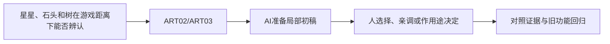

# C-01｜训练眼睛一：剪影、比例和细节层级

> 兼容课号：R02。ABCDE是主题入口，不是必须按字母顺序完成；文件链接与题号保留稳定。

版本：Applied Curriculum v5｜2026-09-15
状态：课件正文与互动规格已编写；尚未逐课生成OpenMAIC课堂或试教。

## 1. 本课任务卡

**产出：** 在游戏大小的缩略图里，让一个道具一眼可辨。
**前置：** R01, B01A；**对应概念：** ART02/ART03。
**预计课堂：** 20–30分钟，可在实验前后暂停；不含后续真实软件制作时间。
**M 必须掌握：**
- 只看剪影判断造型识别度。
- 先调大比例，再分配主次细节，不把噪声当丰富。
**K 理解即可：**
- Primary/Secondary/Tertiary是主形、辅助形、小细节的组织思路。
**停止线：** 不讲解剖学和复杂雕刻；不要求完整临摹人物。

## 2. 必要讲解：先看现象，再给术语

剪影是外部轮廓：先涂黑或缩小看看还能否辨认。一个水壶若壶嘴和把手融在一起，加花纹也不一定解决识别。

先调大形比例，再放中等结构，最后决定小细节是否值得。卡通不是随意拉大所有部位，而是用一致的夸张规则服务角色或用途。

## 2A. 这次在实际场景里解决什么

**应用位置：** P03｜星星、石头和树在游戏距离下能否辨认；主项目中的功能、视觉或交付决定。

|开始时遇到的问题|本课期望得到的变化|
|---|---|
|局部很精细，但缩小后物体轮廓和功能难以分辨。|用剪影、比例和主次确定可辨认的大形，之后才加细节。|

**这是目标状态对照，不是已完成截图。** 首次操作应使用匹配当前进度的最小场景；还没有配套时，只能记为课堂模拟，不能直接勾选真机应用通过。

### 概念关系示意


图中箭头表示教学流程，不是引擎节点继承。OpenMAIC不支持Mermaid时改画等价方框图，不能把代码原文冒充运行示意。

### 先让AI帮助理解，再让AI帮助工作

**学习指令：**
```text
现在只检查这道判断：加更多纹理能保证剪影更清楚吗？
先等我给预测和理由，再指出一个证据缺口；一次只给一个线索，不先公布完整答案。
我的用词不专业时，先用人话确认意思，再补对应术语。
```

**工作指令：可复制；先补实际版本与当前材料，不粘贴密钥。**
```text
我正在逐步制作同一个小型单机「星光小庭院」，不是重新生成整款游戏。
我会提供实际软件版本、当前场景/文件和必要截图；先确认你能访问哪些材料和工具。
这次只做：以庭院三种简单道具为例，先给不带纹理的轮廓候选和黑白缩略对照。只改变轮廓与比例，列出对识别的影响，不通过增加纹理或粒子转移注意。
必须保持：机位、显示尺寸、背景固定；不一开始雕刻复杂模型。
先列出将改的对象、原值和预期结果，提供最小可撤销初稿及检查步骤。
没有真实软件连接时只提供操作单/脚本，不声称已经编辑、运行或看过未提供的截图。
不要自动安装插件、联网下载素材、购买服务或读取无关文件；必要操作另说明并取得授权。
完成后报告实际做了什么、还没验证什么；我负责选择和最终验收。
```

### 哪些地方比继续发指令更适合亲自试

|入口与性质|一次只做的微调/选择|亲眼观察什么|
|---|---|---|
|对象Dimensions/Scale或轮廓草图（内置/设计）|只改一个比例，例如树冠与树干关系|缩略尺寸下能否区分物体|
|视口缩略/单色预览（观察入口）|隐藏表面细节再观察|轮廓是否仍读得出，细节是否只是噪声|

**初值与恢复：** 先读取并记录当前值；表里的方向是对照办法，不是通用最佳参数。先在副本上操作，不覆盖基底；返回前用撤销或记录值恢复并重新预览。自定义变量不是软件内置参数。
**选择下一步：** 方向不对，补一张明确参考并圈出要借鉴的部分；结构/因果不对，让AI做局部修复；已接近目标且入口可直接操作，先亲调一项。原因不明先做对照，不靠反复重生成抽卡。

**局部修复指令：**
```text
保留本课「必须保持」的部分。我会给出同条件的当前结果和目标差异。
只围绕「用剪影、比例和主次确定可辨认的大形，之后才加细节。」检查一个根因假设；先给最小验证，未经证据不要重写全部内容。
若只是一个可见参数偏差，告诉我该选哪个对象、哪个入口、怎么小幅调和恢复。
```

**本课风险检查：** 检查AI是否用更多装饰掩盖轮廓问题，或只展示近景精细截图。
**时间边界：** 上述是需要在当前模型/工具/软件版本下验证的风险清单，不是所有AI必然失败的结论，也不预测何时会解决。长期保留的是目标、约束、参考选择、结果认可和取舍责任；测量和重复调整可以继续交给AI协助。

## 3. 界面与参数学习深度

以下是后续真机操作的对应范围，不要求本轮打开软件。模拟滑块是教学控件，不代表软件都有同名按钮。会调是指看懂作用、主动选择与恢复；会定位是知道去哪找；按需查不考菜单路径、快捷键和API记忆。
- Blender后续常用：对象/编辑模式缩放、正交观察、Solid视图。
- 会定位：相机视图和尺寸参照。
- 按需查：复杂雕刻笔刷、重拓扑。

## 4. 互动实验规格

**初始状态：** 同一水壶三种比例；纯色背景、黑色剪影、统一尺寸；目标显示宽约160像素。
**可操作项：** 壶身宽高比0.7到1.4、把手间隙、壶嘴长度、黑色/表面切换、缩略/近景。
**实验步骤：**
1. 先隐藏材质比较能否识别用途。
2. 只改一个比例或间隙，记录识别改善而非随机拖动。
3. 在游戏尺寸检查装饰小纹理是否仍有价值，删掉一组无用细节再比较。
**预期反馈：** 参数改变要改轮廓，不能只替换标签。展示近远两种视图，允许不同但有依据的审美选择。
**故障或反例：** 反例：把大量雕花当质量，缩小后道具只是黑团；优先修大形和负形。
**复位：** 恢复统一物体尺寸、比例、剪影模式和观察距离。
**无图/无3D替代：** 用原创简单形状、状态卡或给定时间序列表达同一因果关系；标明“示意”，不得把预设结果说成Godot/Blender实测。不能以假按钮或不响应的截图代替交互。
**完成判据：** 对本课两项M提供操作或判断及解释；一个实验可覆盖多项。只有关键M或发现薄弱处才追加故障/变式，不为每个术语加作业。

## 5. 小结与必须牢记

- 先看剪影，再看材质。
- 先大形，再小细节。
- 质量按游戏距离验收。

## 6. 训练：先作答，再看反馈

P=预测，D=诊断，T=迁移，K=用途认识。下面是候选训练，不是每个词都做四次作业。课堂先用预测和一个操作，重点未达标再选D或T；延迟复测换对象，不重复抄答案。

### R02-P1
加更多纹理能保证剪影更清楚吗？

### R02-D2
壶嘴和把手难分辨，先改纹理还是结构间隙？

### R02-T3
把水壶换成游戏宝箱，怎样安排细节？

### R02-K4
三级形体的用途是什么？

## 7. 后续真机任务（配套待做，不作为当前课堂依赖）

后续可在有许可的基底上做少量比例改造，不必从零建模。
即使已有参考工程，也要区分课件、运行测试、人工体验、学习掌握四种证据。按用户安排，当前先完成全部课件，之后再统一补素材、Godot/Blender起始与参考工程。

## 8. 实际应用验收：把结果放回同一个项目

**本课产物：** 用剪影、比例和主次确定可辨认的大形，之后才加细节。
**接入边界：** 机位、显示尺寸、背景固定；不一开始雕刻复杂模型。

以下是要采集的证据，不是宣称已经执行。记录“未尝试 / 有提示完成 / 独立验证 / 隔次仍会”；不把这四种状态与M/K学习要求混淆。

|原有M能力|本次在哪里取证|
|---|---|
|只看剪影判断造型识别度。|能指出剪影、比例与细节层级各自造成的观察差别。|
|先调大比例，再分配主次细节，不把噪声当丰富。|能选一项大形改动，并用同尺寸前后对照说明理由。|

**旧功能回归：** 选定大形不堵住原通路；交互目标仍与装饰可区分。
**最小记录：** 一段现场演示，或同条件前后图/日志，加一句“我改了什么、为什么”。截图不足以证明运动/一次性事件时，要演示动作或查看对应状态。记录用过的提示，不要求写长报告。
**一般能力取证：** 一次有效操作/选择与解释即可；只有证据不足才补练，不强制反复考试。

**换情境的候选任务：** 将星星换成钥匙形道具，先在单色下检验，不靠颜色救识别。
**判定：** 普通M按原0–2锚点；有针对性根因提示记练习，换变式再验证。K只查用途，不能抵消关键M失败。没有真实操作的M只记待验证，模拟通过不能自动升级为真机通过。未选专题不阻塞主线。

**接入不等于新增系统：** 美术课可交风格卡、参数决定或改造样本；性能课可得出“不优化”。隔离实验只有对当前项目有收益才接入，不强迫庭院变成战斗、开放世界或联网游戏。

## 9. 复现与延迟检查

本课复现：R01。只复习已学的关键M。
下次课抽一个本课关键判断，换对象或数值后先独立解释。查菜单和API不扣独立判断分；被提示根因或目标值后完成，记录有提示，换变式再验。K不反复背定义。

## 10. 依据与观看入口

- [Roman Klco / Polygon Runway：风格化3D作品与课程](https://polygonrunway.com/)
- [Grant Abbitt：Blender造型与图形设计](https://www.gabbitt.co.uk/)

技术来源支持术语和软件边界；具体实验与课程顺序是本项目教学设计，不代表已证明学习效果。艺术家入口用于观看研习，不等于获得图片或素材再分发许可。
