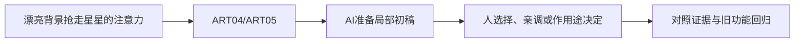

# C-03｜训练眼睛二：明度、色相、饱和度与焦点

> 兼容课号：R03。ABCDE是主题入口，不是必须按字母顺序完成；文件链接与题号保留稳定。

版本：Applied Curriculum v5｜2026-09-15
状态：课件正文与互动规格已编写；尚未逐课生成OpenMAIC课堂或试教。

## 1. 本课任务卡

**产出：** 用受控色盘和明暗层次，使拾取目标从背景中可辨。
**前置：** R02；**对应概念：** ART04/ART05。
**预计课堂：** 20–30分钟，可在实验前后暂停；不含后续真实软件制作时间。
**M 必须掌握：**
- 区分色相、饱和度、明度，并一次只改一种关系。
- 在保持风格前提下组织焦点，做灰度与缩略图对照。
**K 理解即可：**
- 冷暖和互补等术语用来描述关系，不当固定配方。
**停止线：** 不背色彩空间数学；不规定某个色盘就是儿童最爱。

## 2. 必要讲解：先看现象，再给术语

色相可理解为偏哪种颜色，饱和度是颜色的鲜明程度，明度关注明暗。不同系统数值定义不尽相同，本课通过观察关系而非死记换算。

唯美不等于所有地方一样淡，卡通也不等于全场高饱和。主要目标、次要道具和背景要有主次。灰度帮助检查明暗，但不自动替代色彩审美。

## 2A. 这次在实际场景里解决什么

**应用位置：** P03/P05｜漂亮背景抢走星星的注意力；主项目中的功能、视觉或交付决定。

|开始时遇到的问题|本课期望得到的变化|
|---|---|
|所有地方都鲜艳，或者彩色下尚可，灰度下目标消失。|能用明暗、色相和饱和度分配主次，而非全场加亮。|

**这是目标状态对照，不是已完成截图。** 首次操作应使用匹配当前进度的最小场景；还没有配套时，只能记为课堂模拟，不能直接勾选真机应用通过。

### 概念关系示意


图中箭头表示教学流程，不是引擎节点继承。OpenMAIC不支持Mermaid时改画等价方框图，不能把代码原文冒充运行示意。

### 先让AI帮助理解，再让AI帮助工作

**学习指令：**
```text
现在只检查这道判断：全场饱和度拉满一定让星星更显眼吗？
先等我给预测和理由，再指出一个证据缺口；一次只给一个线索，不先公布完整答案。
我的用词不专业时，先用人话确认意思，再补对应术语。
```

**工作指令：可复制；先补实际版本与当前材料，不粘贴密钥。**
```text
我正在逐步制作同一个小型单机「星光小庭院」，不是重新生成整款游戏。
我会提供实际软件版本、当前场景/文件和必要截图；先确认你能访问哪些材料和工具。
这次只做：在固定庭院构图上准备两个受控色彩方案，明确只改变哪一类颜色；提供彩色与灰度观察，不把一种配色说成唯一正确答案。
必须保持：轮廓、相机、光照与目标位置保持。
先列出将改的对象、原值和预期结果，提供最小可撤销初稿及检查步骤。
没有真实软件连接时只提供操作单/脚本，不声称已经编辑、运行或看过未提供的截图。
不要自动安装插件、联网下载素材、购买服务或读取无关文件；必要操作另说明并取得授权。
完成后报告实际做了什么、还没验证什么；我负责选择和最终验收。
```

### 哪些地方比继续发指令更适合亲自试

|入口与性质|一次只做的微调/选择|亲眼观察什么|
|---|---|---|
|材质基础色/设计色板（内置/设计）|先只降低背景饱和度，再回到基线|目标是否更突出而背景仍可读|
|灰度对照和目标明暗（观察/内容）|观察后只改目标或邻近背景之一|明度差来自哪处，而非只看色相不同|

**初值与恢复：** 先读取并记录当前值；表里的方向是对照办法，不是通用最佳参数。先在副本上操作，不覆盖基底；返回前用撤销或记录值恢复并重新预览。自定义变量不是软件内置参数。
**选择下一步：** 方向不对，补一张明确参考并圈出要借鉴的部分；结构/因果不对，让AI做局部修复；已接近目标且入口可直接操作，先亲调一项。原因不明先做对照，不靠反复重生成抽卡。

**局部修复指令：**
```text
保留本课「必须保持」的部分。我会给出同条件的当前结果和目标差异。
只围绕「能用明暗、色相和饱和度分配主次，而非全场加亮。」检查一个根因假设；先给最小验证，未经证据不要重写全部内容。
若只是一个可见参数偏差，告诉我该选哪个对象、哪个入口、怎么小幅调和恢复。
```

**本课风险检查：** 检查AI是否同时改照明和材质却称单变量比较，或默认高饱和等于儿童友好。
**时间边界：** 上述是需要在当前模型/工具/软件版本下验证的风险清单，不是所有AI必然失败的结论，也不预测何时会解决。长期保留的是目标、约束、参考选择、结果认可和取舍责任；测量和重复调整可以继续交给AI协助。

## 3. 界面与参数学习深度

以下是后续真机操作的对应范围，不要求本轮打开软件。模拟滑块是教学控件，不代表软件都有同名按钮。会调是指看懂作用、主动选择与恢复；会定位是知道去哪找；按需查不考菜单路径、快捷键和API记忆。
- 后续常用：基础颜色拾色器与固定相机A/B。
- 会定位：色相/饱和度/明度类控件，注意软件命名差异。
- 按需查：色彩管理和转换公式。

## 4. 互动实验规格

**初始状态：** 暖色小屋、草地和拾取物，三个候选色盘；机位、轮廓、灯光固定。
**可操作项：** 主体与背景的明暗对比、饱和度低/中/高、两组色相、灰度开关、缩略图。
**实验步骤：**
1. 先指出第一眼看到哪里。
2. 保持色相，只改变背景明暗；恢复后只调目标饱和度。
3. 挑一套色盘并说明为什么目标可辨，而不只是自己喜欢。
**预期反馈：** A/B保持相同布局；任何自动灰度转换说明仅为观察工具；不声称代替色觉可访问性测试。
**故障或反例：** 反例：所有对象都高饱和高对比，没有焦点；减少背景竞争再比较。
**复位：** 恢复原色盘、光照与观察尺寸；保留选定风格卡。
**无图/无3D替代：** 用原创简单形状、状态卡或给定时间序列表达同一因果关系；标明“示意”，不得把预设结果说成Godot/Blender实测。不能以假按钮或不响应的截图代替交互。
**完成判据：** 对本课两项M提供操作或判断及解释；一个实验可覆盖多项。只有关键M或发现薄弱处才追加故障/变式，不为每个术语加作业。

## 5. 小结与必须牢记

- 焦点依赖相对关系。
- 不是所有东西都要鲜艳。
- 灰度与缩略图用来检查，不负责替你审美。

## 6. 训练：先作答，再看反馈

P=预测，D=诊断，T=迁移，K=用途认识。下面是候选训练，不是每个词都做四次作业。课堂先用预测和一个操作，重点未达标再选D或T；延迟复测换对象，不重复抄答案。

### R03-P1
全场饱和度拉满一定让星星更显眼吗？

### R03-D2
黄色星星在黄墙前消失感强，怎样局部修？

### R03-T3
夜晚关卡沿用日间色盘，应重新检查什么？

### R03-K4
冷暖有什么沟通价值？

## 7. 后续真机任务（配套待做，不作为当前课堂依赖）

后续用Godot或Blender固定机位拖参数；这次先完成交互课。
即使已有参考工程，也要区分课件、运行测试、人工体验、学习掌握四种证据。按用户安排，当前先完成全部课件，之后再统一补素材、Godot/Blender起始与参考工程。

## 8. 实际应用验收：把结果放回同一个项目

**本课产物：** 能用明暗、色相和饱和度分配主次，而非全场加亮。
**接入边界：** 轮廓、相机、光照与目标位置保持。

以下是要采集的证据，不是宣称已经执行。记录“未尝试 / 有提示完成 / 独立验证 / 隔次仍会”；不把这四种状态与M/K学习要求混淆。

|原有M能力|本次在哪里取证|
|---|---|
|区分色相、饱和度、明度，并一次只改一种关系。|能区分颜色不同与明暗不同，给出可见依据。|
|在保持风格前提下组织焦点，做灰度与缩略图对照。|能做一项主次调整并解释，不按固定配色偏好得分。|

**旧功能回归：** 路径提示与其他可交互对象不被新的色板混淆；静音仍可辨成功。
**最小记录：** 一段现场演示，或同条件前后图/日志，加一句“我改了什么、为什么”。截图不足以证明运动/一次性事件时，要演示动作或查看对应状态。记录用过的提示，不要求写长报告。
**一般能力取证：** 一次有效操作/选择与解释即可；只有证据不足才补练，不强制反复考试。

**换情境的候选任务：** 目标换到相似明度背景上，重新选择局部调整而不是沿用旧色值。
**判定：** 普通M按原0–2锚点；有针对性根因提示记练习，换变式再验证。K只查用途，不能抵消关键M失败。没有真实操作的M只记待验证，模拟通过不能自动升级为真机通过。未选专题不阻塞主线。

**接入不等于新增系统：** 美术课可交风格卡、参数决定或改造样本；性能课可得出“不优化”。隔离实验只有对当前项目有收益才接入，不强迫庭院变成战斗、开放世界或联网游戏。

## 9. 复现与延迟检查

本课复现：R01, R02。只复习已学的关键M。
下次课抽一个本课关键判断，换对象或数值后先独立解释。查菜单和API不扣独立判断分；被提示根因或目标值后完成，记录有提示，换变式再验。K不反复背定义。

## 10. 依据与观看入口

- [The Walt Disney Family Museum：Mary Blair展览资料](https://www.waltdisney.org/mary-blair)
- [Eyvind Earle官方作品入口（仅链接，保留版权）](https://eyvindearle.com/)
- [Roman Klco / Polygon Runway：风格化3D作品与课程](https://polygonrunway.com/)

技术来源支持术语和软件边界；具体实验与课程顺序是本项目教学设计，不代表已证明学习效果。艺术家入口用于观看研习，不等于获得图片或素材再分发许可。
