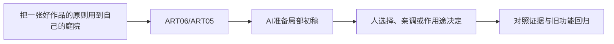

# C-06｜看大师不只收藏：从参考到观察再到变式

> 兼容课号：R04。ABCDE是主题入口，不是必须按字母顺序完成；文件链接与题号保留稳定。

版本：Applied Curriculum v5｜2026-09-15
状态：课件正文与互动规格已编写；尚未逐课生成OpenMAIC课堂或试教。

## 1. 本课任务卡

**产出：** 完成一次有观察问题、有取舍、有变式的作品研习。
**前置：** R03, B13；**对应概念：** ART06/ART05。
**预计课堂：** 20–30分钟，可在实验前后暂停；不含后续真实软件制作时间。
**M 必须掌握：**
- 看作品时定位焦点、轮廓、色块、光线和细节层级。
- 提取一条原则，在新主题里复用，不把复制具体形象当原创。
**K 理解即可：**
- Moodboard、Thumbnail、Study分别服务参考整理、缩略构图和局部研习。
**停止线：** 不要求完整复刻大师作品；没有授权不把原图打包进公开仓库或课件。

## 2. 必要讲解：先看现象，再给术语

收藏很多图不自动提高判断。每次只选一张、只问一个问题：主体为何突出，树为何有节奏，暗部为什么不脏。先写观察，再用少量色块或体块验证。

研习可以只研究构图或冷暖关系。对第三方作品的具体复制、公开展示、训练输入和商业使用要分别核对许可。最稳妥的公共示例用自己制作或许可明确的图，不承诺临摹天然可发布。

## 2A. 这次在实际场景里解决什么

**应用位置：** P05｜把一张好作品的原则用到自己的庭院；主项目中的功能、视觉或交付决定。

|开始时遇到的问题|本课期望得到的变化|
|---|---|
|收藏很多参考，却不知道该学哪一点，临摹变成照抄图案。|一份来源清楚、观察具体的研习卡，以及换题材后的布局选择。|

**这是目标状态对照，不是已完成截图。** 首次操作应使用匹配当前进度的最小场景；还没有配套时，只能记为课堂模拟，不能直接勾选真机应用通过。

### 概念关系示意


图中箭头表示教学流程，不是引擎节点继承。OpenMAIC不支持Mermaid时改画等价方框图，不能把代码原文冒充运行示意。

### 先让AI帮助理解，再让AI帮助工作

**学习指令：**
```text
现在只检查这道判断：临摹得越像是否就证明能独立设计？
先等我给预测和理由，再指出一个证据缺口；一次只给一个线索，不先公布完整答案。
我的用词不专业时，先用人话确认意思，再补对应术语。
```

**工作指令：可复制；先补实际版本与当前材料，不粘贴密钥。**
```text
我正在逐步制作同一个小型单机「星光小庭院」，不是重新生成整款游戏。
我会提供实际软件版本、当前场景/文件和必要截图；先确认你能访问哪些材料和工具。
这次只做：只分析我提供或能实际访问的作品，回答焦点在哪里、由什么形状/明暗支撑。把事实观察与推测分开；选一条原则改成庭院入口的块面方案，不复制独特角色或原图。
必须保持：现有庭院玩法和风格卡保持；参考观看不自动意味着能公开分发源图。
先列出将改的对象、原值和预期结果，提供最小可撤销初稿及检查步骤。
没有真实软件连接时只提供操作单/脚本，不声称已经编辑、运行或看过未提供的截图。
不要自动安装插件、联网下载素材、购买服务或读取无关文件；必要操作另说明并取得授权。
完成后报告实际做了什么、还没验证什么；我负责选择和最终验收。
```

### 哪些地方比继续发指令更适合亲自试

|入口与性质|一次只做的微调/选择|亲眼观察什么|
|---|---|---|
|构图块面草图（设计内容）|只移动主体或一组陪衬形状|视线是否更容易到入口|
|参考与自作对照（观察入口）|同大小看一条原则，不一次学整幅作品|能否解释借鉴的是关系而不是表面图案|

**初值与恢复：** 先读取并记录当前值；表里的方向是对照办法，不是通用最佳参数。先在副本上操作，不覆盖基底；返回前用撤销或记录值恢复并重新预览。自定义变量不是软件内置参数。
**选择下一步：** 方向不对，补一张明确参考并圈出要借鉴的部分；结构/因果不对，让AI做局部修复；已接近目标且入口可直接操作，先亲调一项。原因不明先做对照，不靠反复重生成抽卡。

**局部修复指令：**
```text
保留本课「必须保持」的部分。我会给出同条件的当前结果和目标差异。
只围绕「一份来源清楚、观察具体的研习卡，以及换题材后的布局选择。」检查一个根因假设；先给最小验证，未经证据不要重写全部内容。
若只是一个可见参数偏差，告诉我该选哪个对象、哪个入口、怎么小幅调和恢复。
```

**本课风险检查：** 检查AI是否虚构作者、把推测当创作意图，或把多收藏当审美进步证据。
**时间边界：** 上述是需要在当前模型/工具/软件版本下验证的风险清单，不是所有AI必然失败的结论，也不预测何时会解决。长期保留的是目标、约束、参考选择、结果认可和取舍责任；测量和重复调整可以继续交给AI协助。

## 3. 界面与参数学习深度

以下是后续真机操作的对应范围，不要求本轮打开软件。模拟滑块是教学控件，不代表软件都有同名按钮。会调是指看懂作用、主动选择与恢复；会定位是知道去哪找；按需查不考菜单路径、快捷键和API记忆。
- 常用：参考板、缩略图、标注与对比。
- 会定位：原作者页面和作品信息。
- 按需查：绘画软件具体工具；不强制学新的大型软件。

## 4. 互动实验规格

**初始状态：** 由教师从本文件“依据与观看入口”列出的原作者/机构页面选择可查看作品；与一张原创简化练习图并排。缺素材时保留链接，使用原创构图示意，禁止编造大师图。
**可操作项：** 30秒观察、缩略视图、重点区域标注、最多五色概括、隐藏参考、换主题卡。
**实验步骤：**
1. 30秒只写第一焦点与理由；再找两处支持它的形状或明暗。
2. 只提取一个原则，用五个体块/色块作观察练习；不要求画得像原作。
3. 隐藏参考，把森林换成小屋场景，使用同一原则并说明哪些形象没复制。
**预期反馈：** 记录观察→假设→尝试→比较，不按相似度单独评分。原作品来源和权利状态始终可追溯。
**故障或反例：** 反例：收藏30张图却说不出一条能执行的规则；缩到一张一问题，做一个变式。
**复位：** 保留观察笔记，清空临时标注；不自动下载原图。
**无图/无3D替代：** 用原创简单形状、状态卡或给定时间序列表达同一因果关系；标明“示意”，不得把预设结果说成Godot/Blender实测。不能以假按钮或不响应的截图代替交互。
**完成判据：** 对本课两项M提供操作或判断及解释；一个实验可覆盖多项。只有关键M或发现薄弱处才追加故障/变式，不为每个术语加作业。

## 5. 小结与必须牢记

- 每次看图只带一个问题。
- 提取原则后换题材。
- 参考来源和使用许可分别记录。

## 6. 训练：先作答，再看反馈

P=预测，D=诊断，T=迁移，K=用途认识。下面是候选训练，不是每个词都做四次作业。课堂先用预测和一个操作，重点未达标再选D或T；延迟复测换对象，不重复抄答案。

### R04-P1
临摹得越像是否就证明能独立设计？

### R04-D2
看了很多图却无法描述改哪里，怎么调整训练？

### R04-T3
学习森林构图后设计房屋街道，能迁移什么？

### R04-K4
Moodboard有什么用途？

## 7. 后续真机任务（配套待做，不作为当前课堂依赖）

后续研习可用简单体块，不要求成为专业画师；公开材料仅用授权示例。
即使已有参考工程，也要区分课件、运行测试、人工体验、学习掌握四种证据。按用户安排，当前先完成全部课件，之后再统一补素材、Godot/Blender起始与参考工程。

## 8. 实际应用验收：把结果放回同一个项目

**本课产物：** 一份来源清楚、观察具体的研习卡，以及换题材后的布局选择。
**接入边界：** 现有庭院玩法和风格卡保持；参考观看不自动意味着能公开分发源图。

以下是要采集的证据，不是宣称已经执行。记录“未尝试 / 有提示完成 / 独立验证 / 隔次仍会”；不把这四种状态与M/K学习要求混淆。

|原有M能力|本次在哪里取证|
|---|---|
|看作品时定位焦点、轮廓、色块、光线和细节层级。|能按原链接记录作品并给出一条可核对的观察。|
|提取一条原则，在新主题里复用，不把复制具体形象当原创。|能把该原则用于不同题材，说明哪些部分没有照搬。|

**旧功能回归：** 入口和星星路线仍实际可用；不为了截图构图封掉道路。
**最小记录：** 一段现场演示，或同条件前后图/日志，加一句“我改了什么、为什么”。截图不足以证明运动/一次性事件时，要演示动作或查看对应状态。记录用过的提示，不要求写长报告。
**一般能力取证：** 一次有效操作/选择与解释即可；只有证据不足才补练，不强制反复考试。

**换情境的候选任务：** 再看一张主次相反的作品，解释是否适合当前目标。
**判定：** 普通M按原0–2锚点；有针对性根因提示记练习，换变式再验证。K只查用途，不能抵消关键M失败。没有真实操作的M只记待验证，模拟通过不能自动升级为真机通过。未选专题不阻塞主线。

**接入不等于新增系统：** 美术课可交风格卡、参数决定或改造样本；性能课可得出“不优化”。隔离实验只有对当前项目有收益才接入，不强迫庭院变成战斗、开放世界或联网游戏。

## 9. 复现与延迟检查

本课复现：R02, R03。只复习已学的关键M。
下次课抽一个本课关键判断，换对象或数值后先独立解释。查菜单和API不扣独立判断分；被提示根因或目标值后完成，记录有提示，换变式再验。K不反复背定义。

## 10. 依据与观看入口

- [The Walt Disney Family Museum：Mary Blair展览资料](https://www.waltdisney.org/mary-blair)
- [Eyvind Earle官方作品入口（仅链接，保留版权）](https://eyvindearle.com/)
- [Roman Klco / Polygon Runway：风格化3D作品与课程](https://polygonrunway.com/)
- [Grant Abbitt：Blender造型与图形设计](https://www.gabbitt.co.uk/)

技术来源支持术语和软件边界；具体实验与课程顺序是本项目教学设计，不代表已证明学习效果。艺术家入口用于观看研习，不等于获得图片或素材再分发许可。
