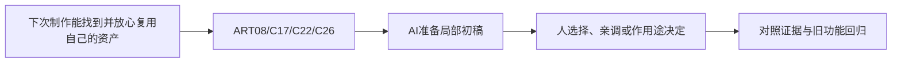

# C-09｜长期美术资源库：少量基底，可靠变体

> 兼容课号：R07。ABCDE是主题入口，不是必须按字母顺序完成；文件链接与题号保留稳定。

版本：Applied Curriculum v5｜2026-09-15
状态：课件正文与互动规格已编写；尚未逐课生成OpenMAIC课堂或试教。

## 1. 本课任务卡

**产出：** 设计一套能持续扩充、可追溯、可检索的风格化资产目录。
**前置：** R06, I03；**对应概念：** ART08/C17/C22/C26。
**预计课堂：** 20–30分钟，可在实验前后暂停；不含后续真实软件制作时间。
**M 必须掌握：**
- 区分基底、变体、实例和展示图；控制共享范围。
- 给资产填写足够使用的元数据与质量检查。
**K 理解即可：**
- Asset Browser/Catalog、Append/Link是复用工具，用时查细节。
**停止线：** 不搭复杂资产管理服务器，不为了库而囤大量不一致模型。

## 2. 必要讲解：先看现象，再给术语

先做一个小套件，如墙、门、窗、树、石头和灯，不追求几百件。每个资产记录来源许可、尺寸、原点、材质、预览、版本和已测状态。

保留原始来源和可编辑主资产，再做受控变体：颜色、比例、少量附加结构。真正共享的部分复用，独立变化不串改；退役和不合格资源要能看出来。

## 2A. 这次在实际场景里解决什么

**应用位置：** P07｜下次制作能找到并放心复用自己的资产；主项目中的功能、视觉或交付决定。

|开始时遇到的问题|本课期望得到的变化|
|---|---|
|文件叫final_new，找不到原始来源，也不知道改一件会影响几件。|小型资产套件有基底、变体、版本、来源、接口和验收状态。|

**这是目标状态对照，不是已完成截图。** 首次操作应使用匹配当前进度的最小场景；还没有配套时，只能记为课堂模拟，不能直接勾选真机应用通过。

### 概念关系示意


图中箭头表示教学流程，不是引擎节点继承。OpenMAIC不支持Mermaid时改画等价方框图，不能把代码原文冒充运行示意。

### 先让AI帮助理解，再让AI帮助工作

**学习指令：**
```text
现在只检查这道判断：一张漂亮预览图能证明资源可直接入游戏吗？
先等我给预测和理由，再指出一个证据缺口；一次只给一个线索，不先公布完整答案。
我的用词不专业时，先用人话确认意思，再补对应术语。
```

**工作指令：可复制；先补实际版本与当前材料，不粘贴密钥。**
```text
我正在逐步制作同一个小型单机「星光小庭院」，不是重新生成整款游戏。
我会提供实际软件版本、当前场景/文件和必要截图；先确认你能访问哪些材料和工具。
这次只做：只整理我提供的少量资产记录，不移动或删除未授权文件。给每件基底/变体关系和最小元数据，缺许可信息标待确认；先用目录加Markdown，不搭数据库。
必须保持：原始来源文件只读保留；预览图不能冒充可编辑源。
先列出将改的对象、原值和预期结果，提供最小可撤销初稿及检查步骤。
没有真实软件连接时只提供操作单/脚本，不声称已经编辑、运行或看过未提供的截图。
不要自动安装插件、联网下载素材、购买服务或读取无关文件；必要操作另说明并取得授权。
完成后报告实际做了什么、还没验证什么；我负责选择和最终验收。
```

### 哪些地方比继续发指令更适合亲自试

|入口与性质|一次只做的微调/选择|亲眼观察什么|
|---|---|---|
|目录/资产浏览入口（内容/工具入口）|按用途和基底关系找目标，不按临时文件名猜|能否从一件变体追到源和使用说明|
|变体颜色或比例（设计参数）|只改一个允许变化项|共用接口和风格是否保持|

**初值与恢复：** 先读取并记录当前值；表里的方向是对照办法，不是通用最佳参数。先在副本上操作，不覆盖基底；返回前用撤销或记录值恢复并重新预览。自定义变量不是软件内置参数。
**选择下一步：** 方向不对，补一张明确参考并圈出要借鉴的部分；结构/因果不对，让AI做局部修复；已接近目标且入口可直接操作，先亲调一项。原因不明先做对照，不靠反复重生成抽卡。

**局部修复指令：**
```text
保留本课「必须保持」的部分。我会给出同条件的当前结果和目标差异。
只围绕「小型资产套件有基底、变体、版本、来源、接口和验收状态。」检查一个根因假设；先给最小验证，未经证据不要重写全部内容。
若只是一个可见参数偏差，告诉我该选哪个对象、哪个入口、怎么小幅调和恢复。
```

**本课风险检查：** 检查AI是否只改名不记录依赖、误删重复文件或把不明许可标成可随意分发。
**时间边界：** 上述是需要在当前模型/工具/软件版本下验证的风险清单，不是所有AI必然失败的结论，也不预测何时会解决。长期保留的是目标、约束、参考选择、结果认可和取舍责任；测量和重复调整可以继续交给AI协助。

## 3. 界面与参数学习深度

以下是后续真机操作的对应范围，不要求本轮打开软件。模拟滑块是教学控件，不代表软件都有同名按钮。会调是指看懂作用、主动选择与恢复；会定位是知道去哪找；按需查不考菜单路径、快捷键和API记忆。
- 常用：资产选择、命名、预览、库内检索、变体参数。
- 会定位：Blender Asset Browser/Catalog和Append/Link。
- 按需查：库路径、链接覆盖和批量迁移工具。

## 4. 互动实验规格

**初始状态：** 六张资产卡，三张缺元数据；一件主资产和两件变体的引用图。
**可操作项：** 筛选风格/用途/验证状态、编辑元数据、共享/独立材质、版本升级、退役标签。
**实验步骤：**
1. 先找哪些卡不能安全快速使用，并补信息。
2. 从一件箱子做三种变体计划，列共享和独立部分。
3. 替换主材质版本，检查哪些变体会变化，记录迁移和回退。
**预期反馈：** 缩略图不是源文件；可使用与可再分发标成独立许可字段；未经测试的卡不能标游戏就绪。
**故障或反例：** 反例：只有final_final2文件和截图，没有尺度、原点、来源；改命名和元数据，不靠记忆。
**复位：** 回到上一版元数据与引用图；原始来源只读保留。
**无图/无3D替代：** 用原创简单形状、状态卡或给定时间序列表达同一因果关系；标明“示意”，不得把预设结果说成Godot/Blender实测。不能以假按钮或不响应的截图代替交互。
**完成判据：** 对本课两项M提供操作或判断及解释；一个实验可覆盖多项。只有关键M或发现薄弱处才追加故障/变式，不为每个术语加作业。

## 5. 小结与必须牢记

- 小套件先做可靠。
- 基底只读，变体可追溯。
- 好看、可用、可分发分别检查。

## 6. 训练：先作答，再看反馈

P=预测，D=诊断，T=迁移，K=用途认识。下面是候选训练，不是每个词都做四次作业。课堂先用预测和一个操作，重点未达标再选D或T；延迟复测换对象，不重复抄答案。

### R07-P1
一张漂亮预览图能证明资源可直接入游戏吗？

### R07-D2
改主材质让已完成关卡全部变色，怎么预防？

### R07-T3
新项目换了色盘，如何快速复用旧套件？

### R07-K4
Asset Browser主要解决什么？

## 7. 后续真机任务（配套待做，不作为当前课堂依赖）

后续制作最小长期资产套件；本轮先交库规范和操练说明。
即使已有参考工程，也要区分课件、运行测试、人工体验、学习掌握四种证据。按用户安排，当前先完成全部课件，之后再统一补素材、Godot/Blender起始与参考工程。

## 8. 实际应用验收：把结果放回同一个项目

**本课产物：** 小型资产套件有基底、变体、版本、来源、接口和验收状态。
**接入边界：** 原始来源文件只读保留；预览图不能冒充可编辑源。

以下是要采集的证据，不是宣称已经执行。记录“未尝试 / 有提示完成 / 独立验证 / 隔次仍会”；不把这四种状态与M/K学习要求混淆。

|原有M能力|本次在哪里取证|
|---|---|
|区分基底、变体、实例和展示图；控制共享范围。|能从一件变体追到源文件、来源、许可记录与回退版本。|
|给资产填写足够使用的元数据与质量检查。|能制作或规划一个受控变体，解释共享影响范围和复用方法。|

**旧功能回归：** 重新打开/导入已有样本，材质与功能引用没有因整理失效。
**最小记录：** 一段现场演示，或同条件前后图/日志，加一句“我改了什么、为什么”。截图不足以证明运动/一次性事件时，要演示动作或查看对应状态。记录用过的提示，不要求写长报告。
**关键能力复测：** 本课高频或返工风险较高，已有有效证据可复用；薄弱处增加一个未知故障或隔次变式，不把每个词都变成一套试卷。

**换情境的候选任务：** 隔次用同库拼一个新角落，先检索和复用，再决定真正缺什么。
**判定：** 普通M按原0–2锚点；有针对性根因提示记练习，换变式再验证。K只查用途，不能抵消关键M失败。没有真实操作的M只记待验证，模拟通过不能自动升级为真机通过。未选专题不阻塞主线。

**接入不等于新增系统：** 美术课可交风格卡、参数决定或改造样本；性能课可得出“不优化”。隔离实验只有对当前项目有收益才接入，不强迫庭院变成战斗、开放世界或联网游戏。

## 9. 复现与延迟检查

本课复现：I03, R05, B09。只复习已学的关键M。
下次课抽一个本课关键判断，换对象或数值后先独立解释。查菜单和API不扣独立判断分；被提示根因或目标值后完成，记录有提示，换变式再验。K不反复背定义。

## 10. 依据与观看入口

- [Blender官方手册：按实际版本查询工具](https://docs.blender.org/manual/en/latest/)
- [Godot Resources：共享和引用](https://docs.godotengine.org/en/stable/tutorials/scripting/resources.html)
- [Kenney Support：资产用途与许可说明](https://kenney.nl/support)
- [Quaternius：基础角色、动作与风格化套件](https://quaternius.com/)

技术来源支持术语和软件边界；具体实验与课程顺序是本项目教学设计，不代表已证明学习效果。艺术家入口用于观看研习，不等于获得图片或素材再分发许可。
