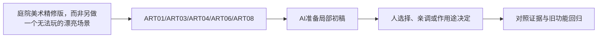

# C-10｜美术结业：一套自己的小型童话场景

> 兼容课号：R08。ABCDE是主题入口，不是必须按字母顺序完成；文件链接与题号保留稳定。

版本：Applied Curriculum v5｜2026-09-15
状态：课件正文与互动规格已编写；尚未逐课生成OpenMAIC课堂或试教。

## 1. 本课任务卡

**产出：** 用自己的风格卡组织六件资产的打磨计划和一张统一场景方案。
**前置：** R07；**对应概念：** ART01/ART03/ART04/ART06/ART08。
**预计课堂：** 20–30分钟，可在实验前后暂停；不含后续真实软件制作时间。
**M 必须掌握：**
- 让轮廓、比例、色盘、灯光、细节密度形成一致表达。
- 提交观察与改造过程，并说明可复用与仍需验证的部分。
**K 理解即可：**
- 儿童偏好应按年龄、情境做实际观察，不存在保证所有孩子喜欢的配方。
**停止线：** 不要求制作原创角色动画或大型世界；不以追求大师同款细节拖延完成。

## 2. 必要讲解：先看现象，再给术语

选一个主题，如暖色森林邮局。使用六件可靠基底，加少量风格化调整和统一材质；重点是整体关系，不是每件都雕得很复杂。

评价分两部分：客观可用性由尺度、来源、可读性和一致性检查；主观喜好要说明目标并观察反馈。儿童测试须由合适成人陪同，不采集不必要个人信息，不把喜欢当长期学习证明。

## 2A. 这次在实际场景里解决什么

**应用位置：** P07｜庭院美术精修版，而非另做一个无法玩的漂亮场景；主项目中的功能、视觉或交付决定。

|开始时遇到的问题|本课期望得到的变化|
|---|---|
|美术作品与游戏脱节，或者用装饰盖住交互问题。|少量自有变体形成统一小场景，保留完整收集体验和来源记录。|

**这是目标状态对照，不是已完成截图。** 首次操作应使用匹配当前进度的最小场景；还没有配套时，只能记为课堂模拟，不能直接勾选真机应用通过。

### 概念关系示意


图中箭头表示教学流程，不是引擎节点继承。OpenMAIC不支持Mermaid时改画等价方框图，不能把代码原文冒充运行示意。

### 先让AI帮助理解，再让AI帮助工作

**学习指令：**
```text
现在只检查这道判断：六件单独精美是否保证整体好看？
先等我给预测和理由，再指出一个证据缺口；一次只给一个线索，不先公布完整答案。
我的用词不专业时，先用人话确认意思，再补对应术语。
```

**工作指令：可复制；先补实际版本与当前材料，不粘贴密钥。**
```text
我正在逐步制作同一个小型单机「星光小庭院」，不是重新生成整款游戏。
我会提供实际软件版本、当前场景/文件和必要截图；先确认你能访问哪些材料和工具。
这次只做：审核当前风格卡与六件左右的小套件，先列三项最高影响问题，再只修一项。逐项检查风格一致、游戏可读、资源可复用；不要临时增加写实大素材包。
必须保持：收集路线、碰撞、镜头、计数和重开不变；不能只交一张摆拍图。
先列出将改的对象、原值和预期结果，提供最小可撤销初稿及检查步骤。
没有真实软件连接时只提供操作单/脚本，不声称已经编辑、运行或看过未提供的截图。
不要自动安装插件、联网下载素材、购买服务或读取无关文件；必要操作另说明并取得授权。
完成后报告实际做了什么、还没验证什么；我负责选择和最终验收。
```

### 哪些地方比继续发指令更适合亲自试

|入口与性质|一次只做的微调/选择|亲眼观察什么|
|---|---|---|
|主次比例/摆放（内置/设计）|在原游戏机位做一个构图调整|路径和互动目标是否仍优先|
|材质或主光（内置）|固定其余项微调一次并记录|气氛与可读性是否同时改善|

**初值与恢复：** 先读取并记录当前值；表里的方向是对照办法，不是通用最佳参数。先在副本上操作，不覆盖基底；返回前用撤销或记录值恢复并重新预览。自定义变量不是软件内置参数。
**选择下一步：** 方向不对，补一张明确参考并圈出要借鉴的部分；结构/因果不对，让AI做局部修复；已接近目标且入口可直接操作，先亲调一项。原因不明先做对照，不靠反复重生成抽卡。

**局部修复指令：**
```text
保留本课「必须保持」的部分。我会给出同条件的当前结果和目标差异。
只围绕「少量自有变体形成统一小场景，保留完整收集体验和来源记录。」检查一个根因假设；先给最小验证，未经证据不要重写全部内容。
若只是一个可见参数偏差，告诉我该选哪个对象、哪个入口、怎么小幅调和恢复。
```

**本课风险检查：** 检查AI是否用华丽截图掩盖无法游玩、风格漂移或不可追溯素材。
**时间边界：** 上述是需要在当前模型/工具/软件版本下验证的风险清单，不是所有AI必然失败的结论，也不预测何时会解决。长期保留的是目标、约束、参考选择、结果认可和取舍责任；测量和重复调整可以继续交给AI协助。

## 3. 界面与参数学习深度

以下是后续真机操作的对应范围，不要求本轮打开软件。模拟滑块是教学控件，不代表软件都有同名按钮。会调是指看懂作用、主动选择与恢复；会定位是知道去哪找；按需查不考菜单路径、快捷键和API记忆。
- 复用R05-R07已学参数；不增加新的必修界面。
- 会定位：游戏镜头、资产版本与来源。
- 按需查：个别造型技巧。

## 4. 互动实验规格

**初始状态：** 六件道具的缩略卡、一个固定场景构图和风格卡；两版候选只在少数变量不同。
**可操作项：** 摆放主次、色盘A/B、细节组开关、游戏距离、隐藏参考、3秒观察任务。
**实验步骤：**
1. 先写主题与排除项，选择六件资产及来源。
2. 比较A/B构图，让另一位观察者指出第一目标和路径。
3. 隐藏参考换一个道具，保持风格；列入资源库并写下一轮只改什么。
**预期反馈：** 评分不以某艺术家相似度为标准；观察者喜好与功能判断分别记录。
**故障或反例：** 反例：每件单独好看但全场比例/质感不一致；先改最影响整体的一项，不重做全部。
**复位：** 回到最近的风格基线，保留前后方案和观察记录。
**无图/无3D替代：** 用原创简单形状、状态卡或给定时间序列表达同一因果关系；标明“示意”，不得把预设结果说成Godot/Blender实测。不能以假按钮或不响应的截图代替交互。
**完成判据：** 对本课两项M提供操作或判断及解释；一个实验可覆盖多项。只有关键M或发现薄弱处才追加故障/变式，不为每个术语加作业。

## 5. 小结与必须牢记

- 整体关系比单件复杂度重要。
- 临摹原则，形成自己的变式。
- 可复用资产要留标准和来源。

## 6. 训练：先作答，再看反馈

P=预测，D=诊断，T=迁移，K=用途认识。下面是候选训练，不是每个词都做四次作业。课堂先用预测和一个操作，重点未达标再选D或T；延迟复测换对象，不重复抄答案。

### R08-P1
六件单独精美是否保证整体好看？

### R08-D2
没有焦点且路口难找，先怎么改？

### R08-T3
同一套件扩为雨天场景，哪些需重验？

### R08-K4
能保证一种画风所有孩子都喜欢吗？

## 7. 后续真机任务（配套待做，不作为当前课堂依赖）

参考图片和完整Blender/Godot场景留后续阶段；当前产出是完整课件与验收计划。
即使已有参考工程，也要区分课件、运行测试、人工体验、学习掌握四种证据。按用户安排，当前先完成全部课件，之后再统一补素材、Godot/Blender起始与参考工程。

## 8. 实际应用验收：把结果放回同一个项目

**本课产物：** 少量自有变体形成统一小场景，保留完整收集体验和来源记录。
**接入边界：** 收集路线、碰撞、镜头、计数和重开不变；不能只交一张摆拍图。

以下是要采集的证据，不是宣称已经执行。记录“未尝试 / 有提示完成 / 独立验证 / 隔次仍会”；不把这四种状态与M/K学习要求混淆。

|原有M能力|本次在哪里取证|
|---|---|
|让轮廓、比例、色盘、灯光、细节密度形成一致表达。|能用风格卡和对照解释这套资产的一致性与具体取舍。|
|提交观察与改造过程，并说明可复用与仍需验证的部分。|能把精修结果放回同一游戏验证，展示来源、可编辑性与复用路径。|

**旧功能回归：** 启动、探索、收齐、完成、重开；再检查既有性能目标。
**最小记录：** 一段现场演示，或同条件前后图/日志，加一句“我改了什么、为什么”。截图不足以证明运动/一次性事件时，要演示动作或查看对应状态。记录用过的提示，不要求写长报告。
**关键能力复测：** 本课高频或返工风险较高，已有有效证据可复用；薄弱处增加一个未知故障或隔次变式，不把每个词都变成一套试卷。

**换情境的候选任务：** 用同套件布置另一角落，保留原则而不复制原构图。
**判定：** 普通M按原0–2锚点；有针对性根因提示记练习，换变式再验证。K只查用途，不能抵消关键M失败。没有真实操作的M只记待验证，模拟通过不能自动升级为真机通过。未选专题不阻塞主线。

**接入不等于新增系统：** 美术课可交风格卡、参数决定或改造样本；性能课可得出“不优化”。隔离实验只有对当前项目有收益才接入，不强迫庭院变成战斗、开放世界或联网游戏。

## 9. 复现与延迟检查

本课复现：R01, R04, R06, R07。只复习已学的关键M。
下次课抽一个本课关键判断，换对象或数值后先独立解释。查菜单和API不扣独立判断分；被提示根因或目标值后完成，记录有提示，换变式再验。K不反复背定义。

## 10. 依据与观看入口

- [Roman Klco / Polygon Runway：风格化3D作品与课程](https://polygonrunway.com/)
- [Grant Abbitt：Blender造型与图形设计](https://www.gabbitt.co.uk/)
- [Eyvind Earle官方作品入口（仅链接，保留版权）](https://eyvindearle.com/)

技术来源支持术语和软件边界；具体实验与课程顺序是本项目教学设计，不代表已证明学习效果。艺术家入口用于观看研习，不等于获得图片或素材再分发许可。
