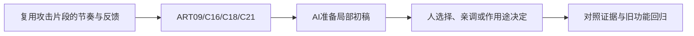

# E-11｜武打表现选修：复用片段，打磨节奏与反馈

> 兼容课号：X02。ABCDE是主题入口，不是必须按字母顺序完成；文件链接与题号保留稳定。

版本：Applied Curriculum v5｜2026-09-15
状态：课件正文与互动规格已编写；尚未逐课生成OpenMAIC课堂或试教。

## 1. 本课任务卡

**产出：** 用现成动作片段设计一次清楚的起势、接触、恢复，不研究复杂格斗系统。
**前置：** X01, B11；**对应概念：** ART09/C16/C18/C21。
**预计课堂：** 20–30分钟，可在实验前后暂停；不含后续真实软件制作时间。
**M 必须掌握：**
- 识别起势、接触点和收势，用少量时间调整提升可读性。
- 区分动作画面、命中判定和反馈触发，并做重复输入检查。
**K 理解即可：**
- Anticipation、Follow-through、Hit stop、Blend是表现词；不用全部采用。
**停止线：** 不要求从零制作武打动作、专业动捕或复杂连招；本课只做表现与复用判断。

## 2. 必要讲解：先看现象，再给术语

好看的武打片段不等于可用攻击。玩家要能读出准备、接触与恢复；动画时间和判定时间要对齐，但判定不由模型看起来碰上自动发生。

可以从兼容片段裁剪、调速、过渡和少量接触修正。过度调速会损害动作重量和脚底稳定；复杂坏片段可以换资源，不强迫初学者成为动画师。

## 2A. 这次在实际场景里解决什么

**应用位置：** P07隔离实验｜复用攻击片段的节奏与反馈；选修隔离实验：有价值才接入。

|开始时遇到的问题|本课期望得到的变化|
|---|---|
|攻击动画播放了，但命中、声音和停顿不同步。|在独立测试区用现成片段检查起手、接触、收势与反馈，不把收集游戏强改成战斗游戏。|

**这是目标状态对照，不是已完成截图。** 首次操作应使用匹配当前进度的最小场景；还没有配套时，只能记为课堂模拟，不能直接勾选真机应用通过。

### 概念关系示意


图中箭头表示教学流程，不是引擎节点继承。OpenMAIC不支持Mermaid时改画等价方框图，不能把代码原文冒充运行示意。

### 先让AI帮助理解，再让AI帮助工作

**学习指令：**
```text
现在只检查这道判断：剑的模型看起来碰到目标就等于命中吗？
先等我给预测和理由，再指出一个证据缺口；一次只给一个线索，不先公布完整答案。
我的用词不专业时，先用人话确认意思，再补对应术语。
```

**工作指令：可复制；先补实际版本与当前材料，不粘贴密钥。**
```text
我正在逐步制作同一个小型单机「星光小庭院」，不是重新生成整款游戏。
我会提供实际软件版本、当前场景/文件和必要截图；先确认你能访问哪些材料和工具。
这次只做：仅在隔离动作测试中复用一个攻击片段。分清动作展示、命中规则和反馈事件，给时间线标记及空挥/命中的对照；不扩展连招、敌人AI或完整战斗数值。
必须保持：原庭院主线无战斗；源动画只读，测试不能改变主奖励状态。
先列出将改的对象、原值和预期结果，提供最小可撤销初稿及检查步骤。
没有真实软件连接时只提供操作单/脚本，不声称已经编辑、运行或看过未提供的截图。
不要自动安装插件、联网下载素材、购买服务或读取无关文件；必要操作另说明并取得授权。
完成后报告实际做了什么、还没验证什么；我负责选择和最终验收。
```

### 哪些地方比继续发指令更适合亲自试

|入口与性质|一次只做的微调/选择|亲眼观察什么|
|---|---|---|
|片段播放速度（内置）|固定事件定义，先微调速度|动作是否可读，事件是否仍跟随正确时间位置|
|命中/音效事件时点（自定义时间线）|回放后只调一处时点|动作接触、实际命中和反馈是否一致|

**初值与恢复：** 先读取并记录当前值；表里的方向是对照办法，不是通用最佳参数。先在副本上操作，不覆盖基底；返回前用撤销或记录值恢复并重新预览。自定义变量不是软件内置参数。
**选择下一步：** 方向不对，补一张明确参考并圈出要借鉴的部分；结构/因果不对，让AI做局部修复；已接近目标且入口可直接操作，先亲调一项。原因不明先做对照，不靠反复重生成抽卡。

**局部修复指令：**
```text
保留本课「必须保持」的部分。我会给出同条件的当前结果和目标差异。
只围绕「在独立测试区用现成片段检查起手、接触、收势与反馈，不把收集游戏强改成战斗游戏。」检查一个根因假设；先给最小验证，未经证据不要重写全部内容。
若只是一个可见参数偏差，告诉我该选哪个对象、哪个入口、怎么小幅调和恢复。
```

**本课风险检查：** 检查AI是否把动画结束等同命中，或用强闪屏掩盖接触时点错误。
**时间边界：** 上述是需要在当前模型/工具/软件版本下验证的风险清单，不是所有AI必然失败的结论，也不预测何时会解决。长期保留的是目标、约束、参考选择、结果认可和取舍责任；测量和重复调整可以继续交给AI协助。

## 3. 界面与参数学习深度

以下是后续真机操作的对应范围，不要求本轮打开软件。模拟滑块是教学控件，不代表软件都有同名按钮。会调是指看懂作用、主动选择与恢复；会定位是知道去哪找；按需查不考菜单路径、快捷键和API记忆。
- 常用：片段起止、速度、过渡和事件标记。
- 会定位：AnimationPlayer/Tree、Dope Sheet/Action或NLA。
- 按需查：复杂曲线、动捕清理、IK和高级连招框架。

## 4. 互动实验规格

**初始状态：** 用原创抽象角色或许可允许的单次挥动片段；时间条标起势/接触/恢复；木桩为虚构目标；默认无命中逻辑。
**可操作项：** 整体速度0.8到1.2倍、接触事件时间、过渡0到0.2秒、反馈开关、重复输入。
**实验步骤：**
1. 先在时间条指出预计接触时刻，不看答案。
2. 小幅调速，再对齐一次命中与反馈，避免反馈先于事件。
3. 检查空挥不计命中、同次攻击不重复奖励、动作结束能恢复。
**预期反馈：** 示意时间线不冒充真实引擎动画；非真实战斗教学。若只有静态资料，用帧序列判断代替播放，不伪造动作资源。
**故障或反例：** 故障：只因播放动画就自动命中，空挥也扣目标状态；拆分动画、判定与反馈。
**复位：** 恢复片段速度、时间标记、目标状态与反馈。
**无图/无3D替代：** 用原创简单形状、状态卡或给定时间序列表达同一因果关系；标明“示意”，不得把预设结果说成Godot/Blender实测。不能以假按钮或不响应的截图代替交互。
**完成判据：** 对本课两项M提供操作或判断及解释；一个实验可覆盖多项。只有关键M或发现薄弱处才追加故障/变式，不为每个术语加作业。

## 5. 小结与必须牢记

- 复用动作不等于复用所有判定。
- 节奏先清楚，再加特效。
- 少量适配，不为坏资源无限返工。

## 6. 训练：先作答，再看反馈

P=预测，D=诊断，T=迁移，K=用途认识。下面是候选训练，不是每个词都做四次作业。课堂先用预测和一个操作，重点未达标再选D或T；延迟复测换对象，不重复抄答案。

### X02-P1
剑的模型看起来碰到目标就等于命中吗？

### X02-D2
空挥也掉目标生命，先查哪里？

### X02-T3
动作换成长柄道具，需要调整和验证什么？

### X02-K4
Anticipation有什么用途？

## 7. 后续真机任务（配套待做，不作为当前课堂依赖）

动作资源、引擎判定与后续演示单独制作，不进入基础单机收集毕业门槛。
即使已有参考工程，也要区分课件、运行测试、人工体验、学习掌握四种证据。按用户安排，当前先完成全部课件，之后再统一补素材、Godot/Blender起始与参考工程。

## 8. 实际应用验收：把结果放回同一个项目

**本课产物：** 在独立测试区用现成片段检查起手、接触、收势与反馈，不把收集游戏强改成战斗游戏。
**接入边界：** 原庭院主线无战斗；源动画只读，测试不能改变主奖励状态。

以下是要采集的证据，不是宣称已经执行。记录“未尝试 / 有提示完成 / 独立验证 / 隔次仍会”；不把这四种状态与M/K学习要求混淆。

|原有M能力|本次在哪里取证|
|---|---|
|识别起势、接触点和收势，用少量时间调整提升可读性。|能说明动作片段并不自动包含正确命中规则。|
|区分动作画面、命中判定和反馈触发，并做重复输入检查。|能用一段复用资源作节奏对照，解释空挥与命中反馈不同。|

**旧功能回归：** 改变播放速度后重新测时点；原庭院仍是无战斗的收集项目。
**最小记录：** 一段现场演示，或同条件前后图/日志，加一句“我改了什么、为什么”。截图不足以证明运动/一次性事件时，要演示动作或查看对应状态。记录用过的提示，不要求写长报告。
**一般能力取证：** 一次有效操作/选择与解释即可；只有证据不足才补练，不强制反复考试。

**换情境的候选任务：** 换成工具敲击或开箱动作，借用时间线思路而非照搬攻击逻辑。
**判定：** 普通M按原0–2锚点；有针对性根因提示记练习，换变式再验证。K只查用途，不能抵消关键M失败。没有真实操作的M只记待验证，模拟通过不能自动升级为真机通过。未选专题不阻塞主线。

**接入不等于新增系统：** 美术课可交风格卡、参数决定或改造样本；性能课可得出“不优化”。隔离实验只有对当前项目有收益才接入，不强迫庭院变成战斗、开放世界或联网游戏。

## 9. 复现与延迟检查

本课复现：B10, B11, I02。只复习已学的关键M。
下次课抽一个本课关键判断，换对象或数值后先独立解释。查菜单和API不扣独立判断分；被提示根因或目标值后完成，记录有提示，换变式再验。K不反复背定义。

## 10. 依据与观看入口

- [Godot AnimationTree：动画组织](https://docs.godotengine.org/en/stable/tutorials/animation/animation_tree.html)
- [Godot Retargeting 3D Skeletons](https://docs.godotengine.org/en/stable/tutorials/assets_pipeline/retargeting_3d_skeletons.html)
- [Adobe Mixamo FAQ：角色、动作及使用条件](https://helpx.adobe.com/creative-cloud/faq/mixamo-faq.html)

技术来源支持术语和软件边界；具体实验与课程顺序是本项目教学设计，不代表已证明学习效果。艺术家入口用于观看研习，不等于获得图片或素材再分发许可。
