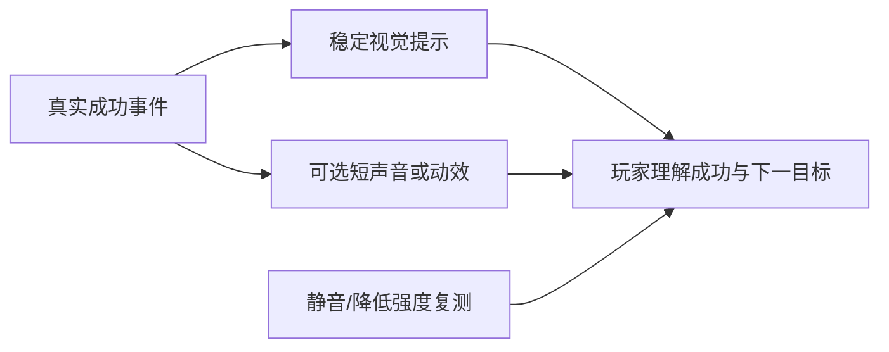

> 新手教学循环：先用一个现象和控件随练，再转0A指定软件样例；根据结果渐撤提示。AI诊断先引用证据并追问，不能直接代做后判掌握。下面的维护规则和提示词不逐字朗读成课。

> 课堂编排补充：不要把全部协作提示词、权限边界和检查清单逐字朗读成幻灯片。先显示本课目标和一个概念对照，安排一次可操作实验，再按学员需要展示可复制对话资源。
> 缺少真实软件/图片时可以做明示的概念模拟；模拟目标通过与真机应用通过分别记录。不得创建无响应的滑杆，不能渲染3D时选能保留同一因果关系的替代，否则标该实验未完成。

> 给OpenMAIC生成器：复制本文件全文作为课程要求即可，不需要再拼接其他规则文件。本文件是教师生成规格，不是直接发给学生的讲义。
> 用中文授课，英文术语附人话；优先操作与因果对照。不要扩展软件百科，不调用仓库工具，不索取密钥。
> 先提出可实现的页面与互动计划，再生成本课；生成后必须实测控件。参考答案只用于教师反馈，不放在题干或初始幻灯片。前端隐藏不是保密措施。

# B07｜反馈：让玩家知道刚才成功了

版本：统一课号课程版｜2026-09-15
状态：课件正文与互动规格已编写；尚未逐课生成OpenMAIC课堂或试教。

**学习分组：** B组；**本课编号：** B07；**路线：** 主线。

## 0. 开始前：只准备本课需要的东西

**本次起点：** 现成实验：game/labs/event_lab.tscn、game/scenes/main.tscn。先做：在事件Lab切换可见反馈，比较成功计数和显示；再观察主游戏真实拾取。；不要从空项目重建。
**缺材料时：** 先用课内模拟辨清概念。缺起始场景时仅准备最小搭建清单；不要让新手为了上本课先生成整款游戏，真机应用保持待验证。
**当前配套：** 见0A的真实文件、首步与覆盖边界；文件存在不表示本课所有M已有完整配套。

**今天的最小任务：** 设计静音也能辨认的拾取反馈，不靠过亮和大粒子堆效果。
**怎样读：** 先看两项M和概念图，再复制对话1。启动框已带首步、继续条件和结束证据；之后用自己的话回复即可，不必把六框逐一重发。
**怎样停：** 完成当前小步可以暂停，记录下次起点；只有本课两项M都有相应证据才标本课应用通过。暂停不是失败，模拟完成不是软件通过。
**先学再验：** 初次允许AI示范一小步，你再换一个值/对象作选择；需要检查独立判断时换未讲过的变式，不要求从零手写代码。

## 0A. 这课怎样学、怎样查缺口

**学习顺序：** 短示范或预测 → 课堂随练 → 软件概念对照 → 自己解释 → 只补薄弱项。

**实际配套：** [event_lab.tscn](../../game/labs/event_lab.tscn)、[main.tscn](../../game/scenes/main.tscn)

**练习首步：** 在事件Lab切换可见反馈，比较成功计数和显示；再观察主游戏真实拾取。

**配套局限：** 现成反馈与规则分离；本Lab未提供完整音频/粒子/打击感库，不以反馈关掉判规则失败。

**正式项目落点：** P2/P9。实验只为理解；进入相应生产阶段再迁移。

**打开方式与分工：** [现成实验入口](../../LABS-START.md)。Godot打开当前场景按F6；Blender直接打开已有文件，先另存副本。默认先体验，不为上课重新搭建。

**回忆与检查：** [本课记忆规则](../../print/memory-by-lesson.md#b07) · [单元检查](../../assessments/unit-checkpoints.md) · [AI追问与弱项诊断](../../assessments/ai-diagnostic-review.md)。

**记录分开：** 回忆/解释/软件应用/换情境；没有证据写待验证。菜单/API可查；得到根因提示记有提示。

## 1. 本课任务卡

**产出：** 设计静音也能辨认的拾取反馈，不靠过亮和大粒子堆效果。
**前置：** B06；**对应概念：** KN18。
**预计课堂：** 20–30分钟，可在实验前后暂停；不含后续真实软件制作时间。
**M 必须掌握：**
- 把成功状态与视觉反馈明确对应。
- 比较反馈强度，检查不遮挡目标且静音可辨。
**K 理解即可：**
- Tween、粒子、空间音效是可选表现工具。
- 短促Camera impulse、轻微FOV/Size Pulse属于可选强调；静音与低镜头运动时仍应能读懂结果。
**停止线：** 不学整套音频工程和特效节点；不把华丽程度当评分依据。

## 1A. 必学内容、实操与题目如何对应

M1/M2只是本课任务卡的两项能力序号，不是新的技术概念。查菜单/API不扣独立判断分。

|必须掌握到这里|本课实操题：做什么算有证据|可选配套题|
|---|---|---|
|M1：把成功状态与视觉反馈明确对应。|在成功和拒绝两种情境核对反馈，静音时仍能辨认结果。|B07-P1, B07-D2|
|M2：比较反馈强度，检查不遮挡目标且静音可辨。|在实际游戏机位调一次强度/时长，保证目标和路径不被遮挡。|B07-P1, B07-T3|

**最低学习路径：** 一次预测 → 一个能覆盖上述两项M的小实验/项目改动 → 一次结果解释。普通M做到即可；关键薄弱处再选一题诊断或隔次迁移，不把P/D/T全套加到每个术语上。
**理解即可与停止线：** 任务卡中的K只检用途；按需查的界面、API、高级实现不进入本课操作门槛。只有已学且已存在的项目功能需要回归。

## 2. 必要讲解：先看现象，再给术语

反馈服务于玩家识别：我碰到了吗、拿到了吗、还剩什么。稳定计数、短动效和声音可以互补；只有声音时静音玩家可能错过。

先做一项短反馈，再调持续时间和强度。持续闪烁、过强光晕或全屏效果可能遮住下一目标；偏好必须通过实际观察而不是口头说更刺激。

固定视角特别适合“局部效果清楚、镜头效果克制”的反馈分层：先有目标本身的缩放/闪光/消失，再加少量粒子与声音；重要事件才考虑一次很短的镜头冲击。镜头效果是加分层，不是成功状态本身。

## 2A. 场景、概念图与逐步AI对话

**实际位置：** P04｜拾取成功是否能被感知。

|操作前的问题|本课希望得到的结果|
|---|---|
|星星突然消失，玩家不知道成功还是出错。|短动效或声音配合稳定视觉提示，静音时仍能判断成功。|

这是目标对照，不是已完成的游戏截图。概念图为职责/因果示意，不是继承图或完整运行证明。

OpenMAIC不能渲染Mermaid时画等价方框图；无3D或真实连接时仅标课堂模拟，不伪造软件运行。

### 本课人和AI分别负责什么

|责任|这课具体做什么|
|---|---|
|我必须作出的判断|规定玩家应感知的成功信息及强度，不把播放特效等同于奖励成功。|
|可以交给AI的制作|把反馈接在已确认的成功结果后，给出静音与弱效果选项。|
|我检查AI交付物|看修改对象/前后差异、实际执行记录及未验证项；先核对是否保留本课约束，再决定是否接入。|

**不是手工熟练考试：** 重复劳动与代码可委托；常用可见参数适合亲调时先调一项，无障碍需要可由AI按已选值执行。必须能说明选择、观察和恢复，不要求机械地拖每个滑杆。

**两种模式：** 练习时可问根因、看示范；独立验收时先由我提出选择/假设，AI只协助执行与记录。已透露本题根因或目标值，就记录“有提示”，再换未揭示答案的变式。

### 复制第1框开始；以后每次只发当前一步

**学员用法：** 无需一次读完所有提示。将当前框发给你使用的AI；做完后回“完成＋观察”，结果不符回“不符＋现象”，报错回“报错＋原文”，需要停下回“暂停”。自然语言也可以。不要一口气把六步当成自动执行授权。

### 对话1｜建立本课上下文

```text
请做我这节课的协作教练：B07《反馈：让玩家知道刚才成功了》。
我们逐步制作同一个「星光小庭院」，当前只解决：星星突然消失，玩家不知道成功还是出错。
目标：短动效或声音配合稳定视觉提示，静音时仍能判断成功。
必须掌握：把成功状态与视觉反馈明确对应；比较反馈强度，检查不遮挡目标且静音可辨。理解即可：Tween、粒子、空间音效是可选表现工具；短促Camera impulse、轻微FOV/Size Pulse属于可选强调；静音与低镜头运动时仍应能读懂结果
停止线：不学整套音频工程和特效节点；不把华丽程度当评分依据。
必须保持：奖励次数、检测距离和游戏状态不变，效果不能决定计数。
本课由我负责：规定玩家应感知的成功信息及强度，不把播放特效等同于奖励成功。
可以交给你：把反馈接在已确认的成功结果后，给出静音与弱效果选项。
请标明建议/已执行/已验证的区别。练习可提示；验收先等我作判断，已提示根因则如实记有提示。
概念配套：game/labs/event_lab.tscn、game/scenes/main.tscn
练习首步：在事件Lab切换可见反馈，比较成功计数和显示；再观察主游戏真实拾取。
覆盖边界：现成反馈与规则分离；本Lab未提供完整音频/粒子/打击感库，不以反馈关掉判规则失败。
对应生产阶段：P2/P9；达到当前阶段才迁移，不把实验完成当成项目通过。
默认先用现成实验体验；下方连接/实现任务属于之后的项目迁移，不作为打开本实验的前置。OpenMAIC已提供同等概念证据时不重复刷题，但真实资源/物理/导出等软件证据不可由模拟代替。
先复用上述现有样本，不重新生成同一个Lab。练习可提示；检查先只读快照，不一边改答案一边评分。
先读取我已提供的进度和材料，只问真正缺失的一项。需要软件操作时核对实际版本、当前截图或场景树、可访问的工具；不要求我发密钥或整个电脑。
本课入场材料：现成实验：game/labs/event_lab.tscn、game/scenes/main.tscn。先做：在事件Lab切换可见反馈，比较成功计数和显示；再观察主游戏真实拾取。；不要从空项目重建。
材料不足的处理：先用课内模拟辨清概念。缺起始场景时仅准备最小搭建清单；不要让新手为了上本课先生成整款游戏，真机应用保持待验证。
以下是本课连续推进卡，不是一次性执行授权；收到我的观察后每轮最多推进一个有意义的小步。
首步：只在已有成功拾取事件后加一个稳定视觉反馈，不先加声音粒子全套。
继续条件：静音也能判断是否成功，反馈不先于真实事件。
随后一步：再选择一种短动作或声音，调强度并复查是否遮挡下个目标。
结束证据：在成功和拒绝两种情境核对反馈，静音时仍能辨认结果。；在实际游戏机位调一次强度/时长，保证目标和路径不被遮挡。
相关回归：一次拾取只加一次；连拾两颗不会长时间遮挡界面。
这些是待执行要求，不是我的已完成进度。不要凭课号推断前置已通过；只复用我已提供的实际材料和证据。
对话1之后我可直接回复完成/不符/报错/暂停，无需重贴整课；你应沿这张推进卡继续，不临时增加系统。
先给一个预测问题并等我回答，再给一个最小步骤。不跳课、不自动做整款游戏。能执行才说已执行，否则给明确操作单或脚本，并标未执行。
后续每轮用四项回应：现在是哪一步；只改什么/怎样恢复；我应观察什么；目前还缺什么证据。没有证据不要替我勾通过。
```

**AI此时应做：** 确认当前场景与学习范围，不直接输出几十个文件。已经提供过的版本、素材和约束应复用，不重复问。

### 对话2｜先理解一个因果关系

```text
先问我：合法拾取和被拒绝接触都播放成功声，但只有前者计数。你认为什么反馈应保留、什么应取消？静音还需要什么？
等我写预测和理由后，再指出一个证据缺口，只给一个提示，不先公布完整答案。用词不专业时先确认意思，再补术语。
```

**转入下一步：** 有自己的预测即可；预测错可以用实验纠正，不要求先背定义。

### 对话3｜AI只完成第一小步

```text
沿用已确认的版本、材料和修改边界。现在只做：只在已有成功拾取事件后加一个稳定视觉反馈，不先加声音粒子全套。
先列影响对象和原值，再提供一个可撤销初稿。没有实际软件连接时给我可执行的局部操作单/脚本，不说已经修改。做完先停下。
```

**预计看到／拿到：** 静音也能判断是否成功，反馈不先于真实事件。
**不是自动保证：** 这是验收目标，取决于实际模型、工具和输入；结果不同就走下方“不符”分支。

### 对话4｜人观察与亲调，再继续第二小步

```text
这是我刚才的实际结果：我会附一张当前图、短演示或必要日志，并用一句话描述差异。
先检查是否满足：静音也能判断是否成功，反馈不先于真实事件。
本课可用的微调项：
入口：反馈时长（项目自定义）；操作：先短再稍长，固定位置和其他强度；观察：是否可察觉、是否挡住下一目标
入口：声音音量/静音与视觉提示（内置/入口）；操作：先静音走一次，再调合适音量；观察：没有声音是否还能判断；不以音量越大越好
若满足，先指导我选择其中一项亲调；我回报观察后才继续：再选择一种短动作或声音，调强度并复查是否遮挡下个目标。
一次只动一项可见参数。方向接近就手调；结构有误才给局部修复，不能不断重生成整个场景。
```

|选中哪里与参数性质|这次亲自试什么|观察与停手依据|
|---|---|---|
|反馈时长（项目自定义）|先短再稍长，固定位置和其他强度|是否可察觉、是否挡住下一目标|
|声音音量/静音与视觉提示（内置/入口）|先静音走一次，再调合适音量|没有声音是否还能判断；不以音量越大越好|

**保存与恢复：** 先记录原值和实际对象。优先在安全副本试；运行中Remote Inspector的变化不要当成已保存的设计值，确认后将选定值写回本地场景/资源或配置并重新运行。菜单路径随版本核对，自定义变量不冒充内置属性。
**采用哪种沟通：** 大方向偏了，用参考图圈出要借鉴的轮廓/色彩/光感，并指出不要照搬什么；单个视觉值接近了，先拖或输入数值；原因不明，固定条件做一次对照。参考图不是可自动反推所有参数的答案。

### 对话5｜成功验收，或失败时只修一处

**达到目标时发送：**
```text
请只根据我提供的证据检查：
- 在成功和拒绝两种情境核对反馈，静音时仍能辨认结果。
- 在实际游戏机位调一次强度/时长，保证目标和路径不被遮挡。
旧功能回归：一次拾取只加一次；连拾两颗不会长时间遮挡界面。
缺少过程证据就标待验证；不得用一张截图证明走跳或一次性事件。不要新增需求或把所有候选题变成作业。
```

**结果不符或报错时发送：**
```text
不符/报错：我会提供触发步骤、预期、实际现象和必要原始日志。
保留：奖励次数、检测距离和游戏状态不变，效果不能决定计数。
本课优先风险：检查AI是否把反馈加入每帧逻辑、用高强度闪烁，或随星星释放提前结束声音。
先提出一个可推翻的假设和一个最小验证；不要同时改多个系统。若两次验证仍无进展，回到基线并列出缺失证据，不反复抽卡。不要删除测试、关闭需求或扩大权限来假装修好。
```

**AI评分边界：** 代码和初稿可以由AI提供；判断、亲调与证据解释由学员完成。得到根因提示记为有提示，不因此重复考试所有概念。

### 对话6｜存进度，下一次接着做

```text
请总结本课B07（B07）的进度卡，不把预测当已完成。
记录：真实软件版本/渲染器；当前场景与变更对象；选定参数和原值；我做的判断；实际证据；通过/待验证；使用过的提示；恢复方法；下一步唯一任务。
只有实际验证才标通过，没有生成或真机执行就明确写模拟/待验证。给我一段可以复制到新AI对话的摘要，不假称你已持久保存。
先核对下一课前置和我的已选路线，未完成就停在当前步骤，不催着扩范围。
```

**学员保存：** 把进度卡存本地或私人笔记；下次粘贴进度卡和下一课第1框。不要公开API Key、账户、本地私密路径或个人录像。

### 当前风险与长期责任

**本课风险检查：** 检查AI是否把反馈加入每帧逻辑、用高强度闪烁，或随星星释放提前结束声音。
这是需要在当前工具版本下核验的风险，不是所有AI必然失败的排行榜，也不预测何时改善。长期保留需求、参考选择、影响范围、结果认可与取舍责任；测量、批量设置和重复验证可以由AI协助。
**不把学习变成额外六次考试：** 六个对话阶段共享本课原有M/K证据；只在薄弱关键能力上追加一处故障或变式。没有实际材料时先做课堂模拟，真机状态单独记录。

## 3. 界面与参数学习深度

以下是软件操作的对应范围；优先使用0A已给出的实验，尚无配套的部分如实标待验证。模拟滑块是教学控件，不代表软件都有同名按钮。会调是指看懂作用、主动选择与恢复；会定位是知道去哪找；按需查不考菜单路径、快捷键和API记忆。
- Godot：动画时长、透明度/缩放等暴露参数、音量。
- 会定位：AnimationPlayer/Tween入口、Audio Bus。
- 按需查：粒子材质、空间衰减与混音技术。

## 4. 互动实验规格

**初始状态：** 已有计数的拾取场景示意；一颗星；视觉提示持续0.3秒；声音默认关闭。
**可操作项：** 提示开关、持续0.1到0.8秒、强度低/中/高、静音、减少动态效果。
**实验步骤：**
1. 先预测只靠声音时静音会漏掉什么。
2. 保持计数不变，比较三档反馈强度，指出遮挡。
3. 低动态模式下用稳定图标和文字继续表达成功。
**预期反馈：** 反馈必须由成功事件触发；失败接触不得播放成功效果。提供无音频替代而非自动播放声音。
**故障或反例：** 故障：错误对象碰星也显示成功；修触发条件，不能仅换颜色掩盖。
**复位：** 清空短效果、恢复未拾取状态、保留用户静音设置。
**无图/无3D替代：** 用原创简单形状、状态卡或给定时间序列表达同一因果关系；标明“示意”，不得把预设结果说成Godot/Blender实测。不能以假按钮或不响应的截图代替交互。
**完成判据：** 对本课两项M提供操作或判断及解释；一个实验可覆盖多项。只有关键M或发现薄弱处才追加故障/变式，不为每个术语加作业。

## 5. 小结与必须牢记

- 反馈要对应真实成功。
- 静音也能辨认。
- 少量清楚胜过大量遮挡。

## 6. 训练：先作答，再看反馈

题干中的日志、数值与AI建议均为标明的教学情境，除非另附运行证据，不是本项目实测。可以有多个合理假设：先给能区分它们的验证，而不是猜老师心中的唯一原因。

P=预测，D=诊断，T=迁移，K=用途认识。下面是候选训练，不是每个词都做四次作业。课堂先用预测和一个操作，重点未达标再选D或T；延迟复测换对象，不重复抄答案。

### B07-P1
**考察范围：** M1、M2的限定子能力；不是整项真机通过证明。先给判断与理由；要求操作时再提供过程/对照。仅答对文字不自动等于实际应用通过。

合法拾取和被拒绝接触都播放成功声，但只有前者计数。你认为什么反馈应保留、什么应取消？静音还需要什么？

### B07-D2
**考察范围：** M1的限定子能力；不是整项真机通过证明。先给判断与理由；要求操作时再提供过程/对照。仅答对文字不自动等于实际应用通过。

【教学构造情境，不是真实测量或某模型故障统计】成功拾取和错误对象进入都会播放庆祝粒子，但只有前者增加计数。AI建议把粒子做得更亮帮助判断。你应核对哪个触发条件，如何同时验证成功、拒绝和静音？

### B07-T3
**考察范围：** M2的限定子能力；不是整项真机通过证明。先给判断与理由；要求操作时再提供过程/对照。仅答对文字不自动等于实际应用通过。

无声环境中如何保留拾取信息？

### B07-K4
**考察范围：** K｜理解用途即可；不要求实现。一句用途解释即可。

Tween适合什么？

## 7. 正式项目迁移（达到相应阶段再做）

后续只实现一种反馈即可，不强制音效和粒子全做。
即使已有参考工程，也要区分课件、运行测试、人工体验、学习掌握四种证据。已有Lab先随课使用；完整生产按任务单推进，未交付的逐课配套不冒充完成。

## 8. 实际应用验收：把结果放回同一个项目

**本课产物：** 短动效或声音配合稳定视觉提示，静音时仍能判断成功。
**接入边界：** 奖励次数、检测距离和游戏状态不变，效果不能决定计数。

以下是要采集的证据，不是宣称已经执行。记录“未尝试 / 有提示完成 / 独立验证 / 隔次仍会”；不把这四种状态与M/K学习要求混淆。

|原有M能力|本次在哪里取证|
|---|---|
|把成功状态与视觉反馈明确对应。|在成功和拒绝两种情境核对反馈，静音时仍能辨认结果。|
|比较反馈强度，检查不遮挡目标且静音可辨。|在实际游戏机位调一次强度/时长，保证目标和路径不被遮挡。|

**旧功能回归：** 一次拾取只加一次；连拾两颗不会长时间遮挡界面。
**最小记录：** 一段现场演示，或同条件前后图/日志，加一句“我改了什么、为什么”。截图不足以证明运动/一次性事件时，要演示动作或查看对应状态。记录用过的提示，不要求写长报告。
**一般能力取证：** 一次有效操作/选择与解释即可；只有证据不足才补练，不强制反复考试。

**换情境的候选任务：** 给开门成功设计不同反馈，避免与拾取提示混淆。
**判定：** 普通M按原0–2锚点；有针对性根因提示记练习，换变式再验证。K只查用途，不能抵消关键M失败。没有真实操作的M只记待验证，模拟通过不能自动升级为真机通过。未选专题不阻塞主线。

**接入不等于新增系统：** 美术课可交风格卡、参数决定或改造样本；性能课可得出“不优化”。隔离实验只有对当前项目有收益才接入，不强迫庭院变成战斗、开放世界或联网游戏。

## 9. 复现与延迟检查

本课复现：B06, B03。只复习已学的关键M。
下次课抽一个本课关键判断，换对象或数值后先独立解释。查菜单和API不扣独立判断分；被提示根因或目标值后完成，记录有提示，换变式再验。K不反复背定义。

## 10. 依据与观看入口

- [Godot AnimationTree：动画组织](https://docs.godotengine.org/en/stable/tutorials/animation/animation_tree.html)
- [Godot运行检查与可见碰撞工具](https://docs.godotengine.org/en/stable/tutorials/scripting/debug/overview_of_debugging_tools.html)

技术来源支持术语和软件边界；具体实验与课程顺序是本项目教学设计，不代表已证明学习效果。艺术家入口用于观看研习，不等于获得图片或素材再分发许可。

## 11. 教师反馈与评分依据（初始课堂不可展示）

沿用全仓库0–2锚点：0=已显示错误；无证据另记待验证；1=提示后完成或理由不清；2=能选择、解释并验证。实现可由AI提供，评价的是学员判断。课堂不强制凑100分；结业仍按M90/K10反馈，K不能补救关键M失败。
两项M都需要有效证据，不能按四道题等权平均掩盖能力缺口。普通M用一次有效操作和解释；关键M增加故障/迁移与延迟复测。E06全K只确认用途，没有M成绩。

**B07-P1 核对要点：** 仅真正成功触发成功反馈；静音要有稳定计数/图标等可见结果，不能用声音代替状态。
**错因提示：** 先看接受结果，再看表现。
**反馈策略：** 先指出证据缺口，给该提示；仍困难再示范。看答案后立即复述不算独立掌握。

**B07-D2 核对要点：** 核对反馈是否跟随已接受的结果而非原始进入事件。成功有稳定可见提示，拒绝不假报成功；关闭声音后仍能读到结果，不改计数规则。
**错因提示：** 粒子在确认结果之前还是之后触发？
**反馈策略：** 先指出证据缺口，给该提示；仍困难再示范。看答案后立即复述不算独立掌握。

**B07-T3 核对要点：** 用稳定计数、短视觉或图标形成替代，不只换更响音效。
**错因提示：** 去掉声音仍能读懂吗？
**反馈策略：** 先指出证据缺口，给该提示；仍困难再示范。看答案后立即复述不算独立掌握。

**B07-K4 核对要点：** 短时间内变化某个参数，如缩放或透明度；语法按需查。
**错因提示：** 不用列API。
**反馈策略：** 先指出证据缺口，给该提示；仍困难再示范。看答案后立即复述不算独立掌握。

## 11A. 本课诊断题的具体评分锚点

**B07-D2｜M1的限定子能力；不是整项真机通过证明**
**2：** 区分请求与成功；正反测试和静音可读，强度不替代条件修复。
**1：** 方向合理但缺区分性验证/结果解释，或得到目标根因提示后才完成；继续一次最小补练。
**0：** 已给出的选择违背题干约束、以无关补偿代替原因检查，且不能用证据解释。尚未提交/无法观察的部分另记“待验证”，不能假定学员不会。
**可接受替代：** 不要求使用参考答案的术语或唯一路径；其他符合条件、可检验且可恢复的方案同样可得分。真实软件表现须另有对应过程证据。
**迁移安排：** D题已讲解时不拿原题重复作独立考试。换本课T题的对象/一个约束，先不给目标参数和根因；实现代码仍可由AI执行已由学员选定的方案。

## 12. 生成后的验收清单

- [ ] 概念后有局部AI工作、亲调入口与对应证据。
- [ ] 模拟和真实工具执行分开。

- [ ] 先有本课目标和M/K/停止线，未把K扩为深度考试。
- [ ] 参数/条件实际改变画面、状态或时间序列，数值和结果一致。
- [ ] 初始状态、单变量对照、故障和复位均可运行；没有图片时替代方案有标示。
- [ ] 学生作答前不展示教师答案；有针对错因的反馈与新变式。
- [ ] 可用键盘/点击操作，文字可读，可暂停；不强制自动音频或高强度闪烁。
- [ ] 技术实测、审美喜好和学习掌握没有混作同一个通过状态。
- [ ] 外部原图/动作仅在许可允许的情况下展示；未伪造来源和运行记录。

- [ ] 本课M到实操题、P/D/T和项目证据可追溯，K未扩大成实现。
- [ ] AI先等学员判断；提示后的表现没有冒充独立掌握；同一题不反复凑分。
- [ ] 教学情境/模拟日志与真实运行分开，替代方案按证据评分，不按关键词或个人审美。
