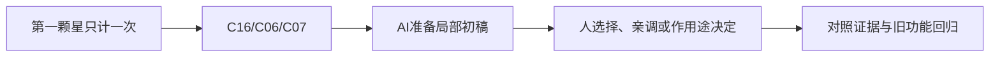

> 给OpenMAIC生成器：复制本文件全文作为课程要求即可，不需要再拼接其他规则文件。本文件是教师生成规格，不是直接发给学生的讲义。
> 用中文授课，英文术语附人话；优先操作与因果对照。不要扩展软件百科，不调用仓库工具，不索取密钥。
> 先提出可实现的页面与互动计划，再生成本课；生成后必须实测控件。参考答案只用于教师反馈，不放在题干或初始幻灯片。前端隐藏不是保密措施。

# B-05｜拾取只算一次：事件、条件与状态

> 兼容课号：B10。ABCDE是主题入口，不是必须按字母顺序完成；文件链接与题号保留稳定。

版本：Applied Curriculum v5｜2026-09-15
状态：课件正文与互动规格已编写；尚未逐课生成OpenMAIC课堂或试教。

## 1. 本课任务卡

**产出：** 解释从进入检测区到计数变化的因果链，并抵抗重复触发。
**前置：** B09, B04；**对应概念：** C16/C06/C07。
**预计课堂：** 20–30分钟，可在实验前后暂停；不含后续真实软件制作时间。
**M 必须掌握：**
- 区分事件发生、条件过滤和状态归属。
- 验证正确对象只计一次，错误对象不计。
**K 理解即可：**
- 延迟释放表示对象不会在调用那一瞬间完全消失。
**停止线：** 不做通用事件总线、背包、网络同步；只讲一条清晰事件链。

## 2. 必要讲解：先看现象，再给术语

事件告诉别人发生了什么；状态保存目前是什么。星星负责检测和防重复，关卡拥有总进度，UI读取它。看得见消失并不等于奖励处理正确。

先确认对象合法，再同步锁定已消耗状态，再通知计数。实际参考工程可能有两层防重；删掉一层未必马上重计。故障实验必须注明观察的是哪层，不能伪造结果。

## 2A. 这次在实际场景里解决什么

**应用位置：** P03｜第一颗星只计一次；主项目中的功能、视觉或交付决定。

|开始时遇到的问题|本课期望得到的变化|
|---|---|
|星星消失但没计数，或同一事件重复发放奖励。|符合条件的玩家触发一次事件，状态拥有者只记录一次。|

**这是目标状态对照，不是已完成截图。** 首次操作应使用匹配当前进度的最小场景；还没有配套时，只能记为课堂模拟，不能直接勾选真机应用通过。

### 概念关系示意


图中箭头表示教学流程，不是引擎节点继承。OpenMAIC不支持Mermaid时改画等价方框图，不能把代码原文冒充运行示意。

### 先让AI帮助理解，再让AI帮助工作

**学习指令：**
```text
现在只检查这道判断：同一星星触发两次，视觉只消失一次就能证明奖励没重复吗？
先等我给预测和理由，再指出一个证据缺口；一次只给一个线索，不先公布完整答案。
我的用词不专业时，先用人话确认意思，再补对应术语。
```

**工作指令：可复制；先补实际版本与当前材料，不粘贴密钥。**
```text
我正在逐步制作同一个小型单机「星光小庭院」，不是重新生成整款游戏。
我会提供实际软件版本、当前场景/文件和必要截图；先确认你能访问哪些材料和工具。
这次只做：只把现有检测区接成一次性拾取。列出触发、过滤、锁定、事件和释放顺序；提供重复请求与错误对象测试。若有两层防重，分别观察各层而不假设删一层必然重复计分。
必须保持：移动、镜头、模型和总目标数量不变；不新增背包或全局事件总线。
先列出将改的对象、原值和预期结果，提供最小可撤销初稿及检查步骤。
没有真实软件连接时只提供操作单/脚本，不声称已经编辑、运行或看过未提供的截图。
不要自动安装插件、联网下载素材、购买服务或读取无关文件；必要操作另说明并取得授权。
完成后报告实际做了什么、还没验证什么；我负责选择和最终验收。
```

### 哪些地方比继续发指令更适合亲自试

|入口与性质|一次只做的微调/选择|亲眼观察什么|
|---|---|---|
|Area3D形状资源（内置）|只调检测半径，先记录基线|接近多近触发，是否远处意外拾取|
|节点信号/运行日志（入口）|观察一次与重复请求，不靠改UI数字修正|事件次数、状态变化与对象释放之间的区别|

**初值与恢复：** 先读取并记录当前值；表里的方向是对照办法，不是通用最佳参数。先在副本上操作，不覆盖基底；返回前用撤销或记录值恢复并重新预览。自定义变量不是软件内置参数。
**选择下一步：** 方向不对，补一张明确参考并圈出要借鉴的部分；结构/因果不对，让AI做局部修复；已接近目标且入口可直接操作，先亲调一项。原因不明先做对照，不靠反复重生成抽卡。

**局部修复指令：**
```text
保留本课「必须保持」的部分。我会给出同条件的当前结果和目标差异。
只围绕「符合条件的玩家触发一次事件，状态拥有者只记录一次。」检查一个根因假设；先给最小验证，未经证据不要重写全部内容。
若只是一个可见参数偏差，告诉我该选哪个对象、哪个入口、怎么小幅调和恢复。
```

**本课风险检查：** 检查AI是否先发事件再锁定、只隐藏对象未限制奖励，或混淆两层防重。
**时间边界：** 上述是需要在当前模型/工具/软件版本下验证的风险清单，不是所有AI必然失败的结论，也不预测何时会解决。长期保留的是目标、约束、参考选择、结果认可和取舍责任；测量和重复调整可以继续交给AI协助。

## 3. 界面与参数学习深度

以下是后续真机操作的对应范围，不要求本轮打开软件。模拟滑块是教学控件，不代表软件都有同名按钮。会调是指看懂作用、主动选择与恢复；会定位是知道去哪找；按需查不考菜单路径、快捷键和API记忆。
- Godot：Area检测对象、信号连接、Inspector中的调试状态。
- 会定位：关卡计数拥有者、输出日志。
- 按需查：signal连接语法、queue_free生命周期细节。

## 4. 互动实验规格

**初始状态：** 玩家/装饰球二选一进入星星；事件日志、consumed和计数同屏；课堂只启用一层可见防重。
**可操作项：** 进入按钮、同帧两次按钮、合法对象切换、consumed防重开关；教师可选双层对照。
**实验步骤：**
1. 先画检测→过滤→防重→通知→显示五张卡顺序。
2. 测试错误对象、正确对象、同帧重复请求。
3. 开启第二层防重，说明某一层关闭为什么仍可能不多加。
**预期反馈：** 每条日志显示接受或拒绝原因；计数来自状态，不从粒子或消失效果推断。
**故障或反例：** 故障：唯一防重被放在通知之后，导致重入重复；先给最小事件记录，学员恢复顺序。
**复位：** 星星、计数、消耗标记和日志全复位，不只重画星星。
**无图/无3D替代：** 用原创简单形状、状态卡或给定时间序列表达同一因果关系；标明“示意”，不得把预设结果说成Godot/Blender实测。不能以假按钮或不响应的截图代替交互。
**完成判据：** 对本课两项M提供操作或判断及解释；一个实验可覆盖多项。只有关键M或发现薄弱处才追加故障/变式，不为每个术语加作业。

## 5. 小结与必须牢记

- 事件不等于状态。
- 消失不等于只计一次。
- 先锁状态，再发通知。

## 6. 训练：先作答，再看反馈

P=预测，D=诊断，T=迁移，K=用途认识。下面是候选训练，不是每个词都做四次作业。课堂先用预测和一个操作，重点未达标再选D或T；延迟复测换对象，不重复抄答案。

### B10-P1
同一星星触发两次，视觉只消失一次就能证明奖励没重复吗？

### B10-D2
关闭对象防重却仍不重复，你能声称实验失败吗？

### B10-T3
把星星改成加能量的果实，应复用与改动哪些部分？

### B10-K4
延迟释放为什么值得认识？

## 7. 后续真机任务（配套待做，不作为当前课堂依赖）

后续用引擎日志复核；Web事件模拟不是Godot生命周期证明。
即使已有参考工程，也要区分课件、运行测试、人工体验、学习掌握四种证据。按用户安排，当前先完成全部课件，之后再统一补素材、Godot/Blender起始与参考工程。

## 8. 实际应用验收：把结果放回同一个项目

**本课产物：** 符合条件的玩家触发一次事件，状态拥有者只记录一次。
**接入边界：** 移动、镜头、模型和总目标数量不变；不新增背包或全局事件总线。

以下是要采集的证据，不是宣称已经执行。记录“未尝试 / 有提示完成 / 独立验证 / 隔次仍会”；不把这四种状态与M/K学习要求混淆。

|原有M能力|本次在哪里取证|
|---|---|
|区分事件发生、条件过滤和状态归属。|能追踪一条触发到计数的因果链，指出状态由谁拥有。|
|验证正确对象只计一次，错误对象不计。|能检查正确对象、错误对象、重复请求，并解释防重复证据。|

**旧功能回归：** 墙还挡人；第二颗仍可拾取；不要用最大显示数量掩盖重复状态。
**最小记录：** 一段现场演示，或同条件前后图/日志，加一句“我改了什么、为什么”。截图不足以证明运动/一次性事件时，要演示动作或查看对应状态。记录用过的提示，不要求写长报告。
**关键能力复测：** 本课高频或返工风险较高，已有有效证据可复用；薄弱处增加一个未知故障或隔次变式，不把每个词都变成一套试卷。

**换情境的候选任务：** 把奖励从星数改为能量，只改变相应状态和显示，不改整个输入系统。
**判定：** 普通M按原0–2锚点；有针对性根因提示记练习，换变式再验证。K只查用途，不能抵消关键M失败。没有真实操作的M只记待验证，模拟通过不能自动升级为真机通过。未选专题不阻塞主线。

**接入不等于新增系统：** 美术课可交风格卡、参数决定或改造样本；性能课可得出“不优化”。隔离实验只有对当前项目有收益才接入，不强迫庭院变成战斗、开放世界或联网游戏。

## 9. 复现与延迟检查

本课复现：B04, B02。只复习已学的关键M。
下次课抽一个本课关键判断，换对象或数值后先独立解释。查菜单和API不扣独立判断分；被提示根因或目标值后完成，记录有提示，换变式再验。K不反复背定义。

## 10. 依据与观看入口

- [Godot Area3D：重叠检测与信号](https://docs.godotengine.org/en/stable/classes/class_area3d.html)
- [Godot Resources：共享和引用](https://docs.godotengine.org/en/stable/tutorials/scripting/resources.html)

技术来源支持术语和软件边界；具体实验与课程顺序是本项目教学设计，不代表已证明学习效果。艺术家入口用于观看研习，不等于获得图片或素材再分发许可。

## 11. 教师反馈与评分依据（初始课堂不可展示）

沿用全仓库0–2锚点：0=缺证据或错误；1=提示后完成或理由不清；2=能选择、解释并验证。实现可由AI提供，评价的是学员判断。课堂不强制凑100分；结业仍按M90/K10反馈，K不能补救关键M失败。
两项M都需要有效证据，不能按四道题等权平均掩盖能力缺口。普通M用一次有效操作和解释；关键M增加故障/迁移与延迟复测。A05全K只确认用途，没有M成绩。

**B10-P1 核对要点：** 不能，要检查计数或奖励状态与事件日志。
**错因提示：** 证据在什么系统？
**反馈策略：** 先指出证据缺口，给该提示；仍困难再示范。看答案后立即复述不算独立掌握。

**B10-D2 核对要点：** 先查关卡是否还有防重；按实际系统层次解释，不编造重复。
**错因提示：** 可能还有哪个保护层？
**反馈策略：** 先指出证据缺口，给该提示；仍困难再示范。看答案后立即复述不算独立掌握。

**B10-T3 核对要点：** 复用检测、合法对象过滤和一次性处理；改奖励状态与反馈，不直接乱改UI。
**错因提示：** 事件链和奖励类型分开。
**反馈策略：** 先指出证据缺口，给该提示；仍困难再示范。看答案后立即复述不算独立掌握。

**B10-K4 核对要点：** 同一轮事件仍可能看到对象或回调，所以防重不能只寄托删除。
**错因提示：** 不需要背引擎队列实现。
**反馈策略：** 先指出证据缺口，给该提示；仍困难再示范。看答案后立即复述不算独立掌握。

## 12. 生成后的验收清单

- [ ] 概念之后立即出现本课真实情境、学习/工作指令和微调入口，不只在结尾贴通用提示。
- [ ] AI模拟执行与真实工具执行明确区分，主项目成果必须另有应用证据。

- [ ] 先有本课目标和M/K/停止线，未把K扩为深度考试。
- [ ] 参数/条件实际改变画面、状态或时间序列，数值和结果一致。
- [ ] 初始状态、单变量对照、故障和复位均可运行；没有图片时替代方案有标示。
- [ ] 学生作答前不展示教师答案；有针对错因的反馈与新变式。
- [ ] 可用键盘/点击操作，文字可读，可暂停；不强制自动音频或高强度闪烁。
- [ ] 技术实测、审美喜好和学习掌握没有混作同一个通过状态。
- [ ] 外部原图/动作仅在许可允许的情况下展示；未伪造来源和运行记录。
