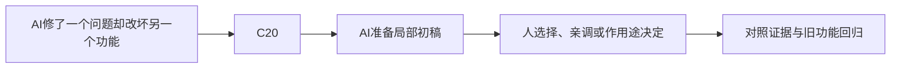

> 给OpenMAIC生成器：复制本文件全文作为课程要求即可，不需要再拼接其他规则文件。本文件是教师生成规格，不是直接发给学生的讲义。
> 用中文授课，英文术语附人话；优先操作与因果对照。不要扩展软件百科，不调用仓库工具，不索取密钥。
> 先提出可实现的页面与互动计划，再生成本课；生成后必须实测控件。参考答案只用于教师反馈，不放在题干或初始幻灯片。前端隐藏不是保密措施。

# D-01｜验收AI改动：小假设、小修改、可回退

> 兼容课号：B15。ABCDE是主题入口，不是必须按字母顺序完成；文件链接与题号保留稳定。

版本：Applied Curriculum v5｜2026-09-15
状态：课件正文与互动规格已编写；尚未逐课生成OpenMAIC课堂或试教。

## 1. 本课任务卡

**产出：** 对一次有缺陷的AI修改提出最小修复与回归方案。
**前置：** B14；**对应概念：** C20。
**预计课堂：** 20–30分钟，可在实验前后暂停；不含后续真实软件制作时间。
**M 必须掌握：**
- 给出复现步骤，限定一个待验证假设。
- 核对diff与需求，拒绝删除功能式修复。
**K 理解即可：**
- 自动测试、分支、日志是辅助工具，不是需要背的理论。
**停止线：** 不背Git对象模型，不重构整个项目，不以代码行数评价完成。

## 2. 必要讲解：先看现象，再给术语

有效报错包含预期、实际、复现、版本和最近改动。先判断所属系统，再让AI提出可证伪的假设；一次改十个地方会让因果消失。

绿色测试也只证明测试覆盖的行为。AI如果删掉碰撞或关掉测试来消除报错，需求仍然失败。提交前核对改动范围和关键回归。

## 2A. 这次在实际场景里解决什么

**应用位置：** P05｜AI修了一个问题却改坏另一个功能；主项目中的功能、视觉或交付决定。

|开始时遇到的问题|本课期望得到的变化|
|---|---|
|修改文件太多，根因不明，无法确认修复到底做了什么。|可以复现、定位一个假设、检查最小改动并恢复基线。|

**这是目标状态对照，不是已完成截图。** 首次操作应使用匹配当前进度的最小场景；还没有配套时，只能记为课堂模拟，不能直接勾选真机应用通过。

### 概念关系示意


图中箭头表示教学流程，不是引擎节点继承。OpenMAIC不支持Mermaid时改画等价方框图，不能把代码原文冒充运行示意。

### 先让AI帮助理解，再让AI帮助工作

**学习指令：**
```text
现在只检查这道判断：不再报错是否等于需求完成？
先等我给预测和理由，再指出一个证据缺口；一次只给一个线索，不先公布完整答案。
我的用词不专业时，先用人话确认意思，再补对应术语。
```

**工作指令：可复制；先补实际版本与当前材料，不粘贴密钥。**
```text
我正在逐步制作同一个小型单机「星光小庭院」，不是重新生成整款游戏。
我会提供实际软件版本、当前场景/文件和必要截图；先确认你能访问哪些材料和工具。
这次只做：先阅读我实际提供的报错、复现步骤和相关文件，不假装读了全仓库。给一个根因假设和最小验证；只在指定文件修改，列出diff、回归步骤和撤销办法。不要删测试或取消功能。
必须保持：不相关场景、资源与已通过功能保持；未经授权不运行破坏性操作。
先列出将改的对象、原值和预期结果，提供最小可撤销初稿及检查步骤。
没有真实软件连接时只提供操作单/脚本，不声称已经编辑、运行或看过未提供的截图。
不要自动安装插件、联网下载素材、购买服务或读取无关文件；必要操作另说明并取得授权。
完成后报告实际做了什么、还没验证什么；我负责选择和最终验收。
```

### 哪些地方比继续发指令更适合亲自试

|入口与性质|一次只做的微调/选择|亲眼观察什么|
|---|---|---|
|Git差异与Godot Output/Debugger（入口）|核对改了哪些文件和首个相关报错|改动是否真的对应假设|
|单一故障字段（内置或自定义，以当前文件为准）|仅恢复目标字段，再重复原步骤|症状是否消失且没有靠扩大范围掩盖|

**初值与恢复：** 先读取并记录当前值；表里的方向是对照办法，不是通用最佳参数。先在副本上操作，不覆盖基底；返回前用撤销或记录值恢复并重新预览。自定义变量不是软件内置参数。
**选择下一步：** 方向不对，补一张明确参考并圈出要借鉴的部分；结构/因果不对，让AI做局部修复；已接近目标且入口可直接操作，先亲调一项。原因不明先做对照，不靠反复重生成抽卡。

**局部修复指令：**
```text
保留本课「必须保持」的部分。我会给出同条件的当前结果和目标差异。
只围绕「可以复现、定位一个假设、检查最小改动并恢复基线。」检查一个根因假设；先给最小验证，未经证据不要重写全部内容。
若只是一个可见参数偏差，告诉我该选哪个对象、哪个入口、怎么小幅调和恢复。
```

**本课风险检查：** 检查AI是否把异常描述当执行证据、重写过多文件或把测试删掉使结果变绿。
**时间边界：** 上述是需要在当前模型/工具/软件版本下验证的风险清单，不是所有AI必然失败的结论，也不预测何时会解决。长期保留的是目标、约束、参考选择、结果认可和取舍责任；测量和重复调整可以继续交给AI协助。

## 3. 界面与参数学习深度

以下是后续真机操作的对应范围，不要求本轮打开软件。模拟滑块是教学控件，不代表软件都有同名按钮。会调是指看懂作用、主动选择与恢复；会定位是知道去哪找；按需查不考菜单路径、快捷键和API记忆。
- 编辑器：错误面板、输出、修改前后对照、回退。
- 会定位：Git提交历史、测试结果。
- 按需查：Git命令、高级调试器和重构模式。

## 4. 互动实验规格

**初始状态：** 案例：换外观后玩家穿墙；三张修改卡分别是删碰撞、改错层、纯颜色；只一张引入故障。
**可操作项：** 选择假设、查看diff、运行示意回归、回退单次修改；不用真实仓库权限。
**实验步骤：**
1. 写预期/实际/最短复现。
2. 选择一个假设与一个测试，先预测结果再看日志。
3. 检查AI修复是否改变原需求，列两个受影响功能回归。
**预期反馈：** 必须把修改卡与症状关联；没有提供日志时标待验证，不让AI声称运行成功。
**故障或反例：** 故障：AI让角色穿过所有墙从而不再卡住；需要恢复阻挡并定位真正卡住原因。
**复位：** 退回已知正确版本；保存诊断记录但不保存个人账号或密钥。
**无图/无3D替代：** 用原创简单形状、状态卡或给定时间序列表达同一因果关系；标明“示意”，不得把预设结果说成Godot/Blender实测。不能以假按钮或不响应的截图代替交互。
**完成判据：** 对本课两项M提供操作或判断及解释；一个实验可覆盖多项。只有关键M或发现薄弱处才追加故障/变式，不为每个术语加作业。

## 5. 小结与必须牢记

- 报错消失不等于功能正确。
- 一次验证一个假设。
- AI没运行就不能说通过。

## 6. 训练：先作答，再看反馈

P=预测，D=诊断，T=迁移，K=用途认识。下面是候选训练，不是每个词都做四次作业。课堂先用预测和一个操作，重点未达标再选D或T；延迟复测换对象，不重复抄答案。

### B15-P1
不再报错是否等于需求完成？

### B15-D2
AI把失败测试删除后全绿，如何处理？

### B15-T3
材质突然影响整片森林，你先提供什么信息？

### B15-K4
版本回退的用途是什么？

## 7. 后续真机任务（配套待做，不作为当前课堂依赖）

后续让学员亲自检查一次真实diff；不提供账户操作或强制push教程。
即使已有参考工程，也要区分课件、运行测试、人工体验、学习掌握四种证据。按用户安排，当前先完成全部课件，之后再统一补素材、Godot/Blender起始与参考工程。

## 8. 实际应用验收：把结果放回同一个项目

**本课产物：** 可以复现、定位一个假设、检查最小改动并恢复基线。
**接入边界：** 不相关场景、资源与已通过功能保持；未经授权不运行破坏性操作。

以下是要采集的证据，不是宣称已经执行。记录“未尝试 / 有提示完成 / 独立验证 / 隔次仍会”；不把这四种状态与M/K学习要求混淆。

|原有M能力|本次在哪里取证|
|---|---|
|给出复现步骤，限定一个待验证假设。|能把症状写成别人可复现的步骤，选择一个验证假设。|
|核对diff与需求，拒绝删除功能式修复。|能读改动范围、执行回归、恢复到已知基线。|

**旧功能回归：** 原失败步骤加至少一条此前成功路径，不要求重测所有无关功能。
**最小记录：** 一段现场演示，或同条件前后图/日志，加一句“我改了什么、为什么”。截图不足以证明运动/一次性事件时，要演示动作或查看对应状态。记录用过的提示，不要求写长报告。
**关键能力复测：** 本课高频或返工风险较高，已有有效证据可复用；薄弱处增加一个未知故障或隔次变式，不把每个词都变成一套试卷。

**换情境的候选任务：** 换一种资源引用故障，使用同样方法而不是背这次答案。
**判定：** 普通M按原0–2锚点；有针对性根因提示记练习，换变式再验证。K只查用途，不能抵消关键M失败。没有真实操作的M只记待验证，模拟通过不能自动升级为真机通过。未选专题不阻塞主线。

**接入不等于新增系统：** 美术课可交风格卡、参数决定或改造样本；性能课可得出“不优化”。隔离实验只有对当前项目有收益才接入，不强迫庭院变成战斗、开放世界或联网游戏。

## 9. 复现与延迟检查

本课复现：B02, B08, B10。只复习已学的关键M。
下次课抽一个本课关键判断，换对象或数值后先独立解释。查菜单和API不扣独立判断分；被提示根因或目标值后完成，记录有提示，换变式再验。K不反复背定义。

## 10. 依据与观看入口

- [Godot General optimization：测量与取舍](https://docs.godotengine.org/en/stable/tutorials/performance/general_optimization.html)
- [Godot Resources：共享和引用](https://docs.godotengine.org/en/stable/tutorials/scripting/resources.html)

技术来源支持术语和软件边界；具体实验与课程顺序是本项目教学设计，不代表已证明学习效果。艺术家入口用于观看研习，不等于获得图片或素材再分发许可。

## 11. 教师反馈与评分依据（初始课堂不可展示）

沿用全仓库0–2锚点：0=缺证据或错误；1=提示后完成或理由不清；2=能选择、解释并验证。实现可由AI提供，评价的是学员判断。课堂不强制凑100分；结业仍按M90/K10反馈，K不能补救关键M失败。
两项M都需要有效证据，不能按四道题等权平均掩盖能力缺口。普通M用一次有效操作和解释；关键M增加故障/迁移与延迟复测。A05全K只确认用途，没有M成绩。

**B15-P1 核对要点：** 不等于，要检验预期行为和改动副作用。
**错因提示：** 报错与功能是同一件事吗？
**反馈策略：** 先指出证据缺口，给该提示；仍困难再示范。看答案后立即复述不算独立掌握。

**B15-D2 核对要点：** 恢复有效测试，明确原需求，再做最小修复。
**错因提示：** 通过条件是否被偷偷改了？
**反馈策略：** 先指出证据缺口，给该提示；仍困难再示范。看答案后立即复述不算独立掌握。

**B15-T3 核对要点：** 目标/实际、共享关系、最近修改、最小复现和固定机位对照。
**错因提示：** 先定位系统。
**反馈策略：** 先指出证据缺口，给该提示；仍困难再示范。看答案后立即复述不算独立掌握。

**B15-K4 核对要点：** 恢复已知正确状态并比较变化，不是一定要学Git内部存储。
**错因提示：** 基线有什么价值？
**反馈策略：** 先指出证据缺口，给该提示；仍困难再示范。看答案后立即复述不算独立掌握。

## 12. 生成后的验收清单

- [ ] 概念之后立即出现本课真实情境、学习/工作指令和微调入口，不只在结尾贴通用提示。
- [ ] AI模拟执行与真实工具执行明确区分，主项目成果必须另有应用证据。

- [ ] 先有本课目标和M/K/停止线，未把K扩为深度考试。
- [ ] 参数/条件实际改变画面、状态或时间序列，数值和结果一致。
- [ ] 初始状态、单变量对照、故障和复位均可运行；没有图片时替代方案有标示。
- [ ] 学生作答前不展示教师答案；有针对错因的反馈与新变式。
- [ ] 可用键盘/点击操作，文字可读，可暂停；不强制自动音频或高强度闪烁。
- [ ] 技术实测、审美喜好和学习掌握没有混作同一个通过状态。
- [ ] 外部原图/动作仅在许可允许的情况下展示；未伪造来源和运行记录。
