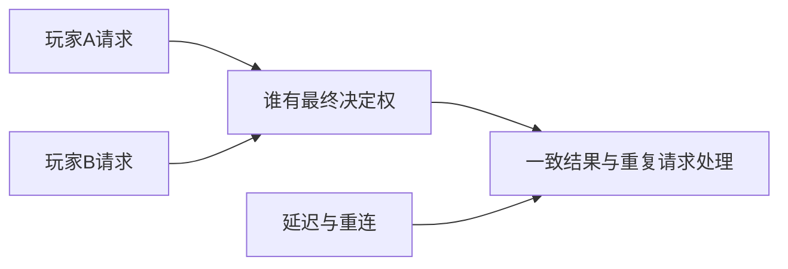

> 新手教学循环：先用一个现象和控件随练，再转0A指定软件样例；根据结果渐撤提示。AI诊断先引用证据并追问，不能直接代做后判掌握。下面的维护规则和提示词不逐字朗读成课。

> 课堂编排补充：不要把全部协作提示词、权限边界和检查清单逐字朗读成幻灯片。先显示本课目标和一个概念对照，安排一次可操作实验，再按学员需要展示可复制对话资源。
> 缺少真实软件/图片时可以做明示的概念模拟；模拟目标通过与真机应用通过分别记录。不得创建无响应的滑杆，不能渲染3D时选能保留同一因果关系的替代，否则标该实验未完成。

> 给OpenMAIC生成器：复制本文件全文作为课程要求即可，不需要再拼接其他规则文件。本文件是教师生成规格，不是直接发给学生的讲义。
> 用中文授课，英文术语附人话；优先操作与因果对照。不要扩展软件百科，不调用仓库工具，不索取密钥。
> 先提出可实现的页面与互动计划，再生成本课；生成后必须实测控件。参考答案只用于教师反馈，不放在题干或初始幻灯片。前端隐藏不是保密措施。

# E06｜多人认识专题：先知道为什么会复杂

版本：统一课号课程版｜2026-09-15
状态：课件正文与互动规格已编写；尚未逐课生成OpenMAIC课堂或试教。

**学习分组：** E组；**本课编号：** E06；**路线：** 选修｜全K，只理解用途。

## 0. 开始前：只准备本课需要的东西

**本次起点：** 两人同时请求一件物品的教学时间线即可；不需要网络项目、服务器或软件操作。
**缺材料时：** 只作一次用途与是否需要的决定即可结束；不增加软件执行或M成绩。
**当前配套：** 见0A的真实文件、首步与覆盖边界；文件存在不表示本课所有M已有完整配套。

**本次结束：** 用一个情境说明用途与当前不做什么；不要求实操、软件截图或M评分。

## 0A. 这课怎样学、怎样查缺口

**学习顺序：** 本课全K：只做用途认识；不要求实操，不考反复记忆或迁移。

**实际配套：** 没有专用软件Lab；先按本课材料分支做认识/模拟，不虚构文件。

**练习首步：** 只解释联网增加了哪类协调问题，以及本项目是否需要。

**配套局限：** 全K，只理解用途，不要求实操或背诵。

**正式项目落点：** 不加入单机生产门槛。实验只为理解；进入相应生产阶段再迁移。

**打开方式与分工：** [现成实验入口](../../LABS-START.md)。Godot打开当前场景按F6；Blender直接打开已有文件，先另存副本。默认先体验，不为上课重新搭建。

**回忆与检查：** [本课记忆规则](../../print/memory-by-lesson.md#e06) · [单元检查](../../assessments/unit-checkpoints.md) · [AI追问与弱项诊断](../../assessments/ai-diagnostic-review.md)。

**记录分开：** 回忆/解释/软件应用/换情境；没有证据写待验证。菜单/API可查；得到根因提示记有提示。

## 1. 本课任务卡

**产出：** 用事件时间线认识权威、延迟和重连；不开展网络实作。
**前置：** D07；**对应概念：** KN31。
**预计课堂：** 5–10分钟的认识讨论，可选。
**M 必须掌握：**
无。本课全为K认识选修，不进入单机毕业细考。
**K 理解即可：**
- 权威决定谁能确认结果。
- 延迟、预测、重连会影响不同客户端看到的状态。
**停止线：** 本课为全K选修，不计入单机毕业条件，不要求服务器和同步代码。

## 1A. 必学内容、实操与题目如何对应

M1/M2只是本课任务卡的两项能力序号，不是新的技术概念。查菜单/API不扣独立判断分。

本课全K。选一道用途情境即可结束；四道认识题是候选，不需要完成网络实现或全部考试。

## 2. 必要讲解：先看现象，再给术语

两个人同时拾取同一件物品时，两个屏幕都显示成功不意味着系统可以发两份奖励。需要明确结果由谁确认。

网络消息有延迟和顺序问题，重连还要恢复一致状态。这与本地一次性事件有关，但不能简单复制本地脚本就保证正确。

## 2A. 场景、概念图与逐步AI对话

**实际位置：** P07决策记录｜要不要把庭院改成多人。

|操作前的问题|本课希望得到的结果|
|---|---|
|以为把单机再加一个玩家就自动成为可靠多人游戏。|知道状态权威、延迟和恢复增加的需求，能决定当前不做多人。|

这是目标对照，不是已完成的游戏截图。概念图为职责/因果示意，不是继承图或完整运行证明。

OpenMAIC不能渲染Mermaid时画等价方框图；无3D或真实连接时仅标课堂模拟，不伪造软件运行。

### 本课人和AI分别负责什么

**我决定：** 只判断本项目是否需要联网，以及多人结果由谁确认；不实施网络。

**AI协助：** 给明确标示的两人请求时间线，等待用途解释，不生成服务器代码。

**结束线：** 说明用途与本项目取舍即可；不运行软件、不做M评分。

### 复制第1框开始；以后每次只发当前一步

**学员用法：** 无需一次读完所有提示。将当前框发给你使用的AI；做完后回“完成＋观察”，结果不符回“不符＋现象”，报错回“报错＋原文”，需要停下回“暂停”。自然语言也可以。不要一口气把六步当成自动执行授权。

### 对话1｜建立本课上下文

```text
请做我这节课的协作教练：E06《多人认识专题：先知道为什么会复杂》。
我们逐步制作同一个「星光小庭院」，当前只解决：以为把单机再加一个玩家就自动成为可靠多人游戏。
目标：知道状态权威、延迟和恢复增加的需求，能决定当前不做多人。
必须掌握：无；本课仅理解用途。理解即可：权威决定谁能确认结果；延迟、预测、重连会影响不同客户端看到的状态
停止线：本课为全K选修，不计入单机毕业条件，不要求服务器和同步代码。
必须保持：课程全K认识；主庭院保持单机，不形成网络实现或操作考试。
本课由我负责：只判断本项目是否需要联网，以及多人结果由谁确认；不实施网络。
可以交给你：给明确标示的两人请求时间线，等待用途解释，不生成服务器代码。
请标明建议/已执行/已验证的区别。练习可提示；验收先等我作判断，已提示根因则如实记有提示。
概念配套：没有专用软件Lab；使用本课明确的材料分支
练习首步：只解释联网增加了哪类协调问题，以及本项目是否需要。
覆盖边界：全K，只理解用途，不要求实操或背诵。
对应生产阶段：不加入单机生产门槛；达到当前阶段才迁移，不把实验完成当成项目通过。
默认先用现成实验体验；下方连接/实现任务属于之后的项目迁移，不作为打开本实验的前置。OpenMAIC已提供同等概念证据时不重复刷题，但真实资源/物理/导出等软件证据不可由模拟代替。
先复用上述现有样本，不重新生成同一个Lab。练习可提示；检查先只读快照，不一边改答案一边评分。
先读取我已提供的进度和材料，只问真正缺失的一项。需要软件操作时核对实际版本、当前截图或场景树、可访问的工具；不要求我发密钥或整个电脑。
本课入场材料：两人同时请求一件物品的教学时间线即可；不需要网络项目、服务器或软件操作。
材料不足的处理：只作一次用途与是否需要的决定即可结束；不增加软件执行或M成绩。
当前目的：全K用途讨论，不开启网络实现。
以下是本课连续推进卡，不是一次性执行授权；收到我的观察后每轮最多推进一个有意义的小步。
用途任务：只讨论两位玩家同时拿一颗星，先让我说谁决定结果；不写联网代码。
结束判断：我能说明权威与延迟为何会影响结果，知道何时查询。
随后：对比重连与重复请求两个用途场景，记录本项目暂不联网。；保持全K，不生成实现。
这些是待执行要求，不是我的已完成进度。不要凭课号推断前置已通过；只复用我已提供的实际材料和证据。
对话1之后我可直接回复完成/不符/报错/暂停，无需重贴整课；你应沿这张推进卡继续，不临时增加系统。
先给一个预测问题并等我回答，再给一个最小步骤。不跳课、不自动做整款游戏。能执行才说已执行，否则给明确操作单或脚本，并标未执行。
后续每轮用四项回应：现在是哪一步；只改什么/怎样恢复；我应观察什么；目前还缺什么证据。没有证据不要替我勾通过。
```

**AI此时应做：** 确认默认体验模式和现成文件；不要先输出脚本或建场景。已经提供过的版本、素材和约束应复用，不重复问。

### 对话2｜先理解一个因果关系

```text
先问我：谁应确认同一物品最终归属？
等我写预测和理由后，再指出一个证据缺口，只给一个提示，不先公布完整答案。用词不专业时先确认意思，再补术语。
```

**转入下一步：** 有自己的预测即可；预测错可以用实验纠正，不要求先背定义。

### 对话3｜K用途选择与结束

```text
只讨论两位玩家同时拿一颗星，先让我说谁决定结果；不写联网代码。
对比重连与重复请求两个用途场景，记录本项目暂不联网。
只核对我的用途解释，缺口用一个追问；不生成实现，不要求操作或长报告。最后给我一份认识记录，写明本项目不因为此课就增加联网。
```

**结束证据：** 我能说明权威与延迟为何会影响结果，知道何时查询。
**本课全K：** 不出现软件执行门槛、六步实操或M成绩。

### 当前风险与长期责任

**本课风险检查：** 检查AI是否承诺低延迟或无冲突而无测试，把K认识课变成部署课程。
这是需要在当前工具版本下核验的风险，不是所有AI必然失败的排行榜，也不预测何时改善。长期保留需求、参考选择、影响范围、结果认可与取舍责任；测量、批量设置和重复验证可以由AI协助。
**不把学习变成额外六次考试：** 六个对话阶段共享本课原有M/K证据；只在薄弱关键能力上追加一处故障或变式。没有实际材料时先做课堂模拟，真机状态单独记录。

## 3. 界面与参数学习深度

以下是软件操作的对应范围；优先使用0A已给出的实验，尚无配套的部分如实标待验证。模拟滑块是教学控件，不代表软件都有同名按钮。会调是指看懂作用、主动选择与恢复；会定位是知道去哪找；按需查不考菜单路径、快捷键和API记忆。
- 无必会实操界面。
- 知道网络调试信息的用途。
- 需要网络项目时再查RPC与网络API。

## 4. 互动实验规格

**初始状态：** 客户端A/B与权威节点三条时间线，两个同时拾取请求；数值仅教学示意。
**可操作项：** 延迟0/100/300毫秒示意、重复请求、断线重连；没有真实网络连接。
**实验步骤：**
1. 观察两人同时请求时可能出现的冲突。
2. 选择谁确认最终结果并说明用途。
3. 回答本项目现在是否需要多人，给出暂缓理由。
**预期反馈：** 只要求用途解释，演示可由老师操控；不考编程和详细故障修复。
**故障或反例：** 反例讨论：每个客户端自行增加奖励会出现什么不一致；不要求排错实操。
**复位：** 清空消息时间线与最终奖励。
**无图/无3D替代：** 用原创简单形状、状态卡或给定时间序列表达同一因果关系；标明“示意”，不得把预设结果说成Godot/Blender实测。不能以假按钮或不响应的截图代替交互。
**完成判据：** 只做用途识别，不强制实操、诊断或迁移。

## 5. 小结与必须牢记

- 多人先问谁确认结果。
- 认识风险不等于现在实现。

## 6. 训练：先作答，再看反馈

题干中的日志、数值与AI建议均为标明的教学情境，除非另附运行证据，不是本项目实测。可以有多个合理假设：先给能区分它们的验证，而不是猜老师心中的唯一原因。

P=预测，D=诊断，T=迁移，K=用途认识。下面是候选训练，不是每个词都做四次作业。课堂先用预测和一个操作，重点未达标再选D或T；延迟复测换对象，不重复抄答案。

### E06-K1
**考察范围：** K｜理解用途即可；不要求实现。一句用途解释即可。

谁应确认同一物品最终归属？

### E06-K2
**考察范围：** K｜理解用途即可；不要求实现。一句用途解释即可。

为什么延迟值得考虑？

### E06-K3
**考察范围：** K｜理解用途即可；不要求实现。一句用途解释即可。

重连为什么不是重新显示画面就够？

### E06-K4
**考察范围：** K｜理解用途即可；不要求实现。一句用途解释即可。

现在做单机收集游戏需要实现这些吗？

## 7. 正式项目迁移（达到相应阶段再做）

没有网络项目和代码任务；全K轻量识别即可。
即使已有参考工程，也要区分课件、运行测试、人工体验、学习掌握四种证据。已有Lab先随课使用；完整生产按任务单推进，未交付的逐课配套不冒充完成。

## 8. 实际应用验收：把结果放回同一个项目

**本课产物：** 知道状态权威、延迟和恢复增加的需求，能决定当前不做多人。
**接入边界：** 课程全K认识；主庭院保持单机，不形成网络实现或操作考试。

以下是要采集的证据，不是宣称已经执行。记录“未尝试 / 有提示完成 / 独立验证 / 隔次仍会”；不把这四种状态与M/K学习要求混淆。

本课全部K：只提交一次用途判断，不要求操作、实现或深度故障排查。
- [ ] 能用一两句话说明权威或延迟解决的问题，并作当前项目是否需要的决定。

**换情境的候选任务：** 只换成两人同时开门的轻量用途题，不升级成故障排查作业。
**判定：** 普通M按原0–2锚点；有针对性根因提示记练习，换变式再验证。K只查用途，不能抵消关键M失败。没有真实操作的M只记待验证，模拟通过不能自动升级为真机通过。未选专题不阻塞主线。

**接入不等于新增系统：** 美术课可交风格卡、参数决定或改造样本；性能课可得出“不优化”。隔离实验只有对当前项目有收益才接入，不强迫庭院变成战斗、开放世界或联网游戏。

## 9. 复现与延迟检查

本课复现：B06。只复习已学的关键M。
下次课抽一个本课关键判断，换对象或数值后先独立解释。查菜单和API不扣独立判断分；被提示根因或目标值后完成，记录有提示，换变式再验。K不反复背定义。

## 10. 依据与观看入口

- [Godot Resources：共享和引用](https://docs.godotengine.org/en/stable/tutorials/scripting/resources.html)

技术来源支持术语和软件边界；具体实验与课程顺序是本项目教学设计，不代表已证明学习效果。艺术家入口用于观看研习，不等于获得图片或素材再分发许可。

## 11. 教师反馈与评分依据（初始课堂不可展示）

沿用全仓库0–2锚点：0=已显示错误；无证据另记待验证；1=提示后完成或理由不清；2=能选择、解释并验证。实现可由AI提供，评价的是学员判断。课堂不强制凑100分；结业仍按M90/K10反馈，K不能补救关键M失败。
两项M都需要有效证据，不能按四道题等权平均掩盖能力缺口。普通M用一次有效操作和解释；关键M增加故障/迁移与延迟复测。E06全K只确认用途，没有M成绩。

**E06-K1 核对要点：** 需要一个明确权威规则，不由相互独立客户端随意各自确认。
**错因提示：** 这是概念认识，不要求架构实现。
**反馈策略：** 先指出证据缺口，给该提示；仍困难再示范。看答案后立即复述不算独立掌握。

**E06-K2 核对要点：** 输入到结果确认有时间差，会影响体验与一致性。
**错因提示：** 看时间线。
**反馈策略：** 先指出证据缺口，给该提示；仍困难再示范。看答案后立即复述不算独立掌握。

**E06-K3 核对要点：** 还需恢复正确状态，避免重复奖励和过期信息。
**错因提示：** 状态从哪里来？
**反馈策略：** 先指出证据缺口，给该提示；仍困难再示范。看答案后立即复述不算独立掌握。

**E06-K4 核对要点：** 不需要；明确后置，不阻塞主线。
**错因提示：** 需求有没有多人？
**反馈策略：** 先指出证据缺口，给该提示；仍困难再示范。看答案后立即复述不算独立掌握。

## 11A. 本课诊断题的具体评分锚点

本课没有D题和M成绩。只核对用途解释；不生成深度排错或工具执行门槛。

## 12. 生成后的验收清单

- [ ] 概念后有局部AI工作、亲调入口与对应证据。
- [ ] 模拟和真实工具执行分开。

- [ ] 先有本课目标和M/K/停止线，未把K扩为深度考试。
- [ ] 参数/条件实际改变画面、状态或时间序列，数值和结果一致。
- [ ] 初始状态、单变量对照、故障和复位均可运行；没有图片时替代方案有标示。
- [ ] 学生作答前不展示教师答案；有针对错因的反馈与新变式。
- [ ] 可用键盘/点击操作，文字可读，可暂停；不强制自动音频或高强度闪烁。
- [ ] 技术实测、审美喜好和学习掌握没有混作同一个通过状态。
- [ ] 外部原图/动作仅在许可允许的情况下展示；未伪造来源和运行记录。

- [ ] 本课M到实操题、P/D/T和项目证据可追溯，K未扩大成实现。
- [ ] AI先等学员判断；提示后的表现没有冒充独立掌握；同一题不反复凑分。
- [ ] 教学情境/模拟日志与真实运行分开，替代方案按证据评分，不按关键词或个人审美。
