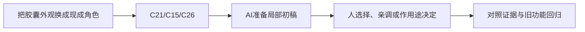

> 给OpenMAIC生成器：复制本文件全文作为课程要求即可，不需要再拼接其他规则文件。本文件是教师生成规格，不是直接发给学生的讲义。
> 用中文授课，英文术语附人话；优先操作与因果对照。不要扩展软件百科，不调用仓库工具，不索取密钥。
> 先提出可实现的页面与互动计划，再生成本课；生成后必须实测控件。参考答案只用于教师反馈，不放在题干或初始幻灯片。前端隐藏不是保密措施。

# E-01｜接入现成角色：会选、会替换、会验收

> 兼容课号：I01。ABCDE是主题入口，不是必须按字母顺序完成；文件链接与题号保留稳定。

版本：Applied Curriculum v5｜2026-09-15
状态：课件正文与互动规格已编写；尚未逐课生成OpenMAIC课堂或试教。

## 1. 本课任务卡

**产出：** 判断两份角色资产哪份更适合当前原型，并制定替换验收单。
**前置：** B16；**对应概念：** C21/C15/C26。
**预计课堂：** 20–30分钟，可在实验前后暂停；不含后续真实软件制作时间。
**M 必须掌握：**
- 核对比例、朝向、骨骼与动作兼容，选择可用资产。
- 替换视觉角色而保持控制与碰撞职责。
**K 理解即可：**
- Armature/Skeleton、Skin/Weights分别是骨架、蒙皮与影响权重。
**停止线：** 不从零绑定和全面刷权重；复杂坏资产允许合理弃用。

## 2. 必要讲解：先看现象，再给术语

角色文件看起来完整，不代表包含可用动画或符合现有骨架。先试一小段待机和行走，再决定是否值得整套导入。

碰撞胶囊、移动根节点与视觉角色分开，可避免为了角色身高误改所有物理参数。角色极端比例可能让自动绑定或重定向不适用。

## 2A. 这次在实际场景里解决什么

**应用位置：** P06｜把胶囊外观换成现成角色；主项目中的功能、视觉或交付决定。

|开始时遇到的问题|本课期望得到的变化|
|---|---|
|角色看起来站好了，但比例、前向或骨架与控制器不匹配。|新角色可用，原碰撞和控制保持；不合适资源有明确淘汰理由。|

**这是目标状态对照，不是已完成截图。** 首次操作应使用匹配当前进度的最小场景；还没有配套时，只能记为课堂模拟，不能直接勾选真机应用通过。

### 概念关系示意


图中箭头表示教学流程，不是引擎节点继承。OpenMAIC不支持Mermaid时改画等价方框图，不能把代码原文冒充运行示意。

### 先让AI帮助理解，再让AI帮助工作

**学习指令：**
```text
现在只检查这道判断：一个漂亮模型没有骨架，是否一定更适合先做走路角色？
先等我给预测和理由，再指出一个证据缺口；一次只给一个线索，不先公布完整答案。
我的用词不专业时，先用人话确认意思，再补对应术语。
```

**工作指令：可复制；先补实际版本与当前材料，不粘贴密钥。**
```text
我正在逐步制作同一个小型单机「星光小庭院」，不是重新生成整款游戏。
我会提供实际软件版本、当前场景/文件和必要截图；先确认你能访问哪些材料和工具。
这次只做：依据我提供的许可信息和角色文件，先检查骨架、朝向、比例及动画片段，再只替换视觉层。试用一段待机，不承诺任意骨架兼容；复杂坏资产先比较更换成本。
必须保持：角色控制根、碰撞形状、相机和原输入保持；不要求手工重绑。
先列出将改的对象、原值和预期结果，提供最小可撤销初稿及检查步骤。
没有真实软件连接时只提供操作单/脚本，不声称已经编辑、运行或看过未提供的截图。
不要自动安装插件、联网下载素材、购买服务或读取无关文件；必要操作另说明并取得授权。
完成后报告实际做了什么、还没验证什么；我负责选择和最终验收。
```

### 哪些地方比继续发指令更适合亲自试

|入口与性质|一次只做的微调/选择|亲眼观察什么|
|---|---|---|
|视觉包装Node3D Transform（内置）|只在独立视觉包装校准位置/朝向与比例|脚是否落地、脸是否朝向运动；不缩放物理根来救外观|
|Godot动画列表/预览（入口）|先只播放一段待机|骨架是否变形、是否异常位移|

**初值与恢复：** 先读取并记录当前值；表里的方向是对照办法，不是通用最佳参数。先在副本上操作，不覆盖基底；返回前用撤销或记录值恢复并重新预览。自定义变量不是软件内置参数。
**选择下一步：** 方向不对，补一张明确参考并圈出要借鉴的部分；结构/因果不对，让AI做局部修复；已接近目标且入口可直接操作，先亲调一项。原因不明先做对照，不靠反复重生成抽卡。

**局部修复指令：**
```text
保留本课「必须保持」的部分。我会给出同条件的当前结果和目标差异。
只围绕「新角色可用，原碰撞和控制保持；不合适资源有明确淘汰理由。」检查一个根因假设；先给最小验证，未经证据不要重写全部内容。
若只是一个可见参数偏差，告诉我该选哪个对象、哪个入口、怎么小幅调和恢复。
```

**本课风险检查：** 检查AI是否缩放整个控制器、修改绑定姿态或把缺失动画误报为兼容。
**时间边界：** 上述是需要在当前模型/工具/软件版本下验证的风险清单，不是所有AI必然失败的结论，也不预测何时会解决。长期保留的是目标、约束、参考选择、结果认可和取舍责任；测量和重复调整可以继续交给AI协助。

## 3. 界面与参数学习深度

以下是后续真机操作的对应范围，不要求本轮打开软件。模拟滑块是教学控件，不代表软件都有同名按钮。会调是指看懂作用、主动选择与恢复；会定位是知道去哪找；按需查不考菜单路径、快捷键和API记忆。
- 常用：角色视觉Transform、动画预览、碰撞可见性。
- 会定位：导入骨架、动画列表和源文件信息。
- 按需查：重定向映射、蒙皮修复；不是必背工具。

## 4. 互动实验规格

**初始状态：** 两份教学资产卡：A比例合适且有骨架/待机，B高细节但无骨架；预览用简化人物，真实资产未附时不冒充导入成功。
**可操作项：** 显示包内容、比例0.8到1.2、前向箭头、待机/行走预览、碰撞可视化。
**实验步骤：**
1. 按用途列选择条件，不先按面数或精细度选。
2. 只替换视觉并核对脚底、胶囊和前向。
3. 播放两段动作，发现问题后选择小修还是换资产。
**预期反馈：** 展示来源、授权状态、骨骼和动作信息；教学卡数据标示意。
**故障或反例：** 故障：为了缩小人物把控制根节点整体缩放，碰撞也变形；恢复职责后只修正确资产层。
**复位：** 恢复胶囊占位人与原控制参数，替换资产保留副本。
**无图/无3D替代：** 用原创简单形状、状态卡或给定时间序列表达同一因果关系；标明“示意”，不得把预设结果说成Godot/Blender实测。不能以假按钮或不响应的截图代替交互。
**完成判据：** 对本课两项M提供操作或判断及解释；一个实验可覆盖多项。只有关键M或发现薄弱处才追加故障/变式，不为每个术语加作业。

## 5. 小结与必须牢记

- 先试最小动作再批量导入。
- 视觉与碰撞职责分开。
- 资产不合适可以换，不必硬修。

## 6. 训练：先作答，再看反馈

P=预测，D=诊断，T=迁移，K=用途认识。下面是候选训练，不是每个词都做四次作业。课堂先用预测和一个操作，重点未达标再选D或T；延迟复测换对象，不重复抄答案。

### I01-P1
一个漂亮模型没有骨架，是否一定更适合先做走路角色？

### I01-D2
换角色后碰撞与脚底不一致，先查什么？

### I01-T3
换成头更大的卡通人物，哪些检查不能省？

### I01-K4
Weights是什么用途？

## 7. 后续真机任务（配套待做，不作为当前课堂依赖）

后续配套阶段选择真实可授权角色；本课不分发第三方角色包。
即使已有参考工程，也要区分课件、运行测试、人工体验、学习掌握四种证据。按用户安排，当前先完成全部课件，之后再统一补素材、Godot/Blender起始与参考工程。

## 8. 实际应用验收：把结果放回同一个项目

**本课产物：** 新角色可用，原碰撞和控制保持；不合适资源有明确淘汰理由。
**接入边界：** 角色控制根、碰撞形状、相机和原输入保持；不要求手工重绑。

以下是要采集的证据，不是宣称已经执行。记录“未尝试 / 有提示完成 / 独立验证 / 隔次仍会”；不把这四种状态与M/K学习要求混淆。

|原有M能力|本次在哪里取证|
|---|---|
|核对比例、朝向、骨骼与动作兼容，选择可用资产。|能选出可用角色并解释淘汰另一个候选的原因。|
|替换视觉角色而保持控制与碰撞职责。|能校准外观且复测原控制、碰撞、相机，保留来源信息。|

**旧功能回归：** 原走跑跳与拾取路径继续通过；材质替换不改变奖励逻辑。
**最小记录：** 一段现场演示，或同条件前后图/日志，加一句“我改了什么、为什么”。截图不足以证明运动/一次性事件时，要演示动作或查看对应状态。记录用过的提示，不要求写长报告。
**关键能力复测：** 本课高频或返工风险较高，已有有效证据可复用；薄弱处增加一个未知故障或隔次变式，不把每个词都变成一套试卷。

**换情境的候选任务：** 第二个风格相似角色重复验收，不能仅因预览漂亮就采用。
**判定：** 普通M按原0–2锚点；有针对性根因提示记练习，换变式再验证。K只查用途，不能抵消关键M失败。没有真实操作的M只记待验证，模拟通过不能自动升级为真机通过。未选专题不阻塞主线。

**接入不等于新增系统：** 美术课可交风格卡、参数决定或改造样本；性能课可得出“不优化”。隔离实验只有对当前项目有收益才接入，不强迫庭院变成战斗、开放世界或联网游戏。

## 9. 复现与延迟检查

本课复现：B07, B09。只复习已学的关键M。
下次课抽一个本课关键判断，换对象或数值后先独立解释。查菜单和API不扣独立判断分；被提示根因或目标值后完成，记录有提示，换变式再验。K不反复背定义。

## 10. 依据与观看入口

- [Godot Retargeting 3D Skeletons](https://docs.godotengine.org/en/stable/tutorials/assets_pipeline/retargeting_3d_skeletons.html)
- [Adobe Mixamo FAQ：角色、动作及使用条件](https://helpx.adobe.com/creative-cloud/faq/mixamo-faq.html)

技术来源支持术语和软件边界；具体实验与课程顺序是本项目教学设计，不代表已证明学习效果。艺术家入口用于观看研习，不等于获得图片或素材再分发许可。

## 11. 教师反馈与评分依据（初始课堂不可展示）

沿用全仓库0–2锚点：0=缺证据或错误；1=提示后完成或理由不清；2=能选择、解释并验证。实现可由AI提供，评价的是学员判断。课堂不强制凑100分；结业仍按M90/K10反馈，K不能补救关键M失败。
两项M都需要有效证据，不能按四道题等权平均掩盖能力缺口。普通M用一次有效操作和解释；关键M增加故障/迁移与延迟复测。A05全K只确认用途，没有M成绩。

**I01-P1 核对要点：** 不一定；实现成本可能高于有兼容骨架的简单角色。
**错因提示：** 优先满足什么用途？
**反馈策略：** 先指出证据缺口，给该提示；仍困难再示范。看答案后立即复述不算独立掌握。

**I01-D2 核对要点：** 视觉原点、比例、位置与控制根的关系，避免直接乱改移动代码。
**错因提示：** 哪个节点被缩放了？
**反馈策略：** 先指出证据缺口，给该提示；仍困难再示范。看答案后立即复述不算独立掌握。

**I01-T3 核对要点：** 动作变形、脚滑、碰撞、前向、镜头可读性以及授权。
**错因提示：** 外形变化会影响哪些表现？
**反馈策略：** 先指出证据缺口，给该提示；仍困难再示范。看答案后立即复述不算独立掌握。

**I01-K4 核对要点：** 决定骨骼对网格的影响程度，出现变形问题时查，不要求此刻手刷。
**错因提示：** 先分清骨架和网格。
**反馈策略：** 先指出证据缺口，给该提示；仍困难再示范。看答案后立即复述不算独立掌握。

## 12. 生成后的验收清单

- [ ] 概念之后立即出现本课真实情境、学习/工作指令和微调入口，不只在结尾贴通用提示。
- [ ] AI模拟执行与真实工具执行明确区分，主项目成果必须另有应用证据。

- [ ] 先有本课目标和M/K/停止线，未把K扩为深度考试。
- [ ] 参数/条件实际改变画面、状态或时间序列，数值和结果一致。
- [ ] 初始状态、单变量对照、故障和复位均可运行；没有图片时替代方案有标示。
- [ ] 学生作答前不展示教师答案；有针对错因的反馈与新变式。
- [ ] 可用键盘/点击操作，文字可读，可暂停；不强制自动音频或高强度闪烁。
- [ ] 技术实测、审美喜好和学习掌握没有混作同一个通过状态。
- [ ] 外部原图/动作仅在许可允许的情况下展示；未伪造来源和运行记录。
