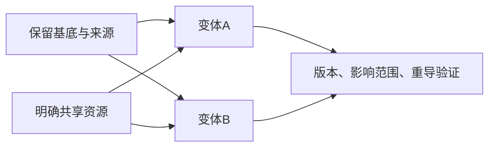

> 给OpenMAIC生成器：复制本文件全文作为课程要求即可，不需要再拼接其他规则文件。本文件是教师生成规格，不是直接发给学生的讲义。
> 用中文授课，英文术语附人话；优先操作与因果对照。不要扩展软件百科，不调用仓库工具，不索取密钥。
> 先提出可实现的页面与互动计划，再生成本课；生成后必须实测控件。参考答案只用于教师反馈，不放在题干或初始幻灯片。前端隐藏不是保密措施。

# D-02｜复用与资源：共享什么、独立什么

> 兼容课号：I03。ABCDE是主题入口，不是必须按字母顺序完成；文件链接与题号保留稳定。

版本：Audited Collaboration v7｜2026-09-15
状态：课件正文与互动规格已编写；尚未逐课生成OpenMAIC课堂或试教。

## 1. 本课任务卡

**产出：** 给三个同类物体制定共享资源和独立状态方案。
**前置：** I02；**对应概念：** C05/C17。
**预计课堂：** 20–30分钟，可在实验前后暂停；不含后续真实软件制作时间。
**M 必须掌握：**
- 区分共享材质/配置与独立的运行状态。
- 限定修改影响范围并验收。
**K 理解即可：**
- 深浅复制、Resource缓存用来解释影响，不背实现。
**停止线：** 不考设计模式名字，不复制所有纹理来保证安全。

## 1A. 必学内容、实操与题目如何对应

M1/M2只是本课任务卡的两项能力序号，不是新的技术概念。查菜单/API不扣独立判断分。

|必须掌握到这里|本课实操题：做什么算有证据|可选配套题|
|---|---|---|
|M1：区分共享材质/配置与独立的运行状态。|对三个实例说明公共材质与个体消费状态的归属。|I03-P1, I03-T3|
|M2：限定修改影响范围并验收。|只改指定材质/状态并实测其余对象，避免复制无关大纹理。|I03-D2, I03-T3|

**最低学习路径：** 一次预测 → 一个能覆盖上述两项M的小实验/项目改动 → 一次结果解释。普通M做到即可；关键薄弱处再选一题诊断或隔次迁移，不把P/D/T全套加到每个术语上。
**理解即可与停止线：** 任务卡中的K只检用途；按需查的界面、API、高级实现不进入本课操作门槛。只有已学且已存在的项目功能需要回归。

## 2. 必要讲解：先看现象，再给术语

三个场景实例可以有独立位置和状态，同时引用同一材质。是否共享由需求决定，不是共享一定好或全部独立更安全。

复用的关键是改通用规则方便，改个别实例不串改。运行时生命、是否拾取等状态不应无意写入全体共享配置。

## 2A. 场景、概念图与逐步AI对话

**实际位置：** P06｜庭院两盏灯：只让其中一盏变化。

|操作前的问题|本课希望得到的结果|
|---|---|
|复制物体后修改一处，另一处意外改变；或为隔离一点参数复制全部资源。|外观需要共享的继续共享，个体状态与目标材质可独立。|

这是目标对照，不是已完成的游戏截图。概念图为职责/因果示意，不是继承图或完整运行证明。

OpenMAIC不能渲染Mermaid时画等价方框图；无3D或真实连接时仅标课堂模拟，不伪造软件运行。

### 本课人和AI分别负责什么

|责任|这课具体做什么|
|---|---|
|我必须作出的判断|指定哪些配置共享、哪些运行状态独立，只复制确有差异的资源。|
|可以交给AI的制作|画实例/资源引用关系，准备单件修改及多件不受影响的对照。|
|我检查AI交付物|看修改对象/前后差异、实际执行记录及未验证项；先核对是否保留本课约束，再决定是否接入。|

**不是手工熟练考试：** 重复劳动与代码可委托；常用可见参数适合亲调时先调一项，无障碍需要可由AI按已选值执行。必须能说明选择、观察和恢复，不要求机械地拖每个滑杆。

**两种模式：** 练习时可问根因、看示范；独立验收时先由我提出选择/假设，AI只协助执行与记录。已透露本题根因或目标值，就记录“有提示”，再换未揭示答案的变式。

### 复制第1框开始；以后每次只发当前一步

**学员用法：** 无需一次读完所有提示。将当前框发给你使用的AI；做完后回“完成＋观察”，结果不符回“不符＋现象”，报错回“报错＋原文”，需要停下回“暂停”。自然语言也可以。不要一口气把六步当成自动执行授权。

### 对话1｜建立本课上下文

```text
请做我这节课的协作教练：D-02（兼容课号I03）《复用与资源：共享什么、独立什么》。
我们逐步制作同一个「星光小庭院」，当前只解决：复制物体后修改一处，另一处意外改变；或为隔离一点参数复制全部资源。
目标：外观需要共享的继续共享，个体状态与目标材质可独立。
必须掌握：区分共享材质/配置与独立的运行状态；限定修改影响范围并验收。理解即可：深浅复制、Resource缓存用来解释影响，不背实现
停止线：不考设计模式名字，不复制所有纹理来保证安全。
必须保持：其他共享资源、纹理文件、游戏计数不变。
本课由我负责：指定哪些配置共享、哪些运行状态独立，只复制确有差异的资源。
可以交给你：画实例/资源引用关系，准备单件修改及多件不受影响的对照。
请标明建议/已执行/已验证的区别。练习可提示；验收先等我作判断，已提示根因则如实记有提示。
先读取我已提供的进度和材料，只问真正缺失的一项。需要软件操作时核对实际版本、当前截图或场景树、可访问的工具；不要求我发密钥或整个电脑。
先给一个预测问题并等我回答，再给一个最小步骤。不跳课、不自动做整款游戏。能执行才说已执行，否则给明确操作单或脚本，并标未执行。
后续每轮用四项回应：现在是哪一步；只改什么/怎样恢复；我应观察什么；目前还缺什么证据。没有证据不要替我勾通过。
```

**AI此时应做：** 确认当前场景与学习范围，不直接输出几十个文件。已经提供过的版本、素材和约束应复用，不重复问。

### 对话2｜先理解一个因果关系

```text
先问我：实例不同，材质就一定不同吗？
等我写预测和理由后，再指出一个证据缺口，只给一个提示，不先公布完整答案。用词不专业时先确认意思，再补术语。
```

**转入下一步：** 有自己的预测即可；预测错可以用实验纠正，不要求先背定义。

### 对话3｜AI只完成第一小步

```text
沿用已确认的版本、材料和修改边界。现在只做：先用两个实例检查共享材质、独立状态各自范围，不讲设计模式百科。
先列影响对象和原值，再提供一个可撤销初稿。没有实际软件连接时给我可执行的局部操作单/脚本，不说已经修改。做完先停下。
```

**预计看到／拿到：** 改一个独立状态不影响另一个，共享材质的影响符合预测。
**不是自动保证：** 这是验收目标，取决于实际模型、工具和输入；结果不同就走下方“不符”分支。

### 对话4｜人观察与亲调，再继续第二小步

```text
这是我刚才的实际结果：我会附一张当前图、短演示或必要日志，并用一句话描述差异。
先检查是否满足：改一个独立状态不影响另一个，共享材质的影响符合预测。
本课可用的微调项：
入口：资源引用与Make Unique等入口（内置）；操作：先确认共享，再对目标资源独立化；观察：一盏改变时另一盏是否仍保持基线
入口：每实例状态/导出配置（自定义）；操作：只切换目标实例的亮灭；观察：材质共享与对象状态是否被混为一谈
若满足，先指导我选择其中一项亲调；我回报观察后才继续：按实际需求只分离必要资源，复查没有复制无关大贴图。
一次只动一项可见参数。方向接近就手调；结构有误才给局部修复，不能不断重生成整个场景。
```

|选中哪里与参数性质|这次亲自试什么|观察与停手依据|
|---|---|---|
|资源引用与Make Unique等入口（内置）|先确认共享，再对目标资源独立化|一盏改变时另一盏是否仍保持基线|
|每实例状态/导出配置（自定义）|只切换目标实例的亮灭|材质共享与对象状态是否被混为一谈|

**保存与恢复：** 先记录原值和实际对象。优先在安全副本试；运行中Remote Inspector的变化不要当成已保存的设计值，确认后将选定值写回本地场景/资源或配置并重新运行。菜单路径随版本核对，自定义变量不冒充内置属性。
**采用哪种沟通：** 大方向偏了，用参考图圈出要借鉴的轮廓/色彩/光感，并指出不要照搬什么；单个视觉值接近了，先拖或输入数值；原因不明，固定条件做一次对照。参考图不是可自动反推所有参数的答案。

### 对话5｜成功验收，或失败时只修一处

**达到目标时发送：**
```text
请只根据我提供的证据检查：
- 对三个实例说明公共材质与个体消费状态的归属。
- 只改指定材质/状态并实测其余对象，避免复制无关大纹理。
旧功能回归：其他灯与主光保持；重载场景后的共享策略一致。
缺少过程证据就标待验证；不得用一张截图证明走跳或一次性事件。不要新增需求或把所有候选题变成作业。
```

**结果不符或报错时发送：**
```text
不符/报错：我会提供触发步骤、预期、实际现象和必要原始日志。
保留：其他共享资源、纹理文件、游戏计数不变。
本课优先风险：检查AI是否把场景实例化当成所有资源自动独立，或用全量复制解决细小差异。
先提出一个可推翻的假设和一个最小验证；不要同时改多个系统。若两次验证仍无进展，回到基线并列出缺失证据，不反复抽卡。不要删除测试、关闭需求或扩大权限来假装修好。
```

**AI评分边界：** 代码和初稿可以由AI提供；判断、亲调与证据解释由学员完成。得到根因提示记为有提示，不因此重复考试所有概念。

### 对话6｜存进度，下一次接着做

```text
请总结本课D-02（I03）的进度卡，不把预测当已完成。
记录：真实软件版本/渲染器；当前场景与变更对象；选定参数和原值；我做的判断；实际证据；通过/待验证；使用过的提示；恢复方法；下一步唯一任务。
只有实际验证才标通过，没有生成或真机执行就明确写模拟/待验证。给我一段可以复制到新AI对话的摘要，不假称你已持久保存。
先核对下一课前置和我的已选路线，未完成就停在当前步骤，不催着扩范围。
```

**学员保存：** 把进度卡存本地或私人笔记；下次粘贴进度卡和下一课第1框。不要公开API Key、账户、本地私密路径或个人录像。

### 当前风险与长期责任

**本课风险检查：** 检查AI是否把场景实例化当成所有资源自动独立，或用全量复制解决细小差异。
这是需要在当前工具版本下核验的风险，不是所有AI必然失败的排行榜，也不预测何时改善。长期保留需求、参考选择、影响范围、结果认可与取舍责任；测量、批量设置和重复验证可以由AI协助。
**不把学习变成额外六次考试：** 六个对话阶段共享本课原有M/K证据；只在薄弱关键能力上追加一处故障或变式。没有实际材料时先做课堂模拟，真机状态单独记录。

## 3. 界面与参数学习深度

以下是后续真机操作的对应范围，不要求本轮打开软件。模拟滑块是教学控件，不代表软件都有同名按钮。会调是指看懂作用、主动选择与恢复；会定位是知道去哪找；按需查不考菜单路径、快捷键和API记忆。
- 常用：Inspector资源引用、Make Unique或等效操作。
- 会定位：资源文件与实例覆盖。
- 按需查：嵌套资源复制规则。

## 4. 互动实验规格

**初始状态：** 三棵树共用材质，三份拾取状态独立；给出资源引用图。
**可操作项：** 改共享颜色、独立颜色、单件消耗、复制配置按钮。
**实验步骤：**
1. 预测一次颜色修改影响几棵树。
2. 只让一棵树变秋色，保持其他共享。
3. 消耗一个对象，检查另外两个状态不变。
**预期反馈：** 引用连线与受影响对象高亮同步；只统计真实状态变化。
**故障或反例：** 故障：consumed放入共享Resource导致全部消失；修改状态归属。
**复位：** 恢复引用与独立状态；不通过整套复制隐藏错误。
**无图/无3D替代：** 用原创简单形状、状态卡或给定时间序列表达同一因果关系；标明“示意”，不得把预设结果说成Godot/Blender实测。不能以假按钮或不响应的截图代替交互。
**完成判据：** 对本课两项M提供操作或判断及解释；一个实验可覆盖多项。只有关键M或发现薄弱处才追加故障/变式，不为每个术语加作业。

## 5. 小结与必须牢记

- 实例独立不代表资源全独立。
- 共享配置不等于共享运行状态。
- 按影响范围决定复制。

## 6. 训练：先作答，再看反馈

题干中的日志、数值与AI建议均为标明的教学情境，除非另附运行证据，不是本项目实测。可以有多个合理假设：先给能区分它们的验证，而不是猜老师心中的唯一原因。

P=预测，D=诊断，T=迁移，K=用途认识。下面是候选训练，不是每个词都做四次作业。课堂先用预测和一个操作，重点未达标再选D或T；延迟复测换对象，不重复抄答案。

### I03-P1
**考察范围：** M1的限定子能力；不是整项真机通过证明。先给判断与理由；要求操作时再提供过程/对照。仅答对文字不自动等于实际应用通过。

实例不同，材质就一定不同吗？

### I03-D2
**考察范围：** M2的限定子能力；不是整项真机通过证明。先给判断与理由；要求操作时再提供过程/对照。仅答对文字不自动等于实际应用通过。

【教学构造情境，不是真实测量或某模型故障统计】三瓶药水引用同一个配置资源；拾取一瓶后三瓶都不可用，但位置各自独立。AI要复制三套全部贴图。怎样查看消费状态归属，既修个体状态又保留公共美术？

### I03-T3
**考察范围：** M1、M2的限定子能力；不是整项真机通过证明。先给判断与理由；要求操作时再提供过程/对照。仅答对文字不自动等于实际应用通过。

一百个同类瓶子只改一个标签，怎么避免重复大纹理？

### I03-K4
**考察范围：** K｜理解用途即可；不要求实现。一句用途解释即可。

深复制为什么值得按需查？

## 7. 后续真机任务（配套待做，不作为当前课堂依赖）

后续在实际资源图上做一处独立化；无需自建组件框架。
即使已有参考工程，也要区分课件、运行测试、人工体验、学习掌握四种证据。按用户安排，当前先完成全部课件，之后再统一补素材、Godot/Blender起始与参考工程。

## 8. 实际应用验收：把结果放回同一个项目

**本课产物：** 外观需要共享的继续共享，个体状态与目标材质可独立。
**接入边界：** 其他共享资源、纹理文件、游戏计数不变。

以下是要采集的证据，不是宣称已经执行。记录“未尝试 / 有提示完成 / 独立验证 / 隔次仍会”；不把这四种状态与M/K学习要求混淆。

|原有M能力|本次在哪里取证|
|---|---|
|区分共享材质/配置与独立的运行状态。|对三个实例说明公共材质与个体消费状态的归属。|
|限定修改影响范围并验收。|只改指定材质/状态并实测其余对象，避免复制无关大纹理。|

**旧功能回归：** 其他灯与主光保持；重载场景后的共享策略一致。
**最小记录：** 一段现场演示，或同条件前后图/日志，加一句“我改了什么、为什么”。截图不足以证明运动/一次性事件时，要演示动作或查看对应状态。记录用过的提示，不要求写长报告。
**关键能力复测：** 本课高频或返工风险较高，已有有效证据可复用；薄弱处增加一个未知故障或隔次变式，不把每个词都变成一套试卷。

**换情境的候选任务：** 从两盏灯迁移到两颗果实，一颗被拾取不能影响另一颗状态。
**判定：** 普通M按原0–2锚点；有针对性根因提示记练习，换变式再验证。K只查用途，不能抵消关键M失败。没有真实操作的M只记待验证，模拟通过不能自动升级为真机通过。未选专题不阻塞主线。

**接入不等于新增系统：** 美术课可交风格卡、参数决定或改造样本；性能课可得出“不优化”。隔离实验只有对当前项目有收益才接入，不强迫庭院变成战斗、开放世界或联网游戏。

## 9. 复现与延迟检查

本课复现：B08, B10。只复习已学的关键M。
下次课抽一个本课关键判断，换对象或数值后先独立解释。查菜单和API不扣独立判断分；被提示根因或目标值后完成，记录有提示，换变式再验。K不反复背定义。

## 10. 依据与观看入口

- [Godot Resources：共享和引用](https://docs.godotengine.org/en/stable/tutorials/scripting/resources.html)
- [Godot运行检查与可见碰撞工具](https://docs.godotengine.org/en/stable/tutorials/scripting/debug/overview_of_debugging_tools.html)
- [Godot Resources：实例与共享引用](https://docs.godotengine.org/en/stable/tutorials/scripting/resources.html)

技术来源支持术语和软件边界；具体实验与课程顺序是本项目教学设计，不代表已证明学习效果。艺术家入口用于观看研习，不等于获得图片或素材再分发许可。

## 11. 教师反馈与评分依据（初始课堂不可展示）

沿用全仓库0–2锚点：0=已显示错误；无证据另记待验证；1=提示后完成或理由不清；2=能选择、解释并验证。实现可由AI提供，评价的是学员判断。课堂不强制凑100分；结业仍按M90/K10反馈，K不能补救关键M失败。
两项M都需要有效证据，不能按四道题等权平均掩盖能力缺口。普通M用一次有效操作和解释；关键M增加故障/迁移与延迟复测。A05全K只确认用途，没有M成绩。

**I03-P1 核对要点：** 不一定，可能共享引用。
**错因提示：** 查看连线。
**反馈策略：** 先指出证据缺口，给该提示；仍困难再示范。看答案后立即复述不算独立掌握。

**I03-D2 核对要点：** 检查consumed等运行状态是否误存共享资源，按对象实例独立维护；材质/纹理仍可共享。先消耗一个再操作其余两件，验证状态与外观分开。
**错因提示：** 导致不可用的是纹理还是运行状态？
**反馈策略：** 先指出证据缺口，给该提示；仍困难再示范。看答案后立即复述不算独立掌握。

**I03-T3 核对要点：** 复用公共资源并局部覆盖需要独立的部分，验证范围与成本。
**错因提示：** 哪些是真正不同的？
**反馈策略：** 先指出证据缺口，给该提示；仍困难再示范。看答案后立即复述不算独立掌握。

**I03-K4 核对要点：** 嵌套资源未必随外层独立；遇到串改时查规则。
**错因提示：** 不是要求背定义。
**反馈策略：** 先指出证据缺口，给该提示；仍困难再示范。看答案后立即复述不算独立掌握。

## 11A. 本课诊断题的具体评分锚点

**I03-D2｜M2的限定子能力；不是整项真机通过证明**
**2：** 定位状态共享并最小分离，三对象正反验证保留公共资源。
**1：** 方向合理但缺区分性验证/结果解释，或得到目标根因提示后才完成；继续一次最小补练。
**0：** 已给出的选择违背题干约束、以无关补偿代替原因检查，且不能用证据解释。尚未提交/无法观察的部分另记“待验证”，不能假定学员不会。
**可接受替代：** 不要求使用参考答案的术语或唯一路径；其他符合条件、可检验且可恢复的方案同样可得分。真实软件表现须另有对应过程证据。
**迁移安排：** D题已讲解时不拿原题重复作独立考试。换本课T题的对象/一个约束，先不给目标参数和根因；实现代码仍可由AI执行已由学员选定的方案。

## 12. 生成后的验收清单

- [ ] 概念之后立即出现本课真实情境、学习/工作指令和微调入口，不只在结尾贴通用提示。
- [ ] AI模拟执行与真实工具执行明确区分，主项目成果必须另有应用证据。

- [ ] 先有本课目标和M/K/停止线，未把K扩为深度考试。
- [ ] 参数/条件实际改变画面、状态或时间序列，数值和结果一致。
- [ ] 初始状态、单变量对照、故障和复位均可运行；没有图片时替代方案有标示。
- [ ] 学生作答前不展示教师答案；有针对错因的反馈与新变式。
- [ ] 可用键盘/点击操作，文字可读，可暂停；不强制自动音频或高强度闪烁。
- [ ] 技术实测、审美喜好和学习掌握没有混作同一个通过状态。
- [ ] 外部原图/动作仅在许可允许的情况下展示；未伪造来源和运行记录。

- [ ] 本课M到实操题、P/D/T和项目证据可追溯，K未扩大成实现。
- [ ] AI先等学员判断；提示后的表现没有冒充独立掌握；同一题不反复凑分。
- [ ] 教学情境/模拟日志与真实运行分开，替代方案按证据评分，不按关键词或个人审美。
