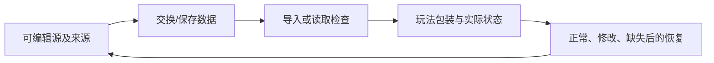

> 课堂编排补充：不要把全部协作提示词、权限边界和检查清单逐字朗读成幻灯片。先显示本课目标和一个概念对照，安排一次可操作实验，再按学员需要展示可复制对话资源。
> 缺少真实软件/图片时可以做明示的概念模拟；模拟目标通过与真机应用通过分别记录。不得创建无响应的滑杆，不能渲染3D时选能保留同一因果关系的替代，否则标该实验未完成。

> 给OpenMAIC生成器：复制本文件全文作为课程要求即可，不需要再拼接其他规则文件。本文件是教师生成规格，不是直接发给学生的讲义。
> 用中文授课，英文术语附人话；优先操作与因果对照。不要扩展软件百科，不调用仓库工具，不索取密钥。
> 先提出可实现的页面与互动计划，再生成本课；生成后必须实测控件。参考答案只用于教师反馈，不放在题干或初始幻灯片。前端隐藏不是保密措施。

# E-04｜模块拼接与简单UV：统一尺度和纹理密度

> 兼容课号：I05。ABCDE是主题入口，不是必须按字母顺序完成；文件链接与题号保留稳定。

版本：Audited Collaboration v7｜2026-09-15
状态：课件正文与互动规格已编写；尚未逐课生成OpenMAIC课堂或试教。

## 0. 开始前：只准备本课需要的东西

**本次起点：** 两三件简单模块、统一尺寸参照及棋盘格诊断材质；不要求人物UV或高分辨率素材包。
**缺材料时：** 先用说明卡判断来源、结构和改造范围。缺可编辑源或适用许可时停止导入/修改，不自动购买、下载或替换成不明资源。
**当前配套：** 本课起始包尚未由这一轮交付；不要把下方目标、代码建议或示意看成已经存在的工程。

**今天的最小任务：** 把三块墙拼齐，并让棋盘格在它们表面大小接近。
**怎样读：** 先看两项M和概念图，再复制对话1。启动框已带首步、继续条件和结束证据；之后用自己的话回复即可，不必把六框逐一重发。
**怎样停：** 完成当前小步可以暂停，记录下次起点；只有本课两项M都有相应证据才标本课应用通过。暂停不是失败，模拟完成不是软件通过。
**先学再验：** 初次允许AI示范一小步，你再换一个值/对象作选择；需要检查独立判断时换未讲过的变式，不要求从零手写代码。

## 1. 本课任务卡

**产出：** 把三块墙拼齐，并让棋盘格在它们表面大小接近。
**前置：** I03, B09；**对应概念：** C14/C22。
**预计课堂：** 20–30分钟，可在实验前后暂停；不含后续真实软件制作时间。
**M 必须掌握：**
- 按统一尺寸和原点对齐模块。
- 用棋盘格识别拉伸与密度问题，修一个简单UV。
**K 理解即可：**
- Texel Density、Trim Sheet、Decal只认识适用问题。
**停止线：** 不展开复杂人物UV，不做完整贴图绘制课程。

## 1A. 必学内容、实操与题目如何对应

M1/M2只是本课任务卡的两项能力序号，不是新的技术概念。查菜单/API不扣独立判断分。

|必须掌握到这里|本课实操题：做什么算有证据|可选配套题|
|---|---|---|
|M1：按统一尺寸和原点对齐模块。|按共同尺寸和连接点拼直段/转角，检查真实接缝。|I05-T3|
|M2：用棋盘格识别拉伸与密度问题，修一个简单UV。|固定几何修一个简单UV比例或密度，比较格子形状和世界尺寸。|I05-P1, I05-D2, I05-T3|

**最低学习路径：** 一次预测 → 一个能覆盖上述两项M的小实验/项目改动 → 一次结果解释。普通M做到即可；关键薄弱处再选一题诊断或隔次迁移，不把P/D/T全套加到每个术语上。
**理解即可与停止线：** 任务卡中的K只检用途；按需查的界面、API、高级实现不进入本课操作门槛。只有已学且已存在的项目功能需要回归。

## 2. 必要讲解：先看现象，再给术语

模块化依赖尺度、原点和连接规则一致。几何拼齐后，纹理仍可能因UV分配不同而大小不一致。

棋盘格用于检查映射：拉长的格子提示拉伸，格子尺寸不同提示密度不一致。升高贴图分辨率不能替代修正映射。

## 2A. 场景、概念图与逐步AI对话

**实际位置：** P06｜让庭院短围廊拼得齐、纹理不拉伸。

|操作前的问题|本课希望得到的结果|
|---|---|
|模块之间有缝，墙面格子大小混乱或被拉长。|两三段模块按统一接口拼接，简单UV问题可定位修复。|

这是目标对照，不是已完成的游戏截图。概念图为职责/因果示意，不是继承图或完整运行证明。

OpenMAIC不能渲染Mermaid时画等价方框图；无3D或真实连接时仅标课堂模拟，不伪造软件运行。

### 本课人和AI分别负责什么

|责任|这课具体做什么|
|---|---|
|我必须作出的判断|先选择拼接尺寸/原点规则，再用格子判断拉伸还是纹理密度问题。|
|可以交给AI的制作|准备三块可编辑墙及棋盘格，指出局部UV入口而非重做整套纹理。|
|我检查AI交付物|看修改对象/前后差异、实际执行记录及未验证项；先核对是否保留本课约束，再决定是否接入。|

**不是手工熟练考试：** 重复劳动与代码可委托；常用可见参数适合亲调时先调一项，无障碍需要可由AI按已选值执行。必须能说明选择、观察和恢复，不要求机械地拖每个滑杆。

**两种模式：** 练习时可问根因、看示范；独立验收时先由我提出选择/假设，AI只协助执行与记录。已透露本题根因或目标值，就记录“有提示”，再换未揭示答案的变式。

### 复制第1框开始；以后每次只发当前一步

**学员用法：** 无需一次读完所有提示。将当前框发给你使用的AI；做完后回“完成＋观察”，结果不符回“不符＋现象”，报错回“报错＋原文”，需要停下回“暂停”。自然语言也可以。不要一口气把六步当成自动执行授权。

### 对话1｜建立本课上下文

```text
请做我这节课的协作教练：E-04（兼容课号I05）《模块拼接与简单UV：统一尺度和纹理密度》。
我们逐步制作同一个「星光小庭院」，当前只解决：模块之间有缝，墙面格子大小混乱或被拉长。
目标：两三段模块按统一接口拼接，简单UV问题可定位修复。
必须掌握：按统一尺寸和原点对齐模块；用棋盘格识别拉伸与密度问题，修一个简单UV。理解即可：Texel Density、Trim Sheet、Decal只认识适用问题
停止线：不展开复杂人物UV，不做完整贴图绘制课程。
必须保持：已有通行宽度与碰撞职责保持；不拿高分辨率贴图掩盖UV错误。
本课由我负责：先选择拼接尺寸/原点规则，再用格子判断拉伸还是纹理密度问题。
可以交给你：准备三块可编辑墙及棋盘格，指出局部UV入口而非重做整套纹理。
请标明建议/已执行/已验证的区别。练习可提示；验收先等我作判断，已提示根因则如实记有提示。
先读取我已提供的进度和材料，只问真正缺失的一项。需要软件操作时核对实际版本、当前截图或场景树、可访问的工具；不要求我发密钥或整个电脑。
本课入场材料：两三件简单模块、统一尺寸参照及棋盘格诊断材质；不要求人物UV或高分辨率素材包。
材料不足的处理：先用说明卡判断来源、结构和改造范围。缺可编辑源或适用许可时停止导入/修改，不自动购买、下载或替换成不明资源。
以下是本课连续推进卡，不是一次性执行授权；收到我的观察后每轮最多推进一个有意义的小步。
首步：先只拼两块同尺寸模块，检查原点和接缝，不先做整条街。
继续条件：边界能对齐，角色实际可通过，没有看不见的缝隙。
随后一步：再用棋盘格检查一处简单UV拉伸，修正而不是盲升贴图分辨率。
结束证据：按共同尺寸和连接点拼直段/转角，检查真实接缝。；固定几何修一个简单UV比例或密度，比较格子形状和世界尺寸。
相关回归：人能通过原路线，镜头不过度被接缝遮挡；重导入仍保留包装。
这些是待执行要求，不是我的已完成进度。不要凭课号推断前置已通过；只复用我已提供的实际材料和证据。
对话1之后我可直接回复完成/不符/报错/暂停，无需重贴整课；你应沿这张推进卡继续，不临时增加系统。
先给一个预测问题并等我回答，再给一个最小步骤。不跳课、不自动做整款游戏。能执行才说已执行，否则给明确操作单或脚本，并标未执行。
后续每轮用四项回应：现在是哪一步；只改什么/怎样恢复；我应观察什么；目前还缺什么证据。没有证据不要替我勾通过。
```

**AI此时应做：** 确认当前场景与学习范围，不直接输出几十个文件。已经提供过的版本、素材和约束应复用，不重复问。

### 对话2｜先理解一个因果关系

```text
先问我：同一张贴图用在三堵墙上，清晰程度一定相同吗？
等我写预测和理由后，再指出一个证据缺口，只给一个提示，不先公布完整答案。用词不专业时先确认意思，再补术语。
```

**转入下一步：** 有自己的预测即可；预测错可以用实验纠正，不要求先背定义。

### 对话3｜AI只完成第一小步

```text
沿用已确认的版本、材料和修改边界。现在只做：先只拼两块同尺寸模块，检查原点和接缝，不先做整条街。
先列影响对象和原值，再提供一个可撤销初稿。没有实际软件连接时给我可执行的局部操作单/脚本，不说已经修改。做完先停下。
```

**预计看到／拿到：** 边界能对齐，角色实际可通过，没有看不见的缝隙。
**不是自动保证：** 这是验收目标，取决于实际模型、工具和输入；结果不同就走下方“不符”分支。

### 对话4｜人观察与亲调，再继续第二小步

```text
这是我刚才的实际结果：我会附一张当前图、短演示或必要日志，并用一句话描述差异。
先检查是否满足：边界能对齐，角色实际可通过，没有看不见的缝隙。
本课可用的微调项：
入口：Transform/吸附步长（内置）；操作：按约定宽度摆模块，先核对接缝；观察：外观和功能空间是否都对齐
入口：Blender UV Editor缩放/位置（内置）；操作：用格子图只调整一块简单面UV；观察：格子是否接近相同尺度，有无拉长
若满足，先指导我选择其中一项亲调；我回报观察后才继续：再用棋盘格检查一处简单UV拉伸，修正而不是盲升贴图分辨率。
一次只动一项可见参数。方向接近就手调；结构有误才给局部修复，不能不断重生成整个场景。
```

|选中哪里与参数性质|这次亲自试什么|观察与停手依据|
|---|---|---|
|Transform/吸附步长（内置）|按约定宽度摆模块，先核对接缝|外观和功能空间是否都对齐|
|Blender UV Editor缩放/位置（内置）|用格子图只调整一块简单面UV|格子是否接近相同尺度，有无拉长|

**保存与恢复：** 先记录原值和实际对象。优先在安全副本试；运行中Remote Inspector的变化不要当成已保存的设计值，确认后将选定值写回本地场景/资源或配置并重新运行。菜单路径随版本核对，自定义变量不冒充内置属性。
**采用哪种沟通：** 大方向偏了，用参考图圈出要借鉴的轮廓/色彩/光感，并指出不要照搬什么；单个视觉值接近了，先拖或输入数值；原因不明，固定条件做一次对照。参考图不是可自动反推所有参数的答案。

### 对话5｜成功验收，或失败时只修一处

**达到目标时发送：**
```text
请只根据我提供的证据检查：
- 按共同尺寸和连接点拼直段/转角，检查真实接缝。
- 固定几何修一个简单UV比例或密度，比较格子形状和世界尺寸。
旧功能回归：人能通过原路线，镜头不过度被接缝遮挡；重导入仍保留包装。
缺少过程证据就标待验证；不得用一张截图证明走跳或一次性事件。不要新增需求或把所有候选题变成作业。
```

**结果不符或报错时发送：**
```text
不符/报错：我会提供触发步骤、预期、实际现象和必要原始日志。
保留：已有通行宽度与碰撞职责保持；不拿高分辨率贴图掩盖UV错误。
本课优先风险：检查AI是否不同模块使用不同单位、随意移动原点或只升纹理分辨率。
先提出一个可推翻的假设和一个最小验证；不要同时改多个系统。若两次验证仍无进展，回到基线并列出缺失证据，不反复抽卡。不要删除测试、关闭需求或扩大权限来假装修好。
```

**AI评分边界：** 代码和初稿可以由AI提供；判断、亲调与证据解释由学员完成。得到根因提示记为有提示，不因此重复考试所有概念。

### 对话6｜存进度，下一次接着做

```text
请总结本课E-04（I05）的进度卡，不把预测当已完成。
记录：真实软件版本/渲染器；当前场景与变更对象；选定参数和原值；我做的判断；实际证据；通过/待验证；使用过的提示；恢复方法；下一步唯一任务。
只有实际验证才标通过，没有生成或真机执行就明确写模拟/待验证。给我一段可以复制到新AI对话的摘要，不假称你已持久保存。
先核对下一课前置和我的已选路线，未完成就停在当前步骤，不催着扩范围。
```

**学员保存：** 把进度卡存本地或私人笔记；下次粘贴进度卡和下一课第1框。不要公开API Key、账户、本地私密路径或个人录像。

### 当前风险与长期责任

**本课风险检查：** 检查AI是否不同模块使用不同单位、随意移动原点或只升纹理分辨率。
这是需要在当前工具版本下核验的风险，不是所有AI必然失败的排行榜，也不预测何时改善。长期保留需求、参考选择、影响范围、结果认可与取舍责任；测量、批量设置和重复验证可以由AI协助。
**不把学习变成额外六次考试：** 六个对话阶段共享本课原有M/K证据；只在薄弱关键能力上追加一处故障或变式。没有实际材料时先做课堂模拟，真机状态单独记录。

## 3. 界面与参数学习深度

以下是后续真机操作的对应范围，不要求本轮打开软件。模拟滑块是教学控件，不代表软件都有同名按钮。会调是指看懂作用、主动选择与恢复；会定位是知道去哪找；按需查不考菜单路径、快捷键和API记忆。
- Blender：UV Editor、缩放简单UV岛、棋盘格预览。
- 会定位：吸附、对象Dimensions、图像贴图。
- 按需查：自动展开、复杂接缝、Trim Sheet流程。

## 4. 互动实验规格

**初始状态：** 三块2米墙，两块UV一致，一块横向拉伸；原点标在底边角。
**可操作项：** 吸附步长0.5/1、模块旋转90度、UV宽度0.5到2、棋盘格/成品切换。
**实验步骤：**
1. 先拼几何，确认无缝隙后再看纹理。
2. 只改变错误墙的UV比例，检查格子接近正方形。
3. 转一块墙构成角落，检查接缝和图案方向。
**预期反馈：** 显示世界尺度和UV比例两个独立信息；网页映射仅示意，真机复核另列。
**故障或反例：** 故障：墙纹理拉伸，AI仅把图片升4K；指出原因未修。
**复位：** 恢复墙位置、UV和检查材质，保留一张对照。
**无图/无3D替代：** 用原创简单形状、状态卡或给定时间序列表达同一因果关系；标明“示意”，不得把预设结果说成Godot/Blender实测。不能以假按钮或不响应的截图代替交互。
**完成判据：** 对本课两项M提供操作或判断及解释；一个实验可覆盖多项。只有关键M或发现薄弱处才追加故障/变式，不为每个术语加作业。

## 5. 小结与必须牢记

- 先拼几何，再看表面。
- 清晰度不只看分辨率。
- 棋盘格是诊断工具。

## 6. 训练：先作答，再看反馈

题干中的日志、数值与AI建议均为标明的教学情境，除非另附运行证据，不是本项目实测。可以有多个合理假设：先给能区分它们的验证，而不是猜老师心中的唯一原因。

P=预测，D=诊断，T=迁移，K=用途认识。下面是候选训练，不是每个词都做四次作业。课堂先用预测和一个操作，重点未达标再选D或T；延迟复测换对象，不重复抄答案。

### I05-P1
**考察范围：** M2的限定子能力；不是整项真机通过证明。先给判断与理由；要求操作时再提供过程/对照。仅答对文字不自动等于实际应用通过。

同一张贴图用在三堵墙上，清晰程度一定相同吗？

### I05-D2
**考察范围：** M2的限定子能力；不是整项真机通过证明。先给判断与理由；要求操作时再提供过程/对照。仅答对文字不自动等于实际应用通过。

【教学构造情境，不是真实测量或某模型故障统计】三堵墙几何尺寸相同，A/B格子正方，C格子横向拉长；同一贴图。AI要把图从1K升4K。你先动图像还是C的UV？如何证明没有通过拉伸墙几何来伪装修好？

### I05-T3
**考察范围：** M1、M2的限定子能力；不是整项真机通过证明。先给判断与理由；要求操作时再提供过程/对照。仅答对文字不自动等于实际应用通过。

做直墙和转角套件应统一什么？

### I05-K4
**考察范围：** K｜理解用途即可；不要求实现。一句用途解释即可。

Trim Sheet适合什么思路？

## 7. 后续真机任务（配套待做，不作为当前课堂依赖）

后续只要求简单墙面UV操练，复杂人物不作门槛。
即使已有参考工程，也要区分课件、运行测试、人工体验、学习掌握四种证据。按用户安排，当前先完成全部课件，之后再统一补素材、Godot/Blender起始与参考工程。

## 8. 实际应用验收：把结果放回同一个项目

**本课产物：** 两三段模块按统一接口拼接，简单UV问题可定位修复。
**接入边界：** 已有通行宽度与碰撞职责保持；不拿高分辨率贴图掩盖UV错误。

以下是要采集的证据，不是宣称已经执行。记录“未尝试 / 有提示完成 / 独立验证 / 隔次仍会”；不把这四种状态与M/K学习要求混淆。

|原有M能力|本次在哪里取证|
|---|---|
|按统一尺寸和原点对齐模块。|按共同尺寸和连接点拼直段/转角，检查真实接缝。|
|用棋盘格识别拉伸与密度问题，修一个简单UV。|固定几何修一个简单UV比例或密度，比较格子形状和世界尺寸。|

**旧功能回归：** 人能通过原路线，镜头不过度被接缝遮挡；重导入仍保留包装。
**最小记录：** 一段现场演示，或同条件前后图/日志，加一句“我改了什么、为什么”。截图不足以证明运动/一次性事件时，要演示动作或查看对应状态。记录用过的提示，不要求写长报告。
**一般能力取证：** 一次有效操作/选择与解释即可；只有证据不足才补练，不强制反复考试。

**换情境的候选任务：** 换成屋顶或地板模块，沿用接口检查但重新判断贴图比例。
**判定：** 普通M按原0–2锚点；有针对性根因提示记练习，换变式再验证。K只查用途，不能抵消关键M失败。没有真实操作的M只记待验证，模拟通过不能自动升级为真机通过。未选专题不阻塞主线。

**接入不等于新增系统：** 美术课可交风格卡、参数决定或改造样本；性能课可得出“不优化”。隔离实验只有对当前项目有收益才接入，不强迫庭院变成战斗、开放世界或联网游戏。

## 9. 复现与延迟检查

本课复现：B09, B07。只复习已学的关键M。
下次课抽一个本课关键判断，换对象或数值后先独立解释。查菜单和API不扣独立判断分；被提示根因或目标值后完成，记录有提示，换变式再验。K不反复背定义。

## 10. 依据与观看入口

- [Blender glTF 2.0管线参考（4.0文档，具体新版选项另查）](https://docs.blender.org/manual/en/4.0/addons/import_export/scene_gltf2.html)
- [Blender官方手册：按实际版本查询工具](https://docs.blender.org/manual/en/latest/)
- [Godot运行检查与可见碰撞工具](https://docs.godotengine.org/en/stable/tutorials/scripting/debug/overview_of_debugging_tools.html)

技术来源支持术语和软件边界；具体实验与课程顺序是本项目教学设计，不代表已证明学习效果。艺术家入口用于观看研习，不等于获得图片或素材再分发许可。

## 11. 教师反馈与评分依据（初始课堂不可展示）

沿用全仓库0–2锚点：0=已显示错误；无证据另记待验证；1=提示后完成或理由不清；2=能选择、解释并验证。实现可由AI提供，评价的是学员判断。课堂不强制凑100分；结业仍按M90/K10反馈，K不能补救关键M失败。
两项M都需要有效证据，不能按四道题等权平均掩盖能力缺口。普通M用一次有效操作和解释；关键M增加故障/迁移与延迟复测。A05全K只确认用途，没有M成绩。

**I05-P1 核对要点：** 不一定，UV分配与世界尺寸都会影响。
**错因提示：** 比较格子大小。
**反馈策略：** 先指出证据缺口，给该提示；仍困难再示范。看答案后立即复述不算独立掌握。

**I05-D2 核对要点：** 先核对并修C的UV映射，升分辨率不改拉伸比例。保留墙尺寸、接缝、相机和A/B基线，比较C格子变正且密度合理。
**错因提示：** 图像更多像素会改变它映射到墙的比例吗？
**反馈策略：** 先指出证据缺口，给该提示；仍困难再示范。看答案后立即复述不算独立掌握。

**I05-T3 核对要点：** 尺寸、连接点、原点、纹理密度与材质风格。
**错因提示：** 从拼接到表面都检查。
**反馈策略：** 先指出证据缺口，给该提示；仍困难再示范。看答案后立即复述不算独立掌握。

**I05-K4 核对要点：** 多个模块共享一组条带纹理以复用细节；有需求再学。
**错因提示：** 不是本课强制制作。
**反馈策略：** 先指出证据缺口，给该提示；仍困难再示范。看答案后立即复述不算独立掌握。

## 11A. 本课诊断题的具体评分锚点

**I05-D2｜M2的限定子能力；不是整项真机通过证明**
**2：** 修映射并保持几何，格子形状与密度两项对照。
**1：** 方向合理但缺区分性验证/结果解释，或得到目标根因提示后才完成；继续一次最小补练。
**0：** 已给出的选择违背题干约束、以无关补偿代替原因检查，且不能用证据解释。尚未提交/无法观察的部分另记“待验证”，不能假定学员不会。
**可接受替代：** 不要求使用参考答案的术语或唯一路径；其他符合条件、可检验且可恢复的方案同样可得分。真实软件表现须另有对应过程证据。
**迁移安排：** D题已讲解时不拿原题重复作独立考试。换本课T题的对象/一个约束，先不给目标参数和根因；实现代码仍可由AI执行已由学员选定的方案。

## 12. 生成后的验收清单

- [ ] 概念之后立即出现本课真实情境、学习/工作指令和微调入口，不只在结尾贴通用提示。
- [ ] AI模拟执行与真实工具执行明确区分，主项目成果必须另有应用证据。

- [ ] 先有本课目标和M/K/停止线，未把K扩为深度考试。
- [ ] 参数/条件实际改变画面、状态或时间序列，数值和结果一致。
- [ ] 初始状态、单变量对照、故障和复位均可运行；没有图片时替代方案有标示。
- [ ] 学生作答前不展示教师答案；有针对错因的反馈与新变式。
- [ ] 可用键盘/点击操作，文字可读，可暂停；不强制自动音频或高强度闪烁。
- [ ] 技术实测、审美喜好和学习掌握没有混作同一个通过状态。
- [ ] 外部原图/动作仅在许可允许的情况下展示；未伪造来源和运行记录。

- [ ] 本课M到实操题、P/D/T和项目证据可追溯，K未扩大成实现。
- [ ] AI先等学员判断；提示后的表现没有冒充独立掌握；同一题不反复凑分。
- [ ] 教学情境/模拟日志与真实运行分开，替代方案按证据评分，不按关键词或个人审美。
