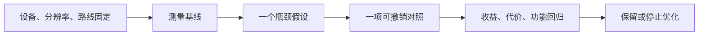

> 给OpenMAIC生成器：复制本文件全文作为课程要求即可，不需要再拼接其他规则文件。本文件是教师生成规格，不是直接发给学生的讲义。
> 用中文授课，英文术语附人话；优先操作与因果对照。不要扩展软件百科，不调用仓库工具，不索取密钥。
> 先提出可实现的页面与互动计划，再生成本课；生成后必须实测控件。参考答案只用于教师反馈，不放在题干或初始幻灯片。前端隐藏不是保密措施。

# E-06｜优化入口：知道什么时候该停

> 兼容课号：I07。ABCDE是主题入口，不是必须按字母顺序完成；文件链接与题号保留稳定。

版本：Guided Demo v6｜2026-09-15
状态：课件正文与互动规格已编写；尚未逐课生成OpenMAIC课堂或试教。

## 1. 本课任务卡

**产出：** 从一个症状提出可检验的瓶颈假设，避免无差别优化。
**前置：** I06；**对应概念：** C19/C29/C30。
**预计课堂：** 20–30分钟，可在实验前后暂停；不含后续真实软件制作时间。
**M 必须掌握：**
- 区分测量条件、症状、假设和结论。
- 在满足目标时停止不必要的优化。
**K 理解即可：**
- MultiMesh/LOD/剔除/资源驻留用来选择下一份文档。
**停止线：** 中级不实现完整大世界流送；高级专项按需再做。

## 2. 必要讲解：先看现象，再给术语

慢可能来自脚本、物理、绘制、加载或资源驻留。只知道面多不够，要用对应开关和记录缩小问题。

一个优化可能减少绘制次数却增加其他约束；成功要看目标帧时间与可读性，不只看一个指标下降。

## 2A. 场景、概念图与逐步AI对话

**实际位置：** P06｜继续优化还是已经够用。

|操作前的问题|本课希望得到的结果|
|---|---|
|因为术语听起来高级就加入批量渲染或剔除，复杂度增加却没有证据。|对一个瓶颈假设有数据支持，达到目标后可以停止。|

这是目标对照，不是已完成的游戏截图。概念图为职责/因果示意，不是继承图或完整运行证明。

OpenMAIC不能渲染Mermaid时画等价方框图；无3D或真实连接时仅标课堂模拟，不伪造软件运行。

### 复制第1框开始；以后每次只发当前一步

**学员用法：** 无需一次读完所有提示。将当前框发给你使用的AI；做完后回“完成＋观察”，结果不符回“不符＋现象”，报错回“报错＋原文”，需要停下回“暂停”。自然语言也可以。不要一口气把六步当成自动执行授权。

### 对话1｜建立本课上下文

```text
请做我这节课的协作教练：E-06（兼容课号I07）《优化入口：知道什么时候该停》。
我们逐步制作同一个「星光小庭院」，当前只解决：因为术语听起来高级就加入批量渲染或剔除，复杂度增加却没有证据。
目标：对一个瓶颈假设有数据支持，达到目标后可以停止。
必须掌握：区分测量条件、症状、假设和结论。；在满足目标时停止不必要的优化。。理解即可：MultiMesh/LOD/剔除/资源驻留用来选择下一份文档。
停止线：中级不实现完整大世界流送；高级专项按需再做。
必须保持：同设备、版本、分辨率和玩法验收条件保持。
先读取我已提供的进度和材料，只问真正缺失的一项。需要软件操作时核对实际版本、当前截图或场景树、可访问的工具；不要求我发密钥或整个电脑。
先给一个预测问题并等我回答，再给一个最小步骤。不跳课、不自动做整款游戏。能执行才说已执行，否则给明确操作单或脚本，并标未执行。
后续每轮用四项回应：现在是哪一步；只改什么/怎样恢复；我应观察什么；目前还缺什么证据。没有证据不要替我勾通过。
```

**AI此时应做：** 确认当前场景与学习范围，不直接输出几十个文件。已经提供过的版本、素材和约束应复用，不重复问。

### 对话2｜先理解一个因果关系

```text
先问我：三角形少就一定快吗？
等我写预测和理由后，再指出一个证据缺口，只给一个提示，不先公布完整答案。用词不专业时先确认意思，再补术语。
```

**转入下一步：** 有自己的预测即可；预测错可以用实验纠正，不要求先背定义。

### 对话3｜AI只完成第一小步

```text
沿用已确认的版本、材料和修改边界。现在只做：先根据已有数据提出一个瓶颈假设；若无证据就标待测，不执行大重构。
先列影响对象和原值，再提供一个可撤销初稿。没有实际软件连接时给我可执行的局部操作单/脚本，不说已经修改。做完先停下。
```

**预计看到／拿到：** 假设有一项能支持或推翻它的测量。
**不是自动保证：** 这是验收目标，取决于实际模型、工具和输入；结果不同就走下方“不符”分支。

### 对话4｜人观察与亲调，再继续第二小步

```text
这是我刚才的实际结果：我会附一张当前图、短演示或必要日志，并用一句话描述差异。
先检查是否满足：假设有一项能支持或推翻它的测量。
若满足，指导我先亲调下面表格的一项；我回报观察后才继续：只采用一种最小改动，再比较功能、画面和慢帧，收益不够就停止。
一次只动一项可见参数。方向接近就手调；结构有误才给局部修复，不能不断重生成整个场景。
```

|选中哪里与参数性质|这次亲自试什么|观察与停手依据|
|---|---|---|
|Profiler与监视器（入口）|看指定慢帧区间并重复采样|问题是否稳定，是否可能来自其他系统|
|一个被怀疑的装饰组开关（实验自定义）|只切换目标组，不同时调多个质量选项|变化是否支持假设，以及失去什么画面内容|

**保存与恢复：** 先记录原值和实际对象。优先在安全副本试；运行中Remote Inspector的变化不要当成已保存的设计值，确认后将选定值写回本地场景/资源或配置并重新运行。菜单路径随版本核对，自定义变量不冒充内置属性。
**采用哪种沟通：** 大方向偏了，用参考图圈出要借鉴的轮廓/色彩/光感，并指出不要照搬什么；单个视觉值接近了，先拖或输入数值；原因不明，固定条件做一次对照。参考图不是可自动反推所有参数的答案。

### 对话5｜成功验收，或失败时只修一处

**达到目标时发送：**
```text
请只根据我提供的证据检查：
- 能提出与实际现象相关的瓶颈假设和验证方法。
- 能根据对照决定继续、撤销或停止，并保留功能/视觉证据。
旧功能回归：没有优化掉交互对象或碰撞；同路线玩法和可读性保持。
缺少过程证据就标待验证；不得用一张截图证明走跳或一次性事件。不要新增需求或把所有候选题变成作业。
```

**结果不符或报错时发送：**
```text
不符/报错：我会提供触发步骤、预期、实际现象和必要原始日志。
保留：同设备、版本、分辨率和玩法验收条件保持。
本课优先风险：检查AI是否把平均FPS提升当成卡顿已消除，或给未测优化收益百分比。
先提出一个可推翻的假设和一个最小验证；不要同时改多个系统。若两次验证仍无进展，回到基线并列出缺失证据，不反复抽卡。不要删除测试、关闭需求或扩大权限来假装修好。
```

**AI评分边界：** 代码和初稿可以由AI提供；判断、亲调与证据解释由学员完成。得到根因提示记为有提示，不因此重复考试所有概念。

### 对话6｜存进度，下一次接着做

```text
请总结本课E-06（I07）的进度卡，不把预测当已完成。
记录：真实软件版本/渲染器；当前场景与变更对象；选定参数和原值；我做的判断；实际证据；通过/待验证；使用过的提示；恢复方法；下一步唯一任务。
只有实际验证才标通过，没有生成或真机执行就明确写模拟/待验证。给我一段可以复制到新AI对话的摘要，不假称你已持久保存。
先核对下一课前置和我的已选路线，未完成就停在当前步骤，不催着扩范围。
```

**学员保存：** 把进度卡存本地或私人笔记；下次粘贴进度卡和下一课第1框。不要公开API Key、账户、本地私密路径或个人录像。

### 当前风险与长期责任

**本课风险检查：** 检查AI是否把平均FPS提升当成卡顿已消除，或给未测优化收益百分比。
这是需要在当前工具版本下核验的风险，不是所有AI必然失败的排行榜，也不预测何时改善。长期保留需求、参考选择、影响范围、结果认可与取舍责任；测量、批量设置和重复验证可以由AI协助。
**不把学习变成额外六次考试：** 六个对话阶段共享本课原有M/K证据；只在薄弱关键能力上追加一处故障或变式。没有实际材料时先做课堂模拟，真机状态单独记录。

## 3. 界面与参数学习深度

以下是后续真机操作的对应范围，不要求本轮打开软件。模拟滑块是教学控件，不代表软件都有同名按钮。会调是指看懂作用、主动选择与恢复；会定位是知道去哪找；按需查不考菜单路径、快捷键和API记忆。
- 常用：Profiler/Monitors、效果或对象组开关。
- 会定位：CPU/GPU相关记录与加载日志。
- 按需查：MultiMesh、LOD、剔除和异步加载API。

## 4. 互动实验规格

**初始状态：** 三组明确标示合成的案例：大量对象、首次加载尖峰、透明叠加；每组含帧时间和行为标签。
**可操作项：** 隐藏一组对象、预热与首次运行比较、固定相机路径、A/B记录。
**实验步骤：**
1. 先指出数据能支持什么，不能支持什么。
2. 挑一个最小改变验证原因，避免同时改资源和画质。
3. 目标达标后写停止理由或下一实验。
**预期反馈：** 不展示虚构硬件测试；所有成本样本标示意。
**故障或反例：** 故障：只因Draw Call高就改成全场一个批量对象，却不再有效剔除；讨论测量而不是口号。
**复位：** 恢复原样本与条件。
**无图/无3D替代：** 用原创简单形状、状态卡或给定时间序列表达同一因果关系；标明“示意”，不得把预设结果说成Godot/Blender实测。不能以假按钮或不响应的截图代替交互。
**完成判据：** 对本课两项M提供操作或判断及解释；一个实验可覆盖多项。只有关键M或发现薄弱处才追加故障/变式，不为每个术语加作业。

## 5. 小结与必须牢记

- 先找症状再选工具。
- 优化要看副作用。
- 达标可以停止。

## 6. 训练：先作答，再看反馈

P=预测，D=诊断，T=迁移，K=用途认识。下面是候选训练，不是每个词都做四次作业。课堂先用预测和一个操作，重点未达标再选D或T；延迟复测换对象，不重复抄答案。

### I07-P1
三角形少就一定快吗？

### I07-D2
优化后指标下降但体验更卡，怎么验收？

### I07-T3
只有第一次进入场景卡，先做什么对照？

### I07-K4
MultiMesh适合什么方向？

## 7. 后续真机任务（配套待做，不作为当前课堂依赖）

后续真实数据替换教学案例；不强制GPU抓帧。
即使已有参考工程，也要区分课件、运行测试、人工体验、学习掌握四种证据。按用户安排，当前先完成全部课件，之后再统一补素材、Godot/Blender起始与参考工程。

## 8. 实际应用验收：把结果放回同一个项目

**本课产物：** 对一个瓶颈假设有数据支持，达到目标后可以停止。
**接入边界：** 同设备、版本、分辨率和玩法验收条件保持。

以下是要采集的证据，不是宣称已经执行。记录“未尝试 / 有提示完成 / 独立验证 / 隔次仍会”；不把这四种状态与M/K学习要求混淆。

|原有M能力|本次在哪里取证|
|---|---|
|区分测量条件、症状、假设和结论。|能提出与实际现象相关的瓶颈假设和验证方法。|
|在满足目标时停止不必要的优化。|能根据对照决定继续、撤销或停止，并保留功能/视觉证据。|

**旧功能回归：** 没有优化掉交互对象或碰撞；同路线玩法和可读性保持。
**最小记录：** 一段现场演示，或同条件前后图/日志，加一句“我改了什么、为什么”。截图不足以证明运动/一次性事件时，要演示动作或查看对应状态。记录用过的提示，不要求写长报告。
**一般能力取证：** 一次有效操作/选择与解释即可；只有证据不足才补练，不强制反复考试。

**换情境的候选任务：** 目标设备变弱时重新设约束，不能直接照搬上次达标结论。
**判定：** 普通M按原0–2锚点；有针对性根因提示记练习，换变式再验证。K只查用途，不能抵消关键M失败。没有真实操作的M只记待验证，模拟通过不能自动升级为真机通过。未选专题不阻塞主线。

**接入不等于新增系统：** 美术课可交风格卡、参数决定或改造样本；性能课可得出“不优化”。隔离实验只有对当前项目有收益才接入，不强迫庭院变成战斗、开放世界或联网游戏。

## 9. 复现与延迟检查

本课复现：B14。只复习已学的关键M。
下次课抽一个本课关键判断，换对象或数值后先独立解释。查菜单和API不扣独立判断分；被提示根因或目标值后完成，记录有提示，换变式再验。K不反复背定义。

## 10. 依据与观看入口

- [Godot General optimization：测量与取舍](https://docs.godotengine.org/en/stable/tutorials/performance/general_optimization.html)
- [Godot运行检查与可见碰撞工具](https://docs.godotengine.org/en/stable/tutorials/scripting/debug/overview_of_debugging_tools.html)

技术来源支持术语和软件边界；具体实验与课程顺序是本项目教学设计，不代表已证明学习效果。艺术家入口用于观看研习，不等于获得图片或素材再分发许可。

## 11. 教师反馈与评分依据（初始课堂不可展示）

沿用全仓库0–2锚点：0=缺证据或错误；1=提示后完成或理由不清；2=能选择、解释并验证。实现可由AI提供，评价的是学员判断。课堂不强制凑100分；结业仍按M90/K10反馈，K不能补救关键M失败。
两项M都需要有效证据，不能按四道题等权平均掩盖能力缺口。普通M用一次有效操作和解释；关键M增加故障/迁移与延迟复测。A05全K只确认用途，没有M成绩。

**I07-P1 核对要点：** 不一定，还有提交、像素、脚本、加载等成本。
**错因提示：** 数据还缺什么？
**反馈策略：** 先指出证据缺口，给该提示；仍困难再示范。看答案后立即复述不算独立掌握。

**I07-D2 核对要点：** 回看真实目标和帧时间分布，检验副作用并回退。
**错因提示：** 你优化的是指标还是体验？
**反馈策略：** 先指出证据缺口，给该提示；仍困难再示范。看答案后立即复述不算独立掌握。

**I07-T3 核对要点：** 区分首次加载与预热运行，记录加载/编译相关证据再下结论。
**错因提示：** 稳定运行是否也卡？
**反馈策略：** 先指出证据缺口，给该提示；仍困难再示范。看答案后立即复述不算独立掌握。

**I07-K4 核对要点：** 大量相似实例的批量绘制；剔除范围和独立行为限制要查。
**错因提示：** 不是默认全场打包。
**反馈策略：** 先指出证据缺口，给该提示；仍困难再示范。看答案后立即复述不算独立掌握。

## 12. 生成后的验收清单

- [ ] 概念之后立即出现本课真实情境、学习/工作指令和微调入口，不只在结尾贴通用提示。
- [ ] AI模拟执行与真实工具执行明确区分，主项目成果必须另有应用证据。

- [ ] 先有本课目标和M/K/停止线，未把K扩为深度考试。
- [ ] 参数/条件实际改变画面、状态或时间序列，数值和结果一致。
- [ ] 初始状态、单变量对照、故障和复位均可运行；没有图片时替代方案有标示。
- [ ] 学生作答前不展示教师答案；有针对错因的反馈与新变式。
- [ ] 可用键盘/点击操作，文字可读，可暂停；不强制自动音频或高强度闪烁。
- [ ] 技术实测、审美喜好和学习掌握没有混作同一个通过状态。
- [ ] 外部原图/动作仅在许可允许的情况下展示；未伪造来源和运行记录。
