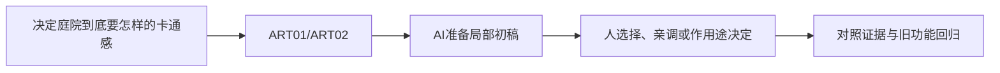

> 给OpenMAIC生成器：复制本文件全文作为课程要求即可，不需要再拼接其他规则文件。本文件是教师生成规格，不是直接发给学生的讲义。
> 用中文授课，英文术语附人话；优先操作与因果对照。不要扩展软件百科，不调用仓库工具，不索取密钥。
> 先提出可实现的页面与互动计划，再生成本课；生成后必须实测控件。参考答案只用于教师反馈，不放在题干或初始幻灯片。前端隐藏不是保密措施。

# A-01｜美术对话：把唯美、卡通说具体

> 兼容课号：R01。ABCDE是主题入口，不是必须按字母顺序完成；文件链接与题号保留稳定。

版本：Applied Curriculum v5｜2026-09-15
状态：课件正文与互动规格已编写；尚未逐课生成OpenMAIC课堂或试教。

## 1. 本课任务卡

**产出：** 写一张能指导AI和素材选择的五维风格卡。
**前置：** 无；**对应概念：** ART01/ART02。
**预计课堂：** 20–30分钟，可在实验前后暂停；不含后续真实软件制作时间。
**M 必须掌握：**
- 用轮廓、比例、色彩、光照、表面五类词描述偏好。
- 给出保留项、排除项和一个可检查的视觉目标。
**K 理解即可：**
- Stylized、Painterly、Toon/Cel、Diorama是检索方向，不是互斥标准。
**停止线：** 不要求素描基础、艺术史和完整建模；不把艺术家名字当唯一提示词。

## 2. 必要讲解：先看现象，再给术语

唯美是感受，不是一个可直接复现的参数。可细化为圆润大形、略夸张比例、受控色盘、柔和暖光、少量手绘质感；同时说清不要写实毛孔、不要油亮塑料、不要拥挤小细节。

本课程把童趣绘本、柔软玩具、漫画明暗、低多边形微缩景作为比较方向，不声称它们是标准分类或所有孩子都喜欢。你提到的卡梅拉先保留为童趣绘本参考词，具体作品对应仍应由实际样图确认。

## 2A. 这次在实际场景里解决什么

**应用位置：** P00｜决定庭院到底要怎样的卡通感；主项目中的功能、视觉或交付决定。

|开始时遇到的问题|本课期望得到的变化|
|---|---|
|只说唯美、可爱，AI给出彼此不搭配的方案。|一张能指导同一庭院制作的一页风格卡，而不是一串艺术家名字。|

**这是目标状态对照，不是已完成截图。** 首次操作应使用匹配当前进度的最小场景；还没有配套时，只能记为课堂模拟，不能直接勾选真机应用通过。

### 概念关系示意


图中箭头表示教学流程，不是引擎节点继承。OpenMAIC不支持Mermaid时改画等价方框图，不能把代码原文冒充运行示意。

### 先让AI帮助理解，再让AI帮助工作

**学习指令：**
```text
现在只检查这道判断：把所有材质变鲜艳就一定是卡通吗？
先等我给预测和理由，再指出一个证据缺口；一次只给一个线索，不先公布完整答案。
我的用词不专业时，先用人话确认意思，再补对应术语。
```

**工作指令：可复制；先补实际版本与当前材料，不粘贴密钥。**
```text
我正在逐步制作同一个小型单机「星光小庭院」，不是重新生成整款游戏。
我会提供实际软件版本、当前场景/文件和必要截图；先确认你能访问哪些材料和工具。
这次只做：根据我提供的参考图，分别描述可观察的形状、比例、主色、明暗和表面细节。给两个范围很小的候选方向，并列出各自不采用的特征。没有图就明确仅据描述，不虚构作者或作品。
必须保持：小型单机收集玩法、主要游戏观察距离和温暖卡通方向保持；不增加世界观。
先列出将改的对象、原值和预期结果，提供最小可撤销初稿及检查步骤。
没有真实软件连接时只提供操作单/脚本，不声称已经编辑、运行或看过未提供的截图。
不要自动安装插件、联网下载素材、购买服务或读取无关文件；必要操作另说明并取得授权。
完成后报告实际做了什么、还没验证什么；我负责选择和最终验收。
```

### 哪些地方比继续发指令更适合亲自试

|入口与性质|一次只做的微调/选择|亲眼观察什么|
|---|---|---|
|参考板/风格卡（设计内容）|选一个圆润程度与一个比例原则|能否用它区分两种候选，而不只说更好看|
|色板和缩略预览（设计工具入口）|减少互相竞争的高对比颜色|星星与背景是否有清楚主次|

**初值与恢复：** 先读取并记录当前值；表里的方向是对照办法，不是通用最佳参数。先在副本上操作，不覆盖基底；返回前用撤销或记录值恢复并重新预览。自定义变量不是软件内置参数。
**选择下一步：** 方向不对，补一张明确参考并圈出要借鉴的部分；结构/因果不对，让AI做局部修复；已接近目标且入口可直接操作，先亲调一项。原因不明先做对照，不靠反复重生成抽卡。

**局部修复指令：**
```text
保留本课「必须保持」的部分。我会给出同条件的当前结果和目标差异。
只围绕「一张能指导同一庭院制作的一页风格卡，而不是一串艺术家名字。」检查一个根因假设；先给最小验证，未经证据不要重写全部内容。
若只是一个可见参数偏差，告诉我该选哪个对象、哪个入口、怎么小幅调和恢复。
```

**本课风险检查：** 检查AI是否臆测图像内容、复制独特角色，或把个人偏好说成所有孩子都喜欢。
**时间边界：** 上述是需要在当前模型/工具/软件版本下验证的风险清单，不是所有AI必然失败的结论，也不预测何时会解决。长期保留的是目标、约束、参考选择、结果认可和取舍责任；测量和重复调整可以继续交给AI协助。

## 3. 界面与参数学习深度

以下是后续真机操作的对应范围，不要求本轮打开软件。模拟滑块是教学控件，不代表软件都有同名按钮。会调是指看懂作用、主动选择与恢复；会定位是知道去哪找；按需查不考菜单路径、快捷键和API记忆。
- 无必会软件操作；先会观察和写风格卡。
- 会定位：参考板、对照图片、缩略图。
- 按需查：风格词英文拼写和软件实现方法。

## 4. 互动实验规格

**初始状态：** 同一小屋的四张原创或有展示许可的风格卡；统一机位和物体摆放，只改表达方式。没有图片时用带明确示意标签的形状与色块，不伪称大师原作。
**可操作项：** 风格卡切换；轮廓圆/直、比例常规/夸张、色彩低/高饱和、明暗柔和/分块、细节少/多标签选择。
**实验步骤：**
1. 先选最喜欢和最不喜欢的一张，每张给一个可见原因，不只说好看。
2. 把喜欢的一张拆成五维风格卡；再选一张反例写不要什么。
3. 把小屋换成路牌，用同一张卡说明哪些规则仍保持。
**预期反馈：** 显示选择对应的可观察描述，不根据偏好打审美分。风格卡只约束目标，不自动保证生成质量。
**故障或反例：** 反例：提示词只有大师名+高质量+卡通，生成风格漂移；补可观察特征与排除项。
**复位：** 清空标签选择但保留喜欢/不喜欢的理由；便于第二次比较。
**无图/无3D替代：** 用原创简单形状、状态卡或给定时间序列表达同一因果关系；标明“示意”，不得把预设结果说成Godot/Blender实测。不能以假按钮或不响应的截图代替交互。
**完成判据：** 对本课两项M提供操作或判断及解释；一个实验可覆盖多项。只有关键M或发现薄弱处才追加故障/变式，不为每个术语加作业。

## 5. 小结与必须牢记

- 感受要落到可见特征。
- 喜欢与不喜欢都要描述。
- 风格规则比堆艺术家名字更可执行。

## 6. 训练：先作答，再看反馈

P=预测，D=诊断，T=迁移，K=用途认识。下面是候选训练，不是每个词都做四次作业。课堂先用预测和一个操作，重点未达标再选D或T；延迟复测换对象，不重复抄答案。

### R01-P1
把所有材质变鲜艳就一定是卡通吗？

### R01-D2
AI把所有物体做得油亮，原提示只写可爱，如何改？

### R01-T3
同风格做一棵树，如何不依赖复制原角色？

### R01-K4
Painterly大致用于搜什么？

## 7. 后续真机任务（配套待做，不作为当前课堂依赖）

后续软件阶段沿用这张卡，不要求这一课制作模型。
即使已有参考工程，也要区分课件、运行测试、人工体验、学习掌握四种证据。按用户安排，当前先完成全部课件，之后再统一补素材、Godot/Blender起始与参考工程。

## 8. 实际应用验收：把结果放回同一个项目

**本课产物：** 一张能指导同一庭院制作的一页风格卡，而不是一串艺术家名字。
**接入边界：** 小型单机收集玩法、主要游戏观察距离和温暖卡通方向保持；不增加世界观。

以下是要采集的证据，不是宣称已经执行。记录“未尝试 / 有提示完成 / 独立验证 / 隔次仍会”；不把这四种状态与M/K学习要求混淆。

|原有M能力|本次在哪里取证|
|---|---|
|用轮廓、比例、色彩、光照、表面五类词描述偏好。|能用具体视觉词而非空泛形容词说明参考中的证据。|
|给出保留项、排除项和一个可检查的视觉目标。|能选定一个小方向，并写出保留和不采用的特征。|

**旧功能回归：** 风格仍允许看清路径与拾取物，不用高复杂度效果作为入门前提。
**最小记录：** 一段现场演示，或同条件前后图/日志，加一句“我改了什么、为什么”。截图不足以证明运动/一次性事件时，要演示动作或查看对应状态。记录用过的提示，不要求写长报告。
**一般能力取证：** 一次有效操作/选择与解释即可；只有证据不足才补练，不强制反复考试。

**换情境的候选任务：** 新来一张不同风格的参考，指出哪些原则可借鉴、哪些不适用庭院。
**判定：** 普通M按原0–2锚点；有针对性根因提示记练习，换变式再验证。K只查用途，不能抵消关键M失败。没有真实操作的M只记待验证，模拟通过不能自动升级为真机通过。未选专题不阻塞主线。

**接入不等于新增系统：** 美术课可交风格卡、参数决定或改造样本；性能课可得出“不优化”。隔离实验只有对当前项目有收益才接入，不强迫庭院变成战斗、开放世界或联网游戏。

## 9. 复现与延迟检查

本课复现：无前置复习，直接开始。只复习已学的关键M。
下次课抽一个本课关键判断，换对象或数值后先独立解释。查菜单和API不扣独立判断分；被提示根因或目标值后完成，记录有提示，换变式再验。K不反复背定义。

## 10. 依据与观看入口

- [Roman Klco / Polygon Runway：风格化3D作品与课程](https://polygonrunway.com/)
- [Grant Abbitt：Blender造型与图形设计](https://www.gabbitt.co.uk/)
- [The Walt Disney Family Museum：Mary Blair展览资料](https://www.waltdisney.org/mary-blair)

技术来源支持术语和软件边界；具体实验与课程顺序是本项目教学设计，不代表已证明学习效果。艺术家入口用于观看研习，不等于获得图片或素材再分发许可。

## 11. 教师反馈与评分依据（初始课堂不可展示）

沿用全仓库0–2锚点：0=缺证据或错误；1=提示后完成或理由不清；2=能选择、解释并验证。实现可由AI提供，评价的是学员判断。课堂不强制凑100分；结业仍按M90/K10反馈，K不能补救关键M失败。
两项M都需要有效证据，不能按四道题等权平均掩盖能力缺口。普通M用一次有效操作和解释；关键M增加故障/迁移与延迟复测。A05全K只确认用途，没有M成绩。

**R01-P1 核对要点：** 不一定；轮廓、比例、光影和细节组织也决定风格。
**错因提示：** 还剩哪四个维度？
**反馈策略：** 先指出证据缺口，给该提示；仍困难再示范。看答案后立即复述不算独立掌握。

**R01-D2 核对要点：** 明确粗糙/哑光、反射克制与反例，并固定其他风格条件。
**错因提示：** 把感受翻译成可见特征。
**反馈策略：** 先指出证据缺口，给该提示；仍困难再示范。看答案后立即复述不算独立掌握。

**R01-T3 核对要点：** 复用形状、比例、色盘和光照规则，改变具体造型与细节。
**错因提示：** 规则和形象能分开吗？
**反馈策略：** 先指出证据缺口，给该提示；仍困难再示范。看答案后立即复述不算独立掌握。

**R01-K4 核对要点：** 有绘画或手绘观感的表现；不代表必须手绘所有贴图。
**错因提示：** 检索方向不是技术承诺。
**反馈策略：** 先指出证据缺口，给该提示；仍困难再示范。看答案后立即复述不算独立掌握。

## 12. 生成后的验收清单

- [ ] 概念之后立即出现本课真实情境、学习/工作指令和微调入口，不只在结尾贴通用提示。
- [ ] AI模拟执行与真实工具执行明确区分，主项目成果必须另有应用证据。

- [ ] 先有本课目标和M/K/停止线，未把K扩为深度考试。
- [ ] 参数/条件实际改变画面、状态或时间序列，数值和结果一致。
- [ ] 初始状态、单变量对照、故障和复位均可运行；没有图片时替代方案有标示。
- [ ] 学生作答前不展示教师答案；有针对错因的反馈与新变式。
- [ ] 可用键盘/点击操作，文字可读，可暂停；不强制自动音频或高强度闪烁。
- [ ] 技术实测、审美喜好和学习掌握没有混作同一个通过状态。
- [ ] 外部原图/动作仅在许可允许的情况下展示；未伪造来源和运行记录。
