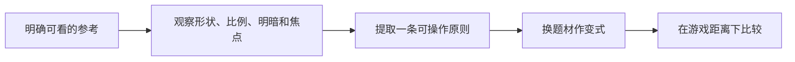

> 给OpenMAIC生成器：复制本文件全文作为课程要求即可，不需要再拼接其他规则文件。本文件是教师生成规格，不是直接发给学生的讲义。
> 用中文授课，英文术语附人话；优先操作与因果对照。不要扩展软件百科，不调用仓库工具，不索取密钥。
> 先提出可实现的页面与互动计划，再生成本课；生成后必须实测控件。参考答案只用于教师反馈，不放在题干或初始幻灯片。前端隐藏不是保密措施。

# C-01｜训练眼睛一：剪影、比例和细节层级

> 兼容课号：R02。ABCDE是主题入口，不是必须按字母顺序完成；文件链接与题号保留稳定。

版本：Audited Collaboration v7｜2026-09-15
状态：课件正文与互动规格已编写；尚未逐课生成OpenMAIC课堂或试教。

## 1. 本课任务卡

**产出：** 在游戏大小的缩略图里，让一个道具一眼可辨。
**前置：** R01, B01A；**对应概念：** ART02/ART03。
**预计课堂：** 20–30分钟，可在实验前后暂停；不含后续真实软件制作时间。
**M 必须掌握：**
- 只看剪影判断造型识别度。
- 先调大比例，再分配主次细节，不把噪声当丰富。
**K 理解即可：**
- Primary/Secondary/Tertiary是主形、辅助形、小细节的组织思路。
**停止线：** 不讲解剖学和复杂雕刻；不要求完整临摹人物。

## 1A. 必学内容、实操与题目如何对应

M1/M2只是本课任务卡的两项能力序号，不是新的技术概念。查菜单/API不扣独立判断分。

|必须掌握到这里|本课实操题：做什么算有证据|可选配套题|
|---|---|---|
|M1：只看剪影判断造型识别度。|隐藏表面细节后辨认道具用途，并指出轮廓上的证据。|R02-P1|
|M2：先调大比例，再分配主次细节，不把噪声当丰富。|只改一处比例/间隙，在游戏大小复核识别，不靠添加纹理补救。|R02-D2, R02-T3|

**最低学习路径：** 一次预测 → 一个能覆盖上述两项M的小实验/项目改动 → 一次结果解释。普通M做到即可；关键薄弱处再选一题诊断或隔次迁移，不把P/D/T全套加到每个术语上。
**理解即可与停止线：** 任务卡中的K只检用途；按需查的界面、API、高级实现不进入本课操作门槛。只有已学且已存在的项目功能需要回归。

## 2. 必要讲解：先看现象，再给术语

剪影是外部轮廓：先涂黑或缩小看看还能否辨认。一个水壶若壶嘴和把手融在一起，加花纹也不一定解决识别。

先调大形比例，再放中等结构，最后决定小细节是否值得。卡通不是随意拉大所有部位，而是用一致的夸张规则服务角色或用途。

## 2A. 场景、概念图与逐步AI对话

**实际位置：** P03｜星星、石头和树在游戏距离下能否辨认。

|操作前的问题|本课希望得到的结果|
|---|---|
|局部很精细，但缩小后物体轮廓和功能难以分辨。|用剪影、比例和主次确定可辨认的大形，之后才加细节。|

这是目标对照，不是已完成的游戏截图。概念图为职责/因果示意，不是继承图或完整运行证明。

OpenMAIC不能渲染Mermaid时画等价方框图；无3D或真实连接时仅标课堂模拟，不伪造软件运行。

### 本课人和AI分别负责什么

|责任|这课具体做什么|
|---|---|
|我必须作出的判断|先按玩家距离判断大形/负形，再决定小细节是否值得。|
|可以交给AI的制作|准备同尺寸剪影与近远对照，只改一个比例或结构间隙。|
|我检查AI交付物|看修改对象/前后差异、实际执行记录及未验证项；先核对是否保留本课约束，再决定是否接入。|

**不是手工熟练考试：** 重复劳动与代码可委托；常用可见参数适合亲调时先调一项，无障碍需要可由AI按已选值执行。必须能说明选择、观察和恢复，不要求机械地拖每个滑杆。

**两种模式：** 练习时可问根因、看示范；独立验收时先由我提出选择/假设，AI只协助执行与记录。已透露本题根因或目标值，就记录“有提示”，再换未揭示答案的变式。

### 复制第1框开始；以后每次只发当前一步

**学员用法：** 无需一次读完所有提示。将当前框发给你使用的AI；做完后回“完成＋观察”，结果不符回“不符＋现象”，报错回“报错＋原文”，需要停下回“暂停”。自然语言也可以。不要一口气把六步当成自动执行授权。

### 对话1｜建立本课上下文

```text
请做我这节课的协作教练：C-01（兼容课号R02）《训练眼睛一：剪影、比例和细节层级》。
我们逐步制作同一个「星光小庭院」，当前只解决：局部很精细，但缩小后物体轮廓和功能难以分辨。
目标：用剪影、比例和主次确定可辨认的大形，之后才加细节。
必须掌握：只看剪影判断造型识别度；先调大比例，再分配主次细节，不把噪声当丰富。理解即可：Primary/Secondary/Tertiary是主形、辅助形、小细节的组织思路
停止线：不讲解剖学和复杂雕刻；不要求完整临摹人物。
必须保持：机位、显示尺寸、背景固定；不一开始雕刻复杂模型。
本课由我负责：先按玩家距离判断大形/负形，再决定小细节是否值得。
可以交给你：准备同尺寸剪影与近远对照，只改一个比例或结构间隙。
请标明建议/已执行/已验证的区别。练习可提示；验收先等我作判断，已提示根因则如实记有提示。
先读取我已提供的进度和材料，只问真正缺失的一项。需要软件操作时核对实际版本、当前截图或场景树、可访问的工具；不要求我发密钥或整个电脑。
先给一个预测问题并等我回答，再给一个最小步骤。不跳课、不自动做整款游戏。能执行才说已执行，否则给明确操作单或脚本，并标未执行。
后续每轮用四项回应：现在是哪一步；只改什么/怎样恢复；我应观察什么；目前还缺什么证据。没有证据不要替我勾通过。
```

**AI此时应做：** 确认当前场景与学习范围，不直接输出几十个文件。已经提供过的版本、素材和约束应复用，不重复问。

### 对话2｜先理解一个因果关系

```text
先问我：加更多纹理能保证剪影更清楚吗？
等我写预测和理由后，再指出一个证据缺口，只给一个提示，不先公布完整答案。用词不专业时先确认意思，再补术语。
```

**转入下一步：** 有自己的预测即可；预测错可以用实验纠正，不要求先背定义。

### 对话3｜AI只完成第一小步

```text
沿用已确认的版本、材料和修改边界。现在只做：只把现有星星、树和石头变成缩略剪影对照，不先生成精细纹理。
先列影响对象和原值，再提供一个可撤销初稿。没有实际软件连接时给我可执行的局部操作单/脚本，不说已经修改。做完先停下。
```

**预计看到／拿到：** 我能说出游戏距离下哪个轮廓更容易辨认及理由。
**不是自动保证：** 这是验收目标，取决于实际模型、工具和输入；结果不同就走下方“不符”分支。

### 对话4｜人观察与亲调，再继续第二小步

```text
这是我刚才的实际结果：我会附一张当前图、短演示或必要日志，并用一句话描述差异。
先检查是否满足：我能说出游戏距离下哪个轮廓更容易辨认及理由。
本课可用的微调项：
入口：对象Dimensions/Scale或轮廓草图（内置/设计）；操作：只改一个比例，例如树冠与树干关系；观察：缩略尺寸下能否区分物体
入口：视口缩略/单色预览（观察入口）；操作：隐藏表面细节再观察；观察：轮廓是否仍读得出，细节是否只是噪声
若满足，先指导我选择其中一项亲调；我回报观察后才继续：仅改变一处比例或间隙，重新缩小比较，不以细节数量评分。
一次只动一项可见参数。方向接近就手调；结构有误才给局部修复，不能不断重生成整个场景。
```

|选中哪里与参数性质|这次亲自试什么|观察与停手依据|
|---|---|---|
|对象Dimensions/Scale或轮廓草图（内置/设计）|只改一个比例，例如树冠与树干关系|缩略尺寸下能否区分物体|
|视口缩略/单色预览（观察入口）|隐藏表面细节再观察|轮廓是否仍读得出，细节是否只是噪声|

**保存与恢复：** 先记录原值和实际对象。优先在安全副本试；运行中Remote Inspector的变化不要当成已保存的设计值，确认后将选定值写回本地场景/资源或配置并重新运行。菜单路径随版本核对，自定义变量不冒充内置属性。
**采用哪种沟通：** 大方向偏了，用参考图圈出要借鉴的轮廓/色彩/光感，并指出不要照搬什么；单个视觉值接近了，先拖或输入数值；原因不明，固定条件做一次对照。参考图不是可自动反推所有参数的答案。

### 对话5｜成功验收，或失败时只修一处

**达到目标时发送：**
```text
请只根据我提供的证据检查：
- 隐藏表面细节后辨认道具用途，并指出轮廓上的证据。
- 只改一处比例/间隙，在游戏大小复核识别，不靠添加纹理补救。
旧功能回归：选定大形不堵住原通路；交互目标仍与装饰可区分。
缺少过程证据就标待验证；不得用一张截图证明走跳或一次性事件。不要新增需求或把所有候选题变成作业。
```

**结果不符或报错时发送：**
```text
不符/报错：我会提供触发步骤、预期、实际现象和必要原始日志。
保留：机位、显示尺寸、背景固定；不一开始雕刻复杂模型。
本课优先风险：检查AI是否用更多装饰掩盖轮廓问题，或只展示近景精细截图。
先提出一个可推翻的假设和一个最小验证；不要同时改多个系统。若两次验证仍无进展，回到基线并列出缺失证据，不反复抽卡。不要删除测试、关闭需求或扩大权限来假装修好。
```

**AI评分边界：** 代码和初稿可以由AI提供；判断、亲调与证据解释由学员完成。得到根因提示记为有提示，不因此重复考试所有概念。

### 对话6｜存进度，下一次接着做

```text
请总结本课C-01（R02）的进度卡，不把预测当已完成。
记录：真实软件版本/渲染器；当前场景与变更对象；选定参数和原值；我做的判断；实际证据；通过/待验证；使用过的提示；恢复方法；下一步唯一任务。
只有实际验证才标通过，没有生成或真机执行就明确写模拟/待验证。给我一段可以复制到新AI对话的摘要，不假称你已持久保存。
先核对下一课前置和我的已选路线，未完成就停在当前步骤，不催着扩范围。
```

**学员保存：** 把进度卡存本地或私人笔记；下次粘贴进度卡和下一课第1框。不要公开API Key、账户、本地私密路径或个人录像。

### 当前风险与长期责任

**本课风险检查：** 检查AI是否用更多装饰掩盖轮廓问题，或只展示近景精细截图。
这是需要在当前工具版本下核验的风险，不是所有AI必然失败的排行榜，也不预测何时改善。长期保留需求、参考选择、影响范围、结果认可与取舍责任；测量、批量设置和重复验证可以由AI协助。
**不把学习变成额外六次考试：** 六个对话阶段共享本课原有M/K证据；只在薄弱关键能力上追加一处故障或变式。没有实际材料时先做课堂模拟，真机状态单独记录。

## 3. 界面与参数学习深度

以下是后续真机操作的对应范围，不要求本轮打开软件。模拟滑块是教学控件，不代表软件都有同名按钮。会调是指看懂作用、主动选择与恢复；会定位是知道去哪找；按需查不考菜单路径、快捷键和API记忆。
- Blender后续常用：对象/编辑模式缩放、正交观察、Solid视图。
- 会定位：相机视图和尺寸参照。
- 按需查：复杂雕刻笔刷、重拓扑。

## 4. 互动实验规格

**初始状态：** 同一水壶三种比例；纯色背景、黑色剪影、统一尺寸；目标显示宽约160像素。
**可操作项：** 壶身宽高比0.7到1.4、把手间隙、壶嘴长度、黑色/表面切换、缩略/近景。
**实验步骤：**
1. 先隐藏材质比较能否识别用途。
2. 只改一个比例或间隙，记录识别改善而非随机拖动。
3. 在游戏尺寸检查装饰小纹理是否仍有价值，删掉一组无用细节再比较。
**预期反馈：** 参数改变要改轮廓，不能只替换标签。展示近远两种视图，允许不同但有依据的审美选择。
**故障或反例：** 反例：把大量雕花当质量，缩小后道具只是黑团；优先修大形和负形。
**复位：** 恢复统一物体尺寸、比例、剪影模式和观察距离。
**无图/无3D替代：** 用原创简单形状、状态卡或给定时间序列表达同一因果关系；标明“示意”，不得把预设结果说成Godot/Blender实测。不能以假按钮或不响应的截图代替交互。
**完成判据：** 对本课两项M提供操作或判断及解释；一个实验可覆盖多项。只有关键M或发现薄弱处才追加故障/变式，不为每个术语加作业。

## 5. 小结与必须牢记

- 先看剪影，再看材质。
- 先大形，再小细节。
- 质量按游戏距离验收。

## 6. 训练：先作答，再看反馈

题干中的日志、数值与AI建议均为标明的教学情境，除非另附运行证据，不是本项目实测。可以有多个合理假设：先给能区分它们的验证，而不是猜老师心中的唯一原因。

P=预测，D=诊断，T=迁移，K=用途认识。下面是候选训练，不是每个词都做四次作业。课堂先用预测和一个操作，重点未达标再选D或T；延迟复测换对象，不重复抄答案。

### R02-P1
**考察范围：** M1的限定子能力；不是整项真机通过证明。先给判断与理由；要求操作时再提供过程/对照。仅答对文字不自动等于实际应用通过。

加更多纹理能保证剪影更清楚吗？

### R02-D2
**考察范围：** M2的限定子能力；不是整项真机通过证明。先给判断与理由；要求操作时再提供过程/对照。仅答对文字不自动等于实际应用通过。

【教学构造情境，不是真实测量或某模型故障统计】160像素宽的水壶缩略图里把手和壶身黏成黑团；AI添加花纹，近景好看但黑色剪影没变。先要改哪个层次，如何对照而不同时改变机位和大小？

### R02-T3
**考察范围：** M2的限定子能力；不是整项真机通过证明。先给判断与理由；要求操作时再提供过程/对照。仅答对文字不自动等于实际应用通过。

把水壶换成游戏宝箱，怎样安排细节？

### R02-K4
**考察范围：** K｜理解用途即可；不要求实现。一句用途解释即可。

三级形体的用途是什么？

## 7. 后续真机任务（配套待做，不作为当前课堂依赖）

后续可在有许可的基底上做少量比例改造，不必从零建模。
即使已有参考工程，也要区分课件、运行测试、人工体验、学习掌握四种证据。按用户安排，当前先完成全部课件，之后再统一补素材、Godot/Blender起始与参考工程。

## 8. 实际应用验收：把结果放回同一个项目

**本课产物：** 用剪影、比例和主次确定可辨认的大形，之后才加细节。
**接入边界：** 机位、显示尺寸、背景固定；不一开始雕刻复杂模型。

以下是要采集的证据，不是宣称已经执行。记录“未尝试 / 有提示完成 / 独立验证 / 隔次仍会”；不把这四种状态与M/K学习要求混淆。

|原有M能力|本次在哪里取证|
|---|---|
|只看剪影判断造型识别度。|隐藏表面细节后辨认道具用途，并指出轮廓上的证据。|
|先调大比例，再分配主次细节，不把噪声当丰富。|只改一处比例/间隙，在游戏大小复核识别，不靠添加纹理补救。|

**旧功能回归：** 选定大形不堵住原通路；交互目标仍与装饰可区分。
**最小记录：** 一段现场演示，或同条件前后图/日志，加一句“我改了什么、为什么”。截图不足以证明运动/一次性事件时，要演示动作或查看对应状态。记录用过的提示，不要求写长报告。
**一般能力取证：** 一次有效操作/选择与解释即可；只有证据不足才补练，不强制反复考试。

**换情境的候选任务：** 将星星换成钥匙形道具，先在单色下检验，不靠颜色救识别。
**判定：** 普通M按原0–2锚点；有针对性根因提示记练习，换变式再验证。K只查用途，不能抵消关键M失败。没有真实操作的M只记待验证，模拟通过不能自动升级为真机通过。未选专题不阻塞主线。

**接入不等于新增系统：** 美术课可交风格卡、参数决定或改造样本；性能课可得出“不优化”。隔离实验只有对当前项目有收益才接入，不强迫庭院变成战斗、开放世界或联网游戏。

## 9. 复现与延迟检查

本课复现：R01。只复习已学的关键M。
下次课抽一个本课关键判断，换对象或数值后先独立解释。查菜单和API不扣独立判断分；被提示根因或目标值后完成，记录有提示，换变式再验。K不反复背定义。

## 10. 依据与观看入口

- [Roman Klco / Polygon Runway：风格化3D作品与课程](https://polygonrunway.com/)
- [Grant Abbitt：Blender造型与图形设计](https://www.gabbitt.co.uk/)
- [Godot运行检查与可见碰撞工具](https://docs.godotengine.org/en/stable/tutorials/scripting/debug/overview_of_debugging_tools.html)

技术来源支持术语和软件边界；具体实验与课程顺序是本项目教学设计，不代表已证明学习效果。艺术家入口用于观看研习，不等于获得图片或素材再分发许可。

## 11. 教师反馈与评分依据（初始课堂不可展示）

沿用全仓库0–2锚点：0=已显示错误；无证据另记待验证；1=提示后完成或理由不清；2=能选择、解释并验证。实现可由AI提供，评价的是学员判断。课堂不强制凑100分；结业仍按M90/K10反馈，K不能补救关键M失败。
两项M都需要有效证据，不能按四道题等权平均掩盖能力缺口。普通M用一次有效操作和解释；关键M增加故障/迁移与延迟复测。A05全K只确认用途，没有M成绩。

**R02-P1 核对要点：** 不能，剪影首先由轮廓和比例决定。
**错因提示：** 涂黑以后还看见纹理吗？
**反馈策略：** 先指出证据缺口，给该提示；仍困难再示范。看答案后立即复述不算独立掌握。

**R02-D2 核对要点：** 先改把手间隙/轮廓或主比例，保持显示尺寸、机位和黑色模式；新旧同尺寸比较，再恢复材质，花纹不修剪影。
**错因提示：** 问题在涂黑后仍存在吗？
**反馈策略：** 先指出证据缺口，给该提示；仍困难再示范。看答案后立即复述不算独立掌握。

**R02-T3 核对要点：** 先开合轮廓与主比例，再中等结构，最后镜头可见的小细节。
**错因提示：** 玩家从多远看？
**反馈策略：** 先指出证据缺口，给该提示；仍困难再示范。看答案后立即复述不算独立掌握。

**R02-K4 核对要点：** 帮助先后组织视觉信息，不是一套必须记住的固定比例。
**错因提示：** 先做哪一层？
**反馈策略：** 先指出证据缺口，给该提示；仍困难再示范。看答案后立即复述不算独立掌握。

## 11A. 本课诊断题的具体评分锚点

**R02-D2｜M2的限定子能力；不是整项真机通过证明**
**2：** 基于轮廓选大形变化；同尺寸对照及游戏距离证据。
**1：** 方向合理但缺区分性验证/结果解释，或得到目标根因提示后才完成；继续一次最小补练。
**0：** 已给出的选择违背题干约束、以无关补偿代替原因检查，且不能用证据解释。尚未提交/无法观察的部分另记“待验证”，不能假定学员不会。
**可接受替代：** 不要求使用参考答案的术语或唯一路径；其他符合条件、可检验且可恢复的方案同样可得分。真实软件表现须另有对应过程证据。
**迁移安排：** D题已讲解时不拿原题重复作独立考试。换本课T题的对象/一个约束，先不给目标参数和根因；实现代码仍可由AI执行已由学员选定的方案。

## 12. 生成后的验收清单

- [ ] 概念之后立即出现本课真实情境、学习/工作指令和微调入口，不只在结尾贴通用提示。
- [ ] AI模拟执行与真实工具执行明确区分，主项目成果必须另有应用证据。

- [ ] 先有本课目标和M/K/停止线，未把K扩为深度考试。
- [ ] 参数/条件实际改变画面、状态或时间序列，数值和结果一致。
- [ ] 初始状态、单变量对照、故障和复位均可运行；没有图片时替代方案有标示。
- [ ] 学生作答前不展示教师答案；有针对错因的反馈与新变式。
- [ ] 可用键盘/点击操作，文字可读，可暂停；不强制自动音频或高强度闪烁。
- [ ] 技术实测、审美喜好和学习掌握没有混作同一个通过状态。
- [ ] 外部原图/动作仅在许可允许的情况下展示；未伪造来源和运行记录。

- [ ] 本课M到实操题、P/D/T和项目证据可追溯，K未扩大成实现。
- [ ] AI先等学员判断；提示后的表现没有冒充独立掌握；同一题不反复凑分。
- [ ] 教学情境/模拟日志与真实运行分开，替代方案按证据评分，不按关键词或个人审美。
