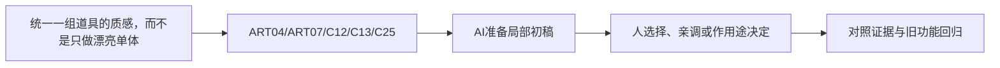

> 给OpenMAIC生成器：复制本文件全文作为课程要求即可，不需要再拼接其他规则文件。本文件是教师生成规格，不是直接发给学生的讲义。
> 用中文授课，英文术语附人话；优先操作与因果对照。不要扩展软件百科，不调用仓库工具，不索取密钥。
> 先提出可实现的页面与互动计划，再生成本课；生成后必须实测控件。参考答案只用于教师反馈，不放在题干或初始幻灯片。前端隐藏不是保密措施。

# C-08｜材质与展示打磨：统一质感而非堆节点

> 兼容课号：R06。ABCDE是主题入口，不是必须按字母顺序完成；文件链接与题号保留稳定。

版本：Applied Curriculum v5｜2026-09-15
状态：课件正文与互动规格已编写；尚未逐课生成OpenMAIC课堂或试教。

## 1. 本课任务卡

**产出：** 用同一套风格标准统一三件道具，并检查在引擎可实现。
**前置：** R05, I06；**对应概念：** ART04/ART07/C12/C13/C25。
**预计课堂：** 20–30分钟，可在实验前后暂停；不含后续真实软件制作时间。
**M 必须掌握：**
- 控制材质差异与统一性，避免所有对象同样油亮。
- 固定展示条件比较细节，并识别仅在Blender成立的效果。
**K 理解即可：**
- 手绘感、渐变、描边、烘焙分别是可选手段。
**停止线：** 不强制复杂材质网络和手绘贴图全集；任何新Shader先进入选修。

## 2. 必要讲解：先看现象，再给术语

同风格不等于同材质：木头、布、金属可有不同粗糙感，却共用受控色盘和边缘处理。纹理噪声太多可能损害绘本感。

Look development是在固定条件下建立质感标准。柔和阴影、背景与展示机位用于比较；最终仍需检查游戏镜头和目标引擎，不以离线高质量渲染遮住问题。

## 2A. 这次在实际场景里解决什么

**应用位置：** P07｜统一一组道具的质感，而不是只做漂亮单体；主项目中的功能、视觉或交付决定。

|开始时遇到的问题|本课期望得到的变化|
|---|---|
|每个模型单看都不错，放一起却像来自不同游戏。|一组道具的色盘、粗糙层次和细节密度受同一风格卡约束。|

**这是目标状态对照，不是已完成截图。** 首次操作应使用匹配当前进度的最小场景；还没有配套时，只能记为课堂模拟，不能直接勾选真机应用通过。

### 概念关系示意


图中箭头表示教学流程，不是引擎节点继承。OpenMAIC不支持Mermaid时改画等价方框图，不能把代码原文冒充运行示意。

### 先让AI帮助理解，再让AI帮助工作

**学习指令：**
```text
现在只检查这道判断：统一风格就让所有东西同一个Roughness吗？
先等我给预测和理由，再指出一个证据缺口；一次只给一个线索，不先公布完整答案。
我的用词不专业时，先用人话确认意思，再补对应术语。
```

**工作指令：可复制；先补实际版本与当前材料，不粘贴密钥。**
```text
我正在逐步制作同一个小型单机「星光小庭院」，不是重新生成整款游戏。
我会提供实际软件版本、当前场景/文件和必要截图；先确认你能访问哪些材料和工具。
这次只做：用同一个展示台和游戏机位比较三件道具，仅提出共享材质规则和少量例外。先统一质感，再单独讨论展示照明；不要让每件资产自带一套补偿灯。
必须保持：几何与镜头固定；材质比较时照明不变，照明比较时材质不变。
先列出将改的对象、原值和预期结果，提供最小可撤销初稿及检查步骤。
没有真实软件连接时只提供操作单/脚本，不声称已经编辑、运行或看过未提供的截图。
不要自动安装插件、联网下载素材、购买服务或读取无关文件；必要操作另说明并取得授权。
完成后报告实际做了什么、还没验证什么；我负责选择和最终验收。
```

### 哪些地方比继续发指令更适合亲自试

|入口与性质|一次只做的微调/选择|亲眼观察什么|
|---|---|---|
|基础色/粗糙度（内置）|先统一主体材质区间，再保留一个功能性强调|道具是否属于同一世界，主目标是否更清楚|
|展示光方向/强度（内置）|材质确定后再单变量调光|好看是否只依赖展示台，回到游戏是否仍成立|

**初值与恢复：** 先读取并记录当前值；表里的方向是对照办法，不是通用最佳参数。先在副本上操作，不覆盖基底；返回前用撤销或记录值恢复并重新预览。自定义变量不是软件内置参数。
**选择下一步：** 方向不对，补一张明确参考并圈出要借鉴的部分；结构/因果不对，让AI做局部修复；已接近目标且入口可直接操作，先亲调一项。原因不明先做对照，不靠反复重生成抽卡。

**局部修复指令：**
```text
保留本课「必须保持」的部分。我会给出同条件的当前结果和目标差异。
只围绕「一组道具的色盘、粗糙层次和细节密度受同一风格卡约束。」检查一个根因假设；先给最小验证，未经证据不要重写全部内容。
若只是一个可见参数偏差，告诉我该选哪个对象、哪个入口、怎么小幅调和恢复。
```

**本课风险检查：** 检查AI是否每件道具调一套曝光、过度光晕或只优化展示渲染不验证游戏。
**时间边界：** 上述是需要在当前模型/工具/软件版本下验证的风险清单，不是所有AI必然失败的结论，也不预测何时会解决。长期保留的是目标、约束、参考选择、结果认可和取舍责任；测量和重复调整可以继续交给AI协助。

## 3. 界面与参数学习深度

以下是后续真机操作的对应范围，不要求本轮打开软件。模拟滑块是教学控件，不代表软件都有同名按钮。会调是指看懂作用、主动选择与恢复；会定位是知道去哪找；按需查不考菜单路径、快捷键和API记忆。
- 常用：基础材质参数、主光、背景、固定机位。
- 会定位：材质预览/实际渲染差异、色彩管理。
- 按需查：烘焙、复杂描边、渲染器专属节点。

## 4. 互动实验规格

**初始状态：** 箱子、灯、布袋三件简单样本；同一白底/灰底与主光；目标风格卡可见。
**可操作项：** 三种材质预设、粗糙度0.2到0.9、纹理密度低/高、轮廓效果开关、展示/游戏距离。
**实验步骤：**
1. 先描述三件物品共同规则和应保留差异。
2. 一次只改一个材质参数或纹理密度，比较统一性。
3. 标出需要引擎重建、可交换和暂时不做的效果，建立检查单。
**预期反馈：** 不得宣称所有Blender节点可导出；每个效果标准备验证的实现路径。
**故障或反例：** 反例：用复杂程序节点在Blender做出好看材质，却没有引擎实现计划；缩成可交换核心或明确重建。
**复位：** 恢复统一中性场景与三件原材质，保存风格标准。
**无图/无3D替代：** 用原创简单形状、状态卡或给定时间序列表达同一因果关系；标明“示意”，不得把预设结果说成Godot/Blender实测。不能以假按钮或不响应的截图代替交互。
**完成判据：** 对本课两项M提供操作或判断及解释；一个实验可覆盖多项。只有关键M或发现薄弱处才追加故障/变式，不为每个术语加作业。

## 5. 小结与必须牢记

- 同风格不等于同材质。
- 固定条件建立质感标准。
- 离线好看还要能进游戏。

## 6. 训练：先作答，再看反馈

P=预测，D=诊断，T=迁移，K=用途认识。下面是候选训练，不是每个词都做四次作业。课堂先用预测和一个操作，重点未达标再选D或T；延迟复测换对象，不重复抄答案。

### R06-P1
统一风格就让所有东西同一个Roughness吗？

### R06-D2
细节很多却显得脏，怎么调整？

### R06-T3
从箱子扩展到布袋，怎样沿用风格？

### R06-K4
Look development的作用？

## 7. 后续真机任务（配套待做，不作为当前课堂依赖）

后续配套资产以目标引擎为最终验收点。
即使已有参考工程，也要区分课件、运行测试、人工体验、学习掌握四种证据。按用户安排，当前先完成全部课件，之后再统一补素材、Godot/Blender起始与参考工程。

## 8. 实际应用验收：把结果放回同一个项目

**本课产物：** 一组道具的色盘、粗糙层次和细节密度受同一风格卡约束。
**接入边界：** 几何与镜头固定；材质比较时照明不变，照明比较时材质不变。

以下是要采集的证据，不是宣称已经执行。记录“未尝试 / 有提示完成 / 独立验证 / 隔次仍会”；不把这四种状态与M/K学习要求混淆。

|原有M能力|本次在哪里取证|
|---|---|
|控制材质差异与统一性，避免所有对象同样油亮。|能描述一组资产不一致的具体来源。|
|固定展示条件比较细节，并识别仅在Blender成立的效果。|能通过材质或展示对照统一它们，并在实际游戏距离确认。|

**旧功能回归：** 共享范围可解释；重导入后风格规则和功能包装仍保持。
**最小记录：** 一段现场演示，或同条件前后图/日志，加一句“我改了什么、为什么”。截图不足以证明运动/一次性事件时，要演示动作或查看对应状态。记录用过的提示，不要求写长报告。
**一般能力取证：** 一次有效操作/选择与解释即可；只有证据不足才补练，不强制反复考试。

**换情境的候选任务：** 加入第四个来源不同的基底，优先修一项最高影响的差异。
**判定：** 普通M按原0–2锚点；有针对性根因提示记练习，换变式再验证。K只查用途，不能抵消关键M失败。没有真实操作的M只记待验证，模拟通过不能自动升级为真机通过。未选专题不阻塞主线。

**接入不等于新增系统：** 美术课可交风格卡、参数决定或改造样本；性能课可得出“不优化”。隔离实验只有对当前项目有收益才接入，不强迫庭院变成战斗、开放世界或联网游戏。

## 9. 复现与延迟检查

本课复现：B08, I06, R03。只复习已学的关键M。
下次课抽一个本课关键判断，换对象或数值后先独立解释。查菜单和API不扣独立判断分；被提示根因或目标值后完成，记录有提示，换变式再验。K不反复背定义。

## 10. 依据与观看入口

- [Blender Principled BSDF：当前手册入口](https://docs.blender.org/manual/en/latest/render/shader_nodes/shader/principled.html)
- [Blender glTF 2.0管线参考（4.0文档，具体新版选项另查）](https://docs.blender.org/manual/en/4.0/addons/import_export/scene_gltf2.html)
- [Roman Klco / Polygon Runway：风格化3D作品与课程](https://polygonrunway.com/)

技术来源支持术语和软件边界；具体实验与课程顺序是本项目教学设计，不代表已证明学习效果。艺术家入口用于观看研习，不等于获得图片或素材再分发许可。

## 11. 教师反馈与评分依据（初始课堂不可展示）

沿用全仓库0–2锚点：0=缺证据或错误；1=提示后完成或理由不清；2=能选择、解释并验证。实现可由AI提供，评价的是学员判断。课堂不强制凑100分；结业仍按M90/K10反馈，K不能补救关键M失败。
两项M都需要有效证据，不能按四道题等权平均掩盖能力缺口。普通M用一次有效操作和解释；关键M增加故障/迁移与延迟复测。A05全K只确认用途，没有M成绩。

**R06-P1 核对要点：** 不必；保留材料差异，同时统一色盘、细节和光照规则。
**错因提示：** 统一与相同是一个词吗？
**反馈策略：** 先指出证据缺口，给该提示；仍困难再示范。看答案后立即复述不算独立掌握。

**R06-D2 核对要点：** 减少无主次纹理噪声，回到大色块和关键边缘，并在游戏距离比较。
**错因提示：** 哪些信息争夺焦点？
**反馈策略：** 先指出证据缺口，给该提示；仍困难再示范。看答案后立即复述不算独立掌握。

**R06-T3 核对要点：** 共享色盘、细节密度和展示基线，材质响应按布料用途调整。
**错因提示：** 哪些是风格，哪些是材料？
**反馈策略：** 先指出证据缺口，给该提示；仍困难再示范。看答案后立即复述不算独立掌握。

**R06-K4 核对要点：** 建立并反复验证外观规则，不等于必须写复杂Shader。
**错因提示：** 比较需要什么固定条件？
**反馈策略：** 先指出证据缺口，给该提示；仍困难再示范。看答案后立即复述不算独立掌握。

## 12. 生成后的验收清单

- [ ] 概念之后立即出现本课真实情境、学习/工作指令和微调入口，不只在结尾贴通用提示。
- [ ] AI模拟执行与真实工具执行明确区分，主项目成果必须另有应用证据。

- [ ] 先有本课目标和M/K/停止线，未把K扩为深度考试。
- [ ] 参数/条件实际改变画面、状态或时间序列，数值和结果一致。
- [ ] 初始状态、单变量对照、故障和复位均可运行；没有图片时替代方案有标示。
- [ ] 学生作答前不展示教师答案；有针对错因的反馈与新变式。
- [ ] 可用键盘/点击操作，文字可读，可暂停；不强制自动音频或高强度闪烁。
- [ ] 技术实测、审美喜好和学习掌握没有混作同一个通过状态。
- [ ] 外部原图/动作仅在许可允许的情况下展示；未伪造来源和运行记录。
