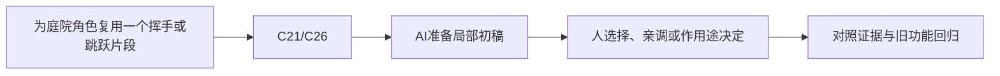

> 给OpenMAIC生成器：复制本文件全文作为课程要求即可，不需要再拼接其他规则文件。本文件是教师生成规格，不是直接发给学生的讲义。
> 用中文授课，英文术语附人话；优先操作与因果对照。不要扩展软件百科，不调用仓库工具，不索取密钥。
> 先提出可实现的页面与互动计划，再生成本课；生成后必须实测控件。参考答案只用于教师反馈，不放在题干或初始幻灯片。前端隐藏不是保密措施。

# E-10｜动作复用：先选兼容资源，再做少量适配

> 兼容课号：X01。ABCDE是主题入口，不是必须按字母顺序完成；文件链接与题号保留稳定。

版本：Applied Curriculum v5｜2026-09-15
状态：课件正文与互动规格已编写；尚未逐课生成OpenMAIC课堂或试教。

## 1. 本课任务卡

**产出：** 筛选可复用动作包，明确导入、重定向与授权检查。
**前置：** I02；**对应概念：** C21/C26。
**预计课堂：** 20–30分钟，可在实验前后暂停；不含后续真实软件制作时间。
**M 必须掌握：**
- 区分动作片段、骨架、蒙皮及根位移来源。
- 先试一段动作，再决定批量复用是否值得。
**K 理解即可：**
- Retarget、In-place、Root Motion、IK知道用途。
**停止线：** 不从零做武打动画，不重造重定向算法；可购买/使用资源不等于可公开再分发原文件。

## 2. 必要讲解：先看现象，再给术语

复用不是把任意动画拖到任意人物上。骨架映射、静止姿态、比例和根位移会影响结果；先试最小动作，再扩大。

优先选择来源清楚、目标骨架明确的资源。Mixamo及其他服务的可用账号、地区和许可需按使用时官方条件核对；本课不依赖必须访问某一个服务，也不使用游戏提取资源。

## 2A. 这次在实际场景里解决什么

**应用位置：** P07隔离实验｜为庭院角色复用一个挥手或跳跃片段；选修隔离实验：有价值才接入。

|开始时遇到的问题|本课期望得到的变化|
|---|---|
|预览动作很好，但套到当前角色上变形、漂移或方向错。|先通过一个兼容样本，再决定采用、轻改还是换资源。|

**这是目标状态对照，不是已完成截图。** 首次操作应使用匹配当前进度的最小场景；还没有配套时，只能记为课堂模拟，不能直接勾选真机应用通过。

### 概念关系示意


图中箭头表示教学流程，不是引擎节点继承。OpenMAIC不支持Mermaid时改画等价方框图，不能把代码原文冒充运行示意。

### 先让AI帮助理解，再让AI帮助工作

**学习指令：**
```text
现在只检查这道判断：动画能播就说明适合当前角色吗？
先等我给预测和理由，再指出一个证据缺口；一次只给一个线索，不先公布完整答案。
我的用词不专业时，先用人话确认意思，再补对应术语。
```

**工作指令：可复制；先补实际版本与当前材料，不粘贴密钥。**
```text
我正在逐步制作同一个小型单机「星光小庭院」，不是重新生成整款游戏。
我会提供实际软件版本、当前场景/文件和必要截图；先确认你能访问哪些材料和工具。
这次只做：根据实际提供的角色、动作和使用条件，列骨架/参考姿态/根位移兼容检查。只试一个片段，准备少量裁剪和调速；不能承诺任意资源一键重定向。
必须保持：主控制器与原角色源保持；在副本测试，不下载或再分发未知许可文件。
先列出将改的对象、原值和预期结果，提供最小可撤销初稿及检查步骤。
没有真实软件连接时只提供操作单/脚本，不声称已经编辑、运行或看过未提供的截图。
不要自动安装插件、联网下载素材、购买服务或读取无关文件；必要操作另说明并取得授权。
完成后报告实际做了什么、还没验证什么；我负责选择和最终验收。
```

### 哪些地方比继续发指令更适合亲自试

|入口与性质|一次只做的微调/选择|亲眼观察什么|
|---|---|---|
|动画预览/片段范围（内置入口）|只截取需要部分，保留原片段|起止姿态和循环接缝是否可用|
|播放速度与根位移选型（内置/方案）|先调速度；根位移问题先确认驱动来源|脚滑、角色漂移以及与控制器是否双重驱动|

**初值与恢复：** 先读取并记录当前值；表里的方向是对照办法，不是通用最佳参数。先在副本上操作，不覆盖基底；返回前用撤销或记录值恢复并重新预览。自定义变量不是软件内置参数。
**选择下一步：** 方向不对，补一张明确参考并圈出要借鉴的部分；结构/因果不对，让AI做局部修复；已接近目标且入口可直接操作，先亲调一项。原因不明先做对照，不靠反复重生成抽卡。

**局部修复指令：**
```text
保留本课「必须保持」的部分。我会给出同条件的当前结果和目标差异。
只围绕「先通过一个兼容样本，再决定采用、轻改还是换资源。」检查一个根因假设；先给最小验证，未经证据不要重写全部内容。
若只是一个可见参数偏差，告诉我该选哪个对象、哪个入口、怎么小幅调和恢复。
```

**本课风险检查：** 检查AI是否忽略参考姿态、缩放或根位移，声称已看过未提供的动画文件。
**时间边界：** 上述是需要在当前模型/工具/软件版本下验证的风险清单，不是所有AI必然失败的结论，也不预测何时会解决。长期保留的是目标、约束、参考选择、结果认可和取舍责任；测量和重复调整可以继续交给AI协助。

## 3. 界面与参数学习深度

以下是后续真机操作的对应范围，不要求本轮打开软件。模拟滑块是教学控件，不代表软件都有同名按钮。会调是指看懂作用、主动选择与恢复；会定位是知道去哪找；按需查不考菜单路径、快捷键和API记忆。
- Godot：动画预览、速度、片段与骨架映射检查。
- Blender会定位：Dope Sheet/Action、NLA；只为预览和少量调整。
- 按需查：Retarget/BoneMap、根位移提取、IK修正。

## 4. 互动实验规格

**初始状态：** 三个动作资源说明卡：同骨架、可重定向、无来源；简化关节预览，不附第三方动作文件。
**可操作项：** 选择资源、A/T参考姿态、根位移开关、循环预览、观察脚底。
**实验步骤：**
1. 先按授权和兼容筛掉高风险包。
2. 试待机和一步行走或单次动作，检查脚滑、骨骼方向和位移。
3. 写少量适配/换资源的决策，并保存来源与测试状态。
**预期反馈：** 显示原数据与适配结果对照；动作能播放不自动等于碰撞和玩法正确。
**故障或反例：** 故障：脚本移动与动画根位移同时生效导致双倍移动；先明确一个位移来源。
**复位：** 回到原角色与静止姿态，保留原动画文件只读。
**无图/无3D替代：** 用原创简单形状、状态卡或给定时间序列表达同一因果关系；标明“示意”，不得把预设结果说成Godot/Blender实测。不能以假按钮或不响应的截图代替交互。
**完成判据：** 对本课两项M提供操作或判断及解释；一个实验可覆盖多项。只有关键M或发现薄弱处才追加故障/变式，不为每个术语加作业。

## 5. 小结与必须牢记

- 先试一段再导整包。
- 明确谁控制根位移。
- 来源、使用和再分发逐项核对。

## 6. 训练：先作答，再看反馈

P=预测，D=诊断，T=迁移，K=用途认识。下面是候选训练，不是每个词都做四次作业。课堂先用预测和一个操作，重点未达标再选D或T；延迟复测换对象，不重复抄答案。

### X01-P1
动画能播就说明适合当前角色吗？

### X01-D2
人物位移像加倍，先检查什么？

### X01-T3
动作换到更矮的卡通人物要复测什么？

### X01-K4
In-place大致是什么意思？

## 7. 后续真机任务（配套待做，不作为当前课堂依赖）

真实资源获取与适配留配套阶段；教师提供匿名说明卡即可先完成选择训练。
即使已有参考工程，也要区分课件、运行测试、人工体验、学习掌握四种证据。按用户安排，当前先完成全部课件，之后再统一补素材、Godot/Blender起始与参考工程。

## 8. 实际应用验收：把结果放回同一个项目

**本课产物：** 先通过一个兼容样本，再决定采用、轻改还是换资源。
**接入边界：** 主控制器与原角色源保持；在副本测试，不下载或再分发未知许可文件。

以下是要采集的证据，不是宣称已经执行。记录“未尝试 / 有提示完成 / 独立验证 / 隔次仍会”；不把这四种状态与M/K学习要求混淆。

|原有M能力|本次在哪里取证|
|---|---|
|区分动作片段、骨架、蒙皮及根位移来源。|能按兼容性与来源选择动作，不只看缩略预览。|
|先试一段动作，再决定批量复用是否值得。|能在副本做一次小适配并说明采用/更换理由。|

**旧功能回归：** 回到原待机走跑跳测试；不采用的动作可完整移除。
**最小记录：** 一段现场演示，或同条件前后图/日志，加一句“我改了什么、为什么”。截图不足以证明运动/一次性事件时，要演示动作或查看对应状态。记录用过的提示，不要求写长报告。
**一般能力取证：** 一次有效操作/选择与解释即可；只有证据不足才补练，不强制反复考试。

**换情境的候选任务：** 换第二个同类型片段，复用验收清单而非假定同库全兼容。
**判定：** 普通M按原0–2锚点；有针对性根因提示记练习，换变式再验证。K只查用途，不能抵消关键M失败。没有真实操作的M只记待验证，模拟通过不能自动升级为真机通过。未选专题不阻塞主线。

**接入不等于新增系统：** 美术课可交风格卡、参数决定或改造样本；性能课可得出“不优化”。隔离实验只有对当前项目有收益才接入，不强迫庭院变成战斗、开放世界或联网游戏。

## 9. 复现与延迟检查

本课复现：I01, I02, B09。只复习已学的关键M。
下次课抽一个本课关键判断，换对象或数值后先独立解释。查菜单和API不扣独立判断分；被提示根因或目标值后完成，记录有提示，换变式再验。K不反复背定义。

## 10. 依据与观看入口

- [Godot Retargeting 3D Skeletons](https://docs.godotengine.org/en/stable/tutorials/assets_pipeline/retargeting_3d_skeletons.html)
- [Adobe Mixamo FAQ：角色、动作及使用条件](https://helpx.adobe.com/creative-cloud/faq/mixamo-faq.html)
- [Quaternius：基础角色、动作与风格化套件](https://quaternius.com/)

技术来源支持术语和软件边界；具体实验与课程顺序是本项目教学设计，不代表已证明学习效果。艺术家入口用于观看研习，不等于获得图片或素材再分发许可。

## 11. 教师反馈与评分依据（初始课堂不可展示）

沿用全仓库0–2锚点：0=缺证据或错误；1=提示后完成或理由不清；2=能选择、解释并验证。实现可由AI提供，评价的是学员判断。课堂不强制凑100分；结业仍按M90/K10反馈，K不能补救关键M失败。
两项M都需要有效证据，不能按四道题等权平均掩盖能力缺口。普通M用一次有效操作和解释；关键M增加故障/迁移与延迟复测。A05全K只确认用途，没有M成绩。

**X01-P1 核对要点：** 不一定，还需检查变形、比例、脚滑、位移和授权。
**错因提示：** 看脚底与根节点。
**反馈策略：** 先指出证据缺口，给该提示；仍困难再示范。看答案后立即复述不算独立掌握。

**X01-D2 核对要点：** 是否脚本和动作都提供根位移；先明确责任，再测试。
**错因提示：** 谁在移动根？
**反馈策略：** 先指出证据缺口，给该提示；仍困难再示范。看答案后立即复述不算独立掌握。

**X01-T3 核对要点：** 接触点、脚滑、肢体穿插、根位移和可读性；不必重做全部动画。
**错因提示：** 比例改变影响哪里？
**反馈策略：** 先指出证据缺口，给该提示；仍困难再示范。看答案后立即复述不算独立掌握。

**X01-K4 核对要点：** 动作主要原地播放，位移可由控制器提供；具体片段仍要检查。
**错因提示：** 别只信文件名。
**反馈策略：** 先指出证据缺口，给该提示；仍困难再示范。看答案后立即复述不算独立掌握。

## 12. 生成后的验收清单

- [ ] 概念之后立即出现本课真实情境、学习/工作指令和微调入口，不只在结尾贴通用提示。
- [ ] AI模拟执行与真实工具执行明确区分，主项目成果必须另有应用证据。

- [ ] 先有本课目标和M/K/停止线，未把K扩为深度考试。
- [ ] 参数/条件实际改变画面、状态或时间序列，数值和结果一致。
- [ ] 初始状态、单变量对照、故障和复位均可运行；没有图片时替代方案有标示。
- [ ] 学生作答前不展示教师答案；有针对错因的反馈与新变式。
- [ ] 可用键盘/点击操作，文字可读，可暂停；不强制自动音频或高强度闪烁。
- [ ] 技术实测、审美喜好和学习掌握没有混作同一个通过状态。
- [ ] 外部原图/动作仅在许可允许的情况下展示；未伪造来源和运行记录。
